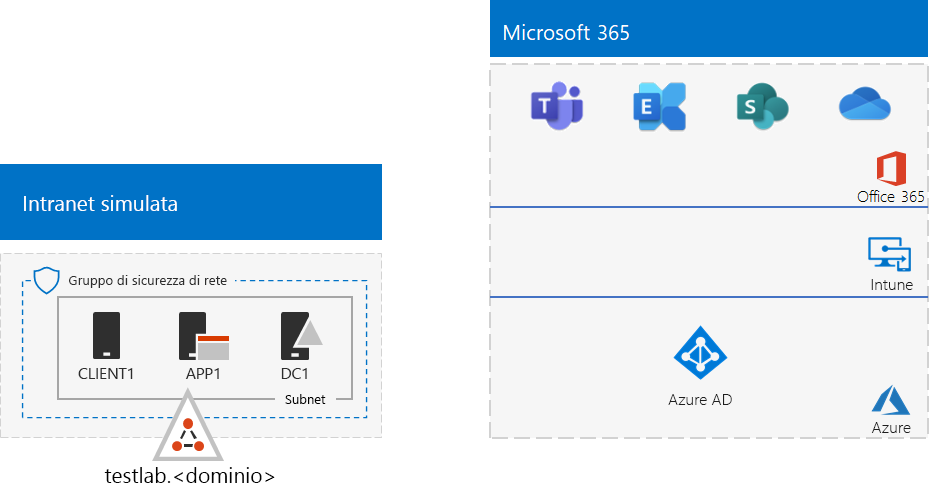
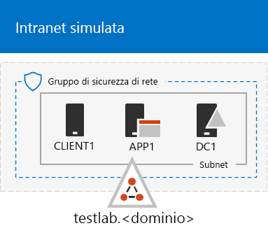
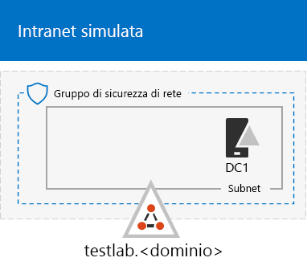
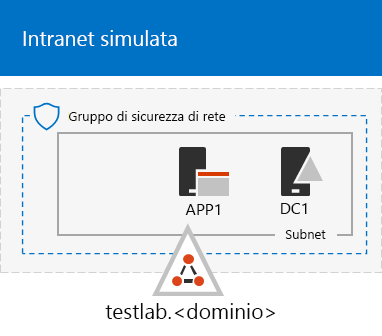

# <a name="the-simulated-enterprise-base-configuration"></a><span data-ttu-id="08df8-103">La configurazione di base per l'organizzazione simulata</span><span class="sxs-lookup"><span data-stu-id="08df8-103">The simulated enterprise base configuration</span></span>

<span data-ttu-id="08df8-104">*Questa guida del laboratorio di testing può essere usata sia per gli ambienti di testing di Microsoft 365 per le aziende che per Office 365 Enterprise.*</span><span class="sxs-lookup"><span data-stu-id="08df8-104">*This Test Lab Guide can be used for both Microsoft 365 for enterprise and Office 365 Enterprise test environments.*</span></span>

<span data-ttu-id="08df8-105">Questo articolo descrive come creare un ambiente semplificato per Microsoft 365 per le aziende che include:</span><span class="sxs-lookup"><span data-stu-id="08df8-105">This article describes how to create a simplified environment for Microsoft 365 for enterprise that includes:</span></span>

- <span data-ttu-id="08df8-106">Un abbonamento di valutazione o a pagamento a Microsoft 365 E5.</span><span class="sxs-lookup"><span data-stu-id="08df8-106">A Microsoft 365 E5 trial or paid subscription.</span></span>
- <span data-ttu-id="08df8-107">Una intranet dell'organizzazione semplificata connessa a Internet, costituita da tre macchine virtuali in una rete virtuale di Azure (DC1, APP1 e CLIENT1).</span><span class="sxs-lookup"><span data-stu-id="08df8-107">A simplified organization intranet connected to the internet, consisting of three virtual machines on an Azure virtual network (DC1, APP1, and CLIENT1).</span></span>
 


<span data-ttu-id="08df8-109">La creazione di un ambiente di testing semplificato prevede due fasi:</span><span class="sxs-lookup"><span data-stu-id="08df8-109">Creating a simplified test environment involves two phases:</span></span>
- [<span data-ttu-id="08df8-110">Fase 1: creare una rete intranet simulata</span><span class="sxs-lookup"><span data-stu-id="08df8-110">Phase 1: Create a simulated intranet</span></span>](#phase-1-create-a-simulated-intranet)
- [<span data-ttu-id="08df8-111">Fase 2: creare gli abbonamenti a Microsoft 365 E5</span><span class="sxs-lookup"><span data-stu-id="08df8-111">Phase 2: Create your Microsoft 365 E5 subscription</span></span>](#phase-2-create-your-microsoft-365-e5-subscription)

<span data-ttu-id="08df8-112">È possibile utilizzare l'ambiente risultante per testare le funzionalità di [Microsoft 365 per](https://www.microsoft.com/microsoft-365/enterprise) le aziende con altre guide al lab [di test](m365-enterprise-test-lab-guides.md) o da soli.</span><span class="sxs-lookup"><span data-stu-id="08df8-112">You can use the resulting environment to test the features and functionality of [Microsoft 365 for enterprise](https://www.microsoft.com/microsoft-365/enterprise) with additional [Test Lab Guides](m365-enterprise-test-lab-guides.md) or on your own.</span></span>


> [!TIP]
> <span data-ttu-id="08df8-114">Per una mappa visiva di tutti gli articoli della guida del lab di test di Microsoft 365 per le aziende, passare a [Microsoft 365 per enterprise Test Lab Guide Stack.](../downloads/Microsoft365EnterpriseTLGStack.pdf)</span><span class="sxs-lookup"><span data-stu-id="08df8-114">For a visual map to all the articles in the Microsoft 365 for enterprise Test Lab Guide stack, go to [Microsoft 365 for enterprise Test Lab Guide Stack](../downloads/Microsoft365EnterpriseTLGStack.pdf).</span></span>

## <a name="phase-1-create-a-simulated-intranet"></a><span data-ttu-id="08df8-115">Fase 1: creare una rete intranet simulata</span><span class="sxs-lookup"><span data-stu-id="08df8-115">Phase 1: Create a simulated intranet</span></span>

<span data-ttu-id="08df8-116">In questa fase, creare una rete Intranet simulata nei servizi di infrastruttura di Azure che includa un controller di dominio di Servizi di dominio Active Directory, un server applicazioni e un computer client.</span><span class="sxs-lookup"><span data-stu-id="08df8-116">In this phase, build a simulated intranet in Azure infrastructure services that includes an Active Directory Domain Services (AD DS) domain controller, an application server, and a client computer.</span></span>

<span data-ttu-id="08df8-117">Questi computer verranno utilizzati nelle guide aggiuntive del laboratorio di testing di [Microsoft 365 per le](m365-enterprise-test-lab-guides.md) aziende per configurare e dimostrare l'identità ibrida e altre funzionalità.</span><span class="sxs-lookup"><span data-stu-id="08df8-117">You'll use these computers in additional [Microsoft 365 for enterprise Test Lab Guides](m365-enterprise-test-lab-guides.md) to configure and demonstrate hybrid identity and other capabilities.</span></span>

### <a name="method-1-build-your-simulated-intranet-with-an-azure-resource-manager-template"></a><span data-ttu-id="08df8-118">Metodo 1: creare una rete intranet simulata con un modello di Azure Resource Manager</span><span class="sxs-lookup"><span data-stu-id="08df8-118">Method 1: Build your simulated intranet with an Azure Resource Manager template</span></span>

<span data-ttu-id="08df8-119">In questo metodo, si usa un modello di Azure Resource Manager per creare la rete Intranet simulata.</span><span class="sxs-lookup"><span data-stu-id="08df8-119">In this method, you use an Azure Resource Manager template to build out the simulated intranet.</span></span> <span data-ttu-id="08df8-120">I modelli di Azure Resource Manager contengono tutte le istruzioni per creare l'infrastruttura di rete di Azure, le macchine virtuali e la relativa configurazione.</span><span class="sxs-lookup"><span data-stu-id="08df8-120">Azure Resource Manager templates contain all of the instructions to create the Azure networking infrastructure, the virtual machines, and their configuration.</span></span>

<span data-ttu-id="08df8-121">Prima di distribuire il modello, leggere la pagina [README](https://github.com/maxskunkworks/TLG/tree/master/tlg-base-config_3-vm.m365-ems) del modello e disporre delle informazioni seguenti:</span><span class="sxs-lookup"><span data-stu-id="08df8-121">Before deploying the template, read through the [template README page](https://github.com/maxskunkworks/TLG/tree/master/tlg-base-config_3-vm.m365-ems) and have the following information ready:</span></span>

- <span data-ttu-id="08df8-122">Nome di dominio DNS pubblico dell'ambiente di testing (testlab. \<*your public domain*> ).</span><span class="sxs-lookup"><span data-stu-id="08df8-122">The public DNS domain name of your test environment (testlab.\<*your public domain*>).</span></span> <span data-ttu-id="08df8-123">Questo nome verrà immesso nel **campo Domain Name** della pagina Custom **deployment.**</span><span class="sxs-lookup"><span data-stu-id="08df8-123">You'll enter this name in the **Domain Name** field of the **Custom deployment** page.</span></span>
- <span data-ttu-id="08df8-p103">Un prefisso etichetta DNS per gli URL degli indirizzi IP pubblici delle macchine virtuali. È necessario immettere l’etichetta nel campo **Prefisso etichetta DNS** della pagina **Distribuzione personalizzata**.</span><span class="sxs-lookup"><span data-stu-id="08df8-p103">A DNS label prefix for the URLs of the public IP addresses of your virtual machines. You'll need to enter this label in the **Dns Label Prefix** field of the **Custom deployment** page.</span></span>

<span data-ttu-id="08df8-126">Dopo aver letto le istruzioni, selezionare **Distribuisci in Azure** nella pagina [README del modello](https://github.com/maxskunkworks/TLG/tree/master/tlg-base-config_3-vm.m365-ems) per iniziare.</span><span class="sxs-lookup"><span data-stu-id="08df8-126">After you read through the instructions, select **Deploy to Azure** on the [template README page](https://github.com/maxskunkworks/TLG/tree/master/tlg-base-config_3-vm.m365-ems) to get started.</span></span>

>[!Note]
><span data-ttu-id="08df8-127">La rete Intranet simulata creata dal modello Azure Resource Manager richiede una sottoscrizione di Azure a pagamento.</span><span class="sxs-lookup"><span data-stu-id="08df8-127">The simulated intranet built by the Azure Resource Manager template requires a paid Azure subscription.</span></span>

<span data-ttu-id="08df8-128">Al termine del modello, la configurazione sarà simile alla seguente:</span><span class="sxs-lookup"><span data-stu-id="08df8-128">After the template is complete, your configuration looks like this:</span></span>



### <a name="method-2-build-your-simulated-intranet-with-azure-powershell"></a><span data-ttu-id="08df8-130">Metodo 2: creare la rete intranet simulata con Azure PowerShell</span><span class="sxs-lookup"><span data-stu-id="08df8-130">Method 2: Build your simulated intranet with Azure PowerShell</span></span>

<span data-ttu-id="08df8-131">Con questo metodo si utilizza Windows PowerShell e il modulo di Azure PowerShell per creare l'infrastruttura di rete, le macchine virtuali e la loro configurazione.</span><span class="sxs-lookup"><span data-stu-id="08df8-131">In this method, you use Windows PowerShell and the Azure PowerShell module to build out the networking infrastructure, the virtual machines, and their configuration.</span></span>

<span data-ttu-id="08df8-p104">Utilizzare questo metodo per acquisire esperienza nella creazione di elementi dell'infrastruttura di Azure un passo alla volta con PowerShell. È quindi possibile personalizzare i blocchi di comandi di PowerShell per una distribuzione personalizzata delle altre macchine virtuali in Azure.</span><span class="sxs-lookup"><span data-stu-id="08df8-p104">Use this method if you want to get experience creating elements of Azure infrastructure one step at a time with PowerShell. You can then customize the PowerShell command blocks for your own deployment of other virtual machines in Azure.</span></span>

#### <a name="step-1-create-dc1"></a><span data-ttu-id="08df8-134">Passaggio 1: creare DC1</span><span class="sxs-lookup"><span data-stu-id="08df8-134">Step 1: Create DC1</span></span>

<span data-ttu-id="08df8-135">In questo passaggio viene creata una rete virtuale di Azure e viene aggiunto DC1, una macchina virtuale che è un controller di dominio per un dominio di Servizi di dominio Active Directory.</span><span class="sxs-lookup"><span data-stu-id="08df8-135">In this step, you create an Azure virtual network and add DC1, a virtual machine that is a domain controller for an AD DS domain.</span></span>

<span data-ttu-id="08df8-136">Innanzitutto, avviare un prompt dei comandi di Windows PowerShell sul computer locale.</span><span class="sxs-lookup"><span data-stu-id="08df8-136">First, start a Windows PowerShell command prompt on your local computer.</span></span>
  
> [!NOTE]
> <span data-ttu-id="08df8-p105">I seguenti comandi consentono di utilizzare la versione più recente di Azure PowerShell. Vedere [Panoramica dei cmdlet di Azure PowerShell](https://docs.microsoft.com/powershell/azureps-cmdlets-docs/).</span><span class="sxs-lookup"><span data-stu-id="08df8-p105">The following command sets use the latest version of Azure PowerShell. See [Get started with Azure PowerShell cmdlets](https://docs.microsoft.com/powershell/azureps-cmdlets-docs/).</span></span> 
  
<span data-ttu-id="08df8-139">Accedere al proprio account Azure con il seguente comando.</span><span class="sxs-lookup"><span data-stu-id="08df8-139">Sign in to your Azure account with the following command.</span></span>
  
```powershell
Connect-AzAccount
```

<span data-ttu-id="08df8-140">Ottenere il nome della sottoscrizione utilizzando il comando seguente.</span><span class="sxs-lookup"><span data-stu-id="08df8-140">Get your subscription name using the following command.</span></span>
  
```powershell
Get-AzSubscription | Sort Name | Select Name
```

<span data-ttu-id="08df8-141">Impostare la sottoscrizione di Azure.</span><span class="sxs-lookup"><span data-stu-id="08df8-141">Set your Azure subscription.</span></span> <span data-ttu-id="08df8-142">Sostituire tutto il testo racchiuso tra virgolette, incluse le parentesi angolari ("<" e ">"), con il nome corretto.</span><span class="sxs-lookup"><span data-stu-id="08df8-142">Replace everything within the quotation marks, including the angle brackets ("<" and ">"), with the correct name.</span></span>
  
```powershell
$subscr="<subscription name>"
Get-AzSubscription -SubscriptionName $subscr | Select-AzSubscription
```

<span data-ttu-id="08df8-p107">Successivamente, creare un nuovo gruppo di risorse per il lab di test dell'organizzazione simulata. Per determinare un nome del gruppo di risorse univoco, utilizzare questo comando per creare un elenco dei gruppi di risorse esistenti.</span><span class="sxs-lookup"><span data-stu-id="08df8-p107">Next, create a new resource group for your simulated enterprise test lab. To determine a unique resource group name, use this command to list your existing resource groups.</span></span>
  
```powershell
Get-AzResourceGroup | Sort ResourceGroupName | Select ResourceGroupName
```

<span data-ttu-id="08df8-145">Creare il nuovo gruppo di risorse con questi comandi.</span><span class="sxs-lookup"><span data-stu-id="08df8-145">Create your new resource group with these commands.</span></span> <span data-ttu-id="08df8-146">Sostituire tutti gli elementi racchiusi tra virgolette, incluse le parentesi uncinate, con i nomi corretti.</span><span class="sxs-lookup"><span data-stu-id="08df8-146">Replace everything within the quotation marks, including the angle brackets, with the correct names.</span></span>
  
```powershell
$rgName="<resource group name>"
$locName="<location name, such as West US>"
New-AzResourceGroup -Name $rgName -Location $locName
```

<span data-ttu-id="08df8-147">Successivamente, creare la rete virtuale TestLab che ospiterà la subnet di rete aziendale dell'ambiente aziendale simulato e proteggerla con un gruppo di sicurezza di rete.</span><span class="sxs-lookup"><span data-stu-id="08df8-147">Next, create the TestLab virtual network that will host the corporate network subnet of the simulated enterprise environment and protect it with a network security group.</span></span> <span data-ttu-id="08df8-148">Immettere il nome del gruppo di risorse ed eseguire questi comandi al prompt dei comandi di PowerShell nel computer locale.</span><span class="sxs-lookup"><span data-stu-id="08df8-148">Fill in the name of your resource group and run these commands at the PowerShell command prompt on your local computer.</span></span>
  
```powershell
$rgName="<name of your new resource group>"
$locName=(Get-AzResourceGroup -Name $rgName).Location
$corpnetSubnet=New-AzVirtualNetworkSubnetConfig -Name Corpnet -AddressPrefix 10.0.0.0/24
New-AzVirtualNetwork -Name TestLab -ResourceGroupName $rgName -Location $locName -AddressPrefix 10.0.0.0/8 -Subnet $corpnetSubnet -DNSServer 10.0.0.4
$rule1=New-AzNetworkSecurityRuleConfig -Name "RDPTraffic" -Description "Allow RDP to all VMs on the subnet" -Access Allow -Protocol Tcp -Direction Inbound -Priority 100 -SourceAddressPrefix Internet -SourcePortRange * -DestinationAddressPrefix * -DestinationPortRange 3389
New-AzNetworkSecurityGroup -Name Corpnet -ResourceGroupName $rgName -Location $locName -SecurityRules $rule1
$vnet=Get-AzVirtualNetwork -ResourceGroupName $rgName -Name TestLab
$nsg=Get-AzNetworkSecurityGroup -Name Corpnet -ResourceGroupName $rgName
Set-AzVirtualNetworkSubnetConfig -VirtualNetwork $vnet -Name Corpnet -AddressPrefix "10.0.0.0/24" -NetworkSecurityGroup $nsg
$vnet | Set-AzVirtualNetwork
```

<span data-ttu-id="08df8-149">In seguito, creare la macchina virtuale DC1 e configurarla come il controller di dominio per il dominio **testlab.**\<your public domain></span><span class="sxs-lookup"><span data-stu-id="08df8-149">Next, you create the DC1 virtual machine and configure it as a domain controller for the **testlab.**\<your public domain></span></span> <span data-ttu-id="08df8-150">di Active Directory Domain Services, e creare poi un server DNS per le macchine virtuali della rete virtuale TestLab. </span><span class="sxs-lookup"><span data-stu-id="08df8-150">AD DS domain and a DNS server for the virtual machines of the TestLab virtual network.</span></span> <span data-ttu-id="08df8-151">Ad esempio, se il nome di dominio pubblico è **<span>contoso</span>.com**, la macchina virtuale DC1 sarà un controller di dominio per il dominio **<span>testlab</span>.contoso.com**.</span><span class="sxs-lookup"><span data-stu-id="08df8-151">For example, if your public domain name is **<span>contoso</span>.com**, the DC1 virtual machine will be a domain controller for the **<span>testlab</span>.contoso.com** domain.</span></span>
  
<span data-ttu-id="08df8-152">Inserire il nome del gruppo di risorse ed eseguire questi comandi al prompt dei comandi di PowerShell nel computer locale per creare una macchina virtuale di Azure per DC1.</span><span class="sxs-lookup"><span data-stu-id="08df8-152">To create an Azure virtual machine for DC1, fill in the name of your resource group and run these commands at the PowerShell command prompt on your local computer.</span></span>
  
```powershell
$rgName="<resource group name>"
$locName=(Get-AzResourceGroup -Name $rgName).Location
$vnet=Get-AzVirtualNetwork -Name TestLab -ResourceGroupName $rgName
$pip=New-AzPublicIpAddress -Name DC1-PIP -ResourceGroupName $rgName -Location $locName -AllocationMethod Dynamic
$nic=New-AzNetworkInterface -Name DC1-NIC -ResourceGroupName $rgName -Location $locName -SubnetId $vnet.Subnets[0].Id -PublicIpAddressId $pip.Id -PrivateIpAddress 10.0.0.4
$vm=New-AzVMConfig -VMName DC1 -VMSize Standard_A2_V2
$cred=Get-Credential -Message "Type the name and password of the local administrator account for DC1."
$vm=Set-AzVMOperatingSystem -VM $vm -Windows -ComputerName DC1 -Credential $cred -ProvisionVMAgent -EnableAutoUpdate
$vm=Set-AzVMSourceImage -VM $vm -PublisherName MicrosoftWindowsServer -Offer WindowsServer -Skus 2016-Datacenter -Version "latest"
$vm=Add-AzVMNetworkInterface -VM $vm -Id $nic.Id
$vm=Set-AzVMOSDisk -VM $vm -Name "DC1-OS" -DiskSizeInGB 128 -CreateOption FromImage
$diskConfig=New-AzDiskConfig -AccountType "Standard_LRS" -Location $locName -CreateOption Empty -DiskSizeGB 20
$dataDisk1=New-AzDisk -DiskName "DC1-DataDisk1" -Disk $diskConfig -ResourceGroupName $rgName
$vm=Add-AzVMDataDisk -VM $vm -Name "DC1-DataDisk1" -CreateOption Attach -ManagedDiskId $dataDisk1.Id -Lun 1
New-AzVM -ResourceGroupName $rgName -Location $locName -VM $vm
```

<span data-ttu-id="08df8-p111">Verrà richiesto nome utente e password dell'account Administrator locale su DC1. Utilizzare una password complessa e annotare nome e password in una posizione sicura.</span><span class="sxs-lookup"><span data-stu-id="08df8-p111">You will be prompted for a user name and password for the local administrator account on DC1. Use a strong password and record both the name and password in a secure location.</span></span>
  
<span data-ttu-id="08df8-155">Successivamente, connettersi alla macchina virtuale DC1:</span><span class="sxs-lookup"><span data-stu-id="08df8-155">Next, connect to the DC1 virtual machine:</span></span>
  
1. <span data-ttu-id="08df8-156">Nel portale [di Azure](https://portal.azure.com)selezionare **Gruppi** di > <il nome del ***nuovo*** gruppo di risorse> > **DC1**  >  **Connect.**</span><span class="sxs-lookup"><span data-stu-id="08df8-156">In the [Azure portal](https://portal.azure.com), select **Resource Groups** > <***the name of your new resource group***> > **DC1** > **Connect**.</span></span>
    
2. <span data-ttu-id="08df8-157">Nel riquadro aperto selezionare **Scarica file RDP.**</span><span class="sxs-lookup"><span data-stu-id="08df8-157">In the open pane, select **Download RDP file**.</span></span> <span data-ttu-id="08df8-158">Aprire il file DC1.rdp scaricato e quindi selezionare **Connetti**.</span><span class="sxs-lookup"><span data-stu-id="08df8-158">Open the DC1.rdp file that is downloaded, and then select **Connect**.</span></span>
    
3. <span data-ttu-id="08df8-159">Specificare il nome dell'account Administrator locale DC1:</span><span class="sxs-lookup"><span data-stu-id="08df8-159">Specify the DC1 local administrator account name:</span></span>
    
   - <span data-ttu-id="08df8-160">Per Windows 7:</span><span class="sxs-lookup"><span data-stu-id="08df8-160">For Windows 7:</span></span>
    
     <span data-ttu-id="08df8-161">Nella finestra **di dialogo Sicurezza** di Windows selezionare Usa un altro **account.**</span><span class="sxs-lookup"><span data-stu-id="08df8-161">In the **Windows Security** dialog box, select **Use another account**.</span></span> <span data-ttu-id="08df8-162">In **Nome utente** immettere **\\ DC1** nome account amministratore locale < *>.*</span><span class="sxs-lookup"><span data-stu-id="08df8-162">In **User name**, enter **DC1\\**<*local administrator account name*>.</span></span>
    
   - <span data-ttu-id="08df8-163">Per Windows 8 o Windows 10:</span><span class="sxs-lookup"><span data-stu-id="08df8-163">For Windows 8 or Windows 10:</span></span>
    
     <span data-ttu-id="08df8-164">Nella finestra **di dialogo Sicurezza** di Windows selezionare Altre **scelte** e quindi selezionare Usa un **account diverso.**</span><span class="sxs-lookup"><span data-stu-id="08df8-164">In the **Windows Security** dialog box, select **More choices**, and then select **Use a different account**.</span></span> <span data-ttu-id="08df8-165">In **Nome utente** immettere **\\ DC1** nome account amministratore locale < *>.*</span><span class="sxs-lookup"><span data-stu-id="08df8-165">In **User name**, enter **DC1\\**<*local administrator account name*>.</span></span>
    
4. <span data-ttu-id="08df8-166">In **Password** immettere la password dell'account amministratore locale e quindi selezionare **OK.**</span><span class="sxs-lookup"><span data-stu-id="08df8-166">In **Password**, enter the password of the local administrator account, and then select **OK**.</span></span>
    
5. <span data-ttu-id="08df8-167">Quando richiesto, selezionare **Sì.**</span><span class="sxs-lookup"><span data-stu-id="08df8-167">When prompted, select **Yes**.</span></span>
    
<span data-ttu-id="08df8-168">Aggiungere un ulteriore disco dati come nuovo volume con lettera di unità F: immettendo questo comando al prompt dei comandi di Windows PowerShell a livello di amministratore in DC1.</span><span class="sxs-lookup"><span data-stu-id="08df8-168">Next, add an extra data disk as a new volume with the drive letter F: with this command at an administrator-level Windows PowerShell command prompt on DC1.</span></span>
  
```powershell
Get-Disk | Where PartitionStyle -eq "RAW" | Initialize-Disk -PartitionStyle MBR -PassThru | New-Partition -AssignDriveLetter -UseMaximumSize | Format-Volume -FileSystem NTFS -NewFileSystemLabel "WSAD Data"
```

<span data-ttu-id="08df8-169">Configurare quindi DC1 come controller di dominio e server DNS per il dominio **testlab.**\<*your public domain*></span><span class="sxs-lookup"><span data-stu-id="08df8-169">Next, configure DC1 as a domain controller and DNS server for the **testlab.**\<*your public domain*></span></span> <span data-ttu-id="08df8-170">.</span><span class="sxs-lookup"><span data-stu-id="08df8-170">domain.</span></span> <span data-ttu-id="08df8-171">Specificare il nome di dominio pubblico, rimuovere le parentesi angolari ed eseguire questi comandi al prompt dei comandi di DC1 Windows PowerShell a livello di amministratore.</span><span class="sxs-lookup"><span data-stu-id="08df8-171">Specify your public domain name, remove the angle brackets, and then run these commands at an administrator-level Windows PowerShell command prompt on DC1.</span></span>
  
```powershell
$yourDomain="<your public domain>"
Install-WindowsFeature AD-Domain-Services -IncludeManagementTools
Install-ADDSForest -DomainName testlab.$yourDomain -DatabasePath "F:\NTDS" -SysvolPath "F:\SYSVOL" -LogPath "F:\Logs"
```
<span data-ttu-id="08df8-p116">Sarà necessario specificare una password di amministratore in modalità provvisoria. Archiviare la password in un percorso sicuro.</span><span class="sxs-lookup"><span data-stu-id="08df8-p116">You will need to specify a safe mode administrator password. Store this password in a secure location.</span></span>
  
<span data-ttu-id="08df8-174">Si tenga presente che il completamento di questi comandi potrebbe richiedere alcuni minuti.</span><span class="sxs-lookup"><span data-stu-id="08df8-174">Note that these commands can take a few minutes to complete.</span></span>
  
<span data-ttu-id="08df8-175">Dopo il riavvio di DC1, riconnettersi al computer virtuale DC1.</span><span class="sxs-lookup"><span data-stu-id="08df8-175">After DC1 restarts, reconnect to the DC1 virtual machine.</span></span>
  
1. <span data-ttu-id="08df8-176">Nel portale [di Azure selezionare](https://portal.azure.com)Gruppi **di** risorse > <*nome del* gruppo di risorse> > **DC1**  >  **Connect.**</span><span class="sxs-lookup"><span data-stu-id="08df8-176">In the [Azure portal](https://portal.azure.com), select **Resource Groups** > <*your resource group name*> > **DC1** > **Connect**.</span></span>
    
2. <span data-ttu-id="08df8-177">Eseguire il file DC1.rdp scaricato e quindi selezionare **Connetti**.</span><span class="sxs-lookup"><span data-stu-id="08df8-177">Run the DC1.rdp file that is downloaded, and then select **Connect**.</span></span>
    
3. <span data-ttu-id="08df8-178">In **Sicurezza di Windows** seleziona Usa un altro **account.**</span><span class="sxs-lookup"><span data-stu-id="08df8-178">In **Windows Security**, select **Use another account**.</span></span> <span data-ttu-id="08df8-179">In **Nome utente** immettere **TESTLAB \\** local administrator account name < *>.*</span><span class="sxs-lookup"><span data-stu-id="08df8-179">In **User name**, enter **TESTLAB\\**<*local administrator account name*>.</span></span>
    
4. <span data-ttu-id="08df8-180">Nella casella **Password** immettere la password dell'account amministratore locale e quindi selezionare **OK.**</span><span class="sxs-lookup"><span data-stu-id="08df8-180">In the **Password** box, enter the password of the local administrator account, and then select **OK**.</span></span>
    
5. <span data-ttu-id="08df8-181">Quando richiesto, selezionare **Sì.**</span><span class="sxs-lookup"><span data-stu-id="08df8-181">When prompted, select **Yes**.</span></span>
    
<span data-ttu-id="08df8-182">Successivamente, creare un account utente in Active Directory che verrà utilizzato per l'accesso ai computer membri del dominio TESTLAB.</span><span class="sxs-lookup"><span data-stu-id="08df8-182">Next, create a user account in Active Directory that will be used when signing in to TESTLAB domain member computers.</span></span> <span data-ttu-id="08df8-183">Eseguire questo comando al prompt dei comandi di Windows PowerShell a livello di amministratore.</span><span class="sxs-lookup"><span data-stu-id="08df8-183">Run this command at an administrator-level Windows PowerShell command prompt.</span></span>
  
```powershell
New-ADUser -SamAccountName User1 -AccountPassword (read-host "Set user password" -assecurestring) -name "User1" -enabled $true -PasswordNeverExpires $true -ChangePasswordAtLogon $false
```

<span data-ttu-id="08df8-184">Tenere presente che questo comando chiede di specificare la password dell'account User1.</span><span class="sxs-lookup"><span data-stu-id="08df8-184">Note that this command prompts you to supply the User1 account password.</span></span> <span data-ttu-id="08df8-185">Questo account verrà utilizzato per le connessioni desktop remote per tutti i computer membri del dominio TESTLAB, quindi scegli una password complessa.</span><span class="sxs-lookup"><span data-stu-id="08df8-185">This account will be used for remote desktop connections for all TESTLAB domain member computers, so choose a strong password.</span></span> <span data-ttu-id="08df8-186">Registrare la password dell'account User1 e archiviarla in una posizione sicura.</span><span class="sxs-lookup"><span data-stu-id="08df8-186">Record the User1 account password and store it in a secured location.</span></span>
  
<span data-ttu-id="08df8-p120">Configurare quindi il nuovo account User1 come amministratore del dominio, dell'organizzazione e dello schema. Eseguire questo comando al prompt dei comandi di Windows PowerShell a livello di amministratore.</span><span class="sxs-lookup"><span data-stu-id="08df8-p120">Next, configure the new User1 account as a domain, enterprise, and schema administrator. Run this command at the administrator-level Windows PowerShell command prompt.</span></span>
  
```powershell
$yourDomain="<your public domain>"
$domainName = "testlab."+$yourDomain
$userName="user1@" + $domainName
$userSID=(New-Object System.Security.Principal.NTAccount($userName)).Translate([System.Security.Principal.SecurityIdentifier]).Value
$groupNames=@("Domain Admins","Enterprise Admins","Schema Admins")
ForEach ($name in $groupNames) {Add-ADPrincipalGroupMembership -Identity $userSID -MemberOf (Get-ADGroup -Identity $name).SID.Value}
```

<span data-ttu-id="08df8-189">Chiudere la sessione Desktop remoto con DC1, quindi riconnettersi usando l'account TESTLAB\\User1.</span><span class="sxs-lookup"><span data-stu-id="08df8-189">Close the Remote Desktop session with DC1 and then reconnect using the TESTLAB\\User1 account.</span></span>
  
<span data-ttu-id="08df8-190">Successivamente, per consentire il traffico per lo strumento Ping, eseguire questo comando al prompt dei comandi di Windows PowerShell a livello di amministratore.</span><span class="sxs-lookup"><span data-stu-id="08df8-190">Next, to allow traffic for the Ping tool, run this command at an administrator-level Windows PowerShell command prompt.</span></span>
  
```powershell
Set-NetFirewallRule -DisplayName "File and Printer Sharing (Echo Request - ICMPv4-In)" -enabled True
```

<span data-ttu-id="08df8-191">La configurazione corrente è simile alla seguente:</span><span class="sxs-lookup"><span data-stu-id="08df8-191">Your current configuration looks like this:</span></span>
  

  
#### <a name="step-2-configure-app1"></a><span data-ttu-id="08df8-193">Passaggio 2: configurare APP1</span><span class="sxs-lookup"><span data-stu-id="08df8-193">Step 2: Configure APP1</span></span>

<span data-ttu-id="08df8-194">In questo passaggio, creare e configurare APP1, ovvero un server applicazioni che inizialmente fornisce servizi di condivisione file e Web.</span><span class="sxs-lookup"><span data-stu-id="08df8-194">In this step, you create and configure APP1, which is an application server that initially provides web and file sharing services.</span></span>

<span data-ttu-id="08df8-195">Inserire il nome del gruppo di risorse ed eseguire questi comandi al prompt dei comandi nel computer locale per creare una macchina virtuale di Azure per APP1.</span><span class="sxs-lookup"><span data-stu-id="08df8-195">To create an Azure Virtual Machine for APP1, fill in the name of your resource group and run these commands at the  command prompt on your local computer.</span></span>
  
```powershell
$rgName="<resource group name>"
$locName=(Get-AzResourceGroup -Name $rgName).Location
$vnet=Get-AzVirtualNetwork -Name TestLab -ResourceGroupName $rgName
$pip=New-AzPublicIpAddress -Name APP1-PIP -ResourceGroupName $rgName -Location $locName -AllocationMethod Dynamic
$nic=New-AzNetworkInterface -Name APP1-NIC -ResourceGroupName $rgName -Location $locName -SubnetId $vnet.Subnets[0].Id -PublicIpAddressId $pip.Id
$vm=New-AzVMConfig -VMName APP1 -VMSize Standard_A2_V2
$cred=Get-Credential -Message "Type the name and password of the local administrator account for APP1."
$vm=Set-AzVMOperatingSystem -VM $vm -Windows -ComputerName APP1 -Credential $cred -ProvisionVMAgent -EnableAutoUpdate
$vm=Set-AzVMSourceImage -VM $vm -PublisherName MicrosoftWindowsServer -Offer WindowsServer -Skus 2016-Datacenter -Version "latest"
$vm=Add-AzVMNetworkInterface -VM $vm -Id $nic.Id
$vm=Set-AzVMOSDisk -VM $vm -Name "APP1-OS" -DiskSizeInGB 128 -CreateOption FromImage
New-AzVM -ResourceGroupName $rgName -Location $locName -VM $vm
```

<span data-ttu-id="08df8-196">Successivamente, connettersi alla macchina virtuale APP1 usando il nome e la password dell'account Administrator locale di APP1, quindi aprire un prompt dei comandi di Windows PowerShell.</span><span class="sxs-lookup"><span data-stu-id="08df8-196">Next, connect to the APP1 virtual machine using the APP1 local administrator account name and password, and then open a Windows PowerShell command prompt.</span></span>
  
<span data-ttu-id="08df8-197">Per controllare la risoluzione dei nomi e la comunicazione di rete tra APP1 e DC1, eseguire il comando **ping dc1.testlab.**\<*your public domain name*></span><span class="sxs-lookup"><span data-stu-id="08df8-197">To check name resolution and network communication between APP1 and DC1, run the **ping dc1.testlab.**\<*your public domain name*></span></span> <span data-ttu-id="08df8-198">e verificare che siano ricevute quattro risposte.</span><span class="sxs-lookup"><span data-stu-id="08df8-198">command and verify that there are four replies.</span></span>
  
<span data-ttu-id="08df8-199">Unire quindi la macchina virtuale APP1 al dominio TESTLAB immettendo questi comandi nel prompt dei comandi di Windows PowerShell.</span><span class="sxs-lookup"><span data-stu-id="08df8-199">Next, join the APP1 virtual machine to the TESTLAB domain with these commands at the Windows PowerShell prompt.</span></span>
  
```powershell
$yourDomain="<your public domain name>"
Add-Computer -DomainName ("testlab." + $yourDomain)
Restart-Computer
```

<span data-ttu-id="08df8-200">Si noti che dopo aver eseguito il **comando Add-Computer,** è necessario fornire le credenziali dell'account di dominio TESTLAB \\ User1.</span><span class="sxs-lookup"><span data-stu-id="08df8-200">Note that you after you run the **Add-Computer** command, you must supply the TESTLAB\\User1 domain account credentials.</span></span>
  
<span data-ttu-id="08df8-201">Dopo il riavvio di APP1, connettersi utilizzando l'account TESTLAB\\User1 e quindi aprire un prompt dei comandi di Windows PowerShell a livello di amministratore.</span><span class="sxs-lookup"><span data-stu-id="08df8-201">After APP1 restarts, connect to it using the TESTLAB\\User1 account, and then open an administrator-level Windows PowerShell command prompt.</span></span>
  
<span data-ttu-id="08df8-202">Successivamente, modificare APP1 in server Web con questo comando al prompt dei comandi di Windows PowerShell in APP1 a livello di amministratore.</span><span class="sxs-lookup"><span data-stu-id="08df8-202">Next, make APP1 a web server with this command at an administrator-level Windows PowerShell command prompt on APP1.</span></span>
  
```powershell
Install-WindowsFeature Web-WebServer -IncludeManagementTools
```

<span data-ttu-id="08df8-203">Creare quindi una cartella condivisa e un file di testo all'interno della cartella in APP1 con i comandi di PowerShell.</span><span class="sxs-lookup"><span data-stu-id="08df8-203">Next, create a shared folder and a text file within the folder on APP1 with these PowerShell commands.</span></span>
  
```powershell
New-Item -path c:\files -type directory
Write-Output "This is a shared file." | out-file c:\files\example.txt
New-SmbShare -name files -path c:\files -changeaccess TESTLAB\User1
```

<span data-ttu-id="08df8-204">La configurazione corrente è simile alla seguente:</span><span class="sxs-lookup"><span data-stu-id="08df8-204">Your current configuration looks like this:</span></span>
  

  
#### <a name="step-3-configure-client1"></a><span data-ttu-id="08df8-206">Passaggio 3: configurare CLIENT1.</span><span class="sxs-lookup"><span data-stu-id="08df8-206">Step 3: Configure CLIENT1</span></span>

<span data-ttu-id="08df8-207">In questo passaggio, viene creato e configurato CLIENT1 che si comporta come un tipico portatile, tablet o computer desktop nella rete intranet.</span><span class="sxs-lookup"><span data-stu-id="08df8-207">In this step, you create and configure CLIENT1, which acts as a typical laptop, tablet, or desktop computer on the intranet.</span></span>

> [!NOTE]  
> <span data-ttu-id="08df8-p122">Il set di comandi seguente crea CLIENT1 che esegue Windows Server 2016 Data Center. Tale operazione è possibile per tutti i tipi di sottoscrizioni di Azure. Se si dispone di una sottoscrizione di Azure basata su Visual Studio, è possibile creare CLIENT1 che esegue Windows 10 con il [portale di Azure](https://portal.azure.com).</span><span class="sxs-lookup"><span data-stu-id="08df8-p122">The following command set creates CLIENT1 running Windows Server 2016 Datacenter, which can be done for all types of Azure subscriptions. If you have a Visual Studio-based Azure subscription, you can create CLIENT1 running Windows 10 with the [Azure portal](https://portal.azure.com).</span></span>
  
<span data-ttu-id="08df8-210">Per creare una macchina virtuale di Azure per CLIENT1, inserire il nome del gruppo di risorse ed eseguire questi comandi al prompt dei comandi nel computer locale.</span><span class="sxs-lookup"><span data-stu-id="08df8-210">To create an Azure Virtual Machine for CLIENT1, fill in the name of your resource group and run these commands at the command prompt on your local computer.</span></span>
  
```powershell
$rgName="<resource group name>"
$locName=(Get-AzResourceGroup -Name $rgName).Location
$vnet=Get-AzVirtualNetwork -Name TestLab -ResourceGroupName $rgName
$pip=New-AzPublicIpAddress -Name CLIENT1-PIP -ResourceGroupName $rgName -Location $locName -AllocationMethod Dynamic
$nic=New-AzNetworkInterface -Name CLIENT1-NIC -ResourceGroupName $rgName -Location $locName -SubnetId $vnet.Subnets[0].Id -PublicIpAddressId $pip.Id
$vm=New-AzVMConfig -VMName CLIENT1 -VMSize Standard_A2_V2
$cred=Get-Credential -Message "Type the name and password of the local administrator account for CLIENT1."
$vm=Set-AzVMOperatingSystem -VM $vm -Windows -ComputerName CLIENT1 -Credential $cred -ProvisionVMAgent -EnableAutoUpdate
$vm=Set-AzVMSourceImage -VM $vm -PublisherName MicrosoftWindowsServer -Offer WindowsServer -Skus 2016-Datacenter -Version "latest"
$vm=Add-AzVMNetworkInterface -VM $vm -Id $nic.Id
$vm=Set-AzVMOSDisk -VM $vm -Name "CLIENT1-OS" -DiskSizeInGB 128 -CreateOption FromImage
New-AzVM -ResourceGroupName $rgName -Location $locName -VM $vm
```

<span data-ttu-id="08df8-211">Successivamente, connettersi alla macchina virtuale CLIENT1 usando il nome e la password dell'account Administrator locale di CLIENT1, quindi aprire un prompt dei comandi di Windows PowerShell a livello di amministratore.</span><span class="sxs-lookup"><span data-stu-id="08df8-211">Next, connect to the CLIENT1 virtual machine using the CLIENT1 local administrator account name and password, and then open an administrator-level Windows PowerShell command prompt.</span></span>
  
<span data-ttu-id="08df8-212">Per controllare la risoluzione dei nomi e la comunicazione di rete tra CLIENT1 e DC1, eseguire il comando **ping dc1.testlab.**\<*your public domain name*></span><span class="sxs-lookup"><span data-stu-id="08df8-212">To check name resolution and network communication between CLIENT1 and DC1, run the **ping dc1.testlab.**\<*your public domain name*></span></span> <span data-ttu-id="08df8-213">in un prompt dei comandi di Windows PowerShell e verificare che siano ricevute quattro risposte.</span><span class="sxs-lookup"><span data-stu-id="08df8-213">command at a Windows PowerShell command prompt and verify that there are four replies.</span></span>
  
<span data-ttu-id="08df8-214">Unire quindi la macchina virtuale CLIENT1 al dominio TESTLAB immettendo questi comandi nel prompt dei comandi di Windows PowerShell.</span><span class="sxs-lookup"><span data-stu-id="08df8-214">Next, join the CLIENT1 virtual machine to the TESTLAB domain with these commands at the Windows PowerShell prompt.</span></span>
  
```powershell
$yourDomain="<your public domain name>"
Add-Computer -DomainName ("testlab." + $yourDomain)
Restart-Computer
```

<span data-ttu-id="08df8-215">È necessario fornire le credenziali di un account di dominio TESTLAB\\User1 dopo aver eseguito il comando **Add-Computer**.</span><span class="sxs-lookup"><span data-stu-id="08df8-215">Note that you must supply your TESTLAB\\User1 domain account credentials after running the **Add-Computer** command.</span></span>
  
<span data-ttu-id="08df8-216">Dopo il riavvio di CLIENT1, connettersi utilizzando nome e password dell'account TESTLAB\\User1 e quindi aprire un prompt dei comandi di Windows PowerShell a livello di amministratore.</span><span class="sxs-lookup"><span data-stu-id="08df8-216">After CLIENT1 restarts, connect to it using the TESTLAB\\User1 account name and password, and then open an administrator-level Windows PowerShell command prompt.</span></span>
  
<span data-ttu-id="08df8-217">Successivamente, verificare che sia possibile accedere alle risorse Web e di condivisione file in APP1 da CLIENT1.</span><span class="sxs-lookup"><span data-stu-id="08df8-217">Next, verify that you can access web and file share resources on APP1 from CLIENT1.</span></span>
  
1. <span data-ttu-id="08df8-218">Nel riquadro dell'albero di Server Manager selezionare **Server locale.**</span><span class="sxs-lookup"><span data-stu-id="08df8-218">In Server Manager, in the tree pane, select **Local Server**.</span></span>
    
2. <span data-ttu-id="08df8-219">In **Proprietà per CLIENT1** selezionare **Attivata** accanto a Configurazione **sicurezza avanzata di Internet Windows.**</span><span class="sxs-lookup"><span data-stu-id="08df8-219">In **Properties for CLIENT1**, select **On** next to **IE Enhanced Security Configuration**.</span></span>
    
3. <span data-ttu-id="08df8-220">In **Configurazione sicurezza avanzata di Internet Explorer** selezionare **Disattivato** per **Amministratori** e **utenti** e quindi fare clic su **OK.**</span><span class="sxs-lookup"><span data-stu-id="08df8-220">In **Internet Explorer Enhanced Security Configuration**, select **Off** for **Administrators** and **Users**, and then select **OK**.</span></span>
    
4. <span data-ttu-id="08df8-221">Nella schermata Start selezionare **Internet Explorer** e quindi fare clic su **OK.**</span><span class="sxs-lookup"><span data-stu-id="08df8-221">From the Start screen, select **Internet Explorer**, and then select **OK**.</span></span>
    
5. <span data-ttu-id="08df8-222">Nella barra degli indirizzi immettere **http <span>://</span>app1.testab.** \<*your public domain name*> **/** e quindi premere **INVIO.**</span><span class="sxs-lookup"><span data-stu-id="08df8-222">In the address bar, enter **http <span>://</span>app1.testab.**\<*your public domain name*>**/**, and then press **Enter**.</span></span> <span data-ttu-id="08df8-223">Dovrebbe essere possibile visualizzare la pagina Web predefinita di Internet Information Services per APP1.</span><span class="sxs-lookup"><span data-stu-id="08df8-223">You should see the default Internet Information Services web page for APP1.</span></span>
    
6. <span data-ttu-id="08df8-224">Sulla barra delle applicazioni del desktop seleziona l'icona Esplora file.</span><span class="sxs-lookup"><span data-stu-id="08df8-224">On the desktop taskbar, select the File Explorer icon.</span></span>
    
7. <span data-ttu-id="08df8-225">Nella barra degli indirizzi immettere **\\ \\ app1 \\ Files** e quindi premere **INVIO.**</span><span class="sxs-lookup"><span data-stu-id="08df8-225">In the address bar, enter **\\\\app1\\Files**, and then press **Enter**.</span></span> <span data-ttu-id="08df8-226">Verrà visualizzata una finestra della cartella con il contenuto della cartella File condivisi.</span><span class="sxs-lookup"><span data-stu-id="08df8-226">You should see a folder window with the contents of the Files shared folder.</span></span>
    
8. <span data-ttu-id="08df8-p126">Nella finestra della cartella **File** condivisi, fare doppio clic sul file **Example.txt**. Verrà visualizzato il contenuto del file Example.txt.</span><span class="sxs-lookup"><span data-stu-id="08df8-p126">In the **Files** shared folder window, double-click the **Example.txt** file. You should see the contents of the Example.txt file.</span></span>
    
9. <span data-ttu-id="08df8-229">Chiudere **example.txt - Blocco note** e la finestra della cartella **File** condivisi.</span><span class="sxs-lookup"><span data-stu-id="08df8-229">Close the **example.txt - Notepad** and the **Files** shared folder windows.</span></span>
    
<span data-ttu-id="08df8-230">La configurazione corrente è simile alla seguente:</span><span class="sxs-lookup"><span data-stu-id="08df8-230">Your current configuration looks like this:</span></span>
  


## <a name="phase-2-create-your-microsoft-365-e5-subscription"></a><span data-ttu-id="08df8-232">Fase 2: creare gli abbonamenti a Microsoft 365 E5</span><span class="sxs-lookup"><span data-stu-id="08df8-232">Phase 2: Create your Microsoft 365 E5 subscription</span></span>

<span data-ttu-id="08df8-p127">In questa fase viene creato un nuovo abbonamento a Microsoft 365 E5 che usa un nuovo tenant Azure Active Directory, separato dall'abbonamento di produzione. L'operazione può essere eseguita in due modi:</span><span class="sxs-lookup"><span data-stu-id="08df8-p127">In this phase, you create a new Microsoft 365 E5 subscription that uses a new Azure AD tenant, one that is separate from your production subscription. You can do this in two ways:</span></span>

- <span data-ttu-id="08df8-235">Usare un abbonamento di valutazione a Microsoft 365 E5.</span><span class="sxs-lookup"><span data-stu-id="08df8-235">Use a trial subscription of Microsoft 365 E5.</span></span>

  <span data-ttu-id="08df8-p128">L'abbonamento di valutazione a Microsoft 365 E5 è di 30 giorni e può essere esteso facilmente a 60 giorni. Quando l'abbonamento di valutazione scade, è necessario convertirlo in un abbonamento a pagamento o creare un nuovo abbonamento di valutazione. Con la creazione di nuovi abbonamenti di valutazione, la configurazione esistente, che può contenere scenari complessi, viene abbandonata.</span><span class="sxs-lookup"><span data-stu-id="08df8-p128">The Microsoft 365 E5 trial subscription is 30 days, which can be easily extended to 60 days. When the trial subscription expires, you must either convert it to a paid subscription or create a new trial subscription. Creating new trial subscriptions means you will leave your configuration, which could include complex scenarios, behind.</span></span>  

- <span data-ttu-id="08df8-239">Usare un abbonamento di produzione separato a Microsoft 365 E5 con un numero limitato di licenze.</span><span class="sxs-lookup"><span data-stu-id="08df8-239">Use a separate production subscription of Microsoft 365 E5 with a small number of licenses.</span></span>

  <span data-ttu-id="08df8-240">Si tratta di un costo aggiuntivo, ma garantisce un ambiente di testing funzionante che non scade; è possibile provare le funzionalità, le configurazioni e gli scenari.</span><span class="sxs-lookup"><span data-stu-id="08df8-240">This is an additional cost, but ensures that you have a working test environment that doesn't expire; in it, you can try features, configurations, and scenarios.</span></span> <span data-ttu-id="08df8-241">È possibile utilizzare lo stesso ambiente di testing a lungo termine per le prove di verifica, la dimostrazione per i colleghi e la gestione, lo sviluppo e il test delle applicazioni.</span><span class="sxs-lookup"><span data-stu-id="08df8-241">You can use the same test environment over the long term for proofs of concept, demonstration to peers and management, and application development and testing.</span></span> <span data-ttu-id="08df8-242">Questo è il metodo consigliato.</span><span class="sxs-lookup"><span data-stu-id="08df8-242">This is the recommended method.</span></span>

### <a name="sign-up-for-an-office-365-e5-trial-subscription"></a><span data-ttu-id="08df8-243">Registrare un abbonamento di valutazione di Office 365 E5</span><span class="sxs-lookup"><span data-stu-id="08df8-243">Sign up for an Office 365 E5 trial subscription</span></span>

<span data-ttu-id="08df8-244">Dal portale di Azure, connettersi a CLIENT1 con l'account CORP\User1.</span><span class="sxs-lookup"><span data-stu-id="08df8-244">From the Azure portal, connect to CLIENT1 with the CORP\User1 account.</span></span>

<span data-ttu-id="08df8-245">Per creare un nuovo abbonamento di valutazione di Office 365 E5, seguire le istruzioni riportate nella [fase 1](lightweight-base-configuration-microsoft-365-enterprise.md#phase-1-create-your-microsoft-365-e5-subscription) della guida al lab di test sulla configurazione di base.</span><span class="sxs-lookup"><span data-stu-id="08df8-245">To create a new Office 365 E5 trial subscription, perform the instructions in [Phase 1](lightweight-base-configuration-microsoft-365-enterprise.md#phase-1-create-your-microsoft-365-e5-subscription) of the lightweight base configuration Test Lab Guide.</span></span>

<span data-ttu-id="08df8-246">Per configurare il nuovo abbonamento di valutazione di Office 365 E5, seguire le istruzioni riportate nella [fase 2](lightweight-base-configuration-microsoft-365-enterprise.md#phase-2-configure-your-office-365-trial-subscription) della guida al lab di test sulla configurazione di base.</span><span class="sxs-lookup"><span data-stu-id="08df8-246">To configure your new Office 365 E5 trial subscription, perform the instructions in [Phase 2](lightweight-base-configuration-microsoft-365-enterprise.md#phase-2-configure-your-office-365-trial-subscription) of the lightweight base configuration Test Lab Guide.</span></span>

#### <a name="using-an-office-365-e5-test-environment"></a><span data-ttu-id="08df8-247">Uso di un ambiente di testing di Office 365 E5</span><span class="sxs-lookup"><span data-stu-id="08df8-247">Using an Office 365 E5 test environment</span></span>

<span data-ttu-id="08df8-248">Se è necessario solo un ambiente di testing di Office 365, non è necessario leggere il resto di questo articolo.</span><span class="sxs-lookup"><span data-stu-id="08df8-248">If you need only an Office 365 test environment, you do not need to read the rest of this article.</span></span>

<span data-ttu-id="08df8-249">Per altre guide al lab di test applicabili sia a Microsoft 365 che a Office 365, vedere Guide dei laboratori di testing di [Microsoft 365](m365-enterprise-test-lab-guides.md)per le aziende.</span><span class="sxs-lookup"><span data-stu-id="08df8-249">For additional Test Lab Guides that apply to both Microsoft 365 and Office 365, see [Microsoft 365 for enterprise Test Lab Guides](m365-enterprise-test-lab-guides.md).</span></span>

### <a name="add-a-microsoft-365-e5-trial-subscription"></a><span data-ttu-id="08df8-250">Aggiungere un abbonamento di valutazione a Microsoft 365 E5</span><span class="sxs-lookup"><span data-stu-id="08df8-250">Add a Microsoft 365 E5 trial subscription</span></span>

<span data-ttu-id="08df8-251">Per aggiungere una sottoscrizione di valutazione di Microsoft 365 E5 e configurare gli account utente con licenze, seguire le istruzioni nella fase [3](lightweight-base-configuration-microsoft-365-enterprise.md#phase-3-add-a-microsoft-365-e5-trial-subscription) della guida al lab di test per la configurazione di base leggera.</span><span class="sxs-lookup"><span data-stu-id="08df8-251">To add a Microsoft 365 E5 trial subscription and configure your users accounts with licenses, perform the instructions in [Phase 3](lightweight-base-configuration-microsoft-365-enterprise.md#phase-3-add-a-microsoft-365-e5-trial-subscription) of the lightweight base configuration Test Lab Guide.</span></span>

  
## <a name="results"></a><span data-ttu-id="08df8-252">Risultati</span><span class="sxs-lookup"><span data-stu-id="08df8-252">Results</span></span>

<span data-ttu-id="08df8-253">A questo punto, l'ambiente di test dispone di:</span><span class="sxs-lookup"><span data-stu-id="08df8-253">Your test environment now has:</span></span>
  
- <span data-ttu-id="08df8-254">Abbonamento di valutazione a Microsoft 365 E5.</span><span class="sxs-lookup"><span data-stu-id="08df8-254">Microsoft 365 E5 trial subscription.</span></span>
- <span data-ttu-id="08df8-255">Tutti gli account utente appropriati sono abilitati all'uso di Microsoft 365 E5.</span><span class="sxs-lookup"><span data-stu-id="08df8-255">All your appropriate user accounts are enabled to use Microsoft 365 E5.</span></span>
- <span data-ttu-id="08df8-256">Una intranet simulata e semplificata.</span><span class="sxs-lookup"><span data-stu-id="08df8-256">A simulated and simplified intranet.</span></span>
    
<span data-ttu-id="08df8-257">La configurazione finale è simile alla seguente:</span><span class="sxs-lookup"><span data-stu-id="08df8-257">Your final configuration looks like this:</span></span>
  

  
<span data-ttu-id="08df8-259">A questo punto è possibile sperimentare le funzionalità aggiuntive di [Microsoft 365 per le aziende.](https://www.microsoft.com/microsoft-365/enterprise)</span><span class="sxs-lookup"><span data-stu-id="08df8-259">You are now ready to experiment with additional features of [Microsoft 365 for enterprise](https://www.microsoft.com/microsoft-365/enterprise).</span></span>
  
## <a name="next-steps"></a><span data-ttu-id="08df8-260">Passaggi successivi</span><span class="sxs-lookup"><span data-stu-id="08df8-260">Next steps</span></span>

<span data-ttu-id="08df8-261">Esplorare questi altri insiemi di guide al lab test:</span><span class="sxs-lookup"><span data-stu-id="08df8-261">Explore these additional sets of Test Lab Guides:</span></span>
  
- [<span data-ttu-id="08df8-262">Identità</span><span class="sxs-lookup"><span data-stu-id="08df8-262">Identity</span></span>](m365-enterprise-test-lab-guides.md#identity)
- [<span data-ttu-id="08df8-263">Gestione dei dispositivi mobili</span><span class="sxs-lookup"><span data-stu-id="08df8-263">Mobile device management</span></span>](m365-enterprise-test-lab-guides.md#mobile-device-management)
- [<span data-ttu-id="08df8-264">Protezione delle informazioni</span><span class="sxs-lookup"><span data-stu-id="08df8-264">Information protection</span></span>](m365-enterprise-test-lab-guides.md#information-protection)

## <a name="see-also"></a><span data-ttu-id="08df8-265">Vedere anche</span><span class="sxs-lookup"><span data-stu-id="08df8-265">See also</span></span>

[<span data-ttu-id="08df8-266">Guide ai lab di test di Microsoft 365 per le aziende</span><span class="sxs-lookup"><span data-stu-id="08df8-266">Microsoft 365 for enterprise Test Lab Guides</span></span>](m365-enterprise-test-lab-guides.md)

[<span data-ttu-id="08df8-267">Panoramica di Microsoft 365 per le aziende</span><span class="sxs-lookup"><span data-stu-id="08df8-267">Microsoft 365 for enterprise overview</span></span>](microsoft-365-overview.md)

[<span data-ttu-id="08df8-268">Documentazione di Microsoft 365 for enterprise</span><span class="sxs-lookup"><span data-stu-id="08df8-268">Microsoft 365 for enterprise documentation</span></span>](https://docs.microsoft.com/microsoft-365-enterprise/)
