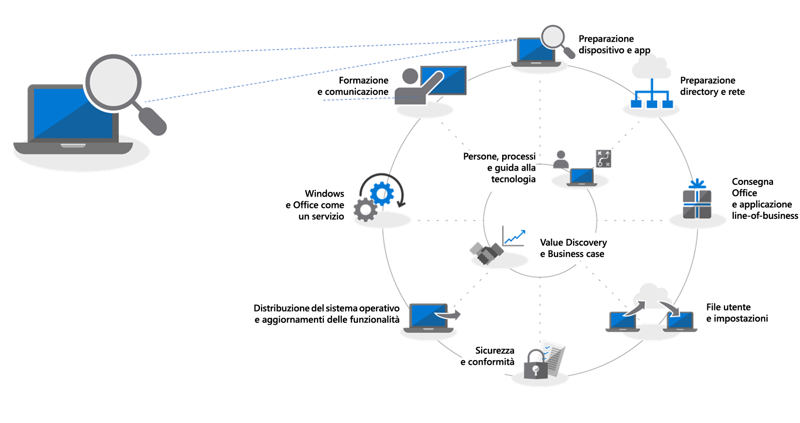
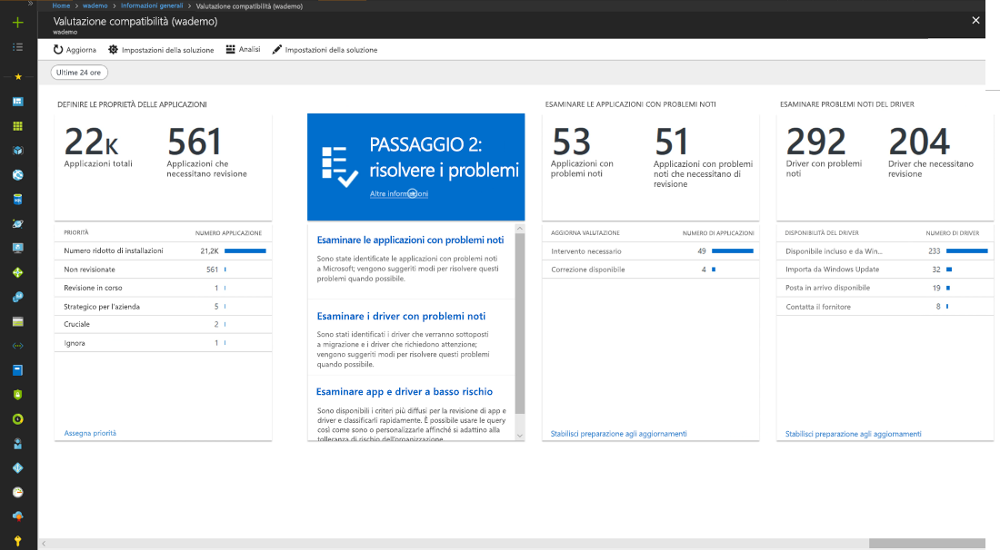
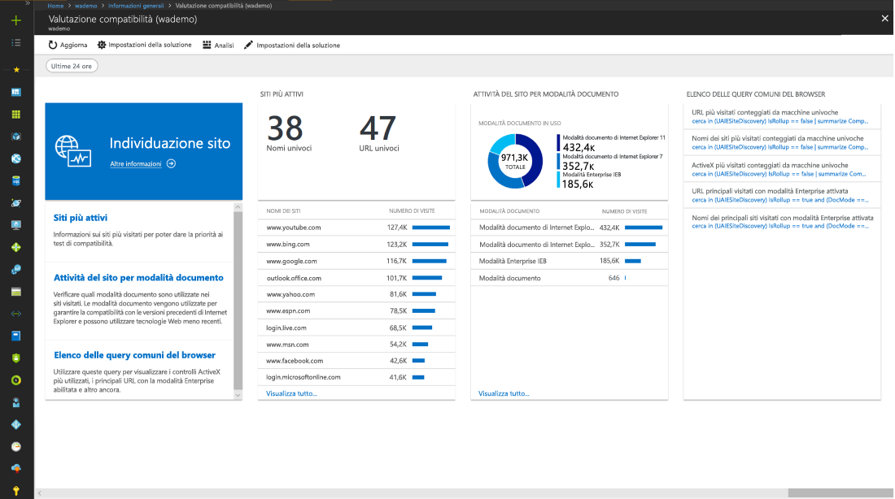
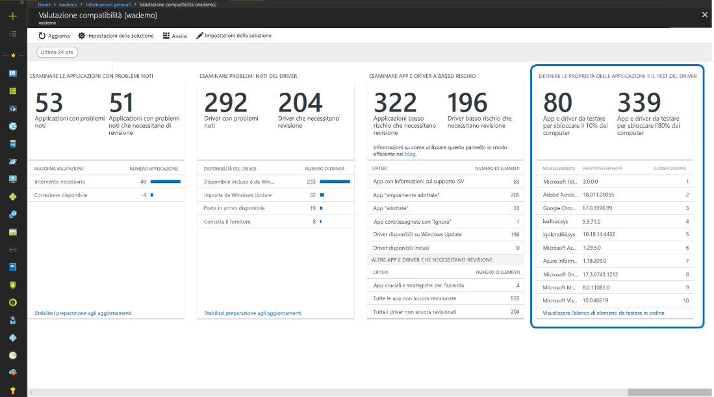
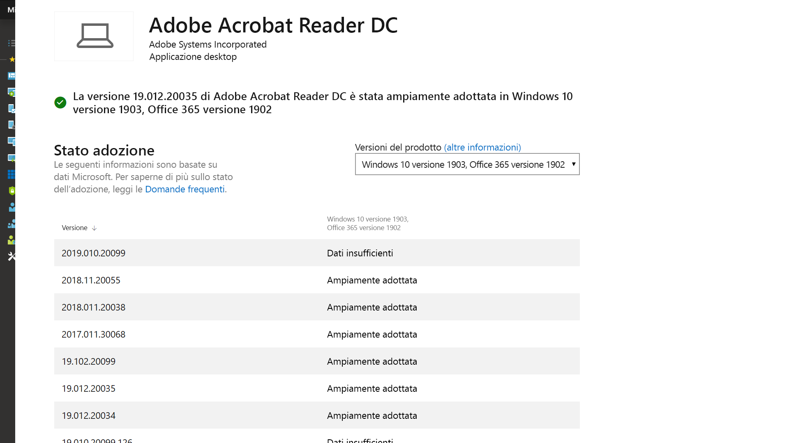
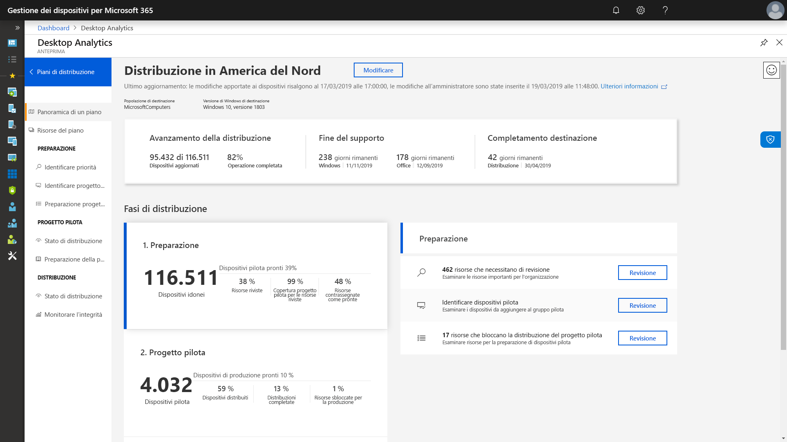

# Passaggio 1: preparazione di dispositivi e appStep 1: Device and App Readiness

<table>
<thead>
<td></td>
<td>
<strong>Passaggio 1: preparazione di dispositivi e app</strong><strong>Step 1: Device and App Readiness</strong>

Iniziare il progetto di distribuzione desktop con un inventario dei dispositivi e delle app, con l'assegnazione delle priorità, con l'esecuzione di test sui dispositivi e sulle app cui è stata assegnata la priorità, quindi con la correzione di quanto necessario per prepararsi alla distribuzione.Begin your desktop deployment project with an inventory of your devices and apps, prioritize what you need to move forward, test prioritized apps and devices, then remediate what’s needed to get ready for deployment.
</td>
<td></td>
</thead>
</table>

>[!NOTE]
>La preparazione di dispositivi e app rappresenta il primo passaggio del processo di distribuzione consigliato e copre gli aspetti olistici della compatibilità di applicazioni e componenti hardware.Device and App Readiness is the first step in our recommended deployment process wheel by covering the holistic aspects of application and hardware compatibility. Per vedere il processo di distribuzione desktop completo, visitare il [Centro distribuzione desktop](https://aka.ms/HowToShift).To see the full desktop deployment process, visit the [Desktop Deployment Center](https://aka.ms/HowToShift).
>

In passato, l'ostacolo principale per l'aggiornamento dei computer desktop degli utenti era la compatibilità di hardware e applicazioni. Finalmente, passando a Windows 10 e Office 365 ProPlus, praticamente ogni applicazione creata negli ultimi 10 anni sarà compatibile con Windows 10 e qualsiasi componente aggiuntivo COM e macro VBA utilizzato dall'organizzazione nelle versioni precedenti di Office (fino a Office 2010) continuerà a essere compatibile nelle versioni più recenti di Office, senza nessuna modifica.In the past, a major hurdle to upgrading the users’ desktops is application and hardware compatibility. The good news as you plan your shift to Windows 10 and Office 365 ProPlus, is just about any application written in the last 10 years will run on Windows 10, and any COM add-ins and VBA macros your organization used on versions of Office dating back to Office 2010, will continue to work on the latest versions of Office, without modification.

Premesso ciò, a seconda delle dimensioni e della longevità dell'organizzazione, la verifica della compatibilità di hardware e applicazioni rimane comunque un passaggio iniziale fondamentale nel nostro processo di distribuzione a 8 fasi consigliato.That said, depending on the size and age of your organization, verifying application and hardware compatibility is likely still an essential initial step in our recommended 8-phase deployment process.

In questo articolo viene illustrata la prima fase, Conformità dei dispositivi e app, usando gli strumenti per la valutazione e la preparazione di Microsoft tra cui Desktop Analytics, una soluzione intelligente basata sul cloud disponibile con la licenza di Windows.In this article we take you through that first phase – Device and App Readiness – using Microsoft readiness assessment tools including the new Windows Analytics Upgrade Readiness tool, an intelligent cloud-based solution available with your Windows license.

## Analisi della compatibilità di Windows 10Windows 10 Compatibility Scan

Prima di distribuire Windows 10, Microsoft consiglia di controllare l'idoneità dei dispositivi esistenti che eseguono Windows 7 o 8/8.1.Before deploying Windows 10 Microsoft recommends checking the readiness of your existing devices running Windows 7 or 8/8.1. Il supporto di installazione di Windows 10 supporta un'opzione della riga di comando per setup.exe, che consente di controllare solo la compatibilità senza eseguire l'aggiornamento.Windows 10 installation media supports a command line switch for the setup.exe to run the upgrade but only check for compatibility, not actually perform the upgrade. ScanOnly può essere eseguito come file batch con script o integrati in una sequenza di attività di System Center Configuration Manager. È possibile eseguire ScanOnly direttamente dalla rete, in modo che il supporto di installazione di Windows 10 non venga scaricato nel dispositivo locale.ScanOnly can be run as a scripted batch file or integrated into a System Center Configuration Manager task sequence, including the ability to run the ScanOnly directly from the network so the Windows 10 installation media isn't streamed down to the local device. Al termine dell'operazione ScanOnly, i risultati vengono restituiti tramite codici di uscita nei file di log generati da Setup.exe.When ScanOnly completes the results are returned via return codes in log files generated by Setup.EXE.   

Una riga di comando ScanOnly di esempio che completa l'analisi di compatibilità in modo invisibile all'utente avrà un aspetto simile al seguente:A sample ScanOnly command line that completes the compatibility scan silently would look like the below:

    Setup.EXE /Auto Upgrade /Quiet /NoReboot /Compat ScanOnly

Per altre informazioni su ScanOnly e altre opzioni della riga di comando di Windows, vedere [Opzioni della riga di comando per l'installazione di Windows](https://aka.ms/setupswitches).For more information on ScanOnly and other Windows setup command switches please review the [Windows Setup Commmand-line Options](https://aka.ms/setupswitches).

## Strumento consigliato: Desktop AnalyticsRecommended Tool: Desktop Analytics

Desktop Analytics offre numerosi vantaggi rispetto ai sistemi di gestione desktop tradizionali ed è lo strumento che noi consigliamo.Windows Analytics Upgrade Readiness offers many advantages over traditional desktop management systems and is our recommended tool. È senza agente e guida l'utente nelle operazioni da eseguire sfruttando le informazioni sulla compatibilità di driver e applicazioni raccolte durante l'aggiornamento di centinaia di milioni di PC.It is agentless and guides you through what needs to be done making use of application and driver compatibility information gathered through the upgrade of hundreds of millions of consumer PCs. Queste informazioni forniscono una valutazione dettagliata, identificando i problemi di compatibilità che potrebbero impedire l'aggiornamento, con collegamenti alle correzioni consigliate note di Microsoft.This information gives you a detailed assessment, identifying compatibility issues that might block your upgrade, supported with links to suggested fixes known to Microsoft.

Per configurare Desktop Analytics, prima di tutto è necessario configurare una sottoscrizione di Azure e includervi un'area di lavoro di Azure Log Analytics.To set up Window Analytics Upgrade Readiness you’ll first need to set up an Azure subscription and include an Azure Log Analytics workspace to that. Una volta che il servizio Desktop Analytics è in esecuzione, è possibile registrare qualsiasi dispositivo Windows 7 SP1 o versioni successive connesso a Internet tramite le impostazioni di Criteri di gruppo. È semplicissimo.Once you have the Windows Analytics Upgrade Readiness service running, you can then enroll any Internet-connected Windows 7 SP1 or newer device via Group Policy settings - it’s that simple. Non ci sono agenti da distribuire e il flusso di lavoro visivo di Desktop Analytics guida l'utente dalla distribuzione pilota alla distribuzione di produzione.There are no agents to deploy, and Windows Analytics Upgrade Readiness’s visual workflow guides you from pilot to production deployment. Volendo, è possibile esportare i dati da Desktop Analytics a strumenti per la distribuzione del software come System Center Configuration Manager (Current Branch), per raggiungere direttamente i PC e creare raccolte non appena sono pronti per la distribuzione.If you wish, you can export data from Windows Analytics Upgrade Readiness to software deployment tools such as System Center Configuration Manager, to target PCs directly and build collections as they become ready for deployment.

Se al momento Desktop Analytics non è configurato per l'ambiente o se si desidera iscriversi per una prova, accedere alla pagina di Desktop Analytics (http://www.aka.ms/desktopanalytics)) e iniziare.If you don’t currently have Windows Analytics set up for your environment or would like to sign up for a trial, go the http://www.aka.ms/desktopanalytics) and get started.

## Processo di preparazione di dispositivi e appDevice and App Readiness Process

Il processo di preparazione di dispositivi e app è costituito da quattro passaggi: 1.Device and App Readiness is comprised of four steps: 1. Inventario, 2Inventory, 2. Assegnazione della priorità, 3.Prioritize, 3. Test, 4.Test, 4. Correzione.Remediate. Di seguito vengono esaminati in dettaglio.Let’s look at each of these in turn.

### 1\.1\. InventarioInventory

Desktop Analytics si avvale di un processo senza agente per effettuare un inventario dei computer e delle applicazioni tra i vari desktop in uso.Windows Analytics Upgrade Readiness service uses an agent-less process to inventory the computers, applications, and Office add-ins across your desktop estate. Inoltre, fornisce report sui siti Internet più visitati, sulle app e sui percorsi Intranet, per semplificare la successiva fase di test della compatibilità.It also provides reports on highly visited Internet sites, apps, and Intranet locations to help you with compatibility testing later.

### 2\.2\. Assegnazione della prioritàPrioritize

Una volta eseguito l'inventario, Desktop Analytics consente di identificare e classificare in ordine di priorità l'hardware e le app più comuni usati nell'organizzazione, oltre a indicare su cosa concentrarsi per sbloccare il maggior numero possibile di PC per la distribuzione.With inventory taken, Windows Analytics Upgrade Readiness helps you to identify and prioritize the most common apps and hardware used in your organization, as well as what to focus on to unblock as many PCs as possible for deployment.

Fornisce inoltre indicazioni utili per valutare se siano necessari aggiornamenti per risolvere i problemi durante il passaggio successivo: il test.It also provides guidance to help you assess the updates necessary to resolve issues during the next step: testing.

### 3\.3\. TestTesting

Si noterà che la maggior parte delle applicazioni, dei driver e dei componenti aggiuntivi sottoposti a inventario funzionerà così com'è.You will find that most of the applications, drivers, and add-ins inventoried will work as-is. Per gli elementi in cui Desktop Analytics rileva problemi, vengono fornite informazioni note, ad esempio dove trovare gli aggiornamenti delle versioni per risolvere i problemi di compatibilità.For items Windows Analytics Upgrade Readiness assesses to have issues, it provides you with known information including where to find version updates to resolve compatibility problems. Anziché dedicare tempo e risorse alla risoluzione di problemi complessi in dispositivi meno recenti e applicazioni non fondamentali e con una distribuzione limitata, è possibile concentrarsi sulla collaborazione con gli utenti per ritirare e sostituire tali elementi.Rather than devoting time and resource resolving complex issues in non-critical, sparsely deployed applications and older devices, you may choose instead to work with users to retire and replace these items.

È possibile usare Desktop Analytics anche per valutare i problemi di compatibilità basati su browser, identificando siti Web e app Web accessibili dagli utenti che usano ancora controlli ActiveX, oggetti browser helper, VBScript o altre tecnologie legacy non supportate dal browser Microsoft Edge.You can use Windows Analytics Upgrade Readiness to assess browser-based compatibility issues too, identifying websites and web apps accessed by users still using ActiveX controls, Browser Helper Objects, VBScript, or other legacy technology not supported by the Microsoft Edge browser. Your users will still need to use Internet Explorer 11 for these sites, and you can add them to the Enterprise Mode site list, using the Enterprise Mode Site List Manager. Gli utenti dovranno continuare a usare Internet Explorer 11 per questi siti ed è possibile aggiungerli all'[elenco siti modalità Enterprise](https://docs.microsoft.com/it-IT/microsoft-edge/deploy/emie-to-improve-compatibility)usando l’Enterprise Mode Site List Manager.You can use Windows Analytics Upgrade Readiness to assess browser-based compatibility issues too, identifying websites and web apps accessed by users still using ActiveX controls, Browser Helper Objects, VBScript, or other legacy technology not supported by the Microsoft Edge browser. Your users will still need to use Internet Explorer 11 for these sites, and you can add them to the [Enterprise Mode site list](https://docs.microsoft.com/it-IT/microsoft-edge/deploy/emie-to-improve-compatibility), using the Enterprise Mode Site List Manager.

Inoltre, per facilitare il passaggio a Office 365 ProPlus, è consigliabile usare [Readiness Toolkit for Office](https://docs.microsoft.com/it-IT/deployoffice/use-the-readiness-toolkit-to-assess-application-compatibility-for-office-365-pro) per testare la compatibilità dei componenti aggiuntivi e delle macro Microsoft Visual Basic for Applications (VBA).Additionally, to assist in your move to Office 365 ProPlus, you may wish to make use of the [Readiness Toolkit for Office](https://docs.microsoft.com/it-IT/deployoffice/use-the-readiness-toolkit-to-assess-application-compatibility-for-office-365-pro) to test the compatibility of your add-ins and Microsoft Visual Basic for Applications (VBA) macros.

### 4\. Correzione4\. Remediation

La fase finale della preparazione di dispositivi e app è quella di correzione.The final phase of device and app readiness is to ‘remediate’. Sarà necessario raccogliere i pacchetti driver e software necessari che verranno usati per sostituire o aggiornare le versioni precedenti nell'ambito del processo di distribuzione.Here you’ll want to collect the required software or driver packages; you are going to use these to supersede or update older versions as part of the deployment process.

Man mano che vengono esaminati problemi, un numero sempre maggiore di PC diventa "pronto per la distribuzione". Ciò significa che sia i driver che le app sui PC vengono considerati compatibili con la versione di Windows 10 che si intende utilizzare per la distribuzione.As you work through the list remediating issues, you’ll see that more and more PCs become “Ready for Deployment”. This means that both the drivers and apps on the PCs are noted as compatible with the version of Windows 10 you are targeting for deployment.

### Inventario software di Configuration Manager per la definizione della priorità delle applicazioniConfiguration Manager Software Inventory for Application Prioritization

L'inventario software di Configuration Manager è un'alternativa all'uso di soluzioni di analisi basate sul cloud per valutare lo stato di preparazione di dispositivi e app.Configuration Manager software inventory is an alternative to using cloud-based analytics solutions for device and app readiness. È possibile tenere traccia del numero di installazioni ed eseguire il drill-down in computer specifici per definire più facilmente le priorità per il test e la convalida della compatibilità, oltre che impostare pacchetti di applicazioni come compatibili con Windows 10 tramite le impostazioni del pacchetto.You can use installation counts and drill into specific computers to help prioritize compatibility testing and validation and set application packages as compatible with Windows 10 via package settings. Anche se questa opzione non offre la possibilità di confrontare le informazioni di compatibilità note con i servizi di analisi di Microsoft, può rappresentare una soluzione efficace per un set ridotto di applicazioni con priorità per il testing manuale.While this option does not offer the ability to compare known compatibility information with Microsoft’s analytics services, it can be an effective solution to target a smaller set of prioritized apps for manual testing. 

Per altre informazioni, vedere [Introduzione all'inventario software in System Center Configuration Manager](https://docs.microsoft.com/it-IT/sccm/core/clients/manage/inventory/introduction-to-software-inventory) e come configurare i requisiti della piattaforma nei pacchetti applicazioni in [Pacchetti e programmi di System Center Configuration Manager](https://docs.microsoft.com/it-IT/sccm/apps/deploy-use/packages-and-programs).For more information, see [Introduction to software inventory in System Center Configuration Manager](https://docs.microsoft.com/it-IT/sccm/core/clients/manage/inventory/introduction-to-software-inventory) and setting platform requirements in application packages in [Packages and programs in System Center Configuration Manager](https://docs.microsoft.com/it-IT/sccm/apps/deploy-use/packages-and-programs).

## Desktop App AssureDesktop App Assure

Un altro strumento utile per valutare la compatibilità delle app di Windows 10 e Office 365 ProPlus è il programma [Desktop App Assure](https://aka.ms/desktopappassure), disponibile in FastTrack Center.Another tool to help with Windows 10 and Office 365 ProPlus app compatibility is the [Desktop App Assure](https://aka.ms/desktopappassure) program available through the FastTrack Center. Tramite Desktop App Assure, in caso di problemi validi di compatibilità delle applicazioni sarà possibile collaborare gratuitamente con un tecnico Microsoft per risolvere l'incompatibilità.Through Desktop App Assure in the event of valid application issues a Microsoft engineer with work with you at no additional cost to help remediate the application incompatibility.

## Uso continuativo di strumenti per i dati di diagnosticaContinued Use of Diagnostic Data Tools

Desktop Analytics non è solo uno strumento che consente di passare a Windows 10 e Office 365 ProPlus.Desktop Analytics isn’t just a tool to help you shift to Windows 10 and Office 365 ProPlus. Dopo aver installato Windows 10 e Office 365 nel computer desktop, è possibile usarlo per gestire la distribuzione e gli aggiornamenti semestrali delle funzionalità per avere sempre le ultime versioni a disposizione.Windows Analytics Upgrade Readiness isn’t just a tool to help you shift to Windows 10 and Office 365 ProPlus. Once you have desktops running on Windows 10 and Office 365 you can use it to help maintain your deployment and manage semi-annual Feature Updates so that you can stay current.

## Passaggio successivoNext Step 

## [Passaggio 2: conformità directory e reteStep 2: Directory and Network Readiness](https://aka.ms/mdd2)
