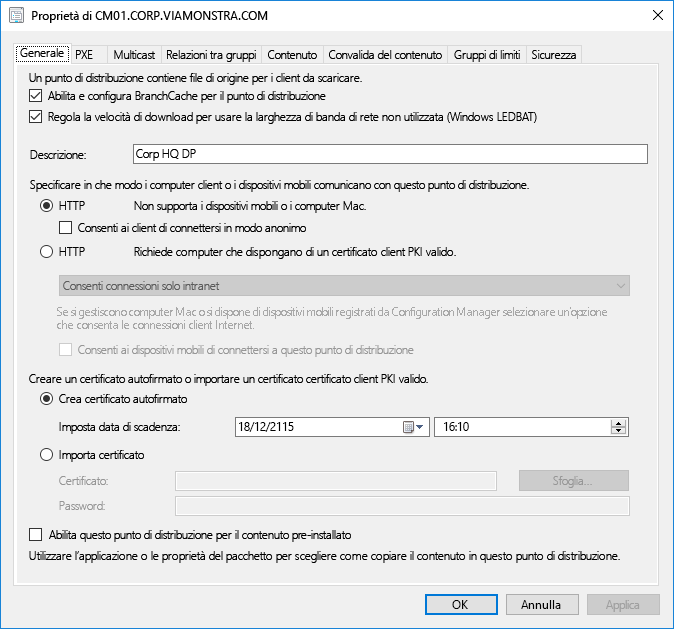
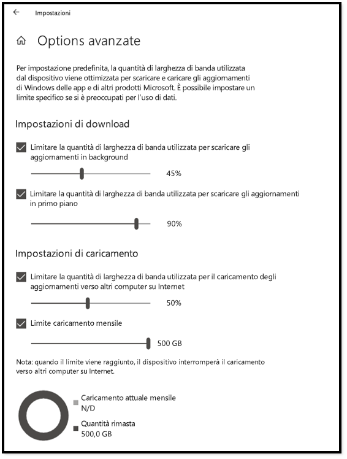
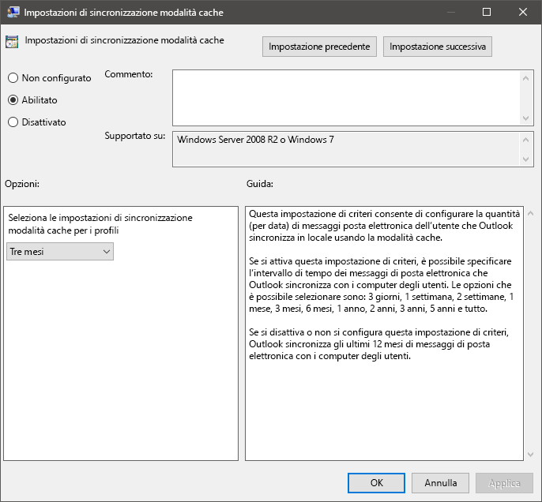
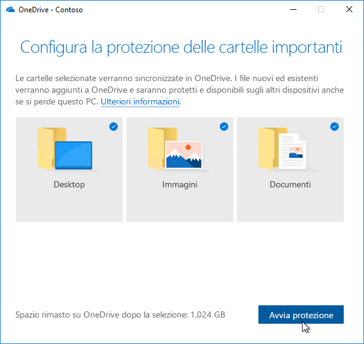

# Passaggio 2: conformità di directory e rete

Ensure your directory and the network are configured and ready to support to your shift to Windows 10 and Microsoft 365 Apps for enterprise. This will require Azure Active Directory Services to be in place for users, and your network must have the capacity to handle both its regular traffic and the movement of potentially vast amounts of data as PCs are upgraded, and users’ files, settings and applications are restored.

<table>
<thead>
<td></td>
<td>
<strong>Passaggio 2: conformità directory e rete</strong>

Cloud connected services in Microsoft 365 Apps for enterprise and new deployment options like Windows Autopilot require Azure Active Directory. Your network and connectivity are also important areas to plan when moving Windows images, apps, drivers and related files to your PCs. Learn how new tools and deployment options reduce and streamline network traffic.
</td>
<td></td>
</thead>
</table>

>[!NOTE]
>La conformità di directory e rete rappresenta il secondo passaggio del processo di distribuzione consigliato, incentrato su Azure Active Directory e l'ottimizzazione della rete. Per vedere il processo di distribuzione desktop completo, visitare il [Centro distribuzione desktop](https://aka.ms/HowToShift).
>

Directory and Network readiness is fundamental to ensuring a smooth OS and desktop deployment. As with any automated deployment, it is important to ensure your file shares can be reached, and your network will need to be able to support the transfer of very large files, possibly to hundreds or even thousands of PCs at a time.

With your shift to Windows 10 and Microsoft 365 Apps for enterprise you also now need to make sure that cloud-based identity is set up with Azure Active Directory. This is key not only to activating Microsoft 365 Apps for enterprise, it also allows you to take advantage of modern provisioning solutions like Windows Autopilot.

In questo articolo è possibile esplorare gli strumenti e le opzioni per preparare i servizi directory, nonché le autorizzazioni per dispositivo e utente, per Windows 10 e Microsoft 365 Apps for enterprise.

## Aggiunta di Azure Active Directory

Se l'organizzazione usa già Office 365, Exchange Online, Microsoft Intune o altri servizi Microsoft Online, allora si sta già usando Azure Active Directory. In tal caso, sarà sufficiente assicurarsi che gli utenti destinatari della distribuzione desktop siano nell'istanza di Azure Active Directory usata e che siano state assegnate licenze.

Se attualmente non si sta usando Azure Active Directory, esistono [numerose risorse](https://docs.microsoft.com/azure/active-directory/) che consentono di configurarlo. È possibile ricevere assistenza personalizzata tramite Microsoft FastTrack, nell'ambito della propria licenza. Informazioni relative a Microsoft FastTrack sono disponibili [qui](https://fasttrack.microsoft.com).

Dopo aver implementato Azure Active Directory sul posto, gli utenti possono accedere e attivare le applicazioni di Microsoft 365 Apps for enterprise ed è possibile consentire la distribuzione di Microsoft Intune o Windows Autopilot per la distribuzione automatica delle applicazioni e dei criteri.

## Conformità di rete

Quando si pianifica la distribuzione, è necessario considerare i requisiti di larghezza di banda. Esistono tre componenti principali in una distribuzione che avranno un impatto sulla rete: imaging del PC, aggiornamenti software e personalizzazione dell'utente. Ciò può significare più di 20 GB per PC per la migrazione iniziale e spesso 1 GB o più al mese per PC per rimanere sempre aggiornati.

Iniziamo a esplorare i requisiti di ognuno di questi tre componenti principali:

### Imaging del PC

Per le immagini di Windows senza alcuna personalizzazione è consigliabile in genere pianificare 3 GB per PC, mentre per le immagini personalizzate con le applicazioni si consigliano 6 GB o più. È necessario prendere in considerazione i pacchetti Driver, che possono essere di poche centinaia di megabyte per PC, a volte fino a 1 GB.

### Aggiornamenti software

È necessario pianificare la larghezza di banda di rete per gli aggiornamenti software. Windows 10 e Microsoft 365 Apps for enterprise si avvalgono di un nuovo modello di servizio, che offre aggiornamenti mensili o semestrali. Se non si conosce il modello, altre informazioni su come funziona sono disponibili [qui](https://docs.microsoft.com/windows/deployment/update/waas-overview).

The new servicing model includes Feature Updates for Windows twice a year, Office Semi-Annual Enterprise Channel Updates, and monthly Quality Updates. Feature Updates are typically 2 – 4GB in size, and Office Semi-Annual Enterprise Channel updates are 300 – 400 MB per update. Then there are the monthly Quality Updates. These may range from a few hundred megabytes to over a gigabyte. This is because monthly updates are cumulative, so these increase in size over the servicing lifetime for each Windows 10 version. That said, there are tools that can help reduce the amount of data that must pass over the network to implement updates. We will cover this in more detail below.

### Personalizzazione utente

The third component to consider is user personalization. Here you need to plan network bandwidth to accommodate the restoring of user files, their settings, and their applications as part of the PC refresh or replacement process. Together, these items often exceed 20 GB per PC; for some users these may exceed 100 GB.

## Limitazione della larghezza di banda

One way to limit the impact of deployment-related traffic on the network is to throttle it using the BITS (Background Intelligent Transfer Service) setting on clients. BITS uses an Adaptive Bit Rate (ABR) to adjust bandwidth available for deployment purposes; it can be configured on clients using Group Policy.

[Informazioni sui BITS](https://docs.microsoft.com/windows/desktop/bits/about-bits)

Se si usa Microsoft Endpoint Configuration Manager (Current Branch), è possibile configurare i punti di distribuzione abilitati a BITS o attivare multicast con WDS.

Throttling specific traffic means that normal network traffic is less impacted by PCs downloading updates and applications. But carving out a certain percentage of bandwidth for these tasks helps ensure productivity isn’t impacted by Windows or Office deployment and processes continue to run as needed, it can worsen deployment-related downtime, with users locked out of their PCs while a deployment runs.

Fortunatamente, sono disponibili nuovi strumenti che facilitano la gestione dell'impatto sulla rete di una distribuzione desktop su vasta scala, tra cui LEDBAT per ottimizzare l'utilizzo della larghezza di banda disponibile e opzioni peer-to-peer (P2P) per spostare la distribuzione del traffico dal centro della rete e fuori dal perimetro

## Scavenging della larghezza di banda

LEDBAT (Low Extra Delay Background Transport), supportato in Windows Server 2019 e Microsoft Endpoint Configuration Manager (Current Branch), è progettato per ottimizzare il traffico di rete per client Windows.

[Le 10 principali funzionalità di rete in Windows Server 2019: \#9 - LEDBAT: Latency Optimized Background Transport](https://blogs.technet.microsoft.com/networking/2018/07/25/ledbat/)

Unlike traditional throttling, LEDBAT can use all available network bandwidth as a background task, instantly yielding bandwidth when other traffic requests it. Unlike BITS there is no delay; everything is automated – no manual tuning or scheduling required, and everything is setup server side. This affords potentially massive performance gains.

## Opzioni peer-to-peer

Peer-to-Peer options are increasingly being used in Windows 10 migrations, for PC imaging, software updates and user personalization. They are also valuable in facilitating build-to-build upgrades after your initial Windows 10 deployment. Here we will cover several examples to help move Windows 10 and Office-related traffic away from the center of the network, reducing the need for classic throttling approaches, and allowing PCs to find the update files they need on peers in their local network rather than downloading them from a distribution point or the internet.

**BranchCache** can help you download content in distributed environments without saturating the network. It comes in two options: Hosted Cache Mode, which lets you use local servers to cache content, and Distributed Cache Mode (a mode supported in Configuration Manager), which lets clients share already downloaded content with each other.

**Peer cache**: i client supportati da Configuration Manager possono anche usare peer cache. Ciò consente ai PC disponibili in modo affidabile sulla rete di ospitare la sorgente per la distribuzione del contenuto. Non sarà necessario abilitare tutti i PC, basterà individuare dispositivi di destinazione con connessioni di rete affidabili come host (ad esempio desktop, mini-tower o tower PC). Peer cache può persino funzionare per le attività di distribuzione in esecuzione nelle fasi di Windows PE durante l'installazione.

Nota: BranchCache e peer cache sono complementari e possono collaborare nello stesso ambiente.

[BranchCache versus Peer cache](https://blogs.technet.microsoft.com/swisspfe/2018/01/25/branch-cache-vs-peer-cache/)

**Ottimizzazione recapito**: Ottimizzazione recapito è un'altra tecnologia di caching peer-to-peer che fornisce controlli basati sulla rete per le installazioni di Windows. Ottimizzazione recapito di Windows 10 viene usato per aggiornare app UWP integrate, anche per installare applicazioni da Microsoft Store e per aggiornamenti software tramite Express Updates. È disponibile dalle prime versioni di Windows 10, sebbene sia stato integrato solo di recente con Microsoft Endpoint Configuration Manager (Current Branch). Le nuove opzioni di configurazione di Windows 10 versione 1803 consentono di impostare in modo indipendente i limiti di larghezza di banda per gli aggiornamenti in background e per i processi in primo piano come l'installazione di un'app dallo Store. Ottimizzazione recapito di Windows ora supporta anche Microsoft 365 Apps for enterprise durante gli aggiornamenti client, disponibile in tutti i canali di aggiornamento client supportati. Il supporto di Ottimizzazione recapito di Windows durante l'installazione iniziale del client sarà presto disponibile.  

**Considerazioni aggiuntive su Microsoft 365 Apps for enterprise**

Oltre a sfruttare Ottimizzazione recapito, ecco tre elementi che consentiranno di ridurre il carico di rete per le distribuzioni di Microsoft 365 Apps for enterprise.

**Binary Delta Compression** Microsoft 365 Apps for enterprise uses Binary Delta Compression to reduce bandwidth consumed by software updates when updating from the most recent release of Microsoft 365 Apps for enterprise to the next release. By only pulling the binary level changes from the previous release, the impact from month-over-month growth of cumulative updates is minimized. This has the potential of saving several hundred megabytes of data, per PC, each month. In order to use this capability though, you cannot skip releases. If you do, then the full cumulative update must be downloaded.

[Scaricare aggiornamenti di sicurezza per Microsoft 365 Apps](https://docs.microsoft.com/deployoffice/overview-update-process-microsoft-365-apps#download-the-updates-for-microsoft-365-apps)

**File di dati di Outlook**: Outlook viene spesso configurato per memorizzare nella cache l'intera cassetta postale degli utenti per l'uso offline. In qualsiasi distribuzione di Windows, ad eccezione di un aggiornamento sul posto, che richiede che i file di dati di Outlook degli utenti vengano ricostruiti automaticamente dopo l'aggiornamento, si tratta di un processo automatizzato, ma con i limiti delle cassette postali di Outlook generalmente impostati su un massimo di 100 GB, l'ulteriore caching dell'intera cassetta postale in locale per tutti gli utenti significa trasferire molti dati. Per ridurre il carico di rete, si consiglia di prendere in considerazione l'utilizzo di Criteri di gruppo per ridurre l'impostazione "Posta da mantenere offline". In Microsoft 365 Apps for enterprise o Office 2016 il valore predefinito di Outlook è impostato su 12 mesi. Al fine di ridurre l'impatto sulla rete, provare a impostare la cache offline per una durata compresa tra 1 e 6 mesi. Modificare questa impostazione non influisce sulle dimensioni della cassetta postale online e l'intera cassetta postale può ancora essere ricercata tramite Outlook quando è online.

**File di OneDrive su richiesta e spostamento di cartelle note**: OneDrive è un ottimo modo per sincronizzare e proteggere i file utente da PC e altri dispositivi nel cloud. Con lo spostamento di cartelle note, è possibile applicare la sincronizzazione dei file dalle cartelle Desktop, Documenti e Immagini dell'utente a OneDrive, rendendo tali file disponibili quando si accede a un nuovo dispositivo o a un PC di cui ne sia stata ricreata l'immagine. Tuttavia, è necessario ricordare che, a causa delle dimensioni e del numero di file conservati nei percorsi Desktop, Documenti e Immagini, si consiglia di pianificare l'implementazione dei criteri che consentono e applicano OneDrive nei PC. Un'opzione consiste nell'usare i controlli di rete dei criteri di gruppo per limitare la larghezza di banda usata dal servizio di sincronizzazione OneDrive.

[Configurazione dello spostamento di cartelle note](https://techcommunity.microsoft.com/t5/Microsoft-OneDrive-Blog/Migrate-Your-Files-to-OneDrive-Easily-with-Known-Folder-Move/ba-p/207076)

[File OneDrive su richiesta](https://www.microsoft.com/microsoft-365/blog/2017/05/11/introducing-onedrive-files-on-demand-and-additional-features-making-it-easier-to-access-and-share-files/)

Se OneDrive non è stato ancora implementato, il passaggio da Windows 7 a Windows 10 è un'opportunità perfetta per abilitarlo e si integra perfettamente con Microsoft 365 Apps for enterprise. Prendere in considerazione la possibilità di iniziare questo roll-out durante la preparazione del dispositivo e l'uso dell'app. Ciò consentirà di sincronizzare i file prima di trasferire le immagini di Windows e distribuire le app sulla rete.

## Passaggio successivo 

## [Passaggio 3: distribuzione di Office e app line-of-business](https://aka.ms/mdd3)

## Passaggio precedente:

## [Passaggio 1: preparazione di dispositivi e app](https://aka.ms/mdd1)

## Commenti e suggerimenti

We'd love to hear your thoughts. Choose the type you'd like to provide:

Commenti e suggerimenti sul prodotto - Accedere per inviare commenti e suggerimenti sulla documentazione

Our new feedback system is built on GitHub Issues. Read about this change in our blog post.
