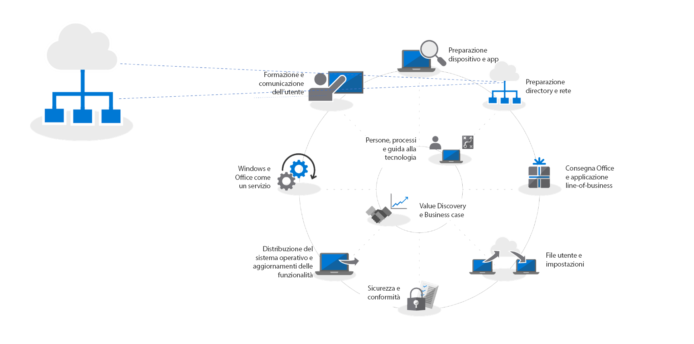
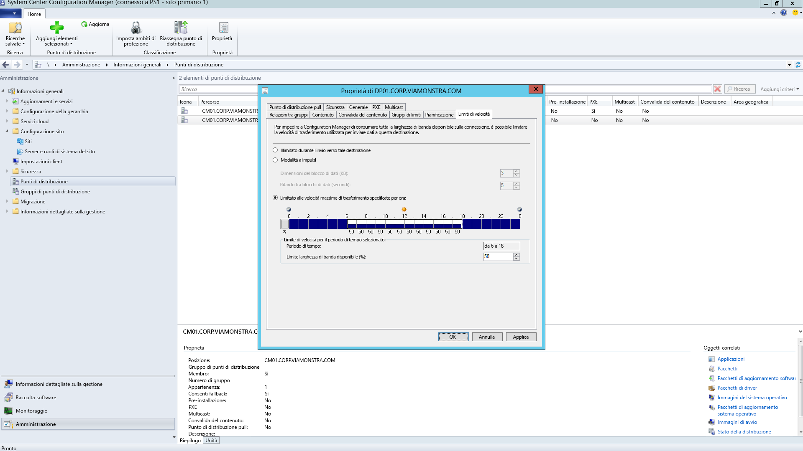
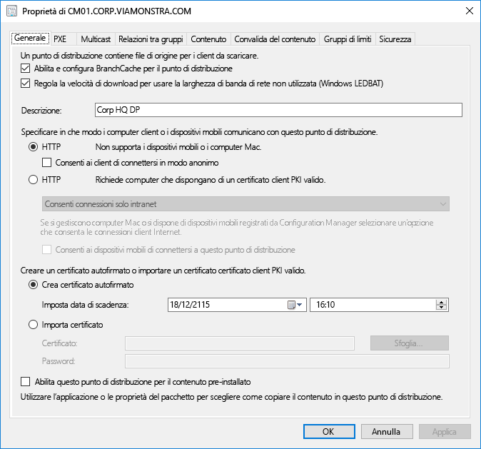
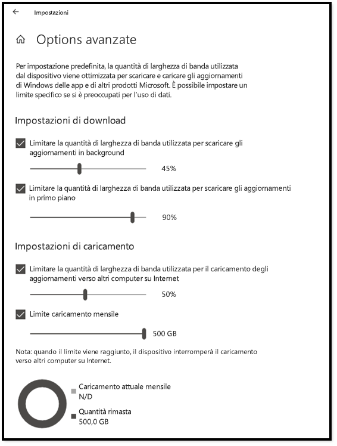
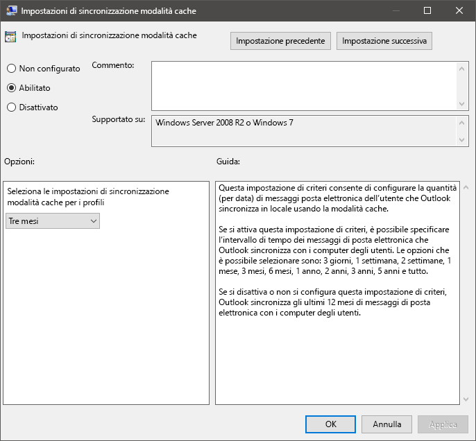
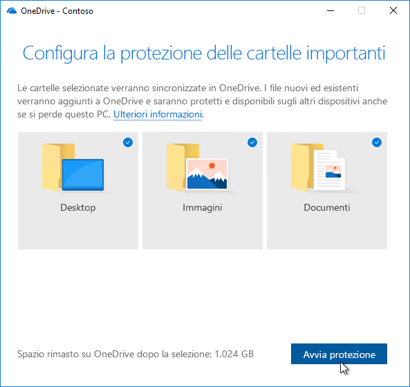

# Passaggio 2: conformità di directory e rete

Assicurarsi che la directory e la rete siano configurate e conformi per supportare il passaggio a Windows 10 e Office 365 ProPlus. Gli utenti dovranno disporre dei servizi di Azure Active Directory sul posto e la rete dovrà avere la capacità di gestire il traffico normale e lo spostamento di quantità di dati potenzialmente grandi durante l'aggiornano del PC e il ripristino di file, impostazioni e applicazioni.

<table>
<thead>
<td></td>
<td>
<strong>Passaggio 2: conformità di directory e rete</strong>

I servizi connessi tramite cloud in Office 365 ProPlus e le nuove opzioni di distribuzione come Windows Autopilot richiedono Azure Active Directory. Anche la rete e la connettività sono aree importanti da pianificare quando si trasferiscono immagini, app, driver e file correlati nei PC. Ottenere informazioni su come i nuovi strumenti e opzioni di distribuzione riducono e ottimizzano il traffico di rete.
</td>
<td></td>
</thead>
</table>

>[!NOTE]
>La conformità di directory e rete rappresenta il secondo passaggio del processo di distribuzione consigliato, incentrato su Azure Active Directory e l'ottimizzazione della rete. Per vedere il processo di distribuzione desktop completo, visitare il [Centro distribuzione desktop](https://aka.ms/HowToShift).
>

La conformità di directory e rete è fondamentale per garantire una distribuzione desktop e del sistema operativo agevole. Analogamente a qualsiasi distribuzione automatizzata, è importante che i file condivisi possano essere raggiunti, inoltre, la rete dovrà essere in grado di supportare il trasferimento di file molto grandi, probabilmente per centinaia o migliaia di PC contemporaneamente.

Con il passaggio a Windows 10 e Office 365 ProPlus, sarà, inoltre, necessario assicurarsi che l'identità basata su cloud sia impostata con Azure Active Directory. Ciò è fondamentale non solo per attivare Office 365 ProPlus, ma consente anche di utilizzare soluzioni moderne di provisioning come Windows Autopilot.

In questo articolo è possibile esplorare gli strumenti e le opzioni per preparare i servizi directory, nonché le autorizzazioni per dispositivo e utente, per Windows 10 e Office 365 ProPlus.

## Aggiunta di Azure Active Directory

Se l'organizzazione usa già Office 365, Exchange Online, Microsoft Intune o altri servizi Microsoft Online, allora si sta già usando Azure Active Directory. In tal caso, sarà sufficiente assicurarsi che gli utenti destinatari della distribuzione desktop siano nell'istanza di Azure Active Directory usata e che siano state assegnate licenze.

Se attualmente non si sta usando Azure Active Directory, esistono [numerose risorse](https://docs.microsoft.com/it-IT/azure/active-directory/) che consentono di configurarlo. È possibile ricevere assistenza personalizzata tramite Microsoft FastTrack, nell'ambito della licenza di Office 365. Informazioni relative a Microsoft Fastrack sono disponibili [qui](https://fasttrack.microsoft.com).

Dopo aver implementato Azure Active Directory sul posto, gli utenti possono accedere e attivare le applicazioni di Office 365 ProPlus ed è possibile consentire la distribuzione di Microsoft Intune o Windows Autopilot per la distribuzione automatica delle applicazioni e dei criteri.

## Conformità di rete

Quando si pianifica la distribuzione, è necessario considerare i requisiti di larghezza di banda. Esistono tre componenti principali in una distribuzione che avranno un impatto sulla rete: imaging del PC, aggiornamenti software e personalizzazione dell'utente. Ciò può significare più di 20 GB per PC per la migrazione iniziale e spesso 1 GB o più al mese per PC per rimanere sempre aggiornati.

Iniziamo a esplorare i requisiti di ognuno di questi tre componenti principali:

### Imaging del PC

Per le immagini di Windows senza alcuna personalizzazione è consigliabile in genere pianificare 3 GB per PC, mentre per le immagini personalizzate con le applicazioni si consigliano 6 GB o più. È necessario prendere in considerazione i pacchetti Driver, che possono essere di poche centinaia di megabyte per PC, a volte fino a 1 GB.

### Aggiornamenti software

È necessario pianificare la larghezza di banda di rete per gli aggiornamenti software. Windows 10 e Office 365 ProPlus si avvalgono di un nuovo modello di servizio, che offre aggiornamenti mensili o semestrali. Se non si conosce il modello, altre informazioni su come funziona sono disponibili [qui](https://docs.microsoft.com/it-IT/windows/deployment/update/waas-overview).

Il nuovo modello di servizio include aggiornamenti delle funzionalità per Windows due volte l'anno, aggiornamenti canale di Office semestrali e aggiornamenti qualitativi mensili. Gli aggiornamenti delle funzionalità hanno in genere dimensioni da 2 a 4 GB e gli aggiornamenti canale di Office semestrali 300-400 MB per ogni aggiornamento. Infine ci sono gli aggiornamenti qualitativi mensili, che possono variare da poche centinaia di megabyte a più di un gigabyte. Ciò dipende dal fatto che gli aggiornamenti mensili sono cumulativi, pertanto la loro dimensione aumenta per la durata di servizio per ogni versione di Windows 10. Nonostante ciò, sono disponibili strumenti che aiutano a ridurre la quantità di dati di rete per implementare gli aggiornamenti. Questi verranno illustrati in dettaglio più avanti.

### Personalizzazione utente

Il terzo componente da considerare è la personalizzazione. In questo caso è necessario pianificare larghezza di banda di rete per consentire il ripristino di file utente, impostazioni e applicazioni nell'ambito del processo di aggiornamento o sostituzione del PC. Questi elementi, insieme, superano spesso i 20 GB per PC e per alcuni utenti si possono superare i 100 GB.

## **Limitazione della larghezza di banda**

Un modo per limitare l'impatto sulla rete del traffico relativo alla distribuzione consiste nel limitare l'impostazione di BITS (Servizio trasferimento intelligente in background) sui client. BITS utilizza una velocità di Bit adattivo (ABR) per modificare la larghezza di banda disponibile per la distribuzione; può essere configurato nel client tramite criteri di gruppo.

  [Informazioni sui BITS](https://docs.microsoft.com/it-IT/windows/desktop/bits/about-bits)

Se si usa System Center Configuration Manager, è possibile configurare i punti di distribuzione abilitati a BITS o attivare multicast con WDS.

Limitazione del traffico specifico indica che il normale traffico di rete è meno interessato dal download di aggiornamenti e applicazioni per il PC. Tuttavia, ricavare una determinata percentuale della larghezza di banda per queste attività consente di evitare l'impatto della distribuzione di Windows o Office sulla produttività e di assicurare la continuità di esecuzione dei processi in base alle esigenze; può peggiorare i tempi di inattività legati alla distribuzione con inaccessibilità al PC da parte degli utenti durante la distribuzione.

Fortunatamente, sono disponibili nuovi strumenti che facilitano la gestione dell'impatto sulla rete di una distribuzione desktop su vasta scala, tra cui LEDBAT per ottimizzare l'utilizzo della larghezza di banda disponibile e opzioni peer-to-peer (P2P) per spostare la distribuzione del traffico dal centro della rete e fuori dal perimetro

## **Scavenging della larghezza di banda**

LEDBAT (Low Extra Delay Background Transport), supportato in Windows Server 2019 e System Center Configuration Manager versione 1806, è progettato per ottimizzare il traffico di rete per client Windows.

[Le 10 principali funzionalità di rete in Windows Server 2019: \#9 - LEDBAT: Latency Optimized Background Transport](https://blogs.technet.microsoft.com/networking/2018/07/25/ledbat/)

A differenza della limitazione tradizionale, LEDBAT può utilizzare tutta la larghezza di banda di rete disponibile come attività in background, offrendo istantaneamente larghezza di banda quando il traffico lo richiede. A differenza di BITS non c'è ritardo; tutto è automatizzato, non è richiesta alcuna sintonizzazione manuale o programmazione e tutto è configurato dal lato server. Ciò offre guadagni potenzialmente massicci in termini di prestazioni.

## **Opzioni peer-to-peer**

Le opzioni peer-to-peer vengono sempre più utilizzate nelle migrazioni di Windows 10, per l'imaging del PC, gli aggiornamenti software e la personalizzazione dell'utente. Sono anche utili per facilitare gli aggiornamenti build-to-build dopo la distribuzione iniziale di Windows 10. In questa sezione verranno trattati diversi esempi per aiutare a spostare Windows 10 e il traffico correlato a Office lontano dal centro della rete, riducendo la necessità di approcci classici di limitazione e consentendo ai PC di trovare i file di aggiornamento di cui hanno bisogno sui peer nella loro rete locale piuttosto che scaricandoli da un punto di distribuzione o da Internet.

**BranchCache**: consente di scaricare contenuti in ambienti distribuiti senza saturare la rete. È disponibile in due opzioni: Modalità cache ospitata, che consente di utilizzare i server locali per memorizzare nella cache il contenuto e la modalità cache distribuita (una modalità supportata in System Center Configuration Manager), che consente ai client di condividere i contenuti già scaricati.

**Peer cache**: i client supportati da System Center Configuration Manager possono anche usare peer cache. Ciò consente ai PC disponibili in modo affidabile sulla rete di ospitare la sorgente per la distribuzione del contenuto. Non sarà necessario abilitare tutti i PC, basterà individuare dispositivi di destinazione con connessioni di rete affidabili come host (ad esempio desktop, mini-tower o tower PC). Peer cache può persino funzionare per le attività di distribuzione in esecuzione nelle fasi di Windows PE durante l'installazione.

Nota: BranchCache e peer cache sono complementari e possono collaborare nello stesso ambiente.

[BranchCache versus Peer cache](https://blogs.technet.microsoft.com/swisspfe/2018/01/25/branch-cache-vs-peer-cache/)

**Ottimizzazione recapito**: Ottimizzazione recapito è un'altra tecnologia di caching peer-to-peer che fornisce controlli basati sulla rete per le installazioni di Windows. Ottimizzazione recapito di Windows 10 viene usato per aggiornare app UWP integrate, anche per installare applicazioni da Microsoft Store e per aggiornamenti software tramite Express Updates. È disponibile dalle prime versioni di Windows 10, sebbene sia stato integrato solo di recente con System Center Configuration Manager. Le nuove opzioni di configurazione di Windows 10 versione 1803 consentono di impostare in modo indipendente i limiti di larghezza di banda per gli aggiornamenti in background e per i processi in primo piano come l'installazione di un'app dallo Store. Ottimizzazione recapito di Windows ora supporta anche Office 365 ProPlus durante gli aggiornamenti client, disponibile in tutti i canali di aggiornamento client di Office 365 supportati. Il supporto di Ottimizzazione recapito di Windows durante l'installazione iniziale del client di Office 365 sarà presto disponibile.  

**Altre considerazioni su Office 365 ProPlus**

Oltre a sfruttare Ottimizzazione recapito, ecco tre elementi che consentiranno di ridurre il carico di rete per le distribuzioni di Office 365 ProPlus.

**Binary Delta Compression**: Office 365 ProPlus utilizza Binary Delta Compression per ridurre la larghezza di banda consumata dagli aggiornamenti software durante l'aggiornamento dalla versione più recente di Office 365 ProPlus alla versione successiva. Modificando solo le modifiche al livello binario della versione precedente, l'impatto della crescita mensile degli aggiornamenti cumulativi è ridotto al minimo. Ciò ha il potenziale di salvare diverse centinaia di megabyte di dati per PC, ogni mese. Tuttavia, per utilizzare questa funzionalità, non è possibile saltare le versioni, nel qual caso, è necessario scaricare l'aggiornamento cumulativo completo.

  [Download degli aggiornamenti per Office 365](https://docs.microsoft.com/it-IT/deployoffice/overview-of-the-update-process-for-office-365-proplus#download-the-updates-for-office-365-proplus)

**File di dati di Outlook**: Outlook viene spesso configurato per memorizzare nella cache l'intera cassetta postale degli utenti per l'uso offline. In qualsiasi distribuzione di Windows, ad eccezione di un aggiornamento sul posto, che richiede che i file di dati di Outlook degli utenti vengano ricostruiti automaticamente dopo l'aggiornamento, si tratta di un processo automatizzato, ma con i limiti delle cassette postali di Outlook generalmente impostati su un massimo di 100 GB, l'ulteriore caching dell'intera cassetta postale in locale per tutti gli utenti significa trasferire molti dati. Per ridurre il carico di rete, si consiglia di prendere in considerazione l'utilizzo di Criteri di gruppo per ridurre l'impostazione "Posta da mantenere offline". In Outlook in Office 365 ProPlus o Outlook 2016 il valore predefinito è impostato su 12 mesi. Al fine di ridurre l'impatto sulla rete, provare a impostare la cache offline per una durata compresa tra 1 e 6 mesi. Modificare questa impostazione non influisce sulle dimensioni della cassetta postale online e l'intera cassetta postale può ancora essere ricercata tramite Outlook quando è online.

**File di OneDrive su richiesta e spostamento di cartelle note**: OneDrive è un ottimo modo per sincronizzare e proteggere i file utente da PC e altri dispositivi nel cloud. Con lo spostamento di cartelle note, è possibile applicare la sincronizzazione dei file dalle cartelle Desktop, Documenti e Immagini dell'utente a OneDrive, rendendo tali file disponibili quando si accede a un nuovo dispositivo o a un PC di cui ne sia stata ricreata l'immagine. Tuttavia, è necessario ricordare che, a causa delle dimensioni e del numero di file conservati nei percorsi Desktop, Documenti e Immagini, si consiglia di pianificare l'implementazione dei criteri che consentono e applicano OneDrive nei PC. Un'opzione consiste nell'usare i controlli di rete dei criteri di gruppo per limitare la larghezza di banda usata dal servizio di sincronizzazione OneDrive.

[Configurazione dello spostamento di cartelle note](https://techcommunity.microsoft.com/t5/Microsoft-OneDrive-Blog/Migrate-Your-Files-to-OneDrive-Easily-with-Known-Folder-Move/ba-p/207076)

[File OneDrive su richiesta](https://www.microsoft.com/en-us/microsoft-365/blog/2017/05/11/introducing-onedrive-files-on-demand-and-additional-features-making-it-easier-to-access-and-share-files/)

Se OneDrive non è stato ancora implementato, il passaggio da Windows 7 a Windows 10 è un'opportunità perfetta per abilitarlo e si integra perfettamente con Office 365 ProPlus. Prendere in considerazione la possibilità di iniziare questo roll-out durante la preparazione del dispositivo e l'uso dell'app. Ciò consentirà di sincronizzare i file prima di trasferire le immagini di Windows e distribuire le app sulla rete.

## Passaggio successivo 

## [Passaggio 3: distribuzione di Office e app line-of-business](https://aka.ms/mdd3)

## Passaggio precedente:

## [Passaggio 1: preparazione di dispositivi e app](https://aka.ms/mdd1)

## Commenti e suggerimenti

Gradiremmo conoscere l'opinione degli utenti. Scegliere il tipo di opinione che si vuole fornire:

Commenti e suggerimenti sul prodotto - Accedere per inviare commenti e suggerimenti sulla documentazione

Il nuovo sistema di commenti e suggerimenti è basato su GitHub Issues. Informazioni su questo cambiamento sono disponibili nel post del blog.
