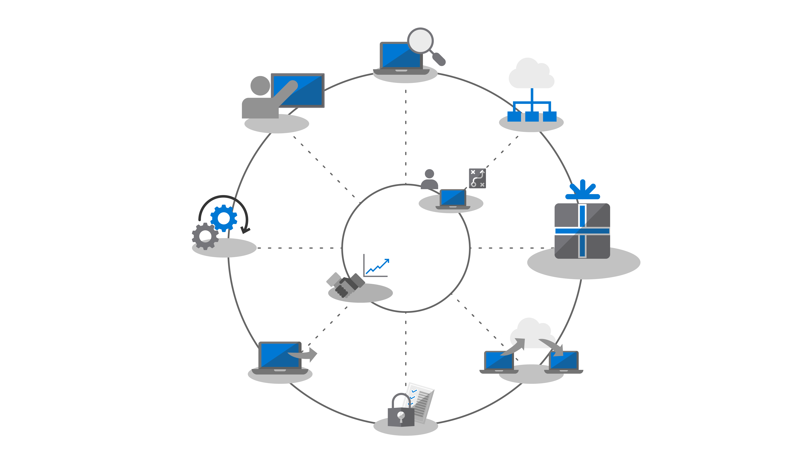
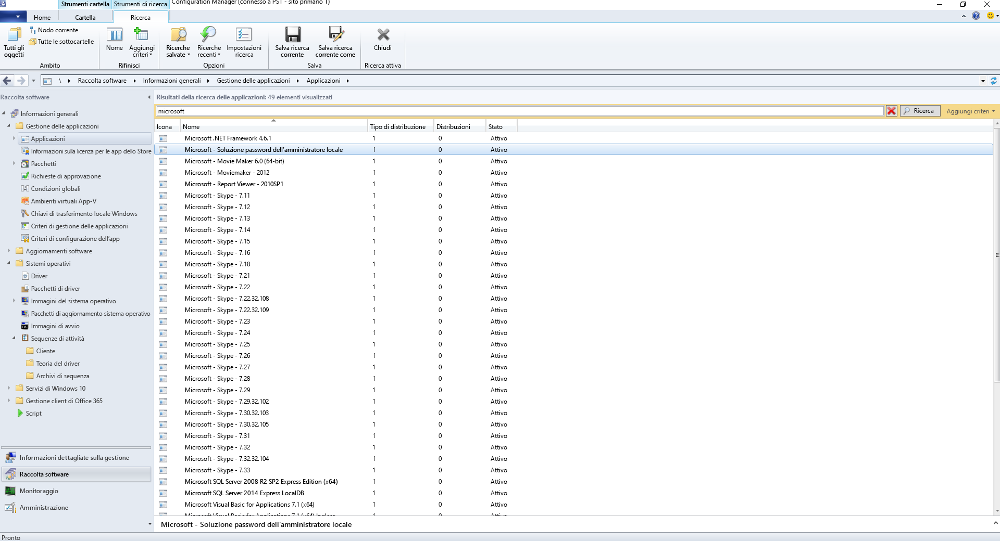
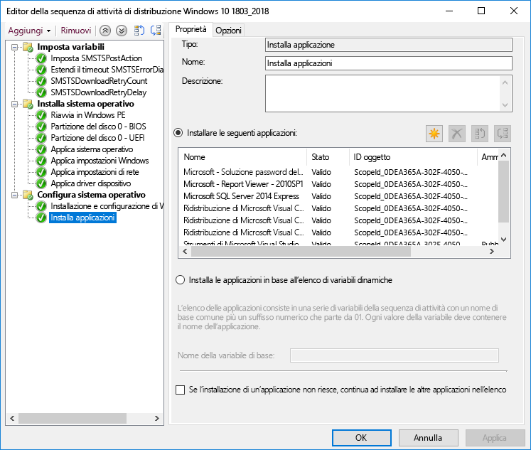
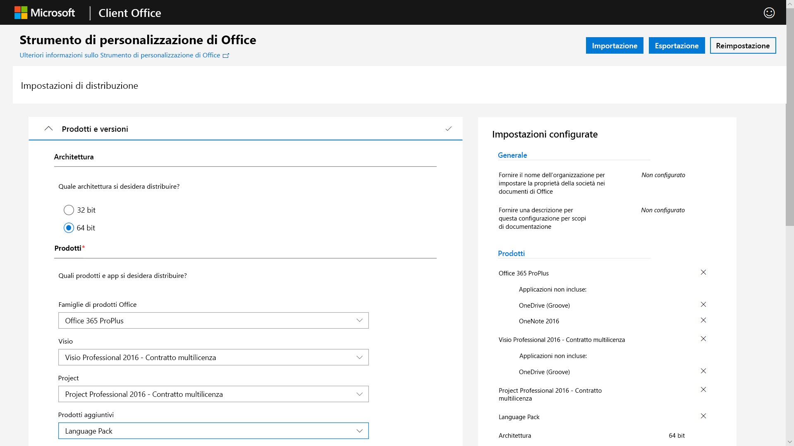
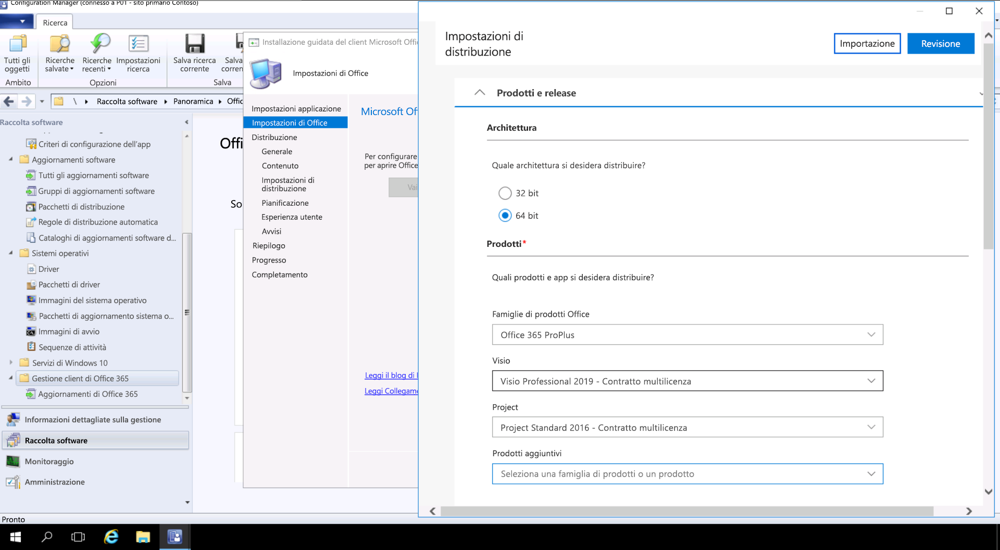

# Passaggio 3: distribuzione di Office e app line-of-businessStep 3: Office and LOB App Delivery

<table>
<thead>
<td></td>
<td>
<strong>Passaggio 3: distribuzione di Office e app line-of-business</strong><strong>Step 3: Office and LOB App Delivery</strong>

Verificare che le app siano compresse e pronte per l'installazione automatica. Ottenere maggiori informazioni sulle nuove opzioni offerte dai pacchetti A portata di clic di Microsoft 365 Apps for enterprise per configurare, distribuire e mantenere aggiornate le app di Office.Ensure your apps are packaged and ready for automated installation. Learn how Click-to-Run packaging with Microsoft 365 Apps for enterprise gives you new options to configure, deliver and keep your Office apps up-to-date.
</td>
<td></td>
</thead>
</table>

>[!NOTE]
>La distribuzione di Office e app line-of-business è il terzo passaggio del processo di distribuzione consigliato e illustra le opzioni di installazione e gestione di Office e app line-of-business.Office and LOB App Delivery is the third step in our recommended deployment process wheel covering the options to install and manage Office and LOB. Per una distribuzione corretta, non saltare i primi due passaggi.For successful deployment do not skip the first two steps.  Per vedere il processo di distribuzione desktop completo, visitare il [Centro distribuzione desktop](https://aka.ms/HowToShift).To see the full desktop deployment process, visit the [Desktop Deployment Center](https://aka.ms/HowToShift).
>

È ora il momento di distribuire Office e le app line-of-business. Esistono molti modi per farlo, tra cui alcune interessanti nuove opzioni.You are now ready to deliver Office and your Line of Business Apps and there are a number of ways to do this, including some exciting new options. Anche se alcune applicazioni sono disponibili solo in versione compilata a 32 bit o 64 bit, altre, tra cui Microsoft 365 Apps for enterprise, sono disponibili come codice compilato nativo a 32 bit e 64 bit e una delle decisioni principali da prendere sarà quella relativa alla versione da distribuire.While some applications are only available as either a 32-bit or 64-bit compiled version, others such as Microsoft 365 Apps for enterprise, offer both as 32-bit and 64-bit native compiled code, and one of biggest decisions you will make is which version to deploy. Per sfruttare la potenza di elaborazione e la RAM aggiuntive dei nuovi dispositivi, Microsoft consiglia di usare la versione a 64 bit se non esistono dipendenze dalla versione a 32 bit.To take advantage of additional compute power and RAM on new devices Microsoft recommends using the 64-bit version when there are no 32-bit dependencies. Per individuare eventuali problematiche correlate alla compatibilità con componenti aggiuntivi o file, è consigliabile tornare al Passaggio 1: preparazione di dispositivi e app.To determine any add-in or file-related compatibility challenges you may have it is recommended to revisit Step 1 Device and App Readiness before you continue.

Se non ci sono problemi, consigliamo di distribuire le versioni a 64 bit di tutte le app, incluso Microsoft Office. Le app compilate native a 64 bit offrono le migliori prestazioni e sono la scelta più lungimirante.If nothing is blocking you, we recommend you deploy 64-bit versions of all apps, including Microsoft Office. 64-bit native compiled apps offer the best performance and is the most future-proof choice.

Esistono molti metodi e modelli per l'installazione di applicazioni in Windows, esaminiamo quindi le opzioni di distribuzione a disposizione.There are many methods and models for installing apps on Windows, so let’s look at your delivery options.

[Gestione di applicazioni di Windows 10Windows 10 application management](https://docs.microsoft.com/windows/application-management/)

## Distribuzioni basate su MSIMSI-based Deployments

Per le app line-of-business, probabilmente verranno usati pacchetti o file eseguibili basati su MSI e le app verranno installate nell'ambito di una sequenza di attività di distribuzione del sistema operativo.For your line of business apps, you’ll probably use MSI-based packages or executable  and install apps as part of an OS deployment task sequence. Windows 10 continuerà a funzionare con questi pacchetti.Windows 10 continues to work with these packages.

Gli strumenti di distribuzione software come Microsoft Endpoint Configuration Manager e Microsoft Intune sono inoltre ottimizzati per fornire app con MSI. Dopo aver convalidato le app su Windows 10, è possibile utilizzare Microsoft Endpoint Configuration Manager (Current Branch) per la distribuzione di app. Se si utilizza il portale dell'azienda in Microsoft Intune, è possibile estendere la scelta di app approvate dall'IT affinché l'organizzazione possa includere le applicazioni più recenti e gli utenti possano selezionare autonomamente ciò che serve.Software deployment tools like Microsoft Endpoint Configuration Manager and Microsoft Intune are also optimized to deliver MSI-packaged apps. Once you have validated your apps on Windows 10, you can use Microsoft Endpoint Configuration Manager (current branch) for app delivery. If you use the Company Portal in Microsoft Intune you can extend the choice of IT sanctioned apps available to your organization to include the latest applications, and users to self-select what they need.

## Imaging del PCPC Imaging

Un altro metodo diffuso di distribuzione delle app è la creazione dell'immagine del PC.Another popular method of app delivery is PC imaging. In questo caso, le applicazioni vengono installate attraverso una sequenza di attività o manualmente su un PC campione, quindi viene acquisita un'immagine del sistema con le applicazioni necessarie preinstallate.In this case, applications are either installed via task sequence or manually on a sample PC, then a system image is captured with the required applications pre-installed. L'approccio della creazione dell'immagine può far risparmiare tempo quando si esegue il provisioning di nuovi PC, ma occorre tenere presente che i sistemi operativi e le app nell'immagine possono diventare rapidamente obsoleti.The imaging approach to build and capture can save time when provisioning new PCs but remember operating systems and apps within the image can become stale quickly. Il modello di aggiornamento cumulativo in Windows 10 e Microsoft 365 Apps for enterprise può aiutare a risolvere questo problema, ma non lo elimina del tutto.The Cumulative Update model in Windows 10 and Microsoft 365 Apps for enterprise help with this problem, but doesn’t eliminate it completely. Ecco perché consigliamo un approccio che prevede l'uso di immagini ridotte, in cui le applicazioni vengono installate dall'esterno dell'immagine al momento della distribuzione.This is why we recommend a thin image approach, where your applications are installed from outside the image at deploy time.

Se si desidera includere Microsoft 365 Apps for enterprise nell'immagine, tenere presente che utilizza un'attivazione basata sull'utente e non può essere pre-attivato dall'amministratore di sistema. Usare lo Strumento di distribuzione di Office per pre-installare Office nel dispositivo di cui si sta acquisendo l'immagine e ignorare l'accesso utente.If you do want to include Microsoft 365 Apps for enterprise in your image, remember that this uses a user-based activation; it cannot be pre-activated by the system admin. Use the Office Deployment Tool to pre-install Office on the device you are imaging and skip the user sign-in. Dopo la distribuzione dell'immagine, gli utenti finali possono accedere con le credenziali e attivare Microsoft 365 Apps for enterprise.Once the image is deployed end users can sign-in using their credentials and activate Microsoft 365 Apps for enterprise.

[Creare una sequenza di attività per installare un sistema operativoCreate a Task Sequence to Install an Operating System](https://docs.microsoft.com/mem/configmgr/osd/deploy-use/create-a-task-sequence-to-install-an-operating-system)

[Distribuire Microsoft 365 Apps come parte di un'immagine del sistema operativoDeploy Microsoft 365 Apps as part of an operating system image](https://docs.microsoft.com/deployoffice/deploy-microsoft-365-apps-operating-system-image)

## Office A portata di clicOffice Click-to-Run 

Microsoft 365 Apps for enterprise viene installato con la tecnologia A portata di clic, che sostituisce i pacchetti basati su MSI in ogni versione del prossimo rilascio di Office 2019 per Windows.Microsoft 365 Apps for enterprise is installed using Click-to-Run, and Click-to-Run replaces MSI-based packaging in every version of the upcoming Office 2019 release for Windows. Offre numerosi vantaggi, tra cui installazioni più rapide, aggiornamento più rapido ed efficiente e una disinstallazione più completa.It brings with it a number of advantages, including faster installations, faster and more efficient updating, and cleaner uninstallation. 

I programmi distribuiti con la tecnologia A portata di clic vengono eseguiti in un ambiente applicativo virtuale nel computer e quindi coesistono con altre applicazioni senza conflitti. Inoltre, occupano metà dello spazio su disco che occuperebbero come pacchetto basato su MSI.Programs delivered via Click-to-Run execute in a virtual application environment on your computer and so co-exist with other applications without conflict; they also take about half the disk space they would as an MSI-based package. Le applicazioni di Office vengono distribuite e gestite tramite lo [Strumento di distribuzione di Office](https://www.microsoft.com/download/details.aspx?id=49117), il motore di installazione di Office necessario per scaricare, configurare e personalizzare le app di Office.Office applications are delivered and managed via the [Office Deployment Tool](https://www.microsoft.com/download/details.aspx?id=49117) which is the Office setup engine needed to download, configure, and customize your Office apps. Lo Strumento di distribuzione di Office legge un file XML di configurazione che fornisce metadati di istruzioni su come configurare e personalizzare l'installazione di Office.The Office Deployment Tool reads a configuration XML file which provides the metadata instructions on how to configure and customization your Office installation.

Microsoft consiglia di usare lo [Strumento di personalizzazione di Office](https://config.office.com/) per personalizzare le impostazioni di distribuzione e creare il file XML di configurazione.Microsoft recommends using the [Office Customization Tool](https://config.office.com/) to customize your deployment settings and create your configuration XML file. Lo Strumento di personalizzazione di Office consente di definire le applicazioni e le lingue da installare, le modalità di aggiornamento e le preferenze delle applicazioni, oltre alle impostazioni dell'esperienza di installazione.Through the Office Customization Tool you can set which applications and languages will be installed, how the applications will be updated, application preferences, and installation experience settings.

Se si utilizza Configuration Manager, è possibile usarlo anche per una distribuzione generale di Microsoft 365 Apps for enterprise. Configuration Manager (Current Branch) presenta supporto nativo per lo strumento di personalizzazione di Office aggiornato, la personalizzazione dei pacchetti per A portata di clic al momento dell'installazione e il supporto nativo della gestione degli aggiornamenti software dopo l'installazione.If you use Configuration Manager, you can still use it for broad deployment of Microsoft 365 Apps for enterprise. Configuration Manager (current branch) has native support for the updated Office Customization Tool, package customization for Click-to-Run at install time, and native support for software update management post installation.

[Guida alla distribuzione di Microsoft 365 AppsDeployment Guide for Microsoft 365 Apps](https://docs.microsoft.com/deployoffice/deployment-guide-microsoft-365-apps)

[Rimuovere le versioni MSI di Office esistenti quando si effettua l'aggiornamento a Microsoft 365 Apps](https://docs.microsoft.com/deployoffice/upgrade-from-msi-version).[Remove existing MSI versions of Office when upgrading to Microsoft 365 Apps](https://docs.microsoft.com/deployoffice/upgrade-from-msi-version)

[Gestire Microsoft 365 Apps for enterprise con Configuration ManagerManage Microsoft 365 Apps for enterprise with Configuration Manager](https://docs.microsoft.com/mem/configmgr/sum/deploy-use/manage-office-365-proplus-updates)

[Assegnare le app di Office 365 ai dispositivi Windows 10 con Microsoft IntuneAssign Office 365 apps to Windows 10 devices with Microsoft Intune](https://docs.microsoft.com/intune/apps-add-office365)

## App basate su browserBrowser-based Apps

Esistono alcuni elementi da considerare per assicurarsi che le applicazioni basate su browser continuino a funzionare nel modo previsto. Se si dispone di siti Web e app specifici per i quali sono noti problemi di compatibilità con Microsoft Edge, è possibile usare l'elenco siti di modalità Enterprise affinché i siti Web si aprano automaticamente utilizzando Internet Explorer 11.There are a few things to consider in order to make sure that your browser-based applications continue to work as expected. If you have specific web sites and apps that you know have compatibility problems with Microsoft Edge, you can use the Enterprise Mode site list so that the web sites will automatically open using Internet Explorer 11.

Inoltre, se si sa che i siti Intranet non funzioneranno correttamente con Microsoft Edge, è possibile configurare tutti i siti Intranet affinché si aprano automaticamente con Internet Explorer 11. Questo processo usa un file XML per gestire l'utilizzo di IE11 per ogni sito, utilizzando Criteri di gruppo per applicare le impostazioni.Additionally, if you know that your intranet sites aren't going to work properly with Microsoft Edge, you can set all intranet sites to open using Internet Explorer 11 automatically. This process uses an XML file to govern whether IE11 is used for each site, using Group Policy to enforce settings.

[Che cos'è la modalità EnterpriseWhat is Enterprise Mode](https://docs.microsoft.com/internet-explorer/ie11-deploy-guide/what-is-enterprise-mode#what-is-enterprise-mode)

Finora sono stati illustrati metodi di distribuzione ben noti.So far, we have covered well known deployment methods. Esistono però due nuovi approcci alla distribuzione di app che può essere interessante prendere in considerazione.But there are two new approaches to app deployment you may wish to consider.

## Microsoft Store for BusinessMicrosoft Store for Business 

Microsoft Store per le aziende offre un modo flessibile per individuare, acquisire, gestire e distribuire app gratuite e a pagamento nei dispositivi Windows 10 su larga scala.Microsoft Store for Business provides a flexible way discover, acquire, manage, and distribute free and paid apps to Windows 10 devices at scale. Come amministratore IT, è possibile pubblicare nello store privato app selezionate del Microsoft Store insieme ad app personalizzate e assegnare e riutilizzare licenze in base alle proprie esigenze.As an IT admin, you can publish selected Microsoft Store apps, along with your custom own apps, to your own private store while assigning and re-using licenses as needed. Gli utenti vengono indirizzati solo a questo store, quindi potranno trovare e installare solo app approvate.Your users are directed to this store only, and so can only find and install approved apps.

Le app dello store possono essere create nativamente come app UWP o è possibile usare il Desktop Bridge per creare un nuovo pacchetto delle app esistenti per lo Store e aggiungere esperienze moderne per Windows 10. A parte il codice utilizzato per attivare le esperienze di Windows 10, l'app rimane invariata e continua a essere eseguita in modalità utente con attendibilità totale.Store apps can be natively built as UWP apps or you can use the Desktop Bridge to repackage your existing apps for the Store and add modern experiences for Windows 10. Aside from the code that you use to light up Windows 10 experiences, your app remains unchanged and continues to run in full-trust user mode.

## Containerizzazione MSIXMSIX Containerization

MSIX è una nuova opzione per la creazione di pacchetti delle applicazioni.A new option for application packaging is MSIX. MSIX utilizza la tecnologia di containerizzazione disponibile in Windows, combinando i migliori aspetti dei pacchetti A portata di clic, UWP e MSI.MSIX uses the containerization technology available in Windows, bringing together the best aspects of Click-to-Run, UWP and MSI packaging. Con strumenti per eseguire la migrazione dei programmi di installazione esistenti, come EXE, MSI, APPV e APPX, direttamente in MSIX, la containerizzazione MSIX offre un percorso unificato per le molte tecnologie di installazione in uso oggi.With tools to migrate existing installers like EXE, MSI, APPV and APPX directly to MSIX we see MSIX Containerization provides a unified path for the many installation technologies in use today. Il supporto di MSIX è incluso nelle versioni correnti di Windows. Tutti i dispositivi che eseguono Windows 10 RS5 o versione successiva includono tutto il necessario per installare ed eseguire le app in pacchetti MSIX.MSIX support is included in current versions of Windows: any device running Windows 10 RS5 or newer includes everything you need to install and run MSIX packaged apps. Windows 10 integra in modo dinamico i contenitori MSIX che riceve, mantenendo le applicazioni separate dal sistema operativo.Windows 10 dynamically integrates MSIX containers it receives, while keeping the applications separate from the operating system.

La containerization consente una disinstallazione e una rimozione dei pacchetti semplici, diversamente da molti dei pacchetti basati su EXE e MSI che possono lasciare elementi nel sistema. Significa anche che è necessario usare esclusivamente le credenziali utente standard per installare le applicazioni, non servono le credenziali Amministratore per installare i contenitori MSIX. I contenitori MSIX sono anche più efficienti da aggiornare. Quando viene pubblicato un aggiornamento, l'uso di differenziali a livello di blocco significa che vengono applicati solo binari completamente nuovi, riducendo il payload dell'aggiornamento, per distribuzioni più rapide con un consumo inferiore della larghezza di banda.Containerization means clean uninstall and removal of packages, unlike a lot of MSI and EXE-based packages today that may leave items on the system. It also means only needing Standard User credentials to install applications – you do not have to have Administrator credentials to install MSIX containers. MSIX containers are more efficient to update too. When an update is published, use of block level differentials means only net new binaries are applied, reducing the update payload, for faster deployments consuming less network bandwidth.

Ulteriori informazioni su MSIX tramite il [sito Community IT MSIX](https://techcommunity.microsoft.com/t5/MSIX/ct-p/MSIX)You can find more information on MSIX via the [MSIX Tech Community site](https://techcommunity.microsoft.com/t5/MSIX/ct-p/MSIX)

## Passaggio successivoNext Step

## [Passaggio 4: impostazioni e file utenteStep 4: User Files and Settings](https://aka.ms/mdd4)

## Passaggio precedentePrevious Step

## [Passaggio 2: conformità directory e reteStep 2: Directory and Network Readiness](https://aka.ms/mdd2) 
