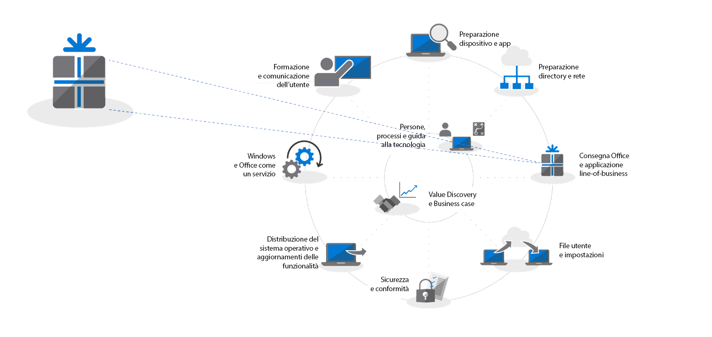
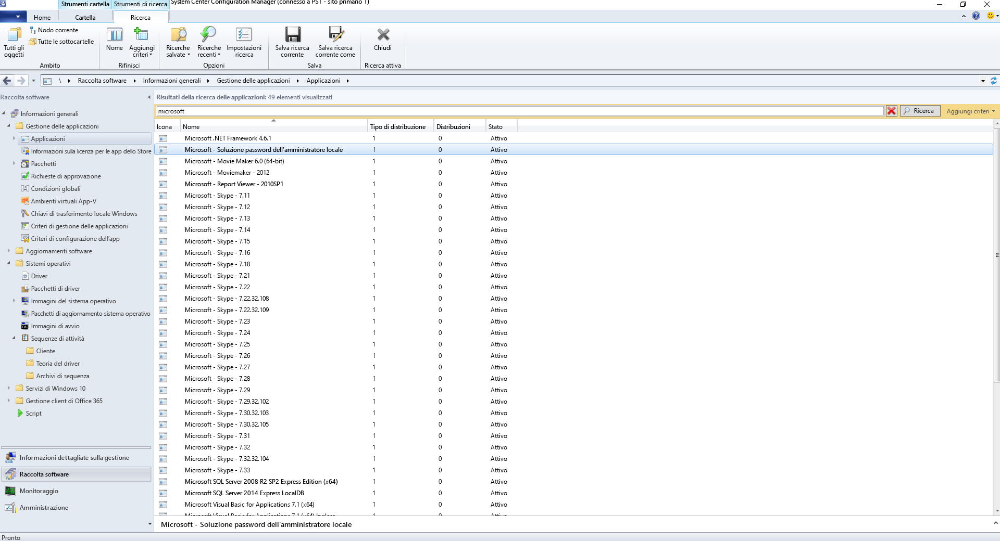
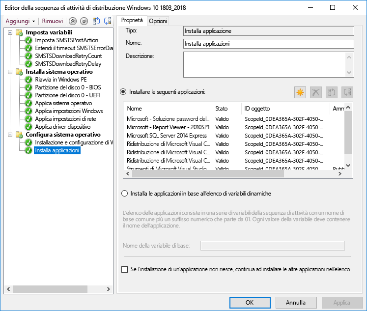
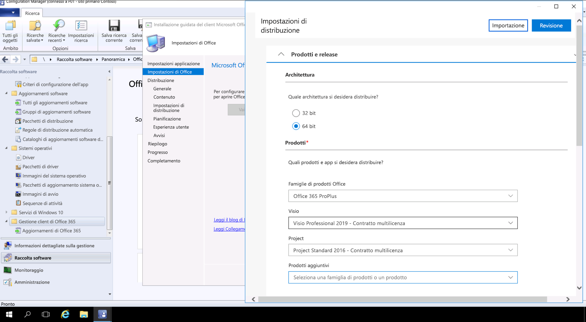

# Passaggio 3: distribuzione di Office e app line-of-business

<table>
<thead>
<td></td>
<td>
<strong>Passaggio 3: distribuzione di Office e app line-of-business</strong>

Verificare che le app siano compresse e pronte per l'installazione automatica. Ottenere maggiori informazioni sulle nuove opzioni offerte dai pacchetti a portata di clic di Office 365 ProPlus per configurare, distribuire e mantenere aggiornate le app di Office.
</td>
<td></td>
</thead>
</table>

>[!NOTE]
>La distribuzione di Office e app line-of-business è il terzo passaggio del processo di distribuzione consigliato e illustra le opzioni di installazione e gestione di Office e app line-of-business. Per una distribuzione corretta, non saltare i primi due passaggi.  Per vedere il processo di distribuzione desktop completo, visitare il [Centro distribuzione desktop](https://aka.ms/HowToShift).
>

È ora il momento di distribuire Office e le app line-of-business. Esistono molti modi per farlo, tra cui alcune interessanti nuove opzioni. Anche se alcune applicazioni sono disponibili solo in versione compilata a 32 bit o 64 bit, altre, tra cui Office 365 ProPlus, sono disponibili come codice compilato nativo a 32 bit e 64 bit e una delle decisioni principali da prendere, sarà quella relativa alla versione da distribuire. Per sfruttare la potenza di elaborazione e la RAM aggiuntive dei nuovi dispositivi, Microsoft consiglia di usare la versione a 64 bit se non esistono dipendenze dalla versione a 32 bit. Per individuare eventuali problematiche correlate alla compatibilità con componenti aggiuntivi o file, è consigliabile tornare al Passaggio 1: preparazione di dispositivi e app.

Se non ci sono problemi, consigliamo di distribuire le versioni a 64 bit di tutte le app, incluso Microsoft Office. Le app compilate native a 64 bit offrono le migliori prestazioni e sono la scelta più lungimirante.

Esistono molti metodi e modelli per l'installazione di applicazioni in Windows, esaminiamo quindi le opzioni di distribuzione a disposizione.

[Gestione di applicazioni di Windows 10](https://docs.microsoft.com/it-IT/windows/application-management/)

## Distribuzioni basate su MSI

Per le app line-of-business, probabilmente verranno usati pacchetti o file eseguibili basati su MSI e le app verranno installate nell'ambito di una sequenza di attività di distribuzione del sistema operativo. Windows 10 continuerà a funzionare con questi pacchetti.

Gli strumenti di distribuzione software come System Center Configuration Manager e Microsoft Intune sono inoltre ottimizzati per fornire app con MSI. Dopo aver convalidato le app su Windows 10, è possibile utilizzare System Center Configuration Manager (current branch) per la distribuzione di app. Se si utilizza il portale dell'azienda in Microsoft Intune, è possibile estendere la scelta di app approvate dall'IT affinché l'organizzazione possa includere le applicazioni più recenti e gli utenti possano selezionare autonomamente cosa gli serve.

## Imaging del PC

Un altro metodo diffuso di distribuzione delle app è la creazione dell'immagine del PC. In questo caso, le applicazioni vengono installate attraverso una sequenza di attività o manualmente su un PC campione, quindi viene acquisita un'immagine del sistema con le applicazioni necessarie preinstallate. L'approccio della creazione dell'immagine può far risparmiare tempo quando si esegue il provisioning di nuovi PC, ma occorre tenere presente che i sistemi operativi e le app nell'immagine possono diventare rapidamente obsoleti. Il modello di aggiornamento cumulativo in Windows 10 e Office 365 ProPlus può aiutare a risolvere questo problema, ma non lo elimina del tutto. Ecco perché consigliamo un approccio che prevede l'uso di immagini ridotte, in cui le applicazioni vengono installate dall'esterno dell'immagine al momento della distribuzione.

Se si vuole includere Office 365 ProPlus nell'immagine, tenere presente che usa un'attivazione basata sull'utente e non può essere pre-attivato dall'amministratore di sistema. Usare lo Strumento di distribuzione di Office per pre-installare Office nel dispositivo di cui si sta acquisendo l'immagine e ignorare l'accesso utente. Dopo la distribuzione dell'immagine, gli utenti finali possono accedere con le credenziali di Office 365 e attivare Office 365 ProPlus.

[Creare una sequenza di attività per installare un sistema operativo](https://docs.microsoft.com/it-IT/sccm/osd/deploy-use/create-a-task-sequence-to-install-an-operating-system)

[Distribuire Office 365 ProPlus come parte di un'immagine del sistema operativo](https://docs.microsoft.com/it-IT/deployoffice/deploy-office-365-proplus-as-part-of-an-operating-system-image)

## Office A portata di clic 

Office 365 ProPlus viene installato con la tecnologia A portata di clic, che sostituisce i pacchetti basati su MSI in ogni versione del prossimo rilascio di Office 2019 per Windows. Offre numerosi vantaggi, tra cui installazioni più rapide, aggiornamento più rapido ed efficiente e una disinstallazione più completa. 

I programmi distribuiti con la tecnologia A portata di clic vengono eseguiti in un ambiente applicativo virtuale nel computer e quindi coesistono con altre applicazioni senza conflitti. Inoltre, occupano metà dello spazio su disco che occuperebbero come pacchetto basato su MSI. Le applicazioni di Office vengono distribuite e gestite tramite lo [Strumento di distribuzione di Office](https://www.microsoft.com/en-us/download/details.aspx?id=49117), il motore di installazione di Office necessario per scaricare, configurare e personalizzare le app di Office. Lo Strumento di distribuzione di Office legge un file XML di configurazione che fornisce metadati di istruzioni su come configurare e personalizzare l'installazione di Office.

Microsoft consiglia di usare lo [Strumento di personalizzazione di Office](https://config.office.com/) per personalizzare le impostazioni di distribuzione e creare il file XML di configurazione. Lo Strumento di personalizzazione di Office consente di definire le applicazioni e le lingue da installare, le modalità di aggiornamento e le preferenze delle applicazioni, oltre alle impostazioni dell'esperienza di installazione.

Se si usa System Center Configuration Manager, è possibile usarlo anche per una distribuzione ampia di Office 365 ProPlus. System Center Configuration Manager (current branch) presenta supporto nativo per lo strumento di personalizzazione di Office aggiornato, la personalizzazione dei pacchetti per A portata di clic al momento dell'installazione e il supporto nativo della gestione degli aggiornamenti software dopo l'installazione.

[Guida alla distribuzione di Office 365 ProPlus](https://docs.microsoft.com/it-IT/deployoffice/deployment-guide-for-office-365-proplus)

[Rimuovere le versioni MSI di Office esistenti quando si effettua l'aggiornamento a Office 365 ProPlus](https://docs.microsoft.com/it-IT/deployoffice/upgrade-from-msi-version)

[Gestire Office 365 ProPlus con Configuration Manager](https://docs.microsoft.com/it-IT/sccm/sum/deploy-use/manage-office-365-proplus-updates)

[Assegnare le app di Office 365 ai dispositivi Windows 10 con Microsoft Intune](https://docs.microsoft.com/it-IT/intune/apps-add-office365)

## App basate su browser

Esistono alcuni elementi da considerare per assicurarsi che le applicazioni basate su browser continuino a funzionare nel modo previsto. Se si dispone di siti Web e app specifici per i quali sono noti problemi di compatibilità con Microsoft Edge, è possibile usare l'elenco siti di modalità Enterprise affinché i siti Web si aprano automaticamente utilizzando Internet Explorer 11.

Inoltre, se si sa che i siti Intranet non funzioneranno correttamente con Microsoft Edge, è possibile configurare tutti i siti Intranet affinché si aprano automaticamente con Internet Explorer 11. Questo processo usa un file XML per gestire l'utilizzo di IE11 per ogni sito, utilizzando Criteri di gruppo per applicare le impostazioni.

[Che cos'è la modalità Enterprise](https://docs.microsoft.com/it-IT/internet-explorer/ie11-deploy-guide/what-is-enterprise-mode#what-is-enterprise-mode)

Finora sono stati illustrati metodi di distribuzione ben noti. Esistono però due nuovi approcci alla distribuzione di app che può essere interessante prendere in considerazione.

## Microsoft Store for Business 

Microsoft Store per le aziende offre un modo flessibile per individuare, acquisire, gestire e distribuire app gratuite e a pagamento nei dispositivi Windows 10 su larga scala. Come amministratore IT, è possibile pubblicare nello store privato app selezionate del Microsoft Store insieme ad app personalizzate e assegnare e riutilizzare licenze in base alle proprie esigenze. Gli utenti vengono indirizzati solo a questo store, quindi potranno trovare e installare solo app approvate.

Le app dello store possono essere create nativamente come app UWP o è possibile usare il Desktop Bridge per creare un nuovo pacchetto delle app esistenti per lo Store e aggiungere esperienze moderne per Windows 10. A parte il codice utilizzato per attivare le esperienze di Windows 10, l'app rimane invariata e continua a essere eseguita in modalità utente con attendibilità totale.

## Containerizzazione MSIX

MSIX è una nuova opzione per la creazione di pacchetti delle applicazioni. MSIX utilizza la tecnologia di containerizzazione disponibile in Windows, combinando i migliori aspetti dei pacchetti A portata di clic, UWP e MSI. Con strumenti per eseguire la migrazione dei programmi di installazione esistenti, come EXE, MSI, APPV e APPX, direttamente in MSIX, la containerizzazione MSIX offre un percorso unificato per le molte tecnologie di installazione in uso oggi. Il supporto di MSIX è incluso nelle versioni correnti di Windows. Tutti i dispositivi che eseguono Windows 10 RS5 o versione successiva includono tutto il necessario per installare ed eseguire le app in pacchetti MSIX. Windows 10 integra in modo dinamico i contenitori MSIX che riceve, mantenendo le applicazioni separate dal sistema operativo.

La containerization consente una disinstallazione e una rimozione dei pacchetti semplici, diversamente da molti dei pacchetti basati su EXE e MSI che possono lasciare elementi nel sistema. Significa anche che è necessario usare esclusivamente le credenziali utente standard per installare le applicazioni, non servono le credenziali Amministratore per installare i contenitori MSIX. I contenitori MSIX sono anche più efficienti da aggiornare. Quando viene pubblicato un aggiornamento, l'uso di differenziali a livello di blocco significa che vengono applicati solo binari completamente nuovi, riducendo il payload dell'aggiornamento, per distribuzioni più rapide con un consumo inferiore della larghezza di banda.

Ulteriori informazioni su MSIX tramite il [sito Community IT MSIX](https://techcommunity.microsoft.com/t5/MSIX/ct-p/MSIX)

## Passaggio successivo

## [Passaggio 4: impostazioni e file utente](https://aka.ms/mdd4)

## Passaggio precedente

## [Passaggio 2: conformità directory e rete](https://aka.ms/mdd2) 