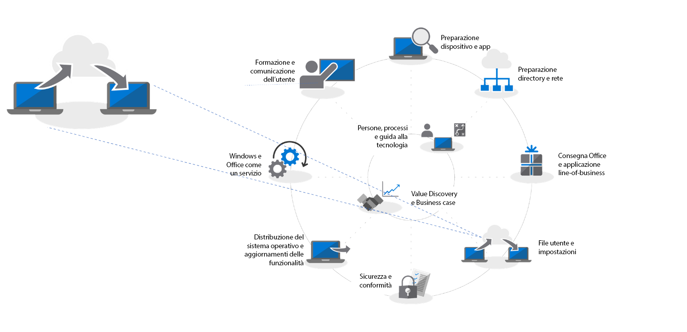

# Passaggio 4: migrazione delle impostazioni e dei file utenteStep 4: User Files and Settings Migration

Spostare i file e le impostazioni degli utenti ai PC nuovi o aggiornati è un processo critico; non è possibile sbagliare.Moving users’ files and settings to their new or refreshed PCs is a critical process, failure is not an option. È possibile eseguire manualmente la migrazione di ogni PC o scegliere uno dei tanti modi per automatizzare il processo.You can migrate each PC manually or you choose one of several ways to automate the process. Qualsiasi sia il metodo di migrazione scelto, devono essere messe in conto tre considerazioni principali: il trasferimento dei file degli utenti, le impostazioni e la gestione di Windows 10 Start e dei layout della barra delle applicazioni.Whichever migration method you choose there are three main considerations to be addressed – the transfer of users’ files, their settings, and managing Windows 10 Start and taskbar layouts.

<table>
<thead>
<td></td>
<td>
<strong>Passaggio 4: impostazioni e file utente</strong><strong>Step 4: User Files and Settings</strong>

Durante l'aggiornamento o la sostituzione dei PC, è possibile risparmiare tempo automatizzando il backup e il ripristino dello stato utente. Le nuove opzioni per la sincronizzazione dei file sul cloud consentono di applicare la sincronizzazione per utente delle cartelle desktop, documenti e immagini in OneDrive per l'accesso semplificato ai file da nuove installazioni di Windows.When refreshing or replacing PCs, save time by automating user state backup and restore. New options for cloud file sync allow you to enforce per user sync of Desktop, Documents and Pictures folders to OneDrive for seamless file access from new Windows installs.
</td>
<td></td>
</thead>
</table>

>[!NOTE]
>Anche se è possibile continuare a utilizzare i processi di migrazione utilizzati in passato, con il passaggio a Office 365 ProPlus consigliamo di usare lo "Spostamento di cartelle note" di OneDrive (vedere di seguito).While you can continue to use migration processes you have used in the past, with your shift to Office 365 ProPlus we recommend you use OneDrive ‘Known Folder Move’ (see below). To see the full desktop deployment process, visit the Modern Desktop Deployment Center. Per vedere l’intero processo di distribuzione, visitare il [Centro distribuzione desktop](https://aka.ms/HowToShift).To see the full desktop deployment process, visit the [Desktop Deployment Center](https://aka.ms/HowToShift).
>

Una delle attività più complesse e spesso più manuale di una distribuzione su vasta scala è quella del trasferimento dei file e delle impostazioni degli utenti. In questo articolo, illustreremo le opzioni disponibili per eseguire la migrazione degli utenti in PC nuovi, aggiornati o di cui è stata ricreata l'immagine.One of the trickiest and often most manual tasks of a large-scale deployment is the transferring of your users' files and settings. In this article we will cover the options available to you to migrate users to new, refreshed and re-imaged PCs.

## Migrazione manualeManual Migration

Quando arriva il momento di decidere cosa mantenere quando si passa a un nuovo PC o a una nuova versione di Windows, alcuni utenti vorrebbero conservare tutto, altri vorrebbero approfittare dell'occasione per pulire le unità. Per questo motivo, alcuni reparti IT scelgono di gestire la migrazione dei file degli utenti manualmente, a volte inviando team di supporto dagli utenti e a volte allestendo centri di supporto dove gli utenti possono portare i propri PC. In entrambi i modi, gli utenti vengono coinvolti nel decidere cosa conservare e cosa eliminare.When it comes to deciding on what to keep when moving to a new PC or a new version of Windows some users may want to keep everything, others may want to take the opportunity to clean up their drives. Because of this, some IT departments choose to handle user file migration manually, sometimes by having support teams visit users; sometimes by setting up support centers for users to bring their PCs to the support team. Either way users can be involved in deciding what to transfer and what to discard.

Questa opzione è disponibile a seconda dell'entità della migrazione che si intende eseguire. Ovviamente, è limitata a tempistiche e logistiche richieste per lavorare direttamente con gli utenti, per capire le loro esigenze e copiare i file nei nuovi PC o in quelli aggiornati.Whether this is an option in your organization will depend on the scale of the migration you are planning. Clearly it is limited to the time and physics involved in working directly with users, understanding their needs, copying files across to their new, or freshly updated PC.

Se si opta per una migrazione manuale, potrebbe essere necessario valutare se si sarà in grado di terminare l'operazione entro gennaio 2020, quando terminerà il supporto di Windows 7. Se non si è sicuri di questo, è consigliabile valutare una delle opzioni automatiche seguenti o chiedere il supporto di altre persone.If you are opting for a manual migration, you may need to assess whether you will be able to complete the task by January 2020, when support for Windows 7 ends. If this looks doubtful, look into using one of the automated options below, or request more people to help.

## Migrazione automatica tramite USMTAutomated Migration using USMT 

Per le distribuzioni su larga scala, è possibile automatizzare buona parte del processo utilizzando gli strumenti di automazione della distribuzione basati su sequenze di attività quali System Center Configuration Manager o Microsoft Deployment Toolkit (MDT). Entrambe le soluzioni adottano l'Utilità di migrazione stato utente (USMT) nell'ambito del processo di distribuzione end-to-end. USMT fa parte del [Windows Assessment and Deployment Kit (Windows ADK)](https://docs.microsoft.com/it-IT/windows-hardware/get-started/adk-install)For large-scale deployments you can automate much of the process using task sequence-based deployment automation tools such as System Center Configuration Manager or the Microsoft Deployment Toolkit (MDT). Both these solutions make use User State Migration Tool (USMT) as part of their end-to-end deployment process. USMT is part of the [Windows Assessment and Deployment Kit (Windows ADK)](https://docs.microsoft.com/it-IT/windows-hardware/get-started/adk-install)

USMT acquisisce account utente, file utente, impostazioni del sistema operativo e delle applicazioni, quindi ne esegue la migrazione a una nuova installazione di Windows. Inoltre, offre all'amministratore IT la possibilità di controllare esattamente cosa viene migrato e, nel caso, escludere tipi di file non desiderati, ad esempio, file audio e video o file eseguibili.USMT captures user accounts, user files, operating system settings, and application settings, and them migrates them to a new Windows installation. It also gives you, the IT Admin, control of exactly what gets migrated and, optionally, can exclude unwanted file types – for example audio and video files, or executables.

Durante il processo di migrazione, è necessario avere sufficiente capacità di archiviazione sul server per usarlo come archivio delle migrazioni temporaneo. Qui USMT offre due importanti funzionalità. Innanzitutto, è in grado di stimare, per PC, la quantità di archiviazione necessaria. In secondo luogo, consente agli archivi delle migrazioni di essere crittografati, riducendo il rischio di violazione dei dati mente si trova nei file server.During the migration process you will need to have sufficient server storage capacity available to act as your temporary migration store. Here USMT offers two important features. First, it can estimate, per PC, the amount of storage you will need. Second, it allows for migration stores to be encrypted, reducing the risk of data being compromised while being stored on file servers.

Se si sta eseguendo un aggiornamento del PC e non si sta formattando la partizione di Windows principale, è anche possibile utilizzare un archivio delle migrazioni con collegamento reale con USMT. Questo processo mantiene lo stato utente sul PC mentre il sistema operativo e le app precedenti vengono rimossi e aggiornati. Con il processo di ripristino derivante dalla stessa partizione locale, questa opzione garantisce miglioramenti delle prestazioni significativi e riduce il traffico di rete.Where you are performing a PC refresh and not reformatting the primary Windows partition, you also have the option of using a hard-link migration store with USMT. This process preserves user state on the PC while the old operating system and apps are removed and refreshed. With the restore process coming from the same local partition, this option offers significant improvements on performance, and reduces network traffic.

[Panoramica sull'Utilità migrazione stato utente (USMT)User State Migration Tool (USMT) Overview](https://docs.microsoft.com/it-IT/windows/deployment/usmt/usmt-overview)

## Spostamento di cartelle note di OneDriveOneDrive Known Folder Move

Se gli utenti sono su OneDrive o si sta aggiungendo OneDrive nell'ambito della distribuzione, esiste una nuova opzione disponibile. Utilizzando il cloud per sincronizzare i file utente, la funzionalità "Spostamento di cartelle note" di OneDrive offre un livello di flessibilità non possibile con opzioni di migrazione dei file basate sulla rete locale. Se abilitata prima della migrazione, questa funzionalità offre accesso sicuro ai nuovi PC e a quelli aggiornati ed elimina la necessità di creare archivi delle migrazioni temporanei sui propri server. Inoltre, è completamente trasparente per l'utente.If your users are on OneDrive or you are adding OneDrive in as part of this deployment, there is new option available to you. Using the cloud to synchronize user files, OneDrive “Known Folder Move” feature provides a level of flexibility not possible with local network-based file migration options. If enabled prior to migration, it provides secure access on new or refreshed PCs and, it eliminates the need to create temporary migration stores on your own servers. It is also has the potential to be completely transparent to the user.

[Reindirizzare e spostare le cartelle note di Windows su OneDriveRedirect and move Windows known folders to OneDrive](https://docs.microsoft.com/it-IT/onedrive/redirect-known-folders)

Se si usa già OneDrive, sarà noto che gli utenti possono selezionare le cartelle e i percorsi che desiderano sincronizzare da OneDrive a SharePoint sul proprio dispositivo; tuttavia, ciò grava sull'utente finale. Con lo Spostamento di cartelle note, è possibile selezionare le cartelle Documenti, Desktop e Immagini in un profilo utente e proteggerle tutte su OneDrive. Un utente può farlo da solo o, importante per questo scenario, l'amministratore può [applicare la funzionalità tramite le impostazioni Criteri di gruppo](https://docs.microsoft.com/en-us/onedrive/use-group-policy?redirectSourcePath=%252fen-us%252farticle%252fUse-Group-Policy-to-control-OneDrive-sync-client-settings-0ecb2cf5-8882-42b3-a6e9-be6bda30899c).If you’re already using OneDrive, you will know that users can select the folders and locations they would like to sync from OneDrive or SharePoint to their device, but that effectively puts the burden on the end user to set it up. With Known Folder Move, you can target the Documents, Desktop and Pictures folders within a user profile and protect it all on OneDrive. A user can do this themselves or, importantly for this scenario, you can [enforce this using Group Policy settings](https://docs.microsoft.com/en-us/onedrive/use-group-policy?redirectSourcePath=%252fen-us%252farticle%252fUse-Group-Policy-to-control-OneDrive-sync-client-settings-0ecb2cf5-8882-42b3-a6e9-be6bda30899c).

Con lo Spostamento di cartelle note, gli utenti non modificano il flusso di lavoro: tutto rimane uguale, durante e al termine della sincronizzazione con OneDrive. Attraverso Criteri di gruppo, è anche possibile scegliere se informare o meno gli utenti che documenti, immagini e desktop sono protetti su OneDrive. Se si sceglie di non farlo, tutto si verifica automaticamente in background. Gli utenti sapranno solo quando possono ritirare il PC o quando il PC sarà stato aggiornato. Non appena effettueranno l'accesso al proprio account OneDrive, i file saranno di nuovo disponibili e verranno ripristinati nel nuovo PC. Ovviamente, OneDrive rende i file disponibili in modo sicuro in qualsiasi momento da telefoni o altri dispositivi.With Known Folder Move, users don’t change their workflow – everything looks the same before, during and after synchronization with OneDrive is complete. Through Group Policy you can even choose whether or not to notify users that their documents, pictures and desktop are protected in OneDrive. If you choose not to, it all happens silently in the background. The users will only be aware when they take delivery of a new PC or their PC is refreshed. As soon as they sign in to their OneDrive account, these files will be available again, and will be restored to their new PC. And of course, OneDrive means they will also their files securely at any time from their phones and other devices.

L'autenticazione per OneDrive con Azure Active Directory: quindi per maggiore sicurezza, è possibile attivare facilmente l'autenticazione a più fattori ed è possibile impostare criteri per controllare la larghezza di banda utilizzata da OneDrive per il caricamento e il download per limitare l'attività di rete.Authentication for OneDrive powered by Azure Active Directory, so for extra security, you can easily enable multi-factor authentication, and you can set policies to control the upload and download bandwidth OneDrive uses to limit network activity.

Non è necessario eseguire la migrazione di ogni utente contemporaneamente. È possibile distribuire in fasi le impostazioni di Criteri di gruppo oppure [limitare la sincronizzazione dei file ai PC aggiunti al dominio](https://docs.microsoft.com/en-us/powershell/module/sharepoint-online/Set-SPOTenantSyncClientRestriction?view=sharepoint-ps).You don’t have to migrate every use at the same time. You may want phase the roll-out of the Group Policy settings, or [limit file sync to domain-joined PCs](https://docs.microsoft.com/en-us/powershell/module/sharepoint-online/Set-SPOTenantSyncClientRestriction?view=sharepoint-ps).

## Personalizzazione del menu Start e della barra delle applicazioniStart Menu and Task Bar Customization

OneDrive è progettato per sincronizzare e proteggere file e cartelle; non sincronizza le impostazioni delle applicazioni o di Windows. In passato, per farlo, si usava il metodo Copia profilo per configurare layout standard per le impostazioni di menu Start e barre delle applicazioni degli utenti. In Windows 10 Pro Enterprise ed Education, è possibile usare Criteri di gruppo, MDM, PowerShell o il provisioning dei pacchetti per distribuire [layout di Start e della barra delle applicazioni personalizzati](https://docs.microsoft.com/it-IT/windows/configuration/windows-10-start-layout-options-and-policies). Non è necessario creare una nuova immagine e il layout può essere aggiornato semplicemente sovrascrivendo il file .xml contenente il layout.OneDrive is designed to sync and protect files and folders; it does not sync application or Windows settings. To do this in the past you may have used the copy profile method to configure standard layouts for users’ Start menus and taskbar settings. In Windows 10 Pro, Enterprise, and Education, you can use Group Policy, MDM, PowerShell, or provisioning packages, to deploy [customized Start and taskbar layouts](https://docs.microsoft.com/it-IT/windows/configuration/windows-10-start-layout-options-and-policies). No reimaging is required, and the layout can be updated simply by overwriting the .xml file that contains the layout.

Per creare un nuovo layout basta configurare un sistema di esempio e utilizzare il cmdlet di PowerShell [Export-StartLayout](https://docs.microsoft.com/en-us/powershell/module/startlayout/export-startlayout?view=win10-ps) per generare un file XML, quindi posizionare il file in una condivisione di rete o memorizzarlo nella cache locale durante la sequenza di distribuzione; deve semplicemente essere raggiungibile come file di sola lettura quando l'utente accede. È possibile quindi usare il criterio o il cmdlet [Import-StartLayout](https://docs.microsoft.com/en-us/powershell/module/startlayout/import-startlayout?view=win10-ps) per fare riferimento a questo file.To create a new layout simply configure a sample system, and use the PowerShell [Export-StartLayout](https://docs.microsoft.com/en-us/powershell/module/startlayout/export-startlayout?view=win10-ps) cmdlet to generate an XML file, then place this file on a network share, or cache it locally as part of your deployment sequence; it just needs to be reachable as Read-only file once the user signs in. You can then use policy or the [Import-StartLayout](https://docs.microsoft.com/en-us/powershell/module/startlayout/import-startlayout?view=win10-ps) cmdlet to reference this file.

## Rimozione delle app incluse non desiderateRemoving unwanted in-box apps

Windows 10 include molte app integrate utili nell'installazione standard, ma gli amministratori potrebbero voler rimuoverne alcune dai PC gestiti e magari configurare un'installazione personalizzata per impedire a queste app di tornare, ad esempio XBOX o Zune Music. È possibile recuperare un elenco di queste app tramite i comandi [PowerShell Get-AppxPackage](https://technet.microsoft.com/it-IT/library/hh856044.aspx) e rimuovere quelle non desiderate con il comando [Remove-AppxPackage](https://technet.microsoft.com/it-IT/library/hh856038.aspx). In alternativa, è possibile montare il file Windows Image (.img) offline prima della distribuzione ed estrarre i pacchetti non desiderati utilizzando lo strumento da riga di comando [Deployment Image Servicing and Management (DISM)](https://docs.microsoft.com/it-IT/windows-hardware/manufacture/desktop/what-is-dism) e il comando [Remove-AppxProvisionedPackage](https://docs.microsoft.com/en-us/powershell/module/dism/remove-appxprovisionedpackage?view=win10-ps).Windows 10 includes many useful built-in apps as part of the standard installation, but you may want to remove some of these from your managed PCs, and even configure your installation to prevent those apps from returning, for example, XBOX or Zune Music. You can retrieve a list of these apps using the [PowerShell Get-AppxPackage](https://technet.microsoft.com/it-IT/library/hh856044.aspx) commands, and remove those you do not want using the [Remove-AppxPackage](https://technet.microsoft.com/it-IT/library/hh856038.aspx) command. Alternatively, you can mount the Windows Image (.img) file offline before deployment, and extract packages you do not want using the [Deployment Image Servicing and Management (DISM)](https://docs.microsoft.com/it-IT/windows-hardware/manufacture/desktop/what-is-dism) command line tool and the [Remove-AppxProvisionedPackage](https://docs.microsoft.com/en-us/powershell/module/dism/remove-appxprovisionedpackage?view=win10-ps) command.

## Passaggio successivoNext Step

## [Passaggio 5: considerazioni sulla sicurezza e conformitàStep 5: Security and Compliance Considerations](https://aka.ms/mdd5)

## Passaggio precedentePrevious Step

## [Passaggio 3: distribuzione di Office e app line-of-businessStep 3: Office and LOB App Delivery](https://aka.ms/mdd3)