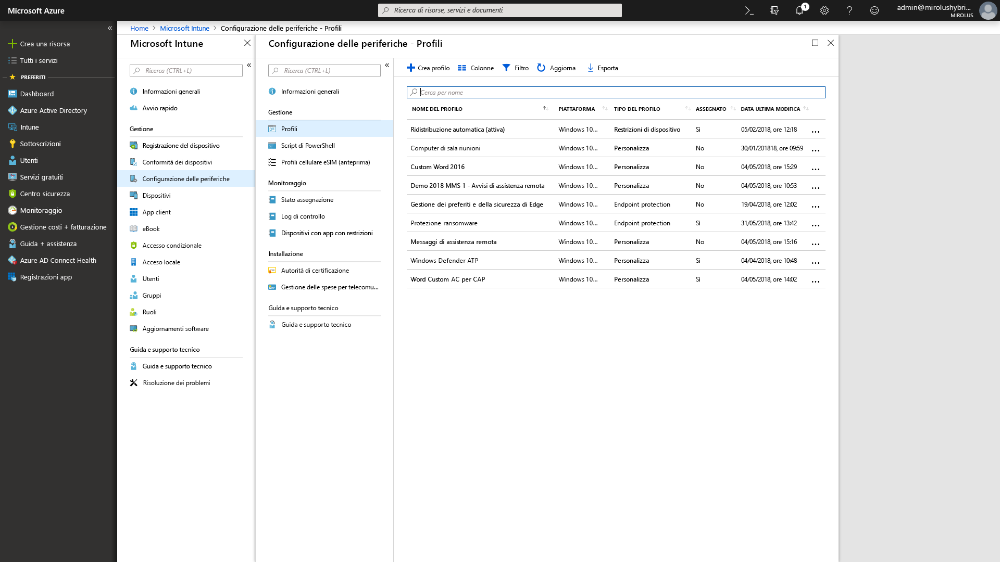

# Passaggio 5: considerazioni sulla sicurezza e conformità

<table>
<thead>
<td></td>
<td>
<strong>Passaggio 5: considerazioni sulla sicurezza e conformità</strong>

Windows 10 e Office 365 ProPlus forniscono nuovi modi per proteggere dati, dispositivi e utenti e per rilevare rapidamente e rispondere alle minacce. Ottenere inoltre informazioni su come gestire i problemi comuni relativi alla crittografia del disco, alle app antimalware e ai criteri quando si passa a Windows 10.
</td>
<td></td>
</thead>
</table>

>[!NOTE]
>Sicurezza e conformità è il quinto passaggio del nostro processo di distribuzione consigliato che copre considerazioni sulla sicurezza e conformità di Windows 10 e Office 365 ProPlus. Per vedere il processo di distribuzione desktop completo, visitare il [Centro distribuzione desktop](https://aka.ms/HowToShift).
>

Esaminare ora le opzioni per definire nuove funzionalità di sicurezza e conformità nell'ambito della distribuzione di Windows 10 e Office 365 ProPlus insieme a considerazioni e problemi comuni quando si passa da versioni precedenti di Windows e Office. Molte delle funzionalità correlate alla sicurezza in Windows 10 stanno guidando da sole il passaggio alla piattaforma più recente. Inoltre, l'integrazione con i servizi cloud in Office 365 e le opzioni di identità che usano Azure Active Directory consente l'accesso a protezioni nuove e continuamente aggiornate per dati, dispositivi e utenti.

## Superamento dei potenziali problemi di distribuzione correlati alla sicurezza

Prima di spiegare le nuove funzionalità che è possibile aggiungere passando a Windows 10 e Office 365 ProPlus e connettendo queste esperienze al cloud, iniziamo con alcune tendenze che spesso possono interrompere il processo di distribuzione.

### Crittografia disco

Innanzitutto, una delle sfide iniziali che si potrebbe incontrare è la crittografia del disco rigido. Molte soluzioni per la crittografia del disco rigido non possono essere facilmente aggiornate da una versione precedente di Windows a una versione più recente.

Alcune soluzioni di crittografia consentono di eseguire gli upgrade quando si usa l'opzione "/reflectdrivers" con Installazione di Windows su alcune versioni delle relative piattaforme, ma altre potrebbero richiedere di decrittografare l'unità prima della distribuzione e di crittografarla di nuovo al termine dell'installazione di Windows 10. Alcune soluzioni, inoltre, non consentono di passare dal record di avvio principale (MBR), che usa BIOS legacy, alla tabella di partizione GUID (GPT), necessaria per l'interfaccia UEFI. Ciò è importante perché una versione a 64 bit di Windows 10 con UEFI è necessaria per le nuove funzionalità di sicurezza basate sulla virtualizzazione in Windows 10, spiegate di seguito.

Un'opzione per risolvere questi problemi consiste nell'utilizzare BitLocker in Windows 10, che incluso in Windows 10 Pro e versioni superiori. BitLocker consente di sospendere la protezione degli upgrade del sistema operativo e degli aggiornamenti delle funzionalità durante il processo.

  [Distribuzione di base di BitLocker](https://docs.microsoft.com/it-IT/windows/security/information-protection/bitlocker/bitlocker-basic-deployment)

### Compatibilità con le applicazioni antivirus e antimalware

In secondo luogo, anche se è stato visto che oltre il [99% delle applicazioni Windows è compatibile](https://www.microsoft.com/en-us/microsoft-365/blog/2018/09/06/helping-customers-shift-to-a-modern-desktop/) in Windows 7 e Windows 10, le eccezioni sono spesso rappresentate dalle app antivirus o dai client VPN. Queste applicazioni spesso implementano processi di sviluppo e API non standard, utilizzando spesso modi non documentati di proteggere il sistema o di connettere l'utente alle risorse di rete.

Di conseguenza, queste applicazioni per natura possono essere fragili alle modifiche quando si passa a una nuova versione di Windows. Se il software AV o VPN non funziona in Windows 10 o dopo l'aggiornamento, la correzione in genere consiste nel sostituire l'applicazione utilizzata con un'altra supportata e testata su Windows 10.

### Criteri di sicurezza

Le impostazioni Criteri di gruppo di Active Directory utilizzate per le versioni precedenti di Windows e Office potrebbero non tradursi direttamente in Windows 10 e Office 365 ProPlus ed esistono diverse considerazioni con le funzionalità di sicurezza e conformità più recenti. È una buona idea utilizzare il toolkit Microsoft Security Compliance per ottenere una linea di base dei criteri di sicurezza per le versioni correnti di Windows e Office. Inoltre, vale la pena analizzare i criteri di gestione dei dispositivi mobili di Microsoft Intune.

## 

## Nuove funzionalità di sicurezza e conformità in Microsoft 365

A questo punto, queste erano le considerazioni sull'aggiornamento delle protezioni correnti e degli aspetti di cui essere consapevoli prima del passaggio. Ora è il momento di analizzare le nuove funzionalità che è possibile sfruttare quando si passa a Windows 10, Office 365 ProPlus e opzioni cloud da EMS in poi.

### Gestione di identità e accessi

Iniziamo dalla gestione delle identità e degli accessi. Azure Active Directory è il piano di controllo delle identità per app, dispositivi e servizi cloud ed è il modo moderno di connettersi a Office 365 e altri servizi cloud. L'accesso condizionale consente di definire diversi requisiti di autenticazione in base al luogo da cui si accede, al dispositivo utilizzato e a fattori come i comportamenti anomali.

A livello di dispositivo, la biometrica può fornire gli identificatori univoci per l'accesso più semplice e sicuro a dispositivi e applicazioni, mentre ci si sposta verso l'obiettivo di eliminare le password. Windows Hello offre autenticazione a più fattori basata sul dispositivo. Si basa sul dispositivo stesso, sul PIN o su un identificatore biometrico univoco, ad esempio il volto o l'impronta digitale, che è possibile applicare tramite criterio.

  [Nozioni fondamentali sulla gestione delle identità di Azure](https://docs.microsoft.com/it-IT/azure/active-directory/fundamentals/identity-fundamentals)

  [Informazioni sulle soluzioni di identità di Azure](https://docs.microsoft.com/it-IT/azure/active-directory/fundamentals/understand-azure-identity-solutions)

  [Accesso condizionale di Azure Active Directory](https://docs.microsoft.com/it-IT/azure/active-directory/conditional-access/overview)

  [Windows Hello for Business](https://docs.microsoft.com/it-IT/windows/security/identity-protection/hello-for-business/hello-identity-verification)

### Sicurezza basata sulla virtualizzazione

Oltre l'identità, è inoltre possibile attivare la protezione continua da minacce note e sconosciute e per farlo Windows 10 utilizza la sicurezza basata sulla virtualizzazione per garantire integrità all'avvio e del codice tramite Avvio protetto. Inoltre, grazie a Credential Guard è possibile fermare il furto di credenziali mantenendo i segreti dell'utente isolati da Windows. Inoltre, Application Guard è in grado di isolare e ridurre le minacce basate su browser eseguendo il browser in un contenitore isolato. Tutte queste tecnologie utilizzano la sicurezza basata su virtualizzazione in Windows 10 e rappresentano modifiche fondamentali che non possono essere replicate su un sistema Windows 7. Tenere inoltre presente che richiedono anche UEFI, Windows a 64 bit e il supporto dell'estensione di virtualizzazione con SLAT a livello hardware.

  [Ulteriori informazioni sulla sicurezza basata sulla virtualizzazione](https://docs.microsoft.com/it-IT/windows-hardware/design/device-experiences/oem-vbs)

### Miglioramenti nella sicurezza dei servizi cloud

I servizi cloud offrono un altro livello di protezione opzionale per migliorare la sicurezza di Windows e Office. Possono offrire un nuovo livello di controllo in tempo reale in grado di rilevare, resistere e rispondere immediatamente a nuovi attacchi e tipi di attacco, in particolare rispetto all'aggiornamento software tradizionale e ai file firma antivirus, dove i tempi di risposta e distribuzione degli aggiornamenti sono intrinsecamente più lenti.

Insieme a Microsoft Intelligent Security Graph, si ha accesso più rapido alle informazioni e alle protezioni dalle minacce emergenti. Ecco alcuni esempi di come si può sfruttarlo, partendo con Office.

La **[Prevenzione della perdita dei dati](https://docs.microsoft.com/it-IT/office365/securitycompliance/data-loss-prevention-policies)** integrata in Office 365 ProPlus informa gli utenti sui criteri di sicurezza quando contenuti a rischio elevato come numeri di carte di credito o di identificazione vengono rilevati. I criteri possono informare o bloccare l'invio e la condivisione dopo aver informato gli utenti.

  **
  [Azure Information Protection](https://docs.microsoft.com/it-IT/azure/information-protection/rms-client/client-admin-guide) ** è un servizio complementare che può essere usato con Office e consente agli utenti di classificare ed etichettare facilmente i file di Office. È in grado di attivare le operazioni automatiche sui file etichettati, come la crittografia o il blocco della condivisione.

Abbiamo inoltre introdotto la protezione **[Collegamenti sicuri](https://docs.microsoft.com/it-IT/office365/securitycompliance/atp-safe-links)** nelle app di Office per proteggere gli utenti da un elenco dinamico di siti Web dannosi noti.

Inoltre, **[Allegati sicuri](https://docs.microsoft.com/it-IT/office365/securitycompliance/atp-safe-attachments)** in Outlook e in Exchange Online supera il filtro della posta elettronica per ispezionare gli allegati. Se viene identificato un allegato di rischio elevato, Allegati sicuri informerà l'utente di allegati dannosi noti e li rimuoverà dal messaggio di posta elettronica.

  **
  [Office 365 Message Encryption](https://docs.microsoft.com/it-IT/office365/securitycompliance/encryption)** (OME) può inoltre essere usata per proteggere la posta elettronica e gli allegati inviati, garantendo che solo i destinatari designati possano visualizzare il contenuto della posta elettronica. OME funziona perfettamente con l'autenticazione degli account di consumo Google, Yahoo e Microsoft e i passcode monouso consentono anche agli utenti degli altri servizi di posta elettronica di ricevere posta sicura.

#### Altre misure di sicurezza di Windows 10

  **
  [Controllo di applicazioni di Windows Defender](https://docs.microsoft.com/it-IT/windows/security/threat-protection/windows-defender-application-control/windows-defender-application-control)** in Windows 10 opera al di fuori di un elenco di indirizzi consentiti e non consentiti di applicazioni di cui Microsoft ha controllato la sicurezza e tutto viene gestito da criteri di protezione endpoint con Microsoft Intune.

  **
  [Windows Defender Advanced Threat Protection](https://docs.microsoft.com/it-IT/windows/security/threat-protection/windows-defender-atp/overview)** è una piattaforma unificata per la protezione preventiva, il rilevamento post-violazione, l'indagine automatizzata e la risposta. Protegge gli endpoint da minacce informatiche; rileva attacchi avanzati e violazione dei dati, automatizza gli incidenti correlati alla sicurezza e aumenta la sicurezza.

  **
  [Exploit Guard](https://docs.microsoft.com/it-IT/windows/security/threat-protection/windows-defender-exploit-guard/windows-defender-exploit-guard)** consente di ridurre la portata dell'attacco per le applicazioni in esecuzione impedendo al malware di entrare in Windows e ai processi non attendibili di accedere alle cartelle protette.

#### Microsoft Intune

  [Microsoft Intune](https://docs.microsoft.com/it-IT/intune/introduction-intune) funge da servizio di gestione basato su cloud per scenari mobili, tra cui dispositivi IOS, Android e Windows e può ora essere configurato per la cogestione per integrare ed estendere i controlli di carichi di lavoro specifici gestiti da System Center Configuration Manager. Un vantaggio è che è possibile richiedere ai dispositivi che accedono alle risorse protette di registrarsi alla gestione dei dispositivi anche a quelli non gestiti, non uniti al dominio o non uniti ad Azure AD. È inoltre possibile sfruttare la configurazione granulare e l'applicazione dei criteri conformità a livello di sistema operativo e applicazione. I criteri e le impostazioni delle applicazioni possono essere configurati centralmente e applicati per Office 365 ProPlus e le app dello Store in Windows 10 con Microsoft Intune.

## Passaggio successivo

## [Passaggio 6: distribuzione del sistema operativo e aggiornamenti delle funzionalità](https://aka.ms/mdd6)

## Passaggio precedente 

## [Passaggio 4: impostazioni e file utente](https://aka.ms/mdd4)
