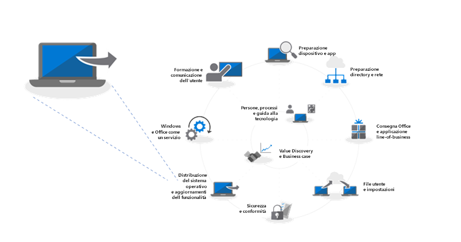
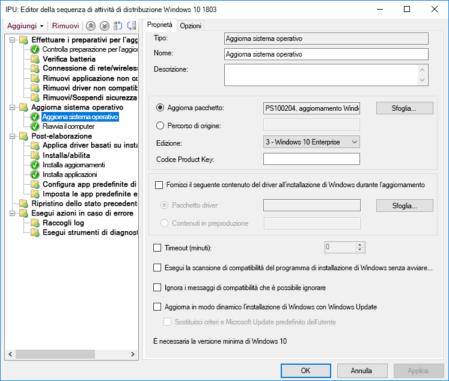
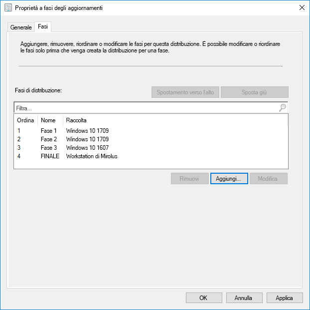
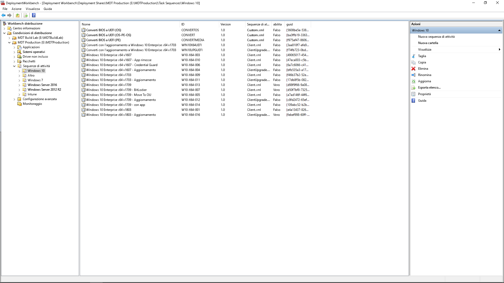

# Passaggio 6: distribuzione del sistema operativo e aggiornamenti delle funzionalitàStep 6: OS Deployment and Feature Updates

<table>
<thead>
<td></td>
<td>
<strong>Passaggio 6: distribuzione del sistema operativo e aggiornamenti delle funzionalità</strong><strong>Step 6: OS Deployment and Feature Updates</strong>

La distribuzione basata sulla sequenza di attività è usata per automatizzare su vasta scala, la distribuzione in fasi per installazioni bare metal, aggiornamento del PC e sostituzione del PC. Le sequenze di attività di aggiornamento consentono inoltre di restare al passo con gli aggiornamenti semestrali principali. E Windows Autopilot è una novità che modernizza il processo di acquisizione di un nuovo PC.Task sequence-based deployment is used to automate large scale, phased deployment for bare metal installs, PC refresh and PC replacement. Upgrade task sequences will also help you stay current with major semi-annual updates. And Windows Autopilot is a recent addition that modernizes the new PC acquisition process.
</td>
<td></td>
</thead>
</table>

>[!NOTE]
>La distribuzione del sistema operativo e gli aggiornamenti delle funzionalità costituiscono il sesto passaggio del nostro processo di distribuzione consigliato che copre la distribuzione di Windows 10, upgrade e aggiornamenti delle funzionalità.OS Deployment and Feature Updates is the sixth step in our recommended deployment process wheel covering Windows 10 OS deployment, upgrades and Feature Updates. To see the full desktop deployment process, visit the Modern Desktop Deployment Center. Per visualizzare il processo completo di distribuzione desktop, visitare il [centro di distribuzione desktop](https://aka.ms/HowToShift).To see the full desktop deployment process, visit the [Desktop Deployment Center](https://aka.ms/HowToShift).
>

Se è stato seguito il processo di distribuzione fino ad adesso, sono stati almeno completati parzialmente i passaggi per la preparazione di dispositivo e app, è stata preparata l'infrastruttura, sono stati configurati e raccolti i pacchetti app, è stato ideato un piano per la migrazione dei file utente e la configurazione delle impostazioni predefinite e si dispongono di piani per la conservazione dei controlli di sicurezza esistenti o magari per l'implementazione di nuovi.If you’ve been following the deployment process wheel till now, you’ve at least partially completed the steps for device and app readiness, prepared your infrastructure, configured and collected app packages, have a plan in place for migrating user files and configuring default settings as well as have plans for retaining your existing security controls and perhaps deploying new ones.

Ora è arrivato il momento di mettere tutti questi pezzi insieme per automatizzare il più possibile il processo per installare Windows 10 e Office 365 ProPlus, insieme a tutti i driver, app ed elementi necessari.Now we’ve arrived at the stage where you’re putting all these pieces together to automate as much as you can to install Windows 10 and Office 365 ProPlus, along with the necessary drivers, apps and whatever else is needed.

Infine, la miglior misura di successo di una distribuzione del sistema operativo è quella di soddisfare le aspettative degli utenti ed evitare interruzioni nel loro lavoro. In questo passaggio, si inizierà a testare e a distribuire agli utenti pilota nell'ambito della distribuzione in più fasi. Un piccolo suggerimento: prima di ampliare la distribuzione, sarà necessario passare al passaggio 8 del nostro processo di distribuzione [Comunicazioni e formazione degli utenti](https://aka.ms/mdd8) per assicurarsi che gli utenti siano informati e preparati alle modifiche in arrivo e di poter misurare la velocità di implementazione con la convalida continua attraverso la Distribuzione in più fasi.Ultimately, the best measure of success with an OS deployment is meeting user expectations and avoiding disruptions in their work. And in this step, you’ll start testing and deploying to pilot users as part of a phased deployment. And one tip here, before you broaden deployment, you’ll need to skip ahead to step 8 on our deployment process wheel – [User Communications and Training](https://aka.ms/mdd8) to make sure users are informed and prepared for changes coming their way and that you can measure your roll-out pace with continuous validation using Phased Deployment.

## Processo di acquisizione di immagini di WindowsWindows Imaging Process

La maggior parte delle organizzazioni utilizza il processo di acquisizione dell'immagine del PC per configurare e creare un clone di Windows, incluso un set di base di alcune app standard installate oppure un'immagine ancora più semplice con solo runtime dell'applicazione e aggiornamenti. Il modo migliore di farlo consiste nell'usare una macchina virtuale per questo processo per evitare eventuali problemi di compatibilità relativi al driver e a scopo di automazione.Most organizations use the process of PC imaging to configure and capture a clone of Windows, including a base set of a few standard apps installed, or an even a thinner image with only application runtimes and updates. The best way to do this is using a virtual machine for this process to avoid any unexpected driver-related compatibility issues and for automation purposes.

Se si intraprende la strada dell'acquisizione dell'immagine, è meglio automatizzare il più possibile per garantire la miglior qualità dell'immagine e un processo ripetibile. Per la maggior parte delle distribuzioni, è inoltre consigliato ridurre la personalizzazione e le app pre-installate nell'immagine Windows prima dell'acquisizione. Questo si intende con l'approccio "immagine semplice" con il quale è possibile risparmiare larghezza di banda sulla rete eliminando il numero di app all'interno dell'immagine. Iniziando con un'immagine semplice, è possibile poi aggiungere app, lingue e configurazioni necessarie in modo dinamico in base alle esigenze degli utenti.If going the image capture route, it’s best to automate as much as possible to ensure the best quality image and a repeatable process. For most deployments, it is also recommended to put as little customization and pre-installed apps as possible in the Windows image prior to capturing. This is what is called a ‘thin image’ approach, which can save overall bandwidth on the network by eliminating the number of apps within the image. By starting with a thin base image, you can layer on required apps, languages and configurations dynamically tailored to users.

Durante il processo di creazione e acquisizione, strumenti come System Center Configuration Manager e Microsoft Deployment Toolkit usano Utilità preparazione sistema, o Sysprep, insieme al comando "Generalizza" per sigillare l'immagine prima di acquisire l'installazione di Windows 10 come immagine.During the build and capture process, tools like System Center Configuration Manager and the Microsoft Deployment Toolkit use the System Preparation Tool – or Sysprep – along with the “Generalize” command to reseal your image before they capture the Windows 10 installation as an image.

L'immagine acquisita avrà il formato dell'immagine Windows, o WIM, come il supporto di installazione Windows standard. Una volta pronto il file WIM personalizzato, è possibile usare un'altra sequenza di attività nell'ambito della distribuzione del sistema operativo in System Center Configuration Manager o Microsoft Deployment Toolkit per eseguire attività correlate alla distribuzione, per applicare l'immagine ed eseguire attività prima e dopo l'applicazione dell'immagine Windows.The captured image will have the Windows image – or WIM – format like standard Windows installation media. Once you have your custom WIM file, you can use another task sequence as part of your OS deployment in System Center Configuration Manager or Microsoft Deployment Toolkit to perform deployment-related tasks, to apply the image and run tasks before and after your Windows image is applied.

[Creare un'immagine di riferimento di Windows 10Create a Windows 10 Reference Image](https://docs.microsoft.com/it-IT/windows/deployment/deploy-windows-mdt/create-a-windows-10-reference-image)

[Creare una sequenza di attività per installare un sistema operativoCreate a Task Sequence to Install an Operating System](https://docs.microsoft.com/it-IT/sccm/osd/deploy-use/create-a-task-sequence-to-install-an-operating-system)

### Tipo di distribuzioneDeployment Types

Una volta pronta l'immagine, il tipo di installazione o migrazione rientrerà nelle seguenti categorie:With your custom image ready, the installation or migration type will fall into the following categories:

  - Innanzitutto, la **Distribuzione bare metal**. Questo è lo scenario utilizzato per distribuire un'immagine in un disco pulito o per ricreare l'immagine di un computer in cui non si intendono conservare dati sul discoFirst, **bare metal deployment**. This is the scenario used to deploy an image to a clean disk, or to reimage a computer where you don’t intend to keep any of the data on the disk

  - Poi, simile alla bare metal, c'è **Computer Refresh**: la differenza sostanziale è che lo stato dell'utente rimane sul disco\* oppure viene ripristinato al termine dell'installazioneAnd second, similar to bare metal, is **Computer Refresh,** with the key difference that user state remains on the disk\* or will be restored after the install is complete

  - L'ultima è **Computer Replacement**. Come dice il nome, si sostituisce un PC con un altro PC. In questo caso, spesso viene eseguito un backup dei file utente dal primo PC a un percorso centrale che viene poi ripristinato nel secondo PC.And last is **Computer Replacement**. Here as the name implies, you are replacing a PC with another PC. In this case, there is often a backup of user files from the first PC to a central location, then a restore of those files to the second PC.

Tutte e tre gli scenari hanno qualcosa in comune: consentono di eseguire una sequenza di attività e di applicare ogni volta un'immagine personalizzata.All three of these scenarios have something in common, they use a task sequence to run, and a custom image can be applied each time.

[Altre informazioni sugli scenari di distribuzione di Windows 10More About Windows 10 Deployment Scenarios](https://docs.microsoft.com/it-IT/windows/deployment/windows-10-deployment-scenarios)

### Aggiornamento sul posto con automazione della sequenza di attivitàIn-place Upgrade using Task Sequence Automation

Oltre a questi tipi di distribuzione, è disponibile un nuova opzione come sequenza di attività di System Center Configuration Manager con Windows 10 e l'aggiornamento sul posto tramite l'automazione della sequenza di attività.In addition to these deployment types, there is a new option available now as a System Center Configuration Manager Task Sequence with Windows 10 – and in-place upgrade using the Upgrade Task Sequence.

Gli aggiornamenti sul posto di una versione precedente di Windows non richiedono una sequenza di attività, ma è un approccio consigliato per le distribuzioni a livello di azienda. Un aggiornamento sul posto non consente di applicare un'immagine personalizzata con applicazioni, ma è possibile aggiornare il file predefinito install.wim tramite i servizi offline. Ad esempio, è possibile assicurarsi che gli aggiornamenti Windows più recenti vengano applicati prima di eseguire gli aggiornamenti.In-place upgrades from a previous version of Windows do not require a task sequence, but it is a recommended approach when deploying at enterprise scale. An in-place upgrade does not allow you to apply a custom image with applications, but you can update the default install.wim using offline servicing. For example, you can to make sure it has the latest Windows updates applied prior to performing upgrades.

L'aggiornamento sul posto utilizza la configurazione delle finestre. Il motore di configurazione esegue diversi controlli pre-installazione minori alla ricerca di problemi di compatibilità. Preserva inoltre lo stato e le applicazioni dell'utente e rimuove solo ciò che non è compatibile con la versione di Windows 10 installata. Con questa opzione, le applicazioni installate in precedenza e lo stato dell'utente vengono preservate. L'aggiornamento sul posto inoltre consente di eseguire il rollback al sistema operativo precedente se necessario per risolvere problemi.In-place upgrade uses windows setup. The setup engine runs several small pre-installation checks looking for known compatibility issues. It also preserves the user state and applications and only removes what isn’t compatible with the version of Windows 10 being installed. With this option, previously installed applications and user state are preserved. In-place upgrade also allows you to roll-back to the previous OS installed if needed for troubleshooting purposes.

[Convalida pre-aggiornamento di Windows 10 con setup.exeWindows 10 Pre-Upgrade Validation Using setup.exe](https://blogs.technet.microsoft.com/mniehaus/2015/08/23/windows-10-pre-upgrade-validation-using-setup-exe/)

Lo scenario dell'aggiornamento sul posto può essere usato per eseguire la migrazione a Windows 10 da versioni legacy di Windows e per l'upgrade da versioni precedenti di Windows 10. Quando Installazione di Windows completa l'upgrade, la sequenza attività può continuare a essere eseguita e ad aggiornare applicazioni come Office, a sostituire driver e ad applicare impostazioni di personalizzazione. Allo stesso modo, è possibile utilizzare la sequenza di attività di upgrade per eseguire attività e controlli pre-installazione prima di completare l'upgrade.The in-place upgrade scenario can be used to migrate to Windows 10 from legacy versions of Windows, as well as upgrade from previous versions of Windows 10. After Windows Setup completes the upgrade, your task sequence can continue to run and upgrade applications like Office, replace drivers, and apply personalization settings. Likewise, you can use the Upgrade Task Sequence to perform pre-installation tasks or checks prior to carrying out the upgrade.

[Eseguire un aggiornamento sul posto a Windows 10 tramite Configuration ManagerPerform an in-place upgrade to Windows 10 using Configuration Manager](https://docs.microsoft.com/it-IT/windows/deployment/upgrade/upgrade-to-windows-10-with-system-center-configuraton-manager)

[Creare una sequenza di attività per aggiornare un sistema operativo in Configuration ManagerCreate a task sequence to upgrade an OS in Configuration Manager](https://docs.microsoft.com/it-IT/sccm/osd/deploy-use/create-a-task-sequence-to-upgrade-an-operating-system)

### Distribuzione a fasiPhased Deployment

Durante la pianificazione della distribuzione, si definiscono i computer delle distribuzioni bare metal, refresh, replace e i percorsi di upgrade. L'approccio consigliato in questo caso è quello di utilizzare la distribuzione a fasi nelle raccolte di macchine simili. In questo modo, è possibile convalidare compatibilità, recapito e automazione, accettazione da parte dell'utente, consumo della larghezza di banda e altri fattori prima di aumentare l'entità della distribuzione.As you're planning your deployment, you'll be targeting computers for bare metal, refresh, replace and upgrade paths. The recommended approach in this case is to use phased deployment to collections of similar machines. This way, you can validate compatibility, delivery and automation, user acceptance, network bandwidth consumption, and other factors before increasing the scale of your deployment.

### Strumenti consigliati: System Center Configuration Manager e Microsoft Deployment ToolkitRecommended Tools: System Center Configuration Manager and the Microsoft Deployment Toolkit

Indipendentemente dal tipo di distribuzione scelto, è necessario assicurarsi che la distribuzione sia il più automatizzata possibile per prevedibilità e ripetibilità. Microsoft offre due soluzioni per automatizzare la distribuzione del sistema operativo attraverso sequenze di attività automatizzate:Regardless of the deployment type you choose, you’ll want to make sure it’s as automated as possible for predictability and repeatability. Microsoft offers two solutions to automate OS deployment using automated task sequences:

  - **[System Center Configuration Manager](https://docs.microsoft.com/it-IT/sccm/core/understand/introduction)** (ConfigMgr) offre funzionalità integrate del sistema operativo per integrare le sue funzionalità di distribuzione software e gestione degli aggiornamenti software. ConfigMgr è ampiamente utilizzato da organizzazioni di tutte le dimensioni e supporta tutti e quattro i tipi di distribuzione Windows. Opzionalmente, è possibile integrare ConfigMgr con Microsoft Intune per aggiungere ulteriori funzionalità per la gestione della distribuzione e dei dispositivi.**[System Center Configuration Manager](https://docs.microsoft.com/it-IT/sccm/core/understand/introduction)** (ConfigMgr) provides built-in operating system deployment capabilities to complement its capabilities for software distribution and software update management. ConfigMgr is widely used by organizations of all sizes and supports all four Windows deployment types. Optionally, you can integrate ConfigMgr with Microsoft Intune to add additional capabilities for deployment and device management.

  - Un'altra opzione di distribuzione comune è il software gratuito **[Microsoft Deployment Toolkit](https://docs.microsoft.com/it-IT/windows/deployment/deploy-windows-mdt/get-started-with-the-microsoft-deployment-toolkit)** (MDT) che viene generalmente usato da piccole e medie organizzazioni per la distribuzione del sistema operativo. Serve pochissima infrastruttura. MDT si integra con Windows Deployment Services (WDS) per l'avvio di rete. Supporta tutti e quattro i tipi di distribuzione e l'installazione di applicazioni, driver e impostazioni. Ovviamente, MDT può anche essere integrato con Configuration Manager.And one other popular deployment option is the free **[Microsoft Deployment Toolkit](https://docs.microsoft.com/it-IT/windows/deployment/deploy-windows-mdt/get-started-with-the-microsoft-deployment-toolkit)** (MDT) which is typically used by small and medium sized organizations for OS deployment. This requires very little infrastructure. MDT integrates with Windows Deployment Services (WDS) for network boot. It supports all four deployment types as well as installation of applications, drivers, and settings. And of course, MDT can even be integrated with Configuration Manager.

### Windows AutopilotWindows Autopilot

Una nuova opzione di Windows 10 consente di configurare nuovi PC durante un ciclo di aggiornamento hardware con Windows Autopilot.A new option with Windows 10 is to configure new PCs as part of your hardware refresh cycle using Windows Autopilot. Grazie a questa opzione è possibile collaborare con fornitori di hardware di supporto per personalizzare l'esperienza di configurazione Windows predefinita, ad esempio eliminando le opzioni presentate agli utenti, come i contratti di licenza o le impostazioni dei dati di diagnostica.A new option with Windows 10 is to configure new PCs as part of your hardware refresh cycle using Windows Autopilot. Here you can work with supporting hardware vendors to customize the default Windows setup experience – for example by eliminating options presented to users, like Licensing Agreements or telemetry settings.

Pertanto, quando un utente accede al PC durante la configurazione tramite le credenziali di Azure AD, il dispositivo si registra a Microsoft Intune, che può subentrare nel processo di distribuzione e applicare applicazioni, configurazioni di aggiornamenti software e criteri di conformità.Then, when a user signs in to the PC during setup using their Azure AD credentials, the device enrolls into Microsoft Intune, which can then take over the deployment process and apply applications, software updates configurations and compliance policies. Windows Autopilot can also optionally prevent the user from accessing the first session until provisioning is complete.

[Panoramica di Windows AutopilotOverview of Windows Autopilot](https://docs.microsoft.com/it-IT/windows/deployment/windows-autopilot/windows-10-autopilot)

[Prerequisiti di Windows AutopilotWindows Autopilot Prerequisites](https://docs.microsoft.com/it-IT/windows/deployment/windows-autopilot/windows-10-autopilot#prerequisites)

## Windows Update per le aziende per gli aggiornamenti delle funzionalitàWindows Update for Business for Feature Updates

Windows Update per le aziende è un servizio gratuito che consente ai professionisti IT di mantenere i dispositivi Windows 10 sempre aggiornati connettendo direttamente i dispositivi al servizio Windows Update.Windows Update for Business is a free service that enables IT Pros to keep Windows 10 devices always up to date by directly connecting the devices to the Windows Update service. È possibile configurare Windows Update per le aziende tramite Criteri di gruppo o soluzioni MDM, come Microsoft Intune, e consente ai professionisti IT di creare [circuiti di distribuzione](https://docs.microsoft.com/it-IT/windows/deployment/update/waas-deployment-rings-windows-10-updates) per convalidare nuove build.Windows Update for Business can be configured via Group Policy or through MDM solutions such as Microsoft Intune and allows IT Pros to create [deployment rings](https://docs.microsoft.com/it-IT/windows/deployment/update/waas-deployment-rings-windows-10-updates) to validate new builds. È integrato in strumenti di gestione esistenti, come Windows Server Update Services (WSUS), System Center Configuration Manager (Current Branch) e Microsoft Intune.It is integrated into existing management tools such as Windows Server Update Services (WSUS), System Center Configuration Manager (current branch), and Microsoft Intune. Inoltre, Windows Update per le aziende supporta la distribuzione peer-to-peer per ottimizzare l'efficienza della larghezza di banda e ridurre la congestione della rete.Additionally, Windows Update for Business supports peer-to-peer delivery to help optimize bandwidth efficiency and reduce network congestion.

Per informazioni più dettagliate su Windows Update per le aziende, vedere la documentazione seguente:For more detailed information on Windows Update for Business please review the following documentation:

- [Distribuire gli aggiornamenti con Windows Update per le aziendeDeploy Updates Using Windows Update for Business](https://docs.microsoft.com/it-IT/windows/deployment/update/waas-manage-updates-wufb)
- [Configurare Windows Update per le aziendeWindows Update for Business](https://docs.microsoft.com/it-IT/windows/deployment/update/waas-configure-wufb)
- [Integrare Windows Update per le aziende con strumenti di gestione esistentiIntegrate Windows Update for Business with Existing Management Tools](https://docs.microsoft.com/it-IT/windows/deployment/update/waas-integrate-wufb)
- [Usare Criteri di gruppo per configurare Windows Update per le aziendeUse Group Policy to configure Windows Update for Business](https://docs.microsoft.com/it-IT/windows/deployment/update/waas-wufb-group-policy)
- [Usare Microsoft Intune per configurare Windows Update per le aziendeUse Microsoft Intune to configure Windows Update for Business](https://docs.microsoft.com/it-IT/intune/windows-update-for-business-configure)

## Passaggio successivoNext Step 

## [Passaggio 7: manutenzione di Windows e OfficeStep 7: Windows and Office as a Service](https://aka.ms/mdd7)

## Passaggio precedentePrevious Step

## [Passaggio 5: considerazioni sulla sicurezza e conformitàStep 5: Security and Compliance Considerations](https://aka.ms/mdd5)