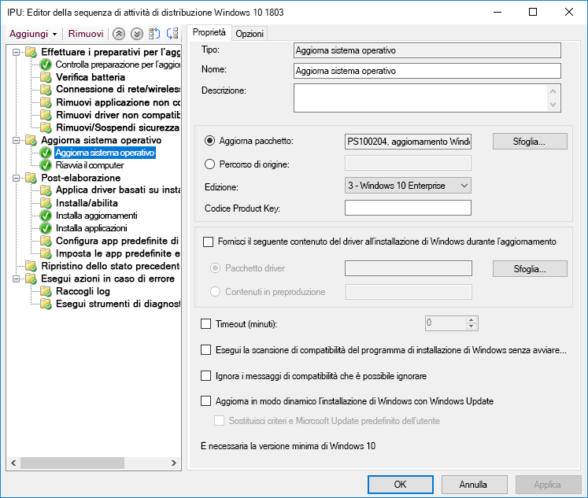
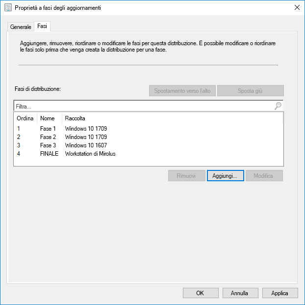
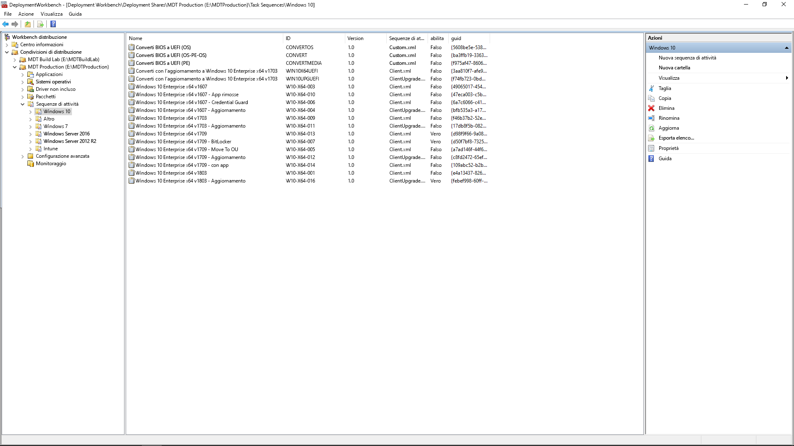

# Passaggio 6: distribuzione del sistema operativo e aggiornamenti delle funzionalità

<table>
<thead>
<td></td>
<td>
<strong>Passaggio 6: distribuzione del sistema operativo e aggiornamenti delle funzionalità</strong>

La distribuzione basata sulla sequenza di attività è usata per automatizzare su vasta scala, la distribuzione in fasi per installazioni bare metal, aggiornamento del PC e sostituzione del PC. Le sequenze di attività di aggiornamento consentono inoltre di restare al passo con gli aggiornamenti semestrali principali. E Windows Autopilot è una novità che modernizza il processo di acquisizione di un nuovo PC.
</td>
<td></td>
</thead>
</table>

>[!NOTE]
>La distribuzione del sistema operativo e gli aggiornamenti delle funzionalità costituiscono il sesto passaggio del nostro processo di distribuzione consigliato che copre la distribuzione di Windows 10, upgrade e aggiornamenti delle funzionalità. Per visualizzare il processo completo di distribuzione desktop, visitare il [centro di distribuzione desktop](https://aka.ms/HowToShift).
>

Se è stato seguito il processo di distribuzione fino ad adesso, sono stati almeno completati parzialmente i passaggi per la preparazione di dispositivo e app, è stata preparata l'infrastruttura, sono stati configurati e raccolti i pacchetti app, è stato ideato un piano per la migrazione dei file utente e la configurazione delle impostazioni predefinite e si dispongono di piani per la conservazione dei controlli di sicurezza esistenti o magari per l'implementazione di nuovi.

Ora è arrivato il momento di mettere tutti questi pezzi insieme per automatizzare il più possibile il processo per installare Windows 10 e Office 365 ProPlus, insieme a tutti i driver, app ed elementi necessari.

Infine, la miglior misura di successo di una distribuzione del sistema operativo è quella di soddisfare le aspettative degli utenti ed evitare interruzioni nel loro lavoro. In questo passaggio, si inizierà a testare e a distribuire agli utenti pilota nell'ambito della distribuzione in più fasi. Un piccolo suggerimento: prima di ampliare la distribuzione, sarà necessario passare al passaggio 8 del nostro processo di distribuzione [Comunicazioni e formazione degli utenti](https://aka.ms/mdd8) per assicurarsi che gli utenti siano informati e preparati alle modifiche in arrivo e di poter misurare la velocità di implementazione con la convalida continua attraverso la Distribuzione in più fasi.

## Processo di acquisizione di immagini di Windows

La maggior parte delle organizzazioni utilizza il processo di acquisizione dell'immagine del PC per configurare e creare un clone di Windows, incluso un set di base di alcune app standard installate oppure un'immagine ancora più semplice con solo runtime dell'applicazione e aggiornamenti. Il modo migliore di farlo consiste nell'usare una macchina virtuale per questo processo per evitare eventuali problemi di compatibilità relativi al driver e a scopo di automazione.

Se si intraprende la strada dell'acquisizione dell'immagine, è meglio automatizzare il più possibile per garantire la miglior qualità dell'immagine e un processo ripetibile. Per la maggior parte delle distribuzioni, è inoltre consigliato ridurre la personalizzazione e le app pre-installate nell'immagine Windows prima dell'acquisizione. Questo si intende con l'approccio "immagine semplice" con il quale è possibile risparmiare larghezza di banda sulla rete eliminando il numero di app all'interno dell'immagine. Iniziando con un'immagine semplice, è possibile poi aggiungere app, lingue e configurazioni necessarie in modo dinamico in base alle esigenze degli utenti.

Durante il processo di creazione e acquisizione, strumenti come Microsoft Endpoint Configuration Manager (Current Branch)e Microsoft Deployment Toolkit usano Utilità preparazione sistema, o Sysprep, insieme al comando "Generalizza" per sigillare l'immagine prima di acquisire l'installazione di Windows 10 come immagine.

L'immagine acquisita avrà il formato dell'immagine Windows, o WIM, come il supporto di installazione Windows standard. Una volta pronto il file WIM personalizzato, è possibile usare un'altra sequenza di attività nell'ambito della distribuzione del sistema operativo in Configuration Manager o Microsoft Deployment Toolkit per eseguire attività correlate alla distribuzione, per applicare l'immagine ed eseguire attività prima e dopo l'applicazione dell'immagine Windows.

[Creare un'immagine di riferimento di Windows 10](https://docs.microsoft.com/windows/deployment/deploy-windows-mdt/create-a-windows-10-reference-image)

[Creare una sequenza di attività per installare un sistema operativo](https://docs.microsoft.com/configmgr/osd/deploy-use/create-a-task-sequence-to-install-an-operating-system)

### Tipo di distribuzione

Una volta pronta l'immagine, il tipo di installazione o migrazione rientrerà nelle seguenti categorie:

  - Innanzitutto, la **Distribuzione bare metal**. Questo è lo scenario utilizzato per distribuire un'immagine in un disco pulito o per ricreare l'immagine di un computer in cui non si intendono conservare dati sul disco

  - Poi, simile alla bare metal, c'è **Computer Refresh**: la differenza sostanziale è che lo stato dell'utente rimane sul disco\* oppure viene ripristinato al termine dell'installazione

  - L'ultima è **Computer Replacement**. Come dice il nome, si sostituisce un PC con un altro PC. In questo caso, spesso viene eseguito un backup dei file utente dal primo PC a un percorso centrale che viene poi ripristinato nel secondo PC.

Tutte e tre gli scenari hanno qualcosa in comune: consentono di eseguire una sequenza di attività e di applicare ogni volta un'immagine personalizzata.

[Altre informazioni sugli scenari di distribuzione di Windows 10](https://docs.microsoft.com/windows/deployment/windows-10-deployment-scenarios)

### Aggiornamento sul posto con automazione della sequenza di attività

Oltre a questi tipi di distribuzione, è disponibile una nuova opzione come sequenza di attività di Microsoft Endpoint Configuration Manager (Current Branch) con Windows 10 e l'aggiornamento sul posto tramite l'automazione della sequenza di attività.

Gli aggiornamenti sul posto di una versione precedente di Windows non richiedono una sequenza di attività, ma è un approccio consigliato per le distribuzioni a livello di azienda. Un aggiornamento sul posto non consente di applicare un'immagine personalizzata con applicazioni, ma è possibile aggiornare il file predefinito install.wim tramite i servizi offline. Ad esempio, è possibile assicurarsi che gli aggiornamenti Windows più recenti vengano applicati prima di eseguire gli aggiornamenti.

L'aggiornamento sul posto utilizza la configurazione delle finestre. Il motore di configurazione esegue diversi controlli pre-installazione minori alla ricerca di problemi di compatibilità. Preserva inoltre lo stato e le applicazioni dell'utente e rimuove solo ciò che non è compatibile con la versione di Windows 10 installata. Con questa opzione, le applicazioni installate in precedenza e lo stato dell'utente vengono preservate. L'aggiornamento sul posto inoltre consente di eseguire il rollback al sistema operativo precedente se necessario per risolvere problemi.

[Convalida pre-aggiornamento di Windows 10 con setup.exe](https://blogs.technet.microsoft.com/mniehaus/2015/08/23/windows-10-pre-upgrade-validation-using-setup-exe/)

Lo scenario dell'aggiornamento sul posto può essere usato per eseguire la migrazione a Windows 10 da versioni legacy di Windows e per l'upgrade da versioni precedenti di Windows 10. Quando Installazione di Windows completa l'upgrade, la sequenza attività può continuare a essere eseguita e ad aggiornare applicazioni come Office, a sostituire driver e ad applicare impostazioni di personalizzazione. Allo stesso modo, è possibile utilizzare la sequenza di attività di upgrade per eseguire attività e controlli pre-installazione prima di completare l'upgrade.

[Eseguire un aggiornamento sul posto a Windows 10 tramite Configuration Manager](https://docs.microsoft.com/windows/deployment/upgrade/upgrade-to-windows-10-with-system-center-configuraton-manager)

[Creare una sequenza di attività per aggiornare un sistema operativo in Configuration Manager](https://docs.microsoft.com/configmgr/osd/deploy-use/create-a-task-sequence-to-upgrade-an-operating-system)

### Distribuzione a fasi

Durante la pianificazione della distribuzione, si definiscono i computer delle distribuzioni bare metal, refresh, replace e i percorsi di upgrade. L'approccio consigliato in questo caso è quello di utilizzare la distribuzione a fasi nelle raccolte di macchine simili. In questo modo, è possibile convalidare compatibilità, recapito e automazione, accettazione da parte dell'utente, consumo della larghezza di banda e altri fattori prima di aumentare l'entità della distribuzione.

### Strumenti consigliati: Microsoft Endpoint Configuration Manager (Current Branch) e Microsoft Deployment Toolkit

Indipendentemente dal tipo di distribuzione scelto, è necessario assicurarsi che la distribuzione sia il più automatizzata possibile per prevedibilità e ripetibilità. Microsoft offre due soluzioni per automatizzare la distribuzione del sistema operativo attraverso sequenze di attività automatizzate:

  - **[Microsoft Endpoint Configuration Manager](https://docs.microsoft.com/configmgr/core/understand/introduction)** (ConfigMgr) offre funzionalità integrate del sistema operativo per integrare le sue funzionalità di distribuzione software e gestione degli aggiornamenti software. ConfigMgr è ampiamente utilizzato da organizzazioni di tutte le dimensioni e supporta tutti e quattro i tipi di distribuzione Windows. Opzionalmente, è possibile integrare ConfigMgr con Microsoft Intune per aggiungere ulteriori funzionalità per la gestione della distribuzione e dei dispositivi.

  - Un'altra opzione di distribuzione comune è il software gratuito **[Microsoft Deployment Toolkit](https://docs.microsoft.com/windows/deployment/deploy-windows-mdt/get-started-with-the-microsoft-deployment-toolkit)** (MDT) che viene generalmente usato da piccole e medie organizzazioni per la distribuzione del sistema operativo. Serve pochissima infrastruttura. MDT si integra con Windows Deployment Services (WDS) per l'avvio di rete. Supporta tutti e quattro i tipi di distribuzione e l'installazione di applicazioni, driver e impostazioni. Ovviamente, MDT può anche essere integrato con Configuration Manager.

### Windows Autopilot

Una nuova opzione di Windows 10 consente di configurare nuovi PC durante un ciclo di aggiornamento hardware con Windows Autopilot. Grazie a questa opzione è possibile collaborare con fornitori di hardware di supporto per personalizzare l'esperienza di configurazione Windows predefinita, ad esempio eliminando le opzioni presentate agli utenti, come i contratti di licenza o le impostazioni dei dati di diagnostica.

Pertanto, quando un utente accede al PC durante la configurazione tramite le credenziali di Azure AD, il dispositivo si registra a Microsoft Intune, che può subentrare nel processo di distribuzione e applicare applicazioni, configurazioni di aggiornamenti software e criteri di conformità.

[Panoramica di Windows Autopilot](https://docs.microsoft.com/windows/deployment/windows-autopilot/windows-10-autopilot)

[Prerequisiti di Windows Autopilot](https://docs.microsoft.com/windows/deployment/windows-autopilot/windows-10-autopilot#prerequisites)

## Windows Update per le aziende per gli aggiornamenti delle funzionalità

Windows Update per le aziende è un servizio gratuito che consente ai professionisti IT di mantenere i dispositivi Windows 10 sempre aggiornati connettendo direttamente i dispositivi al servizio Windows Update. È possibile configurare Windows Update per le aziende tramite Criteri di gruppo o soluzioni MDM, come Microsoft Intune, e consente ai professionisti IT di creare [circuiti di distribuzione](https://docs.microsoft.com/windows/deployment/update/waas-deployment-rings-windows-10-updates) per convalidare nuove build. È integrato in strumenti di gestione esistenti, come Windows Server Update Services (WSUS), Microsoft Endpoint Configuration Manager (Current Branch) e Microsoft Intune. Inoltre, Windows Update per le aziende supporta la distribuzione peer-to-peer per ottimizzare l'efficienza della larghezza di banda e ridurre la congestione della rete.

Per informazioni più dettagliate su Windows Update per le aziende, vedere la documentazione seguente:

- [Distribuire gli aggiornamenti con Windows Update per le aziende](https://docs.microsoft.com/windows/deployment/update/waas-manage-updates-wufb)
- [Configurare Windows Update per le aziende](https://docs.microsoft.com/windows/deployment/update/waas-configure-wufb)
- [Integrare Windows Update per le aziende con strumenti di gestione esistenti](https://docs.microsoft.com/windows/deployment/update/waas-integrate-wufb)
- [Usare Criteri di gruppo per configurare Windows Update per le aziende](https://docs.microsoft.com/windows/deployment/update/waas-wufb-group-policy)
- [Usare Microsoft Intune per configurare Windows Update per le aziende](https://docs.microsoft.com/intune/windows-update-for-business-configure)

## Passaggio successivo 

## [Passaggio 7: manutenzione di Windows e Office](https://aka.ms/mdd7)

## Passaggio precedente

## [Passaggio 5: considerazioni sulla sicurezza e conformità](https://aka.ms/mdd5)
