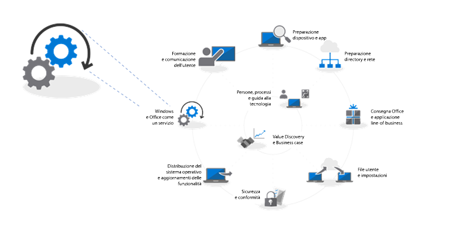
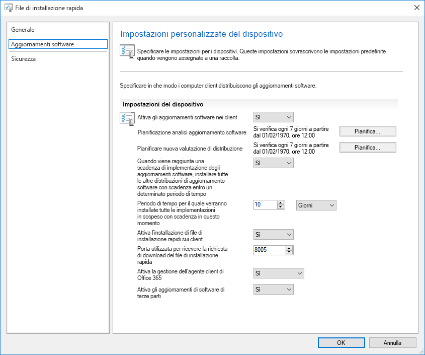
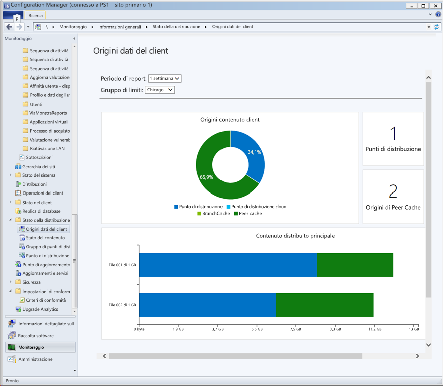
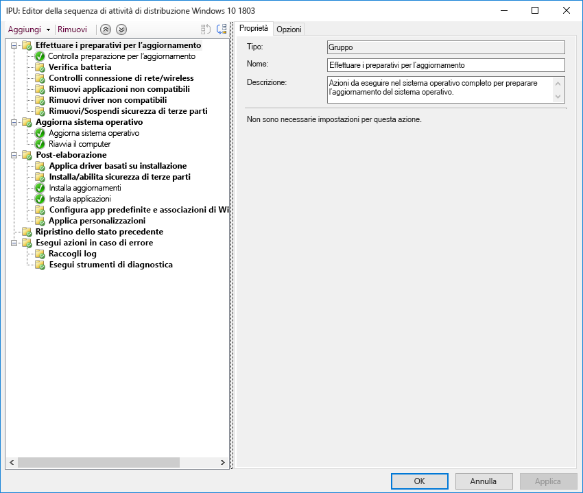

# Passaggio 7: manutenzione di Windows e OfficeStep 7: Windows and Office as a Service

<table>
<thead>
<td></td>
<td>
<strong>Passaggio 7: manutenzione di Windows e Office</strong><strong>Step 7: Windows and Office as a Service</strong>

Windows 10 e Office 365 ProPlus aggiungono continuamente nuove funzionalità per continuare a offrire esperienze utente e protezione con le ultime novità. Ottenere informazioni su come restare al passo con gli aggiornamenti mensili e semestrali, su come funziona il nuovo modello di manutenzione e sugli strumenti e opzioni disponibili.Both Windows 10 and Office 365 ProPlus continually add new capabilities to keep bringing user experiences and security forward with the latest innovations. Learn how to stay current with semi-annual and monthly updates, how the new servicing model works and the tools and options you have.
</td>
<td></td>
</thead>
</table>

>[!NOTE]
>La manutenzione di Windows e Office è il settimo passaggio del nostro processo di distribuzione consigliato e illustra la pianificazione per la preparazione agli aggiornamenti semestrali delle funzionalità.Windows and Office as a Service is the seventh step in our recommended deployment process wheel covering the planning aspects of preparing for semi-annual updates to features. To see the full desktop deployment process, visit the Modern Desktop Deployment Center. Per vedere il processo di distribuzione desktop completo, visitare il [Centro distribuzione desktop](https://aka.ms/HowToShift).To see the full desktop deployment process, visit the [Desktop Deployment Center](https://aka.ms/HowToShift).
>

Sia Windows 10 che Office 365 ProPlus introducono nuove opzioni di manutenzione, modelli di supporto e tempistiche di aggiornamento.Both Windows 10 and Office 365 ProPlus introduce new servicing options, support models, and update timelines. Queste modifiche semplificano il processo per rimanere aggiornati sulle ultime funzionalità.These changes simplify the process for staying current on the latest features. Oltre a questi aggiornamenti sono disponibili nuove opzioni di configurazione, per creare piani di manutenzione sulla base delle proprie specifiche esigenze.Along with these updates are new configuration options to enable servicing plans that meet your needs. Di seguito viene descritto come prepararsi per gli aggiornamenti di canale semestrali che offrono nuove funzionalità e capacità in Windows 10 e Office 365 ProPlus utilizzando le nuove funzionalità di System Center Configuration Manager Current Branch.Let's learn how to prepare for semi-annual channel updates offering new features and capabilities in Windows 10 and Office 365 ProPlus while leveraging new features within System Center Configuration Manager Current Branch.

[Aiutare i clienti a passare a Windows 10 e Office 365 ProPlusHelping customers shift to Windows 10 and Office 365 ProPlus](https://www.microsoft.com/it-IT/microsoft-365/blog/2018/09/06/helping-customers-shift-to-a-modern-desktop/)

## Tipi di aggiornamentoUpdate Types

Gli aggiornamenti si dividono in due categorie principali, aggiornamenti delle funzionalità e aggiornamenti qualitativi e di sicurezza che contengono correzioni cumulative di errori, per l'affidabilità e la sicurezza.Updates fall into two main categories, feature updates and then quality and security updates which contain cumulative security, reliability and bug fixes. In termini di frequenza, sia Windows che Office offrono un canale semestrale che fornisce nuove funzionalità due volte all'anno intorno a marzo e settembre, mentre gli aggiornamenti qualitativi e della sicurezza vengono rilasciati mensilmente.In terms of cadence both Windows and Office deliver a semi-annual channel which delivers new features twice per year around March and September while quality and security Updates occur Monthly. Inoltre, solo per le app di Office 365, è disponibile un'opzione Canale mensile completamente supportata, che fornisce sia nuove funzionalità che aggiornamenti qualitativi.Additionally, unique to Office 365 applications, we offer a fully-supported Monthly Channel option where updates contain both new features and quality updates.

Chi è abituato a un ciclo più lungo tra il sistema operativo desktop e gli aggiornamenti delle app, potrebbe chiedere:If you’re used to a longer cycle between desktop OS and app updates, you might be wondering;

  - Gli aggiornamenti saranno compatibili?Will the updates be compatible?

  - Gli utenti devono ricevere un'altra formazione?Will I need to keep retraining my users?

  - E quali sono i rischi?And what are the risks?

Per rispondere a queste domande e spiegare il motivo dell'offerta più frequente di nuove funzionalità, di seguito vengono presentati alcuni dei vantaggi di questo approccioTo answer those questions and the rationale for delivering new capabilities more frequently, we’ll some of the advantages of this approach

### Vantaggi dell'aggiornamento delle funzionalitàFeature Update Benefits

In primo luogo, Microsoft si è allontanata dal modello del passato che introduceva enormi ondate di cambiamento ogni tre anni, fino alle odierne modifiche incrementali più piccole con aggiornamenti delle funzionalità due volte all'anno. Perché? La rapida evoluzione della tecnologia ma anche delle minacce alla sicurezza, conferma la protezione dell'esperienza utente come argomento di grande attualità. Alcuni degli aggiornamenti relativi alla sicurezza, ad esempio, non possono essere forniti solo dagli aggiornamenti di sicurezza mensili o dai file di firma antivirus; possono essere piattaforme a basso livello, come la sicurezza basata sulla virtualizzazione.First, we’ve moved away from the model of the past that would introduce huge waves of change around every three years to now incremental smaller changes with feature updates twice per year. Why? With technology trends moving so fast in addition to rapidly evolving security threats, this keeps experiences and protections current. Some of the security related updates for example can’t just be delivered by monthly security updates or antivirus signature files; they may be low-level changes platform, like virtualization-based security.

[Guida rapida di Windows as a ServiceQuick guide to Windows as a service](https://docs.microsoft.com/it-IT/windows/deployment/update/waas-quick-start)

[Ridurre le minacce con le funzionalità di sicurezza di Windows 10Mitigate threats by using Windows 10 security features](https://docs.microsoft.com/it-IT/windows/security/threat-protection/overview-of-threat-mitigations-in-windows-10%20%20)

### Vantaggi del modello di aggiornamento cumulativoCumulative Update Model Benefits

Gli aggiornamenti qualitativi e di sicurezza offerti come pacchetto di aggiornamento cumulativo risolvono molti dei problemi del passato. Un tempo era possibile scegliere anche tra una dozzina di aggiornamenti o più ogni mese sia per Windows che per Office. Ovviamente, questa situazione determinava set di matrici quasi impossibili da supportare. Inoltre, se si installa una versione di Windows o Office rilasciata già da un anno o più, potrebbero essere necessarie ore o talvolta giorni per applicare tutti gli aggiornamenti offerti dal rilascio di questa versione.Second delivering quality and security updates as a cumulative update package corrects many of the issues of the past. It used to be that you might pick and choose sometimes from a dozen updates or more each month for both Windows and Office. As you can imagine, this creates a nearly impossible set of test matrices for support. Also, if you install a version of Windows or Office that is a year or more old, it might take hours or sometimes days to apply all updates delivered since that version was released.

Con il modello cumulativo, l'utente rimane aggiornato all'ultimo aggiornamento, riducendo così il numero di aggiornamenti mensili che è necessario distribuire. Ogni aggiornamento si basa sugli aggiornamenti dei mesi precedenti e contiene tutte le correzioni necessarie per rimanere aggiornati. Gli aggiornamenti cumulativi sono particolarmente utili quando i PC non vengono utilizzati per diversi mesi, poiché restano in memoria in attesa di essere riassegnati a un altro utente.With the cumulative model, you’re always one update away from being current and in doing so the number of monthly updates that you need to deploy is reduced. Each update builds upon updates from previous months and contains all of the fixes that you need to get current. Cumulative updates are especially helpful when PCs has been turned off for several months because they are in storage waiting to be reassigned to a different user.

### Convalida estesa degli aggiornamentiExpanded Validation of Updates

Un altro vantaggio è che, prima di implementare gli aggiornamenti per la distribuzione generale, vengono rilasciate build tramite i programmi Insider per [Office](https://products.office.com/en-us/office-insider?tab=Windows-Desktop) e [Windows](https://insider.windows.com/it-IT/) e ciò consente di raccogliere dati di diagnostica e feedback prima del rilascio su larga scala.Another advantage is that, before we roll out updates for broad deployment, we first release builds via the Insider programs for [Office](https://products.office.com/en-us/office-insider?tab=Windows-Desktop) and [Windows](https://insider.windows.com/it-IT/), and this allows us to gather telemetry and feedback ahead of us releasing updates broadly. Now the Insider programs are open to everyone so that you can get ahead of understanding the updates. By the time we release updates we will have received telemetry from millions of configurations, so when we do roll out updates, quality is now inherently more predictable Attualmente i programmi Insider sono aperti a tutti e permettono di conoscere in anticipo gli aggiornamenti.Now the Insider programs are open to everyone so that you can get ahead of understanding the updates. Prima del rilascio degli aggiornamenti, Microsoft avrà ricevuto dati di diagnostica da milioni di configurazioni, pertanto al momento dell'implementazione la qualità sarà intrinsecamente più prevedibile.By the time we release updates we will have received diagnostic data from millions of configurations, so when we do roll out updates, quality is now inherently more predictable

INOLTRE, poiché le build di Office 365 ProPlus Insider riflettono gli aggiornamenti canale mensili, se si utilizza il canale semestrale per Office per fornire aggiornamenti delle funzionalità due volte all'anno in linea con Windows, è possibile convalidare tali build in anticipo utilizzando anche le versioni canale mirate semestrali.AND one more thing, because Office 365 ProPlus Insider builds reflect monthly channel updates, if you are using semi-annual channel for Office to deliver feature updates twice per year aligned to Windows, you can validate those builds early as well using the semi-annual channel targeted releases.

### Strumenti di gestione di supportoSupporting Management Tools

Al fine di rendere la distribuzione degli aggiornamenti ideale per l'utente, System Center Configuration Manager Current Branch viene aggiornato frequentemente per supportare l'implementazione degli aggiornamenti su Windows e Office e qualsiasi nuova funzionalità.We've also thought through how to make the deployment of updates seamless to you. System Center Configuration Manager Current Branch is updated frequently to support the roll-out of these updates to Windows and Office and any new capabilities.

[Distribuire gli aggiornamenti di Windows 10 con System Center Configuration ManagerDeploy Windows 10 updates using System Center Configuration Manager](https://docs.microsoft.com/it-IT/windows/deployment/update/waas-manage-updates-configuration-manager)

[Gestire Office 365 ProPlus con Configuration ManagerManage Office 365 ProPlus with Configuration Manager](https://docs.microsoft.com/it-IT/sccm/sum/deploy-use/manage-office-365-proplus-updates)

## Panoramica dei canali di Windows e OfficeOverview of Windows and Office Channels

Windows 10 offre tre canali di manutenzione:Windows 10 offers three servicing channels:

- [**Programma Windows Insider**](https://docs.microsoft.com/it-IT/windows/deployment/update/waas-overview#windows-insider), che le organizzazioni possono usare per testare e fornire feedback sulle funzionalità fornite con il l'aggiornamento delle funzionalità successivo[**Windows Insider Program**](https://docs.microsoft.com/it-IT/windows/deployment/update/waas-overview#windows-insider) for organizations to test and provide feedback on features shipped in the next feature update
- **Canale semestrale**, che offre aggiornamenti delle funzionalità due volte l'anno**Semi-Annual Channel** provides new functionality with Feature Update releases twice per year
- **Long Term Servicing Channel**, progettato solo per dispositivi specialistici che richiedono un'opzione di manutenzione con tempi più lunghi**Long Term Servicing Channel** is designed only for specialized devices needing a longer servicing option

Office 365 offre quattro canali di manutenzione:Office 365 offers four servicing channels:

- [**Programma Office Insider**](https://support.office.com/it-IT/article/What-is-Office-Insider-f4208185-b63a-4b68-9c7a-9a32d2411c16), che le organizzazioni possono usare per testare e fornire feedback sulle nuove funzionalità di Office ancora in fase di sviluppo[**Office Insider Program**](https://support.office.com/it-IT/article/What-is-Office-Insider-f4208185-b63a-4b68-9c7a-9a32d2411c16) for organizations to test and provide feedback on the newest Office features and functionalities still in development
- **Canale mensile**, che fornisce agli utenti le funzionalità più recenti di Office non appena sono disponibiliMonthly Channel: Provides users with the newest features of Office as soon as they're available.
- **Canale semestrale**, che fornisce nuove funzionalità e caratteristiche solo due volte l'anno**Semi-Annual Channel** provides new functionality with new features only twice per year
- **Canale semestrale (mirato)**, una build di Office completamente supportata che consente a utenti pilota e tester della compatibilità di testare e convalidare il canale semestrale successivo.**Semi-Annual Channel (Targeted)** is a fully supported build of Office that enables pilot users and application compatibility testers to test and validate the next Semi-Annual Channel

Per informazioni dettagliate sui canali di manutenzione di Windows e Office, vedere la documentazione seguente:For detailed information about Windows and Office servicing channels please review the below documentation:

- [Panoramica di Windows as a ServiceOverview of Windows as a service](https://docs.microsoft.com/it-IT/windows/deployment/update/waas-overview#servicing-channels)
- [Panoramica dei canali di aggiornamento per Office 365 ProPlusOverview of update channels for Office 365 ProPlus](https://docs.microsoft.com/it-IT/DeployOffice/overview-of-update-channels-for-office-365-proplus#BKMK_SAC)

## Distribuzione a fasi degli aggiornamentiPhased Deployment of Updates

A questo punto si può procedere sulla spiegazione di come verranno implementati gli aggiornamenti. Per qualsiasi versione, si consigliano almeno tre fasi di distribuzione per l'IT: convalida, distribuzione pilota e distribuzione della produzione estesa. Una volta installato Windows 10 e Office 365 ProPlus, l'utente si avvarrà di manutenzione mensile per rimanere aggiornato con gli aggiornamenti critici di sicurezza e qualitativi, per poi passare alla manutenzione semestrale per le nuove funzionalità.Now let’s shift gears to how you will roll out these updates. For any release, we recommend at least three deployment phases for IT – validation, piloting and broad production deployment. Once you’re up and running on Windows 10 and Office 365 ProPlus, you'll use monthly servicing to stay current with critical security and quality updates, then you’ll move to semi-annual servicing for new features.

### Aggiornamento mensileMonthly Updating

Il modello di servizio è progettato in modo da poter scegliere di limitare l'implementazione delle nuove funzionalità a due volte l'anno e, se necessario, è possibile anche saltare un aggiornamento semestrale e continuare a ricevere aggiornamenti qualitativi e sicurezza. Come accennato, la natura cumulativa degli aggiornamenti mensili comporta che ciascuno aumenterà di dimensioni ogni mese.The service model is designed so you can choose to limit the roll-out of new features to twice per year, and if needed you can even skip a semi-annual update and continue receiving quality and security updates. As mentioned, the cumulative nature of monthly updates means each will increase in size per month.

#### Express UpdatesExpress Updates

Usando una tecnologia chiamata "Express Updates" in Windows e Binary Delta Compression in Office, p possibile ridurre significativamente le dimensioni del download. In entrambi gli approcci, i motori di aggiornamento confrontano ciò che è sul PC e trovano solo i differenziali necessari per aggiornare ciò che è presente.Using a technology called "Express Updates" in Windows and Binary Delta Compression in Office, we can reduce the download size significantly. In both approaches, the update engines compare what’s on the PC and finds only the differentials needed to update what’s there.

[Aggiornamenti qualitativi di Windows 10 illustrati e fine degli aggiornamenti deltaWindows 10 quality updates explained & the end of delta updates](https://techcommunity.microsoft.com/t5/Windows-IT-Pro-Blog/Windows-10-quality-updates-explained-amp-the-end-of-delta/ba-p/214426)

Windows Update for Business e Windows Server Update Services hanno supportato gli Express Updates per un lungo periodo, tuttavia ora è stato esteso il supporto a System Center Configuration Manager in modo che possa utilizzare anche gli Express Updates.Windows Update for Business and Windows Server Update Services have supported express updates for a long time, but we've now extended that support to System Center Configuration Manager so that it can also use Express Updates.

#### Binary Delta CompressionBinary Delta Compression

Binary Delta Compression in Office viene utilizzato solo se si esegue l'aggiornamento dalla versione più recente di Office 365 ProPlus, pertanto per utilizzare questo approccio è necessario aggiornare la build precedente e non è possibile saltare gli aggiornamenti.Binary Delta Compression in Office is only used if you're updating from the most recent version of Office 365 ProPlus-- so to use this approach you need to be updating from the previous build and can’t skip updates.

I canali di aggiornamento di Windows e Office possono essere gestiti tramite Configuration Manager utilizzando il processo di approvazione e individuazione standard. Inoltre, è possibile utilizzare le impostazioni dei criteri in Office e Windows per applicare i canali di aggiornamento utilizzati e le relative impostazioni.Windows and Office update channels can be managed via Configuration Manager using the standard approval and targeting process. Additionally, you can use policy settings in Office and Windows to enforce update channels used, as well as related settings.

### Aggiornamenti semestraliSemi-Annual Updates

Quindi queste sono le considerazioni sugli aggiornamenti mensili. Ora si può passare agli aggiornamenti semestrali più grandi.So those are your considerations for monthly updates, now let’s move to the larger, semi-annual updates.

Come descritto nella sezione relativa alla preparazione di dispositivi e applicazioni, sarà necessario prepararsi per questi aggiornamenti più grandi utilizzando gli stessi strumenti di preparazione configurati nel Passaggio 1 del grafico circolare del processo di distribuzione.As we covered in Device and App Readiness, you’ll want to begin your preparation for these larger updates using the same readiness tools we set up in Step 1 of the deployment process wheel.

Per quanto riguarda gli strumenti, è possibile utilizzare le impostazioni dei criteri con Windows Update for Business, la gestione degli aggiornamenti software tramite System Center Configuration Manager, Windows Server Update Services (WSUS) o i criteri di aggiornamento impostati da Microsoft Intune. Se si è preoccupati della larghezza di banda della rete, vedere il Passaggio 2: conformità di directory e rete per informazioni sulle opzioni per ridurre il traffico di rete tramite ottimizzazione recapito e altre tecnologie di memorizzazione nella cache peer-to-peer.As for tooling, you can use policy settings with Windows Update for Business, software update management via System Center Configuration Manager, Windows Server Update Services (WSUS), or update policies set by Microsoft Intune. If you are concerned about network bandwidth, see Step 2: Directory and Network Readiness, to learn about your options to reduce network traffic via Delivery Optimization and other peer to peer caching technologies.

[Canale semestrale per WindowsWindows Semi-Annual Channel](https://docs.microsoft.com/it-IT/windows/deployment/update/waas-overview#semi-annual-channel)

[Canale semestrale per Office 365 ProPlusSemi-Annual Channel for Office 365 ProPlus](https://docs.microsoft.com/it-IT/DeployOffice/overview-of-update-channels-for-office-365-proplus#BKMK_SAC)

#### Sequenze di attività di aggiornamentoUpgrade Task Sequences

L'installazione degli aggiornamenti di funzionalità più grandi tramite routine di gestione degli aggiornamenti software standard è un'opzione supportata, ma molte organizzazioni sceglieranno di utilizzare una sequenza di attività di aggiornamento con System Center Configuration Manager o Microsoft Deployment Toolkit.Installing the larger feature updates via standard software update management routines is a supported option, but many organizations will opt to use an Upgrade Task Sequence with System Center Configuration Manager or the Microsoft Deployment Toolkit.

Una sequenza di attività consente di creare controlli personalizzati o attività PRIMA dell'installazione dell'aggiornamento delle funzionalità e consente di eseguire attività personalizzate DOPO che l'installazione dell'aggiornamento è stata completata. Le attività di post-aggiornamento potrebbero includere servizi di sospensione temporanea se necessario durante l'aggiornamento, installazione sostituzione di driver, aggiornamenti di applicazioni o barra delle applicazioni e impostazioni Start personalizzate di Windows 10.A Task Sequence allows you to create custom checks or tasks BEFORE to the installing the Feature Update and allows you to perform custom tasks AFTER the update installation itself has completed – post-update tasks might include temporarily suspending services if needed during the update, driver installation and replacement, application upgrades or taskbar and Windows 10 Start personalization settings.

Se l'utente usa già le sequenze di attività per migrare i computer Windows 7 su Windows 10 e conosce bene questi strumenti, ne avrà il massimo controllo. Anche se è possibile utilizzare una singola sequenza di attività per l'intero aggiornamento, è abbastanza comune che le organizzazioni utilizzino due sequenze di attività. Una sequenza di attività per accertarsi che i PC siano pronti per l'aggiornamento, che precede in modo silenzioso tutti i file di installazione richiesti sui computer di destinazione e uno per eseguire l'aggiornamento effettivo. Questo approccio garantisce un impatto minimo sulla produttività dell'utente.If you’re already using task sequences to migrate your Windows 7 machines to Windows 10 and are well-versed with those tools, this is a great place to start and provides ultimate control. While you can use a single task sequence for the entire upgrade, it is quite common that organizations use two task sequences. One task sequence for making sure the machines are ready for the upgrade, that silently pre-stages all the required setup files on target computers, and one to do the actual upgrade. This approach ensures that your user productivity is less impacted.

[Creare una sequenza di attività per aggiornare un sistema operativo in Configuration ManagerCreate a task sequence to upgrade an OS in Configuration Manager](https://docs.microsoft.com/it-IT/sccm/osd/deploy-use/create-a-task-sequence-to-upgrade-an-operating-system)

#### Supporto canale semestrale per l'aggiornamento delle funzionalitàSemi-annual channel support for feature updates

[Come annunciato nel settembre 2018](https://www.microsoft.com/it-IT/microsoft-365/blog/2018/09/06/helping-customers-shift-to-a-modern-desktop/), per il supporto di sequenza temporale per gli aggiornamenti canale semestrali verrà utilizzato il modello seguente.[As announced in September 2018](https://www.microsoft.com/it-IT/microsoft-365/blog/2018/09/06/helping-customers-shift-to-a-modern-desktop/), support timeline for semi-annual channel updates will use the following model.

  - Tutti gli aggiornamenti delle funzionalità attualmente supportati di Windows 10 Enterprise ed Education, a partire dalla versione 1607, saranno supportati per 30 mesi dalla data di rilascio originale.All currently supported feature updates of Windows 10 Enterprise and Education, starting with version 1607, will be supported for 30 months from their original release date.

  - Tutti gli aggiornamenti di funzionalità futuri, a partire da 1809, con assegnazione settembre saranno supportati per 30 mesi dalla data di rilascio.All future feature updates, starting with 1809, with a targeting September will be supported for 30 months from their release date.

  - Gli aggiornamenti delle funzionalità future con assegnazione marzo e a partire da 1903 continueranno a essere supportati per 18 mesi dalla data di rilascio.Future feature updates targeting March and starting with 1903 will continue to be supported for 18 months from their release date.

  - Gli aggiornamenti semestrali di Office 365 ProPlus continuano a essere supportati per 18 mesiOffice 365 ProPlus semi-annual updates continue to be supported for 18 months

#### Ulteriori opzioni di automazione della configurazione al di fuori delle sequenze di attivitàAdditional setup automation options outside of task sequences

Se non si utilizzano le sequenze di attività di aggiornamento, ora è possibile eseguire azioni personalizzate o applicare file del driver durante gli aggiornamenti delle funzioni nella fase di pre-installazione (prima che l'installazione esegua i controlli di compatibilità) o nella fase di pre-commit (prima che l'aggiornamento venga applicato).If you don’t use Upgrade Task Sequences, you can now run custom actions or apply driver files during feature updates in the Pre-install phase – before setup runs its compatibility checks – or in the pre-commit phase – before the upgrade is applied.

[Novità in Windows 10, versione 1803What's new in Windows 10 setup, version 1803](https://docs.microsoft.com/it-IT/windows/whats-new/whats-new-windows-10-version-1803%23windows-setup)

## Passaggio successivoNext Step 

## [Passaggio 8: formazione e comunicazioni utenteStep 8: User Communications and Training](https://aka.ms/mdd8)

## Passaggio precedentePrevious Step 

## [Passaggio 6: distribuzione del sistema operativo e aggiornamenti delle funzionalitàStep 6 OS Deployment and Feature Updates](https://aka.ms/mdd6)