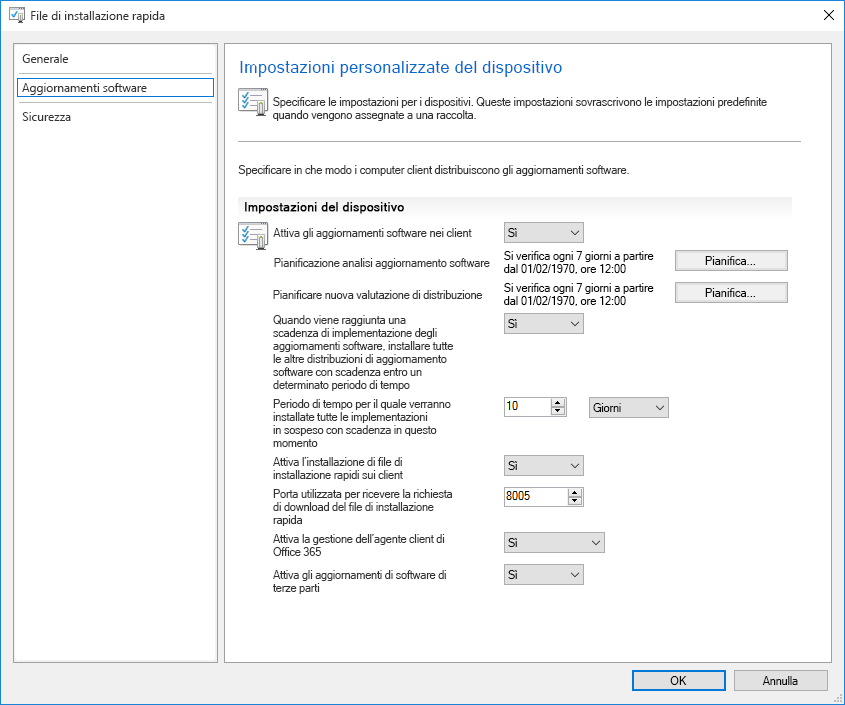
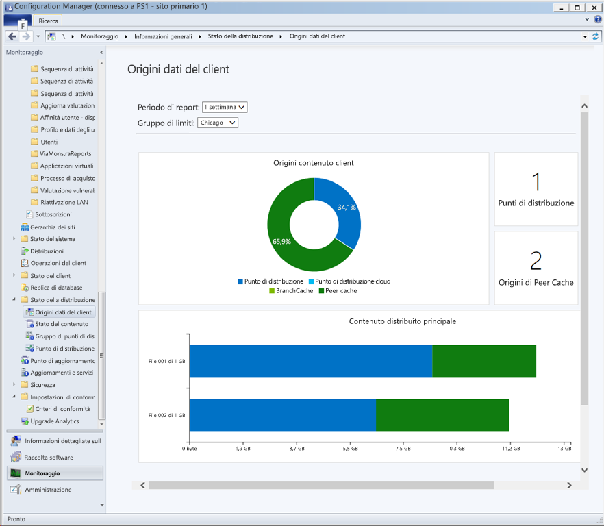
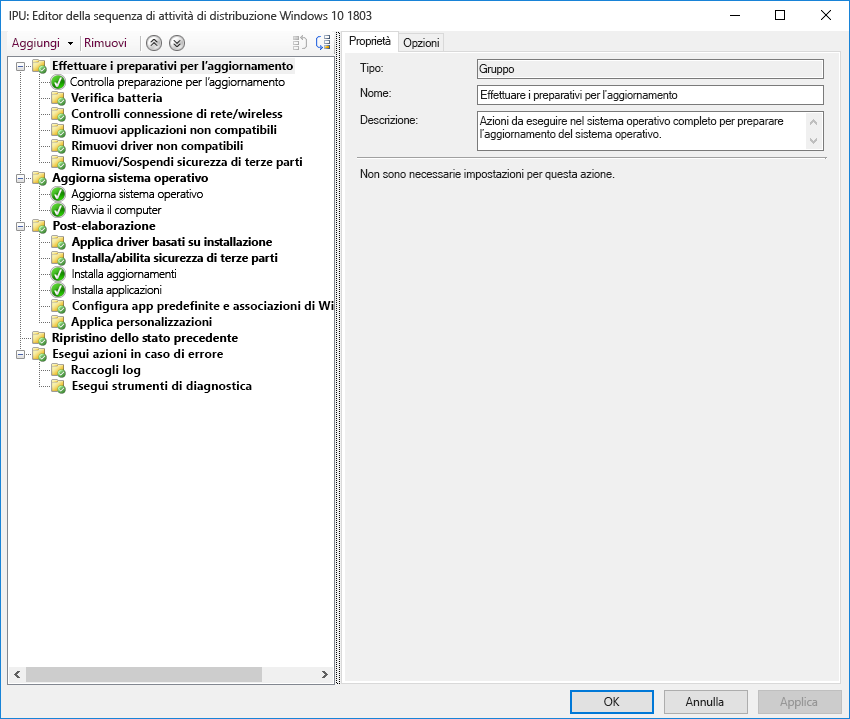

# Passaggio 7: manutenzione di Windows e Office

<table>
<thead>
<td></td>
<td>
<strong>Passaggio 7: manutenzione di Windows e Office</strong>

Windows 10 e Office 365 ProPlus aggiungono continuamente nuove funzionalità per continuare a offrire esperienze utente e protezione con le ultime novità. Ottenere informazioni su come restare al passo con gli aggiornamenti mensili e semestrali, su come funziona il nuovo modello di manutenzione e sugli strumenti e opzioni disponibili.
</td>
<td></td>
</thead>
</table>

>[!NOTE]
>La manutenzione di Windows e Office è il settimo passaggio del nostro processo di distribuzione consigliato e illustra la pianificazione per la preparazione agli aggiornamenti semestrali delle funzionalità. Per vedere il processo di distribuzione desktop completo, visitare il [Centro distribuzione desktop](https://aka.ms/HowToShift).
>

Sia Windows 10 che Office 365 ProPlus introducono nuove opzioni di manutenzione, modelli di supporto e tempistiche di aggiornamento. Queste modifiche semplificano il processo per rimanere aggiornati sulle ultime funzionalità. Oltre a questi aggiornamenti sono disponibili nuove opzioni di configurazione, per creare piani di manutenzione sulla base delle proprie specifiche esigenze. Di seguito viene descritto come prepararsi per gli aggiornamenti di canale semestrali che offrono nuove funzionalità e capacità in Windows 10 e Office 365 ProPlus utilizzando le nuove funzionalità di Microsoft Endpoint Configuration Manager (Current Branch).

[Aiutare i clienti a passare a Windows 10 e Office 365 ProPlus](https://www.microsoft.com/microsoft-365/blog/2018/09/06/helping-customers-shift-to-a-modern-desktop/)

## Tipi di aggiornamento

Gli aggiornamenti si dividono in due categorie principali, aggiornamenti delle funzionalità e aggiornamenti qualitativi e di sicurezza che contengono correzioni cumulative di errori, per l'affidabilità e la sicurezza. In termini di frequenza, sia Windows che Office offrono un canale semestrale che fornisce nuove funzionalità due volte all'anno intorno a marzo e settembre, mentre gli aggiornamenti qualitativi e della sicurezza vengono rilasciati mensilmente. Inoltre, solo per le app di Office 365, è disponibile un'opzione Canale mensile completamente supportata, che fornisce sia nuove funzionalità che aggiornamenti qualitativi.

Chi è abituato a un ciclo più lungo tra il sistema operativo desktop e gli aggiornamenti delle app, potrebbe chiedere:

  - Gli aggiornamenti saranno compatibili?

  - Gli utenti devono ricevere un'altra formazione?

  - E quali sono i rischi?

Per rispondere a queste domande e spiegare il motivo dell'offerta più frequente di nuove funzionalità, di seguito vengono presentati alcuni dei vantaggi di questo approccio

### Vantaggi dell'aggiornamento delle funzionalità

In primo luogo, Microsoft si è allontanata dal modello del passato che introduceva enormi ondate di cambiamento ogni tre anni, fino alle odierne modifiche incrementali più piccole con aggiornamenti delle funzionalità due volte all'anno. Perché? La rapida evoluzione della tecnologia ma anche delle minacce alla sicurezza, conferma la protezione dell'esperienza utente come argomento di grande attualità. Alcuni degli aggiornamenti relativi alla sicurezza, ad esempio, non possono essere forniti solo dagli aggiornamenti di sicurezza mensili o dai file di firma antivirus; possono essere piattaforme a basso livello, come la sicurezza basata sulla virtualizzazione.

[Guida rapida di Windows as a Service](https://docs.microsoft.com/windows/deployment/update/waas-quick-start)

[Ridurre le minacce con le funzionalità di sicurezza di Windows 10](https://docs.microsoft.com/windows/security/threat-protection/overview-of-threat-mitigations-in-windows-10%20%20)

### Vantaggi del modello di aggiornamento cumulativo

Gli aggiornamenti qualitativi e di sicurezza offerti come pacchetto di aggiornamento cumulativo risolvono molti dei problemi del passato. Un tempo era possibile scegliere anche tra una dozzina di aggiornamenti o più ogni mese sia per Windows che per Office. Ovviamente, questa situazione determinava set di matrici quasi impossibili da supportare. Inoltre, se si installa una versione di Windows o Office rilasciata già da un anno o più, potrebbero essere necessarie ore o talvolta giorni per applicare tutti gli aggiornamenti offerti dal rilascio di questa versione.

Con il modello cumulativo, l'utente rimane aggiornato all'ultimo aggiornamento, riducendo così il numero di aggiornamenti mensili che è necessario distribuire. Ogni aggiornamento si basa sugli aggiornamenti dei mesi precedenti e contiene tutte le correzioni necessarie per rimanere aggiornati. Gli aggiornamenti cumulativi sono particolarmente utili quando i PC non vengono utilizzati per diversi mesi, poiché restano in memoria in attesa di essere riassegnati a un altro utente.

### Convalida estesa degli aggiornamenti

Un altro vantaggio è che, prima di implementare gli aggiornamenti per la distribuzione generale, vengono rilasciate build tramite i programmi Insider per [Office](https://products.office.com/office-insider?tab=Windows-Desktop) e [Windows](https://insider.windows.com/) e ciò consente di raccogliere dati di diagnostica e feedback prima del rilascio su larga scala. Attualmente i programmi Insider sono aperti a tutti e permettono di conoscere in anticipo gli aggiornamenti. Prima del rilascio degli aggiornamenti, Microsoft avrà ricevuto dati di diagnostica da milioni di configurazioni, pertanto al momento dell'implementazione la qualità sarà intrinsecamente più prevedibile.

INOLTRE, poiché le build di Office 365 ProPlus Insider riflettono gli aggiornamenti canale mensili, se si utilizza il canale semestrale per Office per fornire aggiornamenti delle funzionalità due volte all'anno in linea con Windows, è possibile convalidare tali build in anticipo utilizzando anche le versioni canale mirate semestrali.

### Strumenti di gestione di supporto

Al fine di rendere la distribuzione degli aggiornamenti ideale per l'utente, Configuration Manager (Current Branch) viene aggiornato frequentemente per supportare l'implementazione degli aggiornamenti su Windows e Office e qualsiasi nuova funzionalità.

[Distribuire gli aggiornamenti di Windows 10 con Configuration Manager](https://docs.microsoft.com/windows/deployment/update/waas-manage-updates-configuration-manager)

[Gestire Office 365 ProPlus con Configuration Manager](https://docs.microsoft.com/configmgr/sum/deploy-use/manage-office-365-proplus-updates)

## Panoramica dei canali di Windows e Office

Windows 10 offre tre canali di manutenzione:

- [**Programma Windows Insider**](https://docs.microsoft.com/windows/deployment/update/waas-overview#windows-insider), che le organizzazioni possono usare per testare e fornire feedback sulle funzionalità fornite con il l'aggiornamento delle funzionalità successivo
- **Canale semestrale**, che offre aggiornamenti delle funzionalità due volte l'anno
- **Long Term Servicing Channel**, progettato solo per dispositivi specialistici che richiedono un'opzione di manutenzione con tempi più lunghi

Office 365 offre quattro canali di manutenzione:

- [**Programma Office Insider**](https://support.office.com/article/What-is-Office-Insider-f4208185-b63a-4b68-9c7a-9a32d2411c16), che le organizzazioni possono usare per testare e fornire feedback sulle nuove funzionalità di Office ancora in fase di sviluppo
- **Canale mensile**, che fornisce agli utenti le funzionalità più recenti di Office non appena sono disponibili
- **Canale semestrale**, che fornisce nuove funzionalità e caratteristiche solo due volte l'anno
- **Canale semestrale (mirato)**, una build di Office completamente supportata che consente a utenti pilota e tester della compatibilità di testare e convalidare il canale semestrale successivo.

Per informazioni dettagliate sui canali di manutenzione di Windows e Office, vedere la documentazione seguente:

- [Panoramica di Windows as a Service](https://docs.microsoft.com/windows/deployment/update/waas-overview#servicing-channels)
- [Panoramica dei canali di aggiornamento per Office 365 ProPlus](https://docs.microsoft.com/DeployOffice/overview-of-update-channels-for-office-365-proplus#BKMK_SAC)

## Distribuzione a fasi degli aggiornamenti

A questo punto si può procedere sulla spiegazione di come verranno implementati gli aggiornamenti. Per qualsiasi versione, si consigliano almeno tre fasi di distribuzione per l'IT: convalida, distribuzione pilota e distribuzione della produzione estesa. Una volta installato Windows 10 e Office 365 ProPlus, l'utente si avvarrà di manutenzione mensile per rimanere aggiornato con gli aggiornamenti critici di sicurezza e qualitativi, per poi passare alla manutenzione semestrale per le nuove funzionalità.

### Aggiornamento mensile

Il modello di servizio è progettato in modo da poter scegliere di limitare l'implementazione delle nuove funzionalità a due volte l'anno e, se necessario, è possibile anche saltare un aggiornamento semestrale e continuare a ricevere aggiornamenti qualitativi e sicurezza. Come accennato, la natura cumulativa degli aggiornamenti mensili comporta che ciascuno aumenterà di dimensioni ogni mese.

#### Express Updates

Usando una tecnologia chiamata "Express Updates" in Windows e Binary Delta Compression in Office, p possibile ridurre significativamente le dimensioni del download. In entrambi gli approcci, i motori di aggiornamento confrontano ciò che è sul PC e trovano solo i differenziali necessari per aggiornare ciò che è presente.

[Aggiornamenti qualitativi di Windows 10 illustrati e fine degli aggiornamenti delta](https://techcommunity.microsoft.com/t5/Windows-IT-Pro-Blog/Windows-10-quality-updates-explained-amp-the-end-of-delta/ba-p/214426)

Windows Update per le aziende e Windows Server Update Services hanno supportato gli Express Updates per un lungo periodo, tuttavia ora è stato esteso il supporto a Microsoft Endpoint Configuration Manager (Current Branch) in modo che possa utilizzare anche gli Express Updates.

#### Binary Delta Compression

Binary Delta Compression in Office viene utilizzato solo se si esegue l'aggiornamento dalla versione più recente di Office 365 ProPlus, pertanto per utilizzare questo approccio è necessario aggiornare la build precedente e non è possibile saltare gli aggiornamenti.

I canali di aggiornamento di Windows e Office possono essere gestiti tramite Configuration Manager utilizzando il processo di approvazione e individuazione standard. Inoltre, è possibile utilizzare le impostazioni dei criteri in Office e Windows per applicare i canali di aggiornamento utilizzati e le relative impostazioni.

### Aggiornamenti semestrali

Quindi queste sono le considerazioni sugli aggiornamenti mensili. Ora si può passare agli aggiornamenti semestrali più grandi.

Come descritto nella sezione relativa alla preparazione di dispositivi e applicazioni, sarà necessario prepararsi per questi aggiornamenti più grandi utilizzando gli stessi strumenti di preparazione configurati nel Passaggio 1 del grafico circolare del processo di distribuzione.

Per quanto riguarda gli strumenti, è possibile utilizzare le impostazioni dei criteri con Windows Update per le aziende, la gestione degli aggiornamenti software tramite Microsoft Endpoint Configuration Manager (Current Branch), Windows Server Update Services (WSUS) o i criteri di aggiornamento impostati da Microsoft Intune. Se si è preoccupati per la larghezza di banda della rete, vedere il Passaggio 2: conformità di directory e rete per informazioni sulle opzioni per ridurre il traffico di rete tramite Ottimizzazione recapito e altre tecnologie di memorizzazione nella cache peer-to-peer.

[Canale semestrale per Windows](https://docs.microsoft.com/windows/deployment/update/waas-overview#semi-annual-channel)

[Canale semestrale per Office 365 ProPlus](https://docs.microsoft.com/DeployOffice/overview-of-update-channels-for-office-365-proplus#BKMK_SAC)

#### Sequenze di attività di aggiornamento

L'installazione degli aggiornamenti di funzionalità più grandi tramite routine di gestione degli aggiornamenti software standard è un'opzione supportata, ma molte organizzazioni sceglieranno di utilizzare una sequenza di attività di aggiornamento con Microsoft Endpoint Configuration Manager (Current Branch) o Microsoft Deployment Toolkit.

Una sequenza di attività consente di creare controlli personalizzati o attività PRIMA dell'installazione dell'aggiornamento delle funzionalità e consente di eseguire attività personalizzate DOPO che l'installazione dell'aggiornamento è stata completata. Le attività di post-aggiornamento potrebbero includere servizi di sospensione temporanea se necessario durante l'aggiornamento, installazione sostituzione di driver, aggiornamenti di applicazioni o barra delle applicazioni e impostazioni Start personalizzate di Windows 10.

Se l'utente usa già le sequenze di attività per migrare i computer Windows 7 su Windows 10 e conosce bene questi strumenti, ne avrà il massimo controllo. Anche se è possibile utilizzare una singola sequenza di attività per l'intero aggiornamento, è abbastanza comune che le organizzazioni utilizzino due sequenze di attività. Una sequenza di attività per accertarsi che i PC siano pronti per l'aggiornamento, che precede in modo silenzioso tutti i file di installazione richiesti sui computer di destinazione e uno per eseguire l'aggiornamento effettivo. Questo approccio garantisce un impatto minimo sulla produttività dell'utente.

[Creare una sequenza di attività per aggiornare un sistema operativo in Configuration Manager](https://docs.microsoft.com/configmgr/osd/deploy-use/create-a-task-sequence-to-upgrade-an-operating-system)

#### Supporto canale semestrale per l'aggiornamento delle funzionalità

[Come annunciato nel settembre 2018](https://www.microsoft.com/microsoft-365/blog/2018/09/06/helping-customers-shift-to-a-modern-desktop/), per il supporto di sequenza temporale per gli aggiornamenti canale semestrali verrà utilizzato il modello seguente.

  - Tutti gli aggiornamenti delle funzionalità attualmente supportati di Windows 10 Enterprise ed Education, a partire dalla versione 1607, saranno supportati per 30 mesi dalla data di rilascio originale.

  - Tutti gli aggiornamenti di funzionalità futuri, a partire da 1809, con assegnazione settembre saranno supportati per 30 mesi dalla data di rilascio.

  - Gli aggiornamenti delle funzionalità future con assegnazione marzo e a partire da 1903 continueranno a essere supportati per 18 mesi dalla data di rilascio.

  - Gli aggiornamenti semestrali di Office 365 ProPlus continuano a essere supportati per 18 mesi

#### Ulteriori opzioni di automazione della configurazione al di fuori delle sequenze di attività

Se non si utilizzano le sequenze di attività di aggiornamento, ora è possibile eseguire azioni personalizzate o applicare file del driver durante gli aggiornamenti delle funzioni nella fase di pre-installazione (prima che l'installazione esegua i controlli di compatibilità) o nella fase di pre-commit (prima che l'aggiornamento venga applicato).

[Novità in Windows 10, versione 1803](https://docs.microsoft.com/windows/whats-new/whats-new-windows-10-version-1803%23windows-setup)

## Passaggio successivo 

## [Passaggio 8: formazione e comunicazioni utente](https://aka.ms/mdd8)

## Passaggio precedente 

## [Passaggio 6: distribuzione del sistema operativo e aggiornamenti delle funzionalità](https://aka.ms/mdd6)
