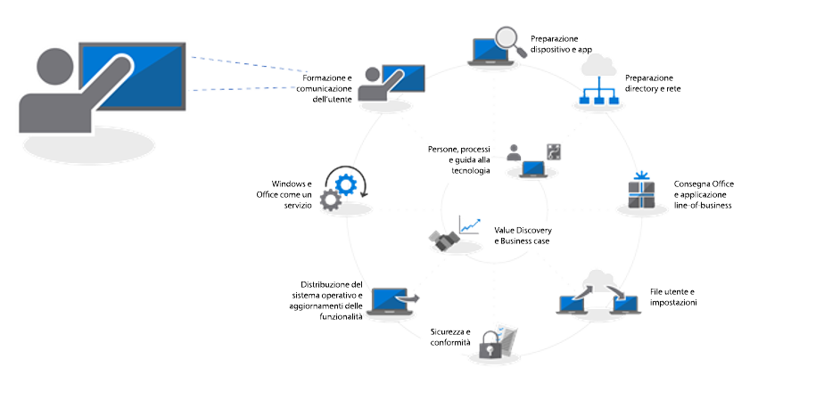
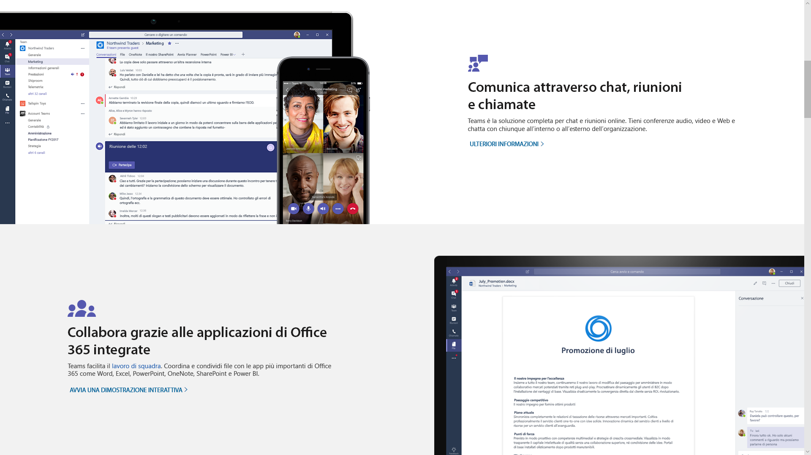
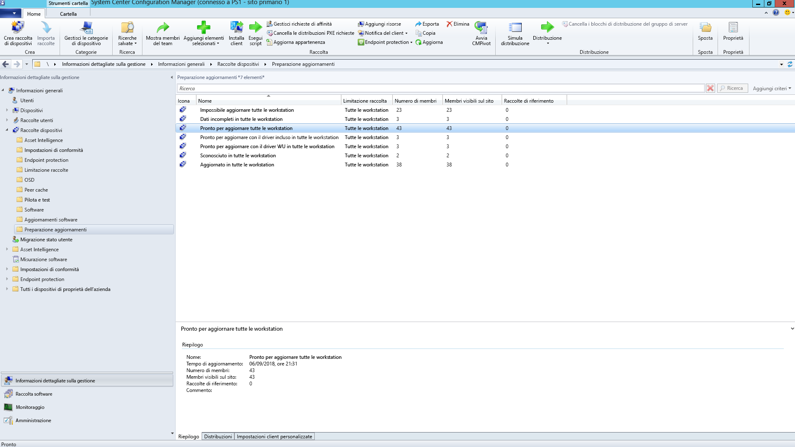
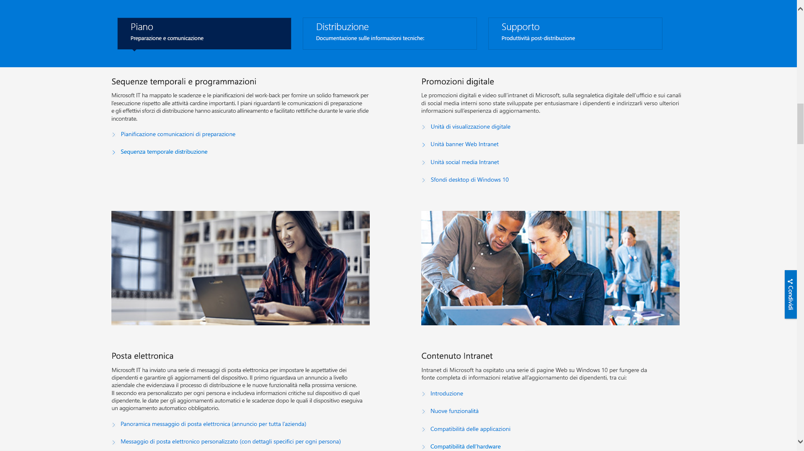

# Passaggio 8: comunicazioni e formazione utenteStep 8: User Communications and Training

<table>
<thead>
<td></td>
<td>
<strong>Passaggio 8: comunicazioni e formazione utente</strong><strong>Step 8: User Communication and Training</strong>

Verificare che gli utenti siano informati sulle nuove esperienze e sulle nuove modalità di lavoro quando si passa a Windows 10 e Office 365 ProPlus. Ottenere informazioni su come sfruttare l’assistenza per l’adozione da parte degli utenti con Microsoft FastTrack, sui materiali di formazione e sui modelli di comunicazione, oltre che sui nuovi modi per monitorare l'utilizzo e l’accettazione da parte degli utenti.Make sure your users are informed about new experiences and new ways of working as you shift your PCs to Windows 10 and Office 365 ProPlus. Learn how to take advantage of user adoption assistance with Microsoft FastTrack, training materials and communication templates, as well as new ways to monitor user acceptance and usage.
</td>
<td></td>
</thead>
</table>

>[!NOTE]
>La comunicazione e la formazione degli utenti costituiscono l'ottavo passo nel diagramma circolare del processo di distribuzione consigliata, dove sono disponibili suggerimenti e raccomandazioni per informare e preparare gli utenti.User Communications and Training is the eighth step in our recommended deployment process wheel by covering tips and recommendations to inform and prepare users. Per visualizzare il processo completo di distribuzione desktop, visitare il [centro di distribuzione desktop](https://aka.ms/HowToShift).To see the full desktop deployment process, visit the [Desktop Deployment Center](https://aka.ms/HowToShift).
>

Per facilitare il passaggio, è necessario informare e preparare gli utenti per esperienze di lavoro moderne che abbracciano Office 365, Windows 10 e nuovi controlli di sicurezza e conformità con Azure Active Directory.Informing and preparing your users for modern workplace experiences spanning Office 365, Windows 10, and new security and compliance controls with Azure Active Directory is critical to driving adoption. Basta capire come introdurre gli aggiornamenti (quando gli utenti possono interrompere la produttività o cambiare il flusso di lavoro o se devono essere formati su contenuti nuovi).The trick here is to figure out how to introduce updates -- when some users may fear disruptions to their productivity or changes in their workflow, or if they have to learn new things.

Se si sta effettuando il passaggio da Windows 7 e Office 2010 o Office 2013, gli utenti avranno molta familiarità con Windows 10 e le versioni più recenti di Office in esecuzione sui dispositivi personali, quindi l'impatto del cambiamento sarà ridotto.The good news is if you are moving from Windows 7 and Office 2010 or Office 2013, there will be a lot of people familiar with Windows 10 and newer versions of Office running on their personal devices, and all this will help reduce the impact of change.

## Prepararsi a nuove esperienzeGetting ready for new experiences

A partire da Office, se si sta distribuendo Office 365 ProPlus per la prima volta, si possono comunicare i vantaggi di poter accedere alle app di Office e di salvare i file nei percorsi OneDrive o SharePoint per consentire una condivisione più semplice, ridurre la diramazione dei file e abilitare la creazione condivisa in tempo reale.Starting with Office, if you’re deploying Office 365 ProPlus for the first time, this is when you can communicate the benefits of signing in to Office apps and saving files to OneDrive or SharePoint locations to enable easier sharing, reduce file branching and enable real-time co-authoring.

Sono disponibili modelli dettagliati di comunicazione e formazione per queste e altre app locali o basate su browser, come Teams e Planner.Detailed communication and training templates are available for these and other local or browser-based apps, like Teams and Planner.

Microsoft fornisce inoltre indicazioni sulle nuove funzionalità in-app che permettono di allegare file collegati a OneDrive in Outlook o di utilizzare nuove transizioni di diapositive Morphing e funzionalità di Designer in PowerPoint.We also give guidance for new in-app capabilities like attaching OneDrive linked files in Outlook or using the new Morph slide transitions and Designer features in PowerPoint.

Per Windows 10, l'utente sarà supportato nella familiarizzazione con funzionalità opzionali e predefinite come Windows Hello per accedere in sicurezza utilizzando la biometria, aggiornamenti di Start per personalizzare l'uso di Windows, Timeline per tornare facilmente a ciò cui si stava lavorando, Cortana e altro.For Windows 10, we help you to familiarize your users with optional and default capabilities like Windows Hello to log in securely using biometrics, Start updates to personalize your Windows experience, Timeline to easily get back to what you were working on, Cortana and more.

Sono inoltre presenti controlli di sicurezza e conformità visibili cui gli utenti potrebbero essere esposti. Enterprise Mobility + Security che comprende Azure AD e Microsoft Intune integra funzionalità aggiuntive con Windows 10 e Office 365 che è possibile scegliere per l'aggiornamento del desktop.There are also visible security and compliance controls that your users may be exposed to. Enterprise Mobility + Security which comprises Azure AD and Microsoft Intune, integrates additional capabilities with Windows 10 and Office 365 that you can target for your desktop upgrade.

[Microsoft Enterprise Mobility + SecurityMicrosoft Enterprise Mobility + Security](https://www.microsoft.com/cloud-platform/enterprise-mobility-security)

Ad esempio, se è stata attivata l'autenticazione a più fattori, questa utilizza Azure AD e protegge l'accesso dell'utente alle risorse sfruttando l'app o il PIN di un telefono per accedere in modo sicuro ai servizi. Inoltre, Azure Information Protection facilita la classificazione e l'etichettatura dei documenti da parte degli utenti.For example, if you've enabled Multi-factor Authentication, this uses Azure AD --and protects user sign-in to resources by leveraging a phone app or PIN to securely access services. And Azure Information Protection makes it easy for users to classify and label documents.

[Configurare l'autenticazione a più fattori per utenti di Office 365Set up multi-factor authentication for Office 365 users](https://support.office.com/article/set-up-multi-factor-authentication-for-office-365-users-8f0454b2-f51a-4d9c-bcde-2c48e41621c6)

Queste sono solo alcune delle nuove funzionalità che saranno sperimentate dagli utenti e alcune potrebbero coglierli di sorpresa, in modo positivo o meno. Tali sorprese, specialmente se alterano il normale flusso di lavoro, possono comportare più chiamate e ticket per l'helpdesk.These are just a handful of new capabilities that will be experienced by your users and some may catch them by surprise – either in a positive or less positive way. And these surprises – especially if they alter the normal work flow – can result in more calls and tickets for you or your helpdesk.

## Preparazione preventiva e implementazioni misurateProactive Preparation and Measured Roll-outs

Per ridurre i rischi associati alla modifica dell'esperienza utente, è consigliabile porre in atto due strategie complementari:To help minimize the risk associated with changes in the user experience, we recommend two complementary approaches:

  - Comunicazione proattiva agli utenti in modo che sappiano cosa aspettarsiProactive communication to your users so they know what to expect

  - Uso di anelli distribuzione per controllare la frequenza di distribuzioneUse of deployment rings to control the rate of deployment

### Distribuzione a fasiPhased Deployment

La distribuzione a fasi utilizzando gli anelli di distribuzione consiste nell'iniziare la distribuzione a piccoli gruppi, per ampliarla in modo misurato nel tempo. Normalmente, quando viene redatto un piano di comunicazione e formazione, è necessario formare i membri all'interno di questi anelli. In questo modo, si riducono rischi potenziali ed è possibile valutare il proprio approccio, poiché l'operazione di distribuzione viene eseguita più volte, oppure sospendere le attività quando necessario, ad esempio, se l'helpdesk riceve più chiamate del previsto.Phased deployment using deployment rings is the concept of starting with small groups then broadened deployment scale in a measured way over time. Normally by the time a communication and training plan is drafted, these rings and their members should be formed. This way, you can reduce potential risk and validate your approach as you continually open the deployment valve, or pause activities if needed, for example, when you see more helpdesk calls come in than expected.

Gli anelli di distribuzione sono creati al meglio se effettuati in collaborazione con le unità aziendali e i loro dirigenti. Si consiglia di individuare le date e le ore critiche da evitare per la distribuzione o l'esecuzione di modifiche. Senza un'attenta pianificazione e l'approvazione delle parti interessate, sarà difficile convincere gli utenti ad adottare con serenità gli eventuali cambiamenti in arrivo.Deployment rings are best created in cooperation with business units and their managers. You’ll want an understanding of critical dates and times to avoid when deploying or making changes. Without careful planning and buy-in from stakeholders, it will be difficult to get users on-board and comfortable with any changes coming their way.

### Fase 1: team IT e personale al passo con la tecnologiaPhase 1: The IT Team and Early Adopter Insiders 

Solitamente è preferibile iniziare la distribuzione dal team IT e dal personale al passo con la tecnologia che non vede l'ora di implementarla. Con queste persone sarà possibile testare l'impatto dei cambiamenti e l'efficacia delle comunicazioni e della formazione. Durante questa fase, l'IT gestisce piccoli progetti pilota, apprende tecniche di risoluzione dei problemi e di automazione che saranno utili a fornire supporto durante le fasi di implementazione più ampie.It’s usually best to begin your deployment with the IT team and enthusiastic early adopters, who volunteer for early access. With these “insiders” you can test your communications, the impacts of change and the effectiveness of your communications and training. During this phase, IT runs small pilots, learns troubleshooting and automation techniques to help during broader deployment phases.

È importante avere membri impegnati nella fase pilota iniziale, per documentare le loro osservazioni e ottenere feedback sul processo. Inoltre, è positivo avere dei punti di riferimento al di fuori del team IT che possono contribuire a sostenere le nuove funzionalità e rappresenteranno probabilmente la prima linea di supporto quando gli utenti nelle fasi successive avranno bisogno di aiuto.It’s important to have engaged members in the initial pilot phase, to make sure they are documenting their observations and feeding back to the process. Also, it’s good to have champions outside the IT team that help extend organic, word-of-mouth communication of new capabilities, and they’ll often be first line of support when users in later phases need help.

### Fase 2: progetto pilotaPhase 2: Pilot 

Una volta sperimentata con successo la prima fase, si può scegliere come target una serie più ampia di utenti per la seconda fase pilota. Ciò dovrebbe comprendere una combinazione rappresentativa di ruoli utente, tipi di dispositivi, app Windows e componenti aggiuntivi di Office. I dati di ritorno da questi gruppi verranno utilizzati tramite il servizio analisi per individuare le ondate iniziali per la fase 3, la distribuzione più ampia.Once you feel good about the first phase, you can target a larger set of users for your second, pilot phase. This should comprise a representative mix of user roles, device types, Windows apps and Office add-ins. The data returning from these groups will be used via Analytics to target the initial waves for phase 3, the broader deployment.

È bene ricordare che tutti i PC in questa fase e nelle fasi successive devono poter accedere al servizio di analisi, in modo da raccogliere dati di diagnostica sullo stato di dispositivi e app, oltre che sul risparmio di larghezza di banda ottenuto grazie all'uso di Ottimizzazione recapito e dell'accesso a Windows Hello.Remember, all PCs in this phase and future phases should be logging up to the Analytics service, so you can collect diagnostic data about device and app health as well as bandwidth savings from Delivery Optimization and use of Windows Hello login.

In questa fase è particolarmente importante comunicare le modifiche e aiutare gli utenti a sfruttare le nuove funzionalità. Gli utenti spesso ignorano le e-mail o altre comunicazioni provenienti dall'IT, quindi può essere utile incontrare il responsabile per ottenerne l'aiuto nella comunicazione dei cambiamenti e nell'adozione di nuovi strumenti e tecnologie.For this phase it is especially important to communicate changes and help users take advantage of new capabilities. Users can often de-prioritize or ignore email or other communications coming from IT – so it helps to meet with management to get their help in communicating change and drive adoption of new tools and technology.

Questa collaborazione tornerà anche utile per avere informazioni sui periodi da evitare, in modo da ridurre al minimo l'interruzione del lavoro degli utenti (ad esempio il team finanziario potrebbe essere particolarmente impegnato alla fine del trimestre fiscale o il team di sviluppo potrebbe essere impegnato durante il lancio di un prodotto).You’ll also need their input on timeframes to avoid, so you can minimize user disruption – for example the finance team may be particularly sensitive at the end of fiscal quarters or product development teams during a product launch.

Parallelamente alla pianificazione di dispositivi, utenti, reparti e tempistiche, si può iniziare a creare piani di comunicazione e formazione, nonché a compilare i contenuti o a coinvolgere risorse esterne per aiutare gli utenti.In parallel to planning for devices, users, departments and timing, you can start to build your communication and training plans, as well as begin compiling content or engaging outside resources to help train users.

#### Microsoft FastTrackMicrosoft FastTrack 

Per mettere insieme i contenuti della formazione, è possibile accedere a brevi video formativi con istruzioni dettagliate sulla raccolta di produttività di Microsoft FastTrack.To help your effort in pulling together training content, you can access a comprehensive set of short, video-based training with step-by-step instructional guidance on the Microsoft FastTrack Productivity Library.

[Raccolta di produttività di Microsoft FastTrackMicrosoft FastTrack Productivity Library](https://www.microsoft.com/microsoft-365/success/?rtc=2)

Sono disponibili centinaia di argomenti, in base agli argomenti rilevanti per l'organizzazione, tra cui: creazione di contenuti di maggiore impatto, condivisione di siti e contenuti, trasformazione del lavoro di gruppo e sblocco della produttività con dispositivi moderni.There are hundreds of topics, based on what’s important to your organization, including: creating more impactful content, sharing sites and content, transforming teamwork and unlocking productivity with modern devices.

Inoltre, se l'utente utilizza Microsoft 365 o Office 365, è probabile che abbia diritto a ricevere assistenza nel guidare l'adozione da parte degli utenti tramite il servizio Microsoft FastTrack. Una guida illustra le migliori pratiche da adottare durante il processo di implementazione di Microsoft 365 - Windows, Office ed EMS.Also, if you are using Microsoft 365 or Office 365, there is good chance that you’re eligible for help with driving user adoption via Microsoft’s FastTrack service. Representatives guide you through adoption best practices as you go through the Microsoft 365 – Windows, Office and EMS – rollout process.

#### Microsoft IT ShowcaseMicrosoft IT Showcase 

La serie Microsoft IT Showcase è un'altra grande risorsa per i contenuti relativi alla distribuzione di Windows 10. Include scadenze e orari, modelli di promozione digitale, modelli di e-mail e contenuti Intranet. Si basano su materiali utilizzati per la distribuzione di Windows 10 di Microsoft e possono essere utilizzati da parte di qualsiasi organizzazione.Microsoft’s IT Showcase series is another great resource for Windows 10 deployment-related content. It includes timelines and schedules, digital promotion templates, email templates and Intranet content. These are based on materials used for Microsoft’s own deployment of Windows 10 and has been modified for any organization to use.

[Preparazione dell'organizzazione per una distribuzione semplice di Windows 10Preparing your organization for a seamless Windows 10 deployment](https://www.microsoft.com/itshowcase/windows10deployment)

Questi componenti e servizi insieme possono essere messi a punto durante la fase pilota. Solo quando sarà chiara la risposta degli utenti alla formazione, quali sono i dispositivi target e, grazie al servizio analisi, quali dispositivi o gruppi di utenti è meglio evitare o lasciare per l'ultima fase, allora si potrà attuare la successiva fase di implementazione, utilizzando un approccio basato su dati e guidato dall'esperienza.These components and services together can be fine-tuned during the pilot phase. And as you start to realize what’s resonating with users on the training side of things, which devices to target and via Analytics and which devices or user groups to avoid or delay, you can begin to broaden your deployment in later phases using a data- and experience-driven approach.

Man mano che il progetto pilota si espande, sarà necessario documentare e pubblicare domande frequenti e contenuti cui poter accedere autonomamente per ridurre in modo proattivo i ticket di assistenza e le attività dell'helpdesk.As your pilot expands, you’ll want to document and publish frequently asked questions and self-service content to help proactively reduce support tickets and helpdesk activities.

### Fase 3 e successive: distribuzione generale della produzionePhase 3 and beyond: Broad Production deployment 

Nel momento in cui verranno raggiunte ampie fasi di implementazione, i processi, la comunicazione, la formazione e gli strumenti cui accedere autonomamente saranno stati perfezionati.By the time you reach broad deployment phases, you’ll have refined your processes, communication, training and self-service tools. A quel punto sarà possibile usare i dati di diagnostica raccolti per l'assegnazione a un numero sempre maggiore di PC.Now you can use the diagnostic data collected to target more and more PCs.

Eseguire la distribuzione a una velocità gestibile dal reparto IT, dall'helpdesk, dagli utenti e dalla capacità della rete. È sempre possibile tornare al passaggio 2 del diagramma circolare del processo di distribuzione per ottimizzare ulteriormente la rete utilizzando la cache peer-to-peer, la tecnologia LEDBAT e altre tecniche per facilitare il trasferimento più rapido dei dati relativi all'implementazione.Deploy at a rate that is manageable to your IT department, help desk, users and network capacity. You can always go back to Step 2 in the deployment process wheel to optimize your network even further using peer to peer cache, LEDBAT and other techniques to facilitate faster transfer of deployment-related data.

Oltre ai dati di diagnostica monitorati tramite gli strumenti di analisi, è anche possibile monitorare in modo granulare l'utilizzo dei servizi di Office 365 e Microsoft 365 con report dettagliati sull'utilizzo in base al carico di lavoro nel centro di amministrazione e usando i dashboard di amministrazione tramite Power BI.In addition to the diagnostic data that you monitor via the analytics tools, you can also monitor Office 365 and Microsoft 365 service usage in a granular way with detailed usage reports in by workload in the admin center and using the admin dashboards via Power BI. Si tratta di strumenti validissimi per impostare e tenere traccia degli obiettivi quando vengono implementati nuovi strumenti di collaborazione, come Microsoft Teams, o nuovi modi per condividere file, come OneDrive.These are great tools to help set and track goals as you roll-out new tools for working together – like Microsoft Teams – or new ways to share files – like OneDrive.

L'accettazione e l'adozione di nuove tecnologie continueranno molto dopo che ogni PC dell'organizzazione avrà installato Windows 10 e Office 365 ProPlus. Inoltre, gli utenti non cambieranno necessariamente il loro modo di lavorare, a meno che non si spenda il giusto tempo per informarli e formarli sulle nuove funzionalità. Infine, con i nuovi modelli di servizio che forniscono nuove funzionalità su base semestrale per Windows e facoltativamente su base mensile per Office, la comunicazione sarà continua.New technology acceptance and adoption will go on long after every PC in your organization has Windows 10 and Office 365 ProPlus installed. And users won’t necessarily change how they work – without taking the time to inform and train them of new capabilities. Finally, with the new servicing models providing new capabilities on an ongoing semi-annual schedule for Windows and optionally a monthly schedule for Office, communication will be continual.

## Passaggio precedentePrevious Step 

## [Passaggio 7: manutenzione di Windows e OfficeStep 7: Windows and Office Servicing](https://aka.ms/mdd7)