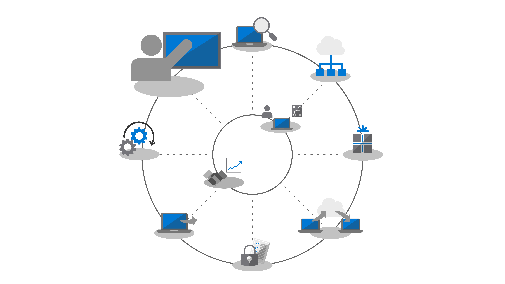
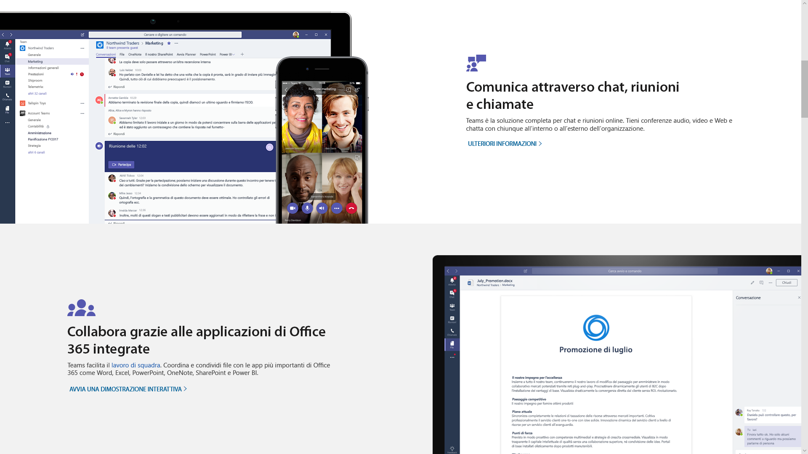
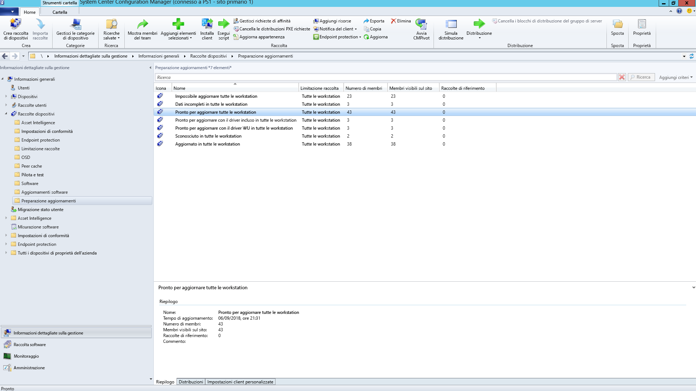
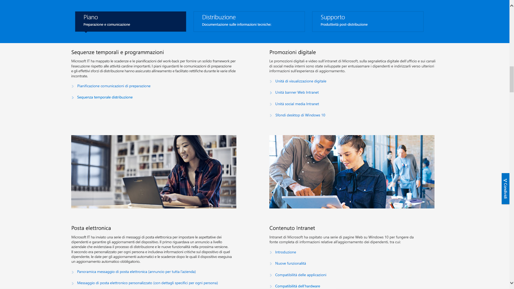

# Passaggio 8: comunicazioni e formazione utente

<table>
<thead>
<td></td>
<td>
<strong>Passaggio 8: comunicazioni e formazione utente</strong>

Verificare che gli utenti siano informati sulle nuove esperienze e sulle nuove modalità di lavoro quando si passa a Windows 10 e Office 365 ProPlus. Ottenere informazioni su come sfruttare l’assistenza per l’adozione da parte degli utenti con Microsoft FastTrack, sui materiali di formazione e sui modelli di comunicazione, oltre che sui nuovi modi per monitorare l'utilizzo e l’accettazione da parte degli utenti.
</td>
<td></td>
</thead>
</table>

>[!NOTE]
>La comunicazione e la formazione degli utenti costituiscono l'ottavo passo nel diagramma circolare del processo di distribuzione consigliata, dove sono disponibili suggerimenti e raccomandazioni per informare e preparare gli utenti. Per visualizzare il processo completo di distribuzione desktop, visitare il [centro di distribuzione desktop](https://aka.ms/HowToShift).
>

Per facilitare il passaggio, è necessario informare e preparare gli utenti per esperienze di lavoro moderne che abbracciano Office 365, Windows 10 e nuovi controlli di sicurezza e conformità con Azure Active Directory. Basta capire come introdurre gli aggiornamenti (quando gli utenti possono interrompere la produttività o cambiare il flusso di lavoro o se devono essere formati su contenuti nuovi).

Se si sta effettuando il passaggio da Windows 7 e Office 2010 o Office 2013, gli utenti avranno molta familiarità con Windows 10 e le versioni più recenti di Office in esecuzione sui dispositivi personali, quindi l'impatto del cambiamento sarà ridotto.

## Prepararsi a nuove esperienze

A partire da Office, se si sta distribuendo Office 365 ProPlus per la prima volta, si possono comunicare i vantaggi di poter accedere alle app di Office e di salvare i file nei percorsi OneDrive o SharePoint per consentire una condivisione più semplice, ridurre la diramazione dei file e abilitare la creazione condivisa in tempo reale.

Sono disponibili modelli dettagliati di comunicazione e formazione per queste e altre app locali o basate su browser, come Teams e Planner.

Microsoft fornisce inoltre indicazioni sulle nuove funzionalità in-app che permettono di allegare file collegati a OneDrive in Outlook o di utilizzare nuove transizioni di diapositive Morphing e funzionalità di Designer in PowerPoint.

Per Windows 10, l'utente sarà supportato nella familiarizzazione con funzionalità opzionali e predefinite come Windows Hello per accedere in sicurezza utilizzando la biometria, aggiornamenti di Start per personalizzare l'uso di Windows, Timeline per tornare facilmente a ciò cui si stava lavorando, Cortana e altro.

Sono inoltre presenti controlli di sicurezza e conformità visibili cui gli utenti potrebbero essere esposti. Enterprise Mobility + Security che comprende Azure AD e Microsoft Intune integra funzionalità aggiuntive con Windows 10 e Office 365 che è possibile scegliere per l'aggiornamento del desktop.

[Microsoft Enterprise Mobility + Security](https://www.microsoft.com/cloud-platform/enterprise-mobility-security)

Ad esempio, se è stata attivata l'autenticazione a più fattori, questa utilizza Azure AD e protegge l'accesso dell'utente alle risorse sfruttando l'app o il PIN di un telefono per accedere in modo sicuro ai servizi. Inoltre, Azure Information Protection facilita la classificazione e l'etichettatura dei documenti da parte degli utenti.

[Configurare l'autenticazione a più fattori per utenti di Office 365](https://support.office.com/article/set-up-multi-factor-authentication-for-office-365-users-8f0454b2-f51a-4d9c-bcde-2c48e41621c6)

Queste sono solo alcune delle nuove funzionalità che saranno sperimentate dagli utenti e alcune potrebbero coglierli di sorpresa, in modo positivo o meno. Tali sorprese, specialmente se alterano il normale flusso di lavoro, possono comportare più chiamate e ticket per l'helpdesk.

## Preparazione preventiva e implementazioni misurate

Per ridurre i rischi associati alla modifica dell'esperienza utente, è consigliabile porre in atto due strategie complementari:

  - Comunicazione proattiva agli utenti in modo che sappiano cosa aspettarsi

  - Uso di anelli distribuzione per controllare la frequenza di distribuzione

### Distribuzione a fasi

La distribuzione a fasi utilizzando gli anelli di distribuzione consiste nell'iniziare la distribuzione a piccoli gruppi, per ampliarla in modo misurato nel tempo. Normalmente, quando viene redatto un piano di comunicazione e formazione, è necessario formare i membri all'interno di questi anelli. In questo modo, si riducono rischi potenziali ed è possibile valutare il proprio approccio, poiché l'operazione di distribuzione viene eseguita più volte, oppure sospendere le attività quando necessario, ad esempio, se l'helpdesk riceve più chiamate del previsto.

Gli anelli di distribuzione sono creati al meglio se effettuati in collaborazione con le unità aziendali e i loro dirigenti. Si consiglia di individuare le date e le ore critiche da evitare per la distribuzione o l'esecuzione di modifiche. Senza un'attenta pianificazione e l'approvazione delle parti interessate, sarà difficile convincere gli utenti ad adottare con serenità gli eventuali cambiamenti in arrivo.

### Fase 1: team IT e personale al passo con la tecnologia 

Solitamente è preferibile iniziare la distribuzione dal team IT e dal personale al passo con la tecnologia che non vede l'ora di implementarla. Con queste persone sarà possibile testare l'impatto dei cambiamenti e l'efficacia delle comunicazioni e della formazione. Durante questa fase, l'IT gestisce piccoli progetti pilota, apprende tecniche di risoluzione dei problemi e di automazione che saranno utili a fornire supporto durante le fasi di implementazione più ampie.

È importante avere membri impegnati nella fase pilota iniziale, per documentare le loro osservazioni e ottenere feedback sul processo. Inoltre, è positivo avere dei punti di riferimento al di fuori del team IT che possono contribuire a sostenere le nuove funzionalità e rappresenteranno probabilmente la prima linea di supporto quando gli utenti nelle fasi successive avranno bisogno di aiuto.

### Fase 2: progetto pilota 

Una volta sperimentata con successo la prima fase, si può scegliere come target una serie più ampia di utenti per la seconda fase pilota. Ciò dovrebbe comprendere una combinazione rappresentativa di ruoli utente, tipi di dispositivi, app Windows e componenti aggiuntivi di Office. I dati di ritorno da questi gruppi verranno utilizzati tramite il servizio analisi per individuare le ondate iniziali per la fase 3, la distribuzione più ampia.

È bene ricordare che tutti i PC in questa fase e nelle fasi successive devono poter accedere al servizio di analisi, in modo da raccogliere dati di diagnostica sullo stato di dispositivi e app, oltre che sul risparmio di larghezza di banda ottenuto grazie all'uso di Ottimizzazione recapito e dell'accesso a Windows Hello.

In questa fase è particolarmente importante comunicare le modifiche e aiutare gli utenti a sfruttare le nuove funzionalità. Gli utenti spesso ignorano le e-mail o altre comunicazioni provenienti dall'IT, quindi può essere utile incontrare il responsabile per ottenerne l'aiuto nella comunicazione dei cambiamenti e nell'adozione di nuovi strumenti e tecnologie.

Questa collaborazione tornerà anche utile per avere informazioni sui periodi da evitare, in modo da ridurre al minimo l'interruzione del lavoro degli utenti (ad esempio il team finanziario potrebbe essere particolarmente impegnato alla fine del trimestre fiscale o il team di sviluppo potrebbe essere impegnato durante il lancio di un prodotto).

Parallelamente alla pianificazione di dispositivi, utenti, reparti e tempistiche, si può iniziare a creare piani di comunicazione e formazione, nonché a compilare i contenuti o a coinvolgere risorse esterne per aiutare gli utenti.

#### Microsoft FastTrack 

Per mettere insieme i contenuti della formazione, è possibile accedere a brevi video formativi con istruzioni dettagliate sulla raccolta di produttività di Microsoft FastTrack.

[Raccolta di produttività di Microsoft FastTrack](https://www.microsoft.com/microsoft-365/success/?rtc=2)

Sono disponibili centinaia di argomenti, in base agli argomenti rilevanti per l'organizzazione, tra cui: creazione di contenuti di maggiore impatto, condivisione di siti e contenuti, trasformazione del lavoro di gruppo e sblocco della produttività con dispositivi moderni.

Inoltre, se l'utente utilizza Microsoft 365 o Office 365, è probabile che abbia diritto a ricevere assistenza nel guidare l'adozione da parte degli utenti tramite il servizio Microsoft FastTrack. Una guida illustra le migliori pratiche da adottare durante il processo di implementazione di Microsoft 365 - Windows, Office ed EMS.

#### Microsoft IT Showcase 

La serie Microsoft IT Showcase è un'altra grande risorsa per i contenuti relativi alla distribuzione di Windows 10. Include scadenze e orari, modelli di promozione digitale, modelli di e-mail e contenuti Intranet. Si basano su materiali utilizzati per la distribuzione di Windows 10 di Microsoft e possono essere utilizzati da parte di qualsiasi organizzazione.

[Preparazione dell'organizzazione per una distribuzione semplice di Windows 10](https://www.microsoft.com/itshowcase/windows10deployment)

Questi componenti e servizi insieme possono essere messi a punto durante la fase pilota. Solo quando sarà chiara la risposta degli utenti alla formazione, quali sono i dispositivi target e, grazie al servizio analisi, quali dispositivi o gruppi di utenti è meglio evitare o lasciare per l'ultima fase, allora si potrà attuare la successiva fase di implementazione, utilizzando un approccio basato su dati e guidato dall'esperienza.

Man mano che il progetto pilota si espande, sarà necessario documentare e pubblicare domande frequenti e contenuti cui poter accedere autonomamente per ridurre in modo proattivo i ticket di assistenza e le attività dell'helpdesk.

### Fase 3 e successive: distribuzione generale della produzione 

Nel momento in cui verranno raggiunte ampie fasi di implementazione, i processi, la comunicazione, la formazione e gli strumenti cui accedere autonomamente saranno stati perfezionati. A quel punto sarà possibile usare i dati di diagnostica raccolti per l'assegnazione a un numero sempre maggiore di PC.

Eseguire la distribuzione a una velocità gestibile dal reparto IT, dall'helpdesk, dagli utenti e dalla capacità della rete. È sempre possibile tornare al passaggio 2 del diagramma circolare del processo di distribuzione per ottimizzare ulteriormente la rete utilizzando la cache peer-to-peer, la tecnologia LEDBAT e altre tecniche per facilitare il trasferimento più rapido dei dati relativi all'implementazione.

Oltre ai dati di diagnostica monitorati tramite gli strumenti di analisi, è anche possibile monitorare in modo granulare l'utilizzo dei servizi di Office 365 e Microsoft 365 con report dettagliati sull'utilizzo in base al carico di lavoro nel centro di amministrazione e usando i dashboard di amministrazione tramite Power BI. Si tratta di strumenti validissimi per impostare e tenere traccia degli obiettivi quando vengono implementati nuovi strumenti di collaborazione, come Microsoft Teams, o nuovi modi per condividere file, come OneDrive.

L'accettazione e l'adozione di nuove tecnologie continueranno molto dopo che ogni PC dell'organizzazione avrà installato Windows 10 e Office 365 ProPlus. Inoltre, gli utenti non cambieranno necessariamente il loro modo di lavorare, a meno che non si spenda il giusto tempo per informarli e formarli sulle nuove funzionalità. Infine, con i nuovi modelli di servizio che forniscono nuove funzionalità su base semestrale per Windows e facoltativamente su base mensile per Office, la comunicazione sarà continua.

## Passaggio precedente 

## [Passaggio 7: manutenzione di Windows e Office](https://aka.ms/mdd7)
