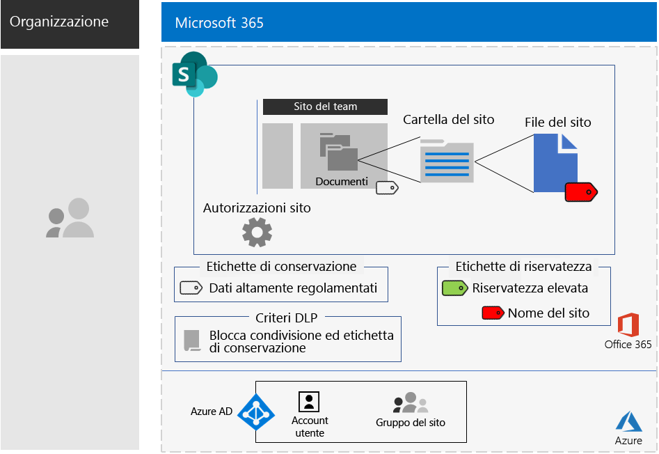

# Siti di SharePoint per dati altamente regolamentati

*Questo scenario si applica alle versioni E3 ed E5 di Microsoft 365 Enterprise*

Microsoft 365 Enterprise include una gamma completa di servizi basati sul cloud, che permettono di creare, archiviare, proteggere e gestire i dati altamente regolamentati archiviati nei file, tra cui quelli:

- Soggetti alle normative internazionali.
- I dati più importanti per l'organizzazione, ad esempio segreti finanziari o informazioni sulle risorse umane e strategia dell'organizzazione.

>[!Note]
> Uno scenario simile che usa Microsoft Teams è disponibile [qui](secure-teams-highly-regulated-data-scenario.md).
>

Affinché una scenario Microsoft 365 Enterprise basata sul cloud soddisfi le esigenze aziendali, è necessario:

- Archiviare i file (documenti, presentazioni, fogli di calcolo e così via) in un sito del team di SharePoint.
- Bloccare il sito per impedire:
  - L'accesso a utenti che non siano membri del gruppo di Office 365 per il sito.
  - I membri del sito dalla concessione dell'accesso ad altri utenti.
  - I non-membri del sito dalla richiesta di accesso al sito.
- Configurare un'etichetta di conservazione di Office 365 per i siti di SharePoint come modo predefinito per impedire agli utenti di inviare file all'esterno dell'organizzazione.
- Crittografare i file più sensibili del sito con crittografia che segue il file.
- Aggiungere autorizzazioni per i file più sensibili, in modo che, anche in caso di condivisione all'esterno del sito, all'apertura vengano richieste le credenziali valide di un account utente autorizzato.

La tabella seguente associa i requisiti di questo scenario a una funzionalità di Microsoft 365 Enterprise.

|||
|:-------|:-----|
| **Requisito** | **Funzionalità di Microsoft 365 Enterprise** |
| Archiviare file | Siti del team di SharePoint |
| Bloccare il sito | Autorizzazioni per gruppi di Office 365 e sito del team di SharePoint |
| Etichettare i file del sito | Etichette di conservazione di Office 365 |
| Bloccare gli utenti quando inviano file all'esterno dell'organizzazione. | Criteri di prevenzione della perdita di dati (DLP) in Office 365 |
| Crittografare tutti i file del sito | Etichette o sottoetichette di riservatezza di Office 365 |
| Aggiungere autorizzazioni ai file del sito | Etichette o sottoetichette di riservatezza di Office 365 |
|||

Ecco una configurazione di esempio per un sito di SharePoint sicuro.

Questo scenario richiede di aver già implementato:

- La fase [Identità](identity-infrastructure.md) e i passaggi 1 e 2 della fase [Protezione delle informazioni](infoprotect-infrastructure.md) dell'infrastruttura di base. 
- [SharePoint](sharepoint-online-onedrive-workload.md).

Le fasi seguenti illustrano come progettare, configurare e facilitare l'adozione dei siti di SharePoint per dati altamente regolamentati.

Per vedere come Contoso Corporation, un'azienda multinazionale fittizia ma rappresentativa, ha progettato un sito di SharePoint per i propri team di ricerca, vedere questo [esempio di configurazione](contoso-sharepoint-online-site-for-highly-confidential-assets.md).

## Prerequisiti di identità e accesso dei dispositivi

Per proteggere l'accesso ai siti di SharePoint, assicurarsi di aver configurato i [criteri di identità e accesso dei dispositivi](identity-access-policies.md) e i [criteri di accesso a SharePoint consigliati](sharepoint-file-access-policies.md).

## Fase 1: progettazione

Per creare un sito di SharePoint per i dati altamente regolamentati, è necessario prima di tutto identificarne lo scopo. Ad esempio, il reparto ricerca e sviluppo di un'azienda del settore manifatturiero ha bisogno di un sito di SharePoint per archiviare le specifiche di progettazione attuali per i prodotti esistenti e come luogo in cui collaborare su nuovi prodotti. Solo i membri del reparto di ricerca e sviluppo e i dirigenti selezionati saranno autorizzati ad accedere al sito.

Questo scopo, ad esempio determinerà l'identificazione di elementi essenziali quali:

- L'etichetta di conservazione di Office 365 da assegnare alla sezione Documenti del sito e i criteri DLP per l'etichetta
- Le impostazioni di una sottoetichetta di riservatezza di Office 365 che gli utenti applicano ai file altamente sensibili archiviati nel sito

Una volta determinate queste impostazioni, usarle per configurare il sito nella Fase 2. 

### Passaggio 1: Etichette di conservazione di Office 365 e criteri DLP

Quando vengono applicate alla sezione Documenti di un sito del team di SharePoint, le etichette di conservazione di Office 365 forniscono un metodo predefinito per classificare tutti i file archiviati nel sito.
 
Per i siti di SharePoint per dati altamente regolamentati, è necessario determinare quale etichetta di conservazione di Office 365 usare.

Per considerazioni sulla progettazione delle etichette di Office 365, vedere [Classificazione ed etichette di Office 365](https://docs.microsoft.com/office365/securitycompliance/secure-sharepoint-online-sites-and-files#office-365-retention-labels).

Per proteggere le informazioni sensibili e prevenirne la divulgazione accidentale o intenzionale, si utilizzano criteri DLP. Per ulteriori informazioni, vedere [Panoramica](https://docs.microsoft.com/office365/securitycompliance/data-loss-prevention-policies).

Per i siti di SharePoint, è necessario configurare un criterio DLP per l'etichetta di conservazione di Office 365 assegnata al sito per bloccare gli utenti quando provano a condividere file con utenti esterni. 

### Passaggio 2: Sottoetichetta di riservatezza di Office 365

Per fornire la crittografia e un set di autorizzazioni per i file più sensibili, gli utenti devono applicare un'etichetta o una sottoetichetta di riservatezza di Office 365. Una sottoetichetta si trova sotto un'etichetta esistente. 

Usare un'etichetta di riservatezza quando è necessario un numero limitato di etichette sia per l'uso globale che per i singoli team privati. Usare una sottoetichetta di riservatezza se si ha un numero elevato di etichette o se si vogliono organizzare le etichette per siti sicuri sotto l'etichetta per i dati altamente regolamentati. 

Le impostazioni dell'etichetta o della sottoetichetta applicata seguono il file. Anche se dovesse uscire dal sito, solo gli account utente autenticati con autorizzazioni adeguate potrebbero aprirlo.

### Risultati della progettazione

È stato determinato quanto segue:

- L'etichetta di conservazione appropriata di Office 365 e il criterio DLP ad essa associato
- Le impostazioni della sottoetichetta di riservatezza di Office 365 che includono crittografia e autorizzazioni

## Fase 2: Configurazione

In questa fase, le impostazioni determinate nella Fase 1 vengono implementate per creare un sito di SharePoint per dati altamente regolamentati.

### Passaggio 1: Creare un sito del team di SharePoint privato con proprietari e membri del gruppo di Office 365 corrispondente

Seguire [queste istruzioni]( https://support.office.com/article/create-a-site-in-sharepoint-online-4d1e11bf-8ddc-499d-b889-2b48d10b1ce8) per creare un sito del team di SharePoint privato.

### Passaggio 2: Configurare altre impostazioni delle autorizzazioni per il sito del team di SharePoint

Nel sito di SharePoint configurare queste impostazioni per le autorizzazioni.

1. Nella barra degli strumenti fare clic sull'icona delle impostazioni, quindi su **Autorizzazioni sito**.
2. Nel riquadro **Autorizzazioni sito** fare clic su **Modifica impostazioni di condivisione** in **Impostazioni di condivisione**.
3. In **Impostazioni di condivisione** scegliere **Solo i proprietari del sito possono condividere file, cartelle e il sito**.
4. Disattivare **Consenti richieste di accesso** e quindi fare clic su **Salva**.

Con queste impostazioni, la possibilità per i membri del gruppo di siti di condividere il sito con altri membri o per i non membri di richiedere l'accesso al sito è disabilitata.

### Passaggio 3: Configurare il sito per un'etichetta di conservazione di Office 365

Attenersi alle istruzioni riportate in [Proteggere i file di SharePoint con le etichette di Office 365 e la prevenzione della perdita dei dati](https://docs.microsoft.com/office365/enterprise/protect-sharepoint-online-files-with-office-365-labels-and-dlp) per:

1. Creare e pubblicare un'etichetta di conservazione per i dati altamente regolamentati, se necessario.
2. Configurare il sito per l'etichetta di conservazione creata nel passaggio 1.
3. Creare un criterio DLP per i dati altamente regolamentati che usi l'etichetta di conservazione creata nel passaggio 2 e impedisca agli utenti di inviare file all'esterno dell'organizzazione

#### Passaggio 4: Creare una sottoetichetta di riservatezza di Office 365 per il sito

Diversamente da un'etichetta di riservatezza per dati altamente regolamentati, che chiunque può applicare a qualsiasi file, un sito sicuro deve avere una propria sottoetichetta, in modo che i file a cui è assegnata la sottoetichetta:

- Siano crittografati e la crittografia segua il file.
- Contengano autorizzazioni personalizzate in modo che solo i membri del gruppo del sito possano aprirli.

Per implementare questo ulteriore livello di sicurezza per i file archiviati nel sito, è necessario configurare una nuova etichetta di riservatezza oppure una sottoetichetta dell'etichetta generale per i file altamente regolamentati. La vedranno solo i membri del gruppo per il sito, nell'elenco di sottoetichette relative all'etichetta per dati altamente regolamentati.

Usare le istruzioni disponibili [qui](https://docs.microsoft.com/microsoft-365/compliance/encryption-sensitivity-labels) per configurare un'etichetta o una sottoetichetta dell'etichetta che si usa per i file altamente regolamentati, con le impostazioni seguenti:

- Il nome dell'etichetta o della sottoetichetta contiene il nome del sito, per semplificare l'associazione quando si assegna l'etichetta o la sottoetichetta a un file.
- La crittografia è abilitata.
- Il gruppo di siti ha autorizzazioni di creazione condivisa.

### Risultati della configurazione

È stato configurato quanto segue:

- Impostazioni di autorizzazione più restrittive nel sito di SharePoint
- Un'etichetta di conservazione di Office 365 assegnata alla sezione Documenti del sito di SharePoint
- Un criterio DLP per l'etichetta di conservazione di Office 365
- Un'etichetta o una sottoetichetta di riservatezza di Office 365 che gli utenti possono applicare ai file più sensibili archiviati nel sito, che crittografa il file e consente solo l'accesso in modalità di creazione condivisa ai membri del gruppo del sito del team 

Ecco la configurazione risultante che usa una sottoetichetta dell'etichetta per dati altamente regolamentati.

Ecco un esempio di un utente che ha applicato la sottoetichetta a un file archiviato nel sito.

## Fase 3: Incoraggiare l'adozione da parte degli utenti

Un sito di SharePoint per dati altamente regolamentati può proteggere tali dati solo se viene usato regolarmente per l'archiviazione e l'accesso ai file sensibili. Questa è la fase più difficile, perché dipende dal cambiamento di abitudini degli utenti. 

Ad esempio, i dipendenti che sono abituati ad archiviare file sensibili in unità USB o soluzioni di archiviazione basate sul cloud personale dovranno ora archiviarli esclusivamente in un sito di SharePoint per dati altamente regolamentati.

### Passaggio 1: formare gli utenti

Dopo aver completato la configurazione, formare gli utenti membri del sito:

- Sull'importanza di usare il nuovo sito per proteggere file preziosi e le conseguenze di una perdita di dati altamente regolamentati, come implicazioni legali, sanzioni per inadempimento alle normative, ransomware o perdita di vantaggi competitivi.
- Come accedere al sito e ai suoi file.
- Come creare nuovi file sul sito e caricare nuovi file memorizzati localmente.
- In che modo i criteri DLP impediscono di condividere i file esternamente.
- Come contrassegnare i file più sensibili con l'etichetta o la sottoetichetta del sito.
- In che modo l'etichetta o la sottoetichetta protegge un file anche se viene diffuso all'esterno del sito.

Questa formazione dovrebbe includere esercizi pratici in modo che gli utenti possano sperimentare queste operazioni e i loro risultati.

### Passaggio 2: Effettuare revisioni periodiche sull'utilizzo e sui file

Nelle settimane successive alla formazione, l'amministratore di SharePoint per il sito di SharePoint può:

- Analizzare l'utilizzo del sito e confrontarlo con le aspettative di utilizzo.
- Verificare che i file altamente sensibili siano stati etichettati correttamente con l'etichetta o la sottoetichetta di riservatezza.

  È possibile vedere i file a cui è assegnata un'etichetta visualizzando una cartella in SharePoint e aggiungendo la colonna **Riservatezza** con l'opzione **Aggiungi colonna** in **Mostra/Nascondi colonne**.

Ripetere la formazione degli utenti se necessario.

### Risultati dell'adozione da parte degli utenti

I file altamente regolamentati vengono archiviati esclusivamente nei siti di SharePoint per dati altamente regolamentati e ai file più sensibili è applicata l'etichetta o la sottoetichetta di riservatezza per il sito.

## Informazioni sulle modalità di distribuzione di Microsoft 365 Enterprise da parte di Contoso Corporation

Contoso Corporation è un conglomerato industriale fittizio ma rappresentativo a livello internazionale. Vedere il modo in cui Contoso ha sviluppato, configurato e quindi ha guidato l'adozione di un [sito di SharePoint protetto](contoso-sharepoint-online-site-for-highly-confidential-assets.md) per i team di ricerca a Parigi, Mosca, New York, Pechino e Bengaluru. 

## Vedere anche

[Teams per dati altamente regolamentati](secure-teams-highly-regulated-data-scenario.md)

[Carichi di lavoro e scenari di Microsoft 365 Enterprise](deploy-workloads.md)

[Raccolta di produttività di Microsoft 365](https://aka.ms/productivitylibrary)https://aka.ms/productivitylibrary)

[Guida alla distribuzione](deploy-microsoft-365-enterprise.md)
