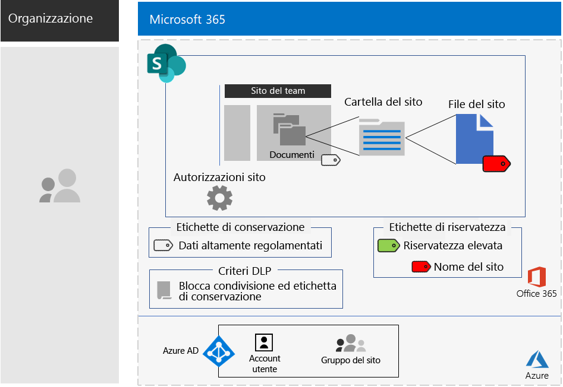

# Siti di SharePoint per dati altamente regolamentatiSharePoint sites for highly regulated data

*Questo scenario si applica alle versioni E3 ed E5 di Microsoft 365 Enterprise**This scenario applies to both the E3 and E5 versions of Microsoft 365 Enterprise*

Microsoft 365 Enterprise include una gamma completa di servizi basati sul cloud, che permettono di creare, archiviare, proteggere e gestire i dati altamente regolamentati archiviati nei file, tra cui quelli:Microsoft 365 Enterprise includes a full suite of cloud-based services so that you can create, store, secure, and manage your highly regulated data stored in files. This includes data that is:

- Soggetti alle normative internazionali.Subject to regional regulations.
- I dati più importanti per l'organizzazione, ad esempio segreti finanziari o informazioni sulle risorse umane e strategia dell'organizzazione.The most valuable data for your organization, such as trade secrets, financial or human resources information, and organization strategy.

>[!Note]
> Uno scenario simile che usa Microsoft Teams è disponibile [qui](secure-teams-highly-regulated-data-scenario.md).A similar scenario using Microsoft Teams is [here](secure-teams-highly-regulated-data-scenario.md).
>

Affinché una scenario Microsoft 365 Enterprise basata sul cloud soddisfi le esigenze aziendali, è necessario:A Microsoft 365 Enterprise cloud-based scenario that meets this business need requires that you:

- Archiviare i file (documenti, presentazioni, fogli di calcolo e così via) in un sito del team di SharePoint.Store files (documents, slide decks, spreadsheets, etc.) in a SharePoint team site.
- Bloccare il sito per impedire:Lock down the site to prevent:
  - Accesso per gli utenti che non sono membri del gruppo di Microsoft 365 per il sito.Access to users who are not members of the Microsoft 365 group for the site.
  - I membri del sito dalla concessione dell'accesso ad altri utenti.Members of the site from granting access to others.
  - I non-membri del sito dalla richiesta di accesso al sito.Non-members of the site from requesting access to the site.
- Configurare un'etichetta di conservazione per i siti di SharePoint come metodo predefinito per impedire agli utenti di inviare file all'esterno dell'organizzazione.Configure a retention label for your SharePoint sites as a default way to block users from sending files outside the organization.
- Crittografare i file più sensibili del sito con crittografia che segue il file.Encrypt the most sensitive files of the site with encryption that travels with the file.
- Aggiungere autorizzazioni per i file più sensibili, in modo che, anche in caso di condivisione all'esterno del sito, all'apertura vengano richieste le credenziali valide di un account utente autorizzato.Add permissions to the most sensitive files so that if even if they get shared outside of the site, opening the file still requires the valid credentials of a user account that has permission.

La tabella seguente associa i requisiti di questo scenario a una funzionalità di Microsoft 365 Enterprise.The following table maps the requirements of this scenario to a feature of Microsoft 365 Enterprise.

|||
|:-------|:-----|
| **Requisito****Requirement** | **Funzionalità di Microsoft 365 Enterprise****Microsoft 365 Enterprise feature** |
| Archiviare fileStore files | Siti del team di SharePointSharePoint team sites |
| Bloccare il sitoLock down the site | Autorizzazioni per i gruppi di Microsoft 365 e il sito del team di SharePointMicrosoft 365 groups and SharePoint team site permissions |
| Etichettare i file del sitoLabel the files of the site | Etichette di conservazione di Microsoft 365Microsoft 365 retention labels |
| Bloccare gli utenti quando inviano file all'esterno dell'organizzazione.Block users when sending files outside the organization | Criteri di prevenzione perdita dati (DLP)Data Loss Prevention (DLP) policies |
| Crittografare tutti i file del sitoEncrypt all of the files of the site | Etichette o etichette secondarie di riservatezza di Microsoft 365Microsoft 365 sensitivity labels or sublabels |
| Aggiungere autorizzazioni ai file del sitoAdd permissions to the files of the site | Etichette o etichette secondarie di riservatezza di Microsoft 365Microsoft 365 sensitivity labels or sublabels |
|||

Ecco una configurazione di esempio per un sito di SharePoint sicuro.Here is an example configuration for a secure SharePoint site.

Questo scenario richiede di aver già implementato:This scenario requires that you have already deployed:

- La fase [Identità](identity-infrastructure.md) e i passaggi 1 e 2 della fase [Protezione delle informazioni](infoprotect-infrastructure.md) dell'infrastruttura di base.The [Identity](identity-infrastructure.md) phase and steps 1 and 2 of the [Information protection](infoprotect-infrastructure.md) phase of the foundation infrastructure. 
- [SharePoint](sharepoint-online-onedrive-workload.md).[SharePoint](sharepoint-online-onedrive-workload.md).

Le fasi seguenti illustrano come progettare, configurare e facilitare l'adozione dei siti di SharePoint per dati altamente regolamentati.The following phases step you through designing, configuring, and driving adoption for SharePoint sites for highly regulated data.

 Per un riepilogo di una pagina per questo scenario, vedere il [poster Siti di SharePoint per dati altamente regolamentati](../media/teams-sharepoint-online-sites-highly-regulated-data/SharePointSitesHighlyRegulatedData.pdf).For a 1-page summary of this scenario, see the [SharePoint sites for highly regulated data poster](../media/teams-sharepoint-online-sites-highly-regulated-data/SharePointSitesHighlyRegulatedData.pdf).

È anche possibile scaricare il poster in formato [PDF](https://github.com/MicrosoftDocs/microsoft-365-docs/raw/public/microsoft-365/media/teams-sharepoint-online-sites-highly-regulated-data/SharePointSitesHighlyRegulatedData.pdf) o [PowerPoint](https://github.com/MicrosoftDocs/microsoft-365-docs/raw/public/microsoft-365/media/teams-sharepoint-online-sites-highly-regulated-data/SharePoint-Sites-Highly-Regulated-Data.pptx) e stamparlo in formato lettera, legale o tabloid (27,9 x 43,2 cm).You can also download this poster in [PDF](https://github.com/MicrosoftDocs/microsoft-365-docs/raw/public/microsoft-365/media/teams-sharepoint-online-sites-highly-regulated-data/SharePointSitesHighlyRegulatedData.pdf) or [PowerPoint](https://github.com/MicrosoftDocs/microsoft-365-docs/raw/public/microsoft-365/media/teams-sharepoint-online-sites-highly-regulated-data/SharePoint-Sites-Highly-Regulated-Data.pptx) formats and print it on letter, legal, or tabloid (11 x 17)-sized paper.

## Prerequisiti di identità e accesso dei dispositiviIdentity and device access prerequisites

Per proteggere l'accesso ai siti di SharePoint, assicurarsi di aver configurato i [criteri di identità e accesso dei dispositivi](identity-access-policies.md) e i [criteri di accesso a SharePoint consigliati](sharepoint-file-access-policies.md).To protect access to the SharePoint site, ensure that you have configured [identity and device access policies](identity-access-policies.md) and the [recommended SharePoint access policies](sharepoint-file-access-policies.md).

## Fase 1: progettazionePhase 1: Design

Per creare un sito di SharePoint per i dati altamente regolamentati, è necessario prima di tutto identificarne lo scopo.To create a SharePoint site for highly regulated data, you must first identify its purpose. Ad esempio, il reparto ricerca e sviluppo di un'azienda del settore manifatturiero ha bisogno di un sito di SharePoint per archiviare le specifiche di progettazione attuali per i prodotti esistenti e come luogo in cui collaborare su nuovi prodotti.For example, the research and development department of a manufacturing organization needs a SharePoint site to store current design specifications for existing products and a place to collaborate on new products. Solo i membri del reparto di ricerca e sviluppo e i dirigenti selezionati saranno autorizzati ad accedere al sito.Only members of the Research & Development department and selected executives will be allowed to access the site.

Questo scopo, ad esempio determinerà l'identificazione di elementi essenziali quali:That purpose will drive the determination of essential configuration items such as:

- L'etichetta di conservazione da assegnare alla sezione Documenti del sito e i criteri DLP per l'etichettaThe retention label to assign to the Documents portion of the site and DLP policies for the label
- Le impostazioni di una etichetta secondaria di riservatezza che gli utenti applicano ai file altamente sensibili archiviati nel sitoThe settings of a sensitivity sublabel that users apply to highly sensitive files stored in the site

Una volta determinate queste impostazioni, usarle per configurare il sito nella Fase 2.Once determined, you use these settings to configure the site in Phase 2. 

### Passaggio 1: criteri DLP ed etichette di conservazione di Microsoft 365Step 1 Microsoft 365 retention labels and DLP policies

Quando vengono applicate alla sezione Documenti di un sito del team di SharePoint, le etichette di conservazione forniscono un metodo predefinito per classificare tutti i file archiviati nel sito.When applied to the Documents portion of a SharePoint team site, retention labels provide a default method of classifying all files stored on the site.
 
Per i siti di SharePoint per dati altamente regolamentati, è necessario determinare quale etichetta di conservazione usare.For SharePoint sites for highly regulated data, you need to determine which retention label to use.

Per considerazioni sulla progettazione delle etichette, vedere [Classificazione ed etichette di Microsoft 365](https://docs.microsoft.com/office365/securitycompliance/secure-sharepoint-online-sites-and-files#office-365-retention-labels).For the design considerations of labels, see [Microsoft 365 classification and labels](https://docs.microsoft.com/office365/securitycompliance/secure-sharepoint-online-sites-and-files#office-365-retention-labels).

Per proteggere le informazioni sensibili e prevenirne la divulgazione accidentale o intenzionale, si utilizzano criteri DLP. Per ulteriori informazioni, vedere [Panoramica](https://docs.microsoft.com/office365/securitycompliance/data-loss-prevention-policies).To protect sensitive information and prevent its accidental or intentional disclosure, you use DLP policies. For more information, see this [overview](https://docs.microsoft.com/office365/securitycompliance/data-loss-prevention-policies).

Per i siti di SharePoint, è necessario configurare un criterio DLP per l'etichetta di conservazione assegnata al sito in modo da bloccare gli utenti quando provano a condividere file con utenti esterni.For SharePoint sites, you must configure a DLP policy for the retention label assigned to the site to block users when they attempt to share files with external users. 

### Passaggio 2: l'etichetta secondaria di riservatezza di Microsoft 365Step 2: Your Microsoft 365 sensitivity sublabel

Per fornire la crittografia e un set di autorizzazioni per i file più sensibili, gli utenti devono applicare un'etichetta o un'etichetta secondaria di riservatezza.To provide encryption and a set of permissions to your most sensitive files, users must apply a sensitivity label or sublabel. Una sottoetichetta si trova sotto un'etichetta esistente.A sublabel exists under an existing label. 

Usare un'etichetta di riservatezza quando è necessario un numero limitato di etichette sia per l'uso globale che per i singoli team privati.Use a sensitivity label when you need is a small number of labels for both global use and individual private teams. Usare una sottoetichetta di riservatezza se si ha un numero elevato di etichette o se si vogliono organizzare le etichette per siti sicuri sotto l'etichetta per i dati altamente regolamentati.Use a sensitivity sublabel when you have a large number of labels or want to organize labels for secure sites the under your highly regulated label. 

Le impostazioni dell'etichetta o della sottoetichetta applicata seguono il file.The settings of the applied label or sublabel travel with the file. Anche se dovesse uscire dal sito, solo gli account utente autenticati con autorizzazioni adeguate potrebbero aprirlo.Even if it is leaked outside the site, only authenticated user accounts that have permissions can open it.

### Risultati della progettazioneDesign results

È stato determinato quanto segue:You have determined the following:

- L'etichetta di conservazione appropriata e il criterio DLP associatoThe appropriate retention label and the DLP policy that is associated with the label
- Le impostazioni delle etichette secondarie di riservatezza che includono crittografia e autorizzazioniThe settings of the sensitivity sublabel that include encryption and permissions

## Fase 2: ConfigurazionePhase 2: Configure

In questa fase, le impostazioni determinate nella Fase 1 vengono implementate per creare un sito di SharePoint per dati altamente regolamentati.In this phase, you take the settings determined in Phase 1 and implement them to create a SharePoint site for highly regulated data.

### Passaggio 1: creare un sito del team di SharePoint privato con proprietari e membri del gruppo di Microsoft 365 corrispondenteStep 1: Create a private SharePoint team site with owners and members of the corresponding Microsoft 365 group

Seguire [queste istruzioni]( https://support.office.com/article/create-a-site-in-sharepoint-online-4d1e11bf-8ddc-499d-b889-2b48d10b1ce8) per creare un sito del team di SharePoint privato.Follow [these instructions]( https://support.office.com/article/create-a-site-in-sharepoint-online-4d1e11bf-8ddc-499d-b889-2b48d10b1ce8) to create a private SharePoint team site.

### Passaggio 2: Configurare altre impostazioni delle autorizzazioni per il sito del team di SharePointStep 2: Configure additional permissions settings for the SharePoint team site

Nel sito di SharePoint configurare queste impostazioni per le autorizzazioni.From the SharePoint site, configure these permission settings.

1. Nella barra degli strumenti fare clic sull'icona delle impostazioni, quindi su **Autorizzazioni sito**.In the tool bar, click the settings icon, and then click **Site permissions**.
2. Nel riquadro **Autorizzazioni sito** fare clic su **Modifica impostazioni di condivisione** in **Impostazioni di condivisione**.In the **Site permissions** pane, under **Sharing Settings**, click **Change sharing settings**.
3. In **Impostazioni di condivisione** scegliere **Solo i proprietari del sito possono condividere file, cartelle e il sito**.Under **Sharing permissions**, choose **Only site owners can share files, folders, and the site**.
4. Disattivare **Consenti richieste di accesso** e quindi fare clic su **Salva**.Turn off **Allow access requests**, and then click **Save**.

Con queste impostazioni, la possibilità per i membri del gruppo di siti di condividere il sito con altri membri o per i non membri di richiedere l'accesso al sito è disabilitata.With these settings, the ability for site group members to share the site with other members or for non-members to request access to the site is disabled.

### Passaggio 3: configurare il sito per un'etichetta di conservazioneStep 3: Configure the site for a retention label

Attenersi alle istruzioni riportate in [Proteggere i file di SharePoint con le etichette e la prevenzione della perdita dei dati](https://docs.microsoft.com/office365/enterprise/protect-sharepoint-online-files-with-office-365-labels-and-dlp) per:Use the instructions in [Protect SharePoint files with labels and DLP](https://docs.microsoft.com/office365/enterprise/protect-sharepoint-online-files-with-office-365-labels-and-dlp) to:

1. Creare e pubblicare un'etichetta di conservazione per i dati altamente regolamentati, se necessario.Create and publish a retention label for highly regulated data (if needed).
2. Configurare il sito per l'etichetta di conservazione creata nel passaggio 1.Configure the site for the retention label created in step 1.
3. Creare un criterio DLP per i dati altamente regolamentati che usi l'etichetta di conservazione creata nel passaggio 2 e impedisca agli utenti di inviare file all'esterno dell'organizzazioneCreate a DLP policy for highly regulated data that uses the retention label created in step 2 and blocks users from sending files outside the organization

#### Passaggio 4: creare un'etichetta secondaria di riservatezza per il sitoStep 4: Create a sensitivity sublabel for the site

Diversamente da un'etichetta di riservatezza per dati altamente regolamentati, che chiunque può applicare a qualsiasi file, un sito sicuro deve avere una propria sottoetichetta, in modo che i file a cui è assegnata la sottoetichetta:Unlike a sensitivity label for highly regulated data that anyone can apply to any file, a secure site needs its own sublabel so that files with the sublabel assigned:

- Siano crittografati e la crittografia segua il file.Are encrypted and the encryption travels with the file.
- Contengano autorizzazioni personalizzate in modo che solo i membri del gruppo del sito possano aprirli.Contain custom permissions so that only members of the site group can open it.

Per implementare questo ulteriore livello di sicurezza per i file archiviati nel sito, è necessario configurare una nuova etichetta di riservatezza oppure una sottoetichetta dell'etichetta generale per i file altamente regolamentati.To accomplish this additional level of security for files stored in the site, you must configure a new sensitivity label or a sublabel of the general label for highly regulated files. La vedranno solo i membri del gruppo per il sito, nell'elenco di sottoetichette relative all'etichetta per dati altamente regolamentati.Only group members for the site will see it in the list of sublabels for the highly regulated label.

Usare le istruzioni disponibili [qui](https://docs.microsoft.com/microsoft-365/compliance/encryption-sensitivity-labels) per configurare un'etichetta o una sottoetichetta dell'etichetta che si usa per i file altamente regolamentati, con le impostazioni seguenti:Use the instructions [here](https://docs.microsoft.com/microsoft-365/compliance/encryption-sensitivity-labels) to configure a label or a sublabel of the label you are using for highly regulated files with the following settings:

- Il nome dell'etichetta o della sottoetichetta contiene il nome del sito, per semplificare l'associazione quando si assegna l'etichetta o la sottoetichetta a un file.The name of the label or sublabel contains the name of the site for easy association when assigning the label or sublabel to a file.
- La crittografia è abilitata.Encryption is enabled.
- Il gruppo di siti ha autorizzazioni di creazione condivisa.The site group has Co-Author permissions.

### Risultati della configurazioneConfiguration results

È stato configurato quanto segue:You have configured the following:

- Impostazioni di autorizzazione più restrittive nel sito di SharePointMore restrictive permission settings on the SharePoint site
- Un'etichetta di conservazione assegnata alla sezione Documenti del sito di SharePointA retention label assigned to the Documents portion of the SharePoint site
- Un criterio DLP per l'etichetta di conservazioneA DLP policy for the retention label
- Un'etichetta o un'etichetta secondaria di riservatezza che gli utenti possono applicare ai file più sensibili archiviati nel sito, che crittografa il file e consente solo l'accesso in modalità di creazione condivisa ai membri del gruppo del sito del teamA sensitivity label or sublabel that users can apply to the most sensitive files stored in the site, which encrypts the file and only allows Co-Author access for members of the team site group 

Ecco la configurazione risultante che usa una sottoetichetta dell'etichetta per dati altamente regolamentati.Here is the resulting configuration that uses a sublabel of the Highly regulated label.

Ecco un esempio di un utente che ha applicato la sottoetichetta a un file archiviato nel sito.Here is an example of a user that has applied the sublabel to a file stored in the site.

## Fase 3: Incoraggiare l'adozione da parte degli utentiPhase 3: Drive user adoption

Un sito di SharePoint per dati altamente regolamentati può proteggere tali dati solo se viene usato regolarmente per l'archiviazione e l'accesso ai file sensibili.A SharePoint site for highly regulated data can only protect that data if it is consistently used for storage and access of sensitive files. Questa è la fase più difficile, perché dipende dal cambiamento di abitudini degli utenti.This is the hardest phase because it relies on users changing their habits and preferences. 

Ad esempio, i dipendenti che sono abituati ad archiviare file sensibili in unità USB o soluzioni di archiviazione basate sul cloud personale dovranno ora archiviarli esclusivamente in un sito di SharePoint per dati altamente regolamentati.For example, employees that are used to storing sensitive files on USB drives or on personal cloud-based storage solutions will now have to store them exclusively in a SharePoint site for highly regulated data.

### Passaggio 1: formare gli utentiStep 1: Train your users

Dopo aver completato la configurazione, formare gli utenti membri del sito:After completing your configuration, train the set of users who are members of the site:

- Sull'importanza di usare il nuovo sito per proteggere file preziosi e le conseguenze di una perdita di dati altamente regolamentati, come implicazioni legali, sanzioni per inadempimento alle normative, ransomware o perdita di vantaggi competitivi.On the importance of using the new site to protect valuable files and the consequences of a highly regulated data leak, such as legal ramifications, regulatory fines, ransomware, or loss of competitive advantage.
- Come accedere al sito e ai suoi file.How to access the site and its files.
- Come creare nuovi file sul sito e caricare nuovi file memorizzati localmente.How to create new files on the site and upload new files stored locally.
- In che modo i criteri DLP impediscono di condividere i file esternamente.How the DLP policy blocks them from sharing files externally.
- Come contrassegnare i file più sensibili con l'etichetta o la sottoetichetta del sito.How to label the most sensitive files with the label or sublabel for the site.
- In che modo l'etichetta o la sottoetichetta protegge un file anche se viene diffuso all'esterno del sito.How the label or sublabel protects a file even when it is leaked off the site.

Questa formazione dovrebbe includere esercizi pratici in modo che gli utenti possano sperimentare queste operazioni e i loro risultati.This training should include hands-on exercises so that the users can experience these operations and their results.

### Passaggio 2: Effettuare revisioni periodiche sull'utilizzo e sui fileStep 2: Conduct periodic reviews of usage and files

Nelle settimane successive alla formazione, l'amministratore di SharePoint per il sito di SharePoint può:In the weeks after training, the SharePoint administrator for the SharePoint site can:

- Analizzare l'utilizzo del sito e confrontarlo con le aspettative di utilizzo.Analyze usage for the site and compare it with usage expectations.
- Verificare che i file altamente sensibili siano stati etichettati correttamente con l'etichetta o la sottoetichetta di riservatezza.Verify that highly sensitive files have been properly labeled with the sensitivity label or sublabel.

  È possibile vedere i file a cui è assegnata un'etichetta visualizzando una cartella in SharePoint e aggiungendo la colonna **Riservatezza** con l'opzione **Aggiungi colonna** in **Mostra/Nascondi colonne**.You can see which files have a label assigned by viewing a folder in SharePoint and adding the **Sensitivity** column through the **Show/hide columns** option of **Add column**.

Ripetere la formazione degli utenti se necessario.Retrain your users as needed.

### Risultati dell'adozione da parte degli utentiUser adoption results

I file altamente regolamentati vengono archiviati esclusivamente nei siti di SharePoint per dati altamente regolamentati e ai file più sensibili è applicata l'etichetta o la sottoetichetta di riservatezza per il sito.Highly regulated files are stored exclusively on SharePoint sites for highly regulated data and the most sensitive files have the sensitivity label or sublabel for the site applied.

## Utilizzo di un sito di SharePoint per dati altamente regolamentatiHow the Contoso Corporation used a SharePoint site for highly regulated data

Contoso Corporation è un conglomerato industriale fittizio ma rappresentativo a livello internazionale.The Contoso Corporation is a fictional but representative global manufacturing conglomerate. Vedere il modo in cui Contoso ha sviluppato, configurato e quindi ha guidato l'adozione di un [sito di SharePoint protetto](contoso-sharepoint-online-site-for-highly-confidential-assets.md) per i team di ricerca a Parigi, Mosca, New York, Pechino e Bengaluru.See how Contoso designed, configured, and then drove the adoption of a [secure SharePoint site](contoso-sharepoint-online-site-for-highly-confidential-assets.md) for their research teams in Paris, Moscow, New York, Beijing, and Bangalore. 

## Vedere ancheSee also

[Teams per dati altamente regolamentatiTeams for highly regulated data](secure-teams-highly-regulated-data-scenario.md)

[Carichi di lavoro e scenari di Microsoft 365 EnterpriseMicrosoft 365 Enterprise workloads and scenarios](deploy-workloads.md)

[Raccolta di produttività di Microsoft 365](https://aka.ms/productivitylibrary)https://aka.ms/productivitylibrary)[Microsoft 365 Productivity Library](https://aka.ms/productivitylibrary) (https://aka.ms/productivitylibrary)

[Guida alla distribuzioneDeployment guide](deploy-microsoft-365-enterprise.md)
