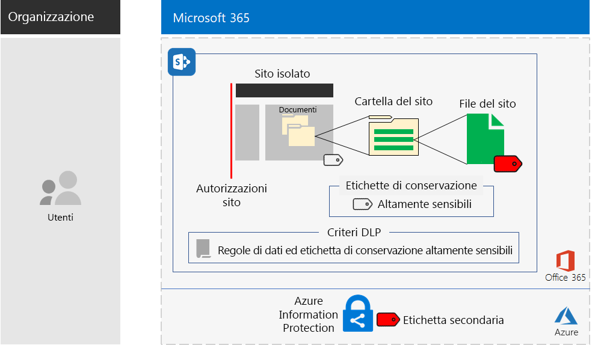
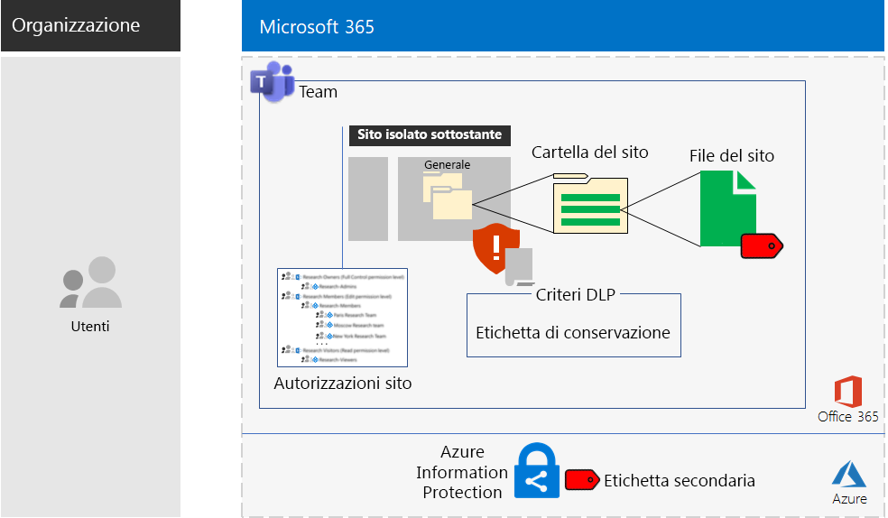

# Siti Microsoft Teams e SharePoint Online per dati altamente riservatiMicrosoft Teams and SharePoint Online sites for highly regulated data

*Questo scenario si applica alle versioni E3 ed E5 di Microsoft 365 Enterprise**This scenario applies to both the E3 and E5 versions of Microsoft 365 Enterprise*

Poiché Microsoft 365 Enterprise include una gamma completa di servizi basati sul cloud, è possibile creare, archiviare e proteggere i dati altamente riservati, tra cui quelli:Microsoft 365 Enterprise includes a full suite of cloud-based services so that you can create, store, and secure your highly regulated data. This includes data that is:

- Soggetti alle normative internazionali.Subject to regional regulations.
- I dati più importanti per l'organizzazione, ad esempio segreti finanziari o informazioni sulle risorse umane e strategia dell'organizzazione.The most valuable data for your organization, such as trade secrets, financial or human resources information, and organization strategy.

Affinché una scenario Microsoft 365 Enterprise basata sul cloud soddisfi le esigenze aziendali, è necessario:A Microsoft 365 Enterprise cloud-based solution that meets this business need requires that you:

- Memorizzare asset digitali, quali documenti, presentazioni, fogli di calcolo e così via, in un sito di SharePoint Online o nella scheda **File** di un team di Microsoft Teams.Store digital assets (documents, slide decks, spreadsheets, etc.) in a SharePoint Online team site or in the **Files** tab of a Microsoft Teams team.
- Bloccare i siti del team per evitare che:Lock down the site or team to prevent:
   - Si acceda solo a un set specifico di account utente tramite l'appartenenza al gruppo, che include gli utenti che possono accedere al sito del team di SharePoint Online con relativo livello di autorizzazione e gli utenti che possono gestirlo.Access to only a specific set of user accounts through group membership, which includes those who can access the SharePoint Online team site and at what level of permission, and those who can administer it.
   - I membri del sito dalla concessione dell'accesso ad altri utenti.Members of the site from granting access to others.
   - I non-membri del sito dalla richiesta di accesso al sito.Non-members of the site from requesting access to the site.
- Configurare un'etichetta di conservazione di Office 365 per i siti o i team di SharePoint Online come metodo predefinito per definire i criteri di conservazione dei documenti nel sito o nel team.Configure an Office 365 retention label for your SharePoint Online sites or teams as a default way to define retention policies on the documents in the site or team.
- Bloccare l'invio di file all'esterno dell'organizzazione da parte degli utenti.Block users from sending files outside the organization.
- Crittografare gli asset digitali più riservati del sito o del team.Encrypt the most sensitive digital assets of the site or team.
- Aggiungere autorizzazioni per gli asset digitali più riservati, in modo che, anche in caso di condivisione all'esterno del sito, all'apertura vengano richieste le credenziali di un account utente che dispone dell'autorizzazione.Add permissions to the most sensitive digital assets so that if even if they get shared outside of the site, opening the asset still requires the valid credentials of a user account that has permission.

La tabella seguente associa i requisiti di questo scenario a una funzionalità di Microsoft 365 Enterprise.The following table maps the requirements of this solution to a feature of Microsoft 365 Enterprise.

|||
|:-------|:-----|
| **Requisito****Requirement** | **Funzionalità di Microsoft 365 Enterprise****Microsoft 365 Enterprise feature** |
| Memorizzare gli asset digitaliStore digital assets | Siti del team di SharePoint Online e team di Office 365SharePoint Online team sites and teams in Office 365 |
| Bloccare il sitoLock down the site | Autorizzazioni gruppi di Azure AD e sito del team di SharePoint OnlineAzure AD groups and SharePoint Online team site permissions |
| Assegnare un'etichetta agli asset digitali del sitoLabel the digital assets of the site | Etichette di conservazione di Office 365Office 365 retention labels |
| Bloccare gli utenti quando inviano file all'esterno dell'organizzazione.Block users when sending files outside the organization | Criteri di prevenzione della perdita di dati (DLP) in Office 365Data Loss Prevention (DLP) policies in Office 365 |
| Crittografare tutti gli asset digitali del sitoEncrypt all of the digital assets of the site | Etichette secondarie di Azure Information Protection in Enterprise Mobility + Security (EMS)Azure Information Protection sub-labels in Enterprise Mobility + Security (EMS) |
| Aggiungere autorizzazioni a tutti gli asset digitali del sitoAdd permissions to the digital assets of the site | Etichette secondarie di Azure Information Protection in EMSAzure Information Protection sub-labels in EMS |
|||

Ecco la configurazione per un sito di SharePoint Online.Here is the configuration for a SharePoint Online site.

Questo scenario richiede di aver già implementato:This solution requires that you have already deployed:

- La fase [Identità](identity-infrastructure.md) e i passaggi 1 e 2 della fase [Protezione delle informazioni](infoprotect-infrastructure.md) dell'infrastruttura di base.The [Identity](identity-infrastructure.md) phase and steps 1 and 2 of the [Information protection](infoprotect-infrastructure.md) phase of the foundation infrastructure. 
- [SharePoint Online](sharepoint-online-onedrive-workload.md) per i dati altamente riservati nei siti del team di SharePoint Online.For highly regulated data in SharePoint Online team sites, [SharePoint Online](sharepoint-online-onedrive-workload.md).
- [Microsoft Teams](teams-workload.md), per i dati altamente riservati nei team di Microsoft Teams.For highly regulated data in Microsoft Teams teams, [Microsoft Teams](teams-workload.md).

Le fasi seguenti illustrano la progettazione, la configurazione e l'adozione dei siti e dei team di SharePoint Online per dati altamente riservati.The following phases step you through the design, configuration, and driving adoption for SharePoint Online sites and teams for highly regulated data.

Per vedere come Contoso Corporation, un'azienda multinazionale fittizia ma rappresentativa, ha progettato un sito di SharePoint Online per i propri team di ricerca, vedere questo [esempio di configurazione](contoso-sharepoint-online-site-for-highly-confidential-assets.md).To see how the Contoso Corporation, a fictional but representative multi-national organization, designed a SharePoint Online site for its research teams, see this [example configuration](contoso-sharepoint-online-site-for-highly-confidential-assets.md).

Un team con dati altamente riservati richiede che venga creato un sito del team di SharePoint Online per dati altamente riservati. Quindi si crea un nuovo team che utilizza il gruppo Office 365 del sito del team di SharePoint Online. Vedere Fase 2, Passaggio 4 per maggiori informazioni.A team for highly regulated data requires that you first create a SharePoint Online team site for highly regulated data. You then create a new team that uses the Office 365 group of the SharePoint Online team site. See Phase 2, Step 4 for more information.

Ecco la configurazione per un team.Here is the configuration for a team.

## Prerequisiti di identità e accesso dei dispositiviIdentity and device access prerequisites

Per proteggere l'accesso al team o al sito di SharePoint Online, assicurarsi di aver configurato i [criteri di identità e accesso dei dispositivi](identity-access-policies.md) e i [criteri di accesso a SharePoint Online consigliati](sharepoint-file-access-policies.md).To protect access to the team or SharePoint Online site, ensure that you have configured [identity and device access policies](identity-access-policies.md) and the [recommended SharePoint Online access policies](sharepoint-file-access-policies.md).

## Fase 1: progettazionePhase 1: Design

Per creare un sito o un team di SharePoint Online per dati altamente riservati, è necessario innanzitutto identificarne lo scopo. Ad esempio, il reparto di ricerca e sviluppo di un'organizzazione di produzione ha bisogno di un sito di SharePoint Online per archiviare le specifiche di progettazione attuali per i prodotti esistenti e un luogo in cui collaborare su nuovi prodotti. Solo i membri del reparto di ricerca e sviluppo e i dirigenti selezionati saranno autorizzati ad accedere al sito.To create a SharePoint Online site or team for highly regulated data, you must first identify its purpose. For example, the research and development department of a manufacturing organization needs a SharePoint Online site to store current design specifications for existing products and a place to collaborate on new products. Only members of the Research & Development department and selected executives will be allowed to access the site.

Questo scopo, ad esempio determinerà l'identificazione di elementi essenziali quali:That purpose will drive the determination of essential configuration items such as:

- L'insieme dei set di autorizzazione di SharePoint Online e i gruppi di SharePointThe set of SharePoint Online permission sets and SharePoint groups
- L'insieme dei gruppi di accesso, i gruppi di sicurezza di Azure AD e i membri da aggiungere ai gruppi di SharePointThe set of access groups, the Azure AD security groups and their members to add to the SharePoint groups
- L'etichetta di conservazione di Office 365 da assegnare al sito e il set di criteri DLP per l'etichettaThe Office 365 retention label to assign to the site and the set of DLP policies for the label
- Le impostazioni di un'etichetta secondaria di Azure Information Protection che gli utenti applicano agli asset digitali altamente riservati archiviati nel sitoThe settings of an Azure Information Protection sub-label that users apply to highly sensitive digital assets stored in the site

Una volta determinate queste impostazioni, utilizzarle per configurare il sito nella Fase 2.Once determined, you use these settings to configure the site in Phase 2. 

### Passaggio 1: Sito di SharePoint Online isolatoStep 1: An isolated SharePoint Online site

La versione bloccata di un sito del team di SharePoint Online è nota come sito isolato. A differenza delle impostazioni predefinite dei siti dei team privati, i siti isolati sono configurati per impedire:The locked-down version of a SharePoint Online team site is known as an isolated site. Unlike the default settings of private team sites, isolated sites are configured to prevent:

- L'accesso agli utenti che non sono membri di gruppi specifici.Access to those who are not members of specified groups.
- La richiesta di accesso.The requesting of access.
- La concessione non autorizzata di accesso da parte di membri correnti di gruppi specifici.The unauthorized granting of access by current members of specified groups.
- L'amministrazione del sito da parte dei membri del gruppo di accesso.Administration of the site by access group members.

La sicurezza dei siti del team di SharePoint Online che contengono asset altamente riservati non cambia a meno che la modifica non venga apportata da un amministratore di SharePoint per il sito.The security of SharePoint Online team sites that contain highly regulated assets do not change unless done by a SharePoint administrator for the site.

Vedere [Progettare un sito del team di SharePoint Online isolato](https://docs.microsoft.com/office365/enterprise/design-an-isolated-sharepoint-online-team-site) per avere dettagli su come determinare il set di livelli di autorizzazione, gruppi di SharePoint, gruppi di accesso e membri del gruppo.See [Design an isolated SharePoint Online team site](https://docs.microsoft.com/office365/enterprise/design-an-isolated-sharepoint-online-team-site) for the details to determine the set of permission levels, SharePoint groups, access groups, and group members.

### Passaggio 2: Etichette di conservazione di Office 365 e criteri DLPStep 2: Office 365 retention labels and DLP policies

Quando vengono applicate a un sito del team di SharePoint Online, le etichette di conservazione di Office 365 forniscono un metodo predefinito per classificare tutti gli asset digitali archiviati nel sito.When applied to a SharePoint Online team site, Office 365 retention labels provide a default method of classifying all digital assets stored on the site.
 
Per i siti di SharePoint Online per dati altamente riservati, è necessario determinare quale etichetta di conservazione di Office 365 usare.For SharePoint Online sites for highly regulated data, you need to determine which Office 365 retention label to use.

Per considerazioni sulla progettazione delle etichette di Office 365, vedere [Classificazione ed etichette di Office 365](https://docs.microsoft.com/office365/securitycompliance/secure-sharepoint-online-sites-and-files#office-365-retention-labels).For the design considerations of Office 365 labels, see [Office 365 classification and labels](https://docs.microsoft.com/office365/securitycompliance/secure-sharepoint-online-sites-and-files#office-365-retention-labels).

Per proteggere le informazioni sensibili e prevenirne la divulgazione accidentale o intenzionale, si utilizzano criteri DLP. Per ulteriori informazioni, vedere [Panoramica](https://docs.microsoft.com/office365/securitycompliance/data-loss-prevention-policies).To protect sensitive information and prevent its accidental or intentional disclosure, you use DLP policies. For more information, see this [overview](https://docs.microsoft.com/office365/securitycompliance/data-loss-prevention-policies).

Per i siti di SharePoint Online per dati altamente riservati, è necessario configurare un criterio DLP per l'etichetta di conservazione di Office 365 assegnata al sito per bloccare gli utenti quando tentano di condividere asset digitali con utenti esterni.For SharePoint Online sites for highly regulated data, you must configure a DLP policy for the Office 365 retention label assigned to the site to block users when they attempt to share digital assets with external users. 

### Passaggio 3: Etichette secondarie di Azure Information ProtectionStep 3: Your Azure Information Protection sub-label

Per fornire la crittografia e un set di autorizzazioni per gli asset digitali più sensibili, gli utenti devono applicare un'etichetta di Azure Information Protection utilizzando il client di Azure Information Protection. Per utilizzare le etichette di Azure Information Protection per i siti di SharePoint Online per dati altamente riservati, è necessario configurare un'etichetta secondaria di Azure Information Protection in un criterio con ambito.To provide encryption and a set of permissions to your most sensitive digital assets, users must apply an Azure Information Protection label using the Azure Information Protection client. To use Azure Information Protection labels for SharePoint Online sites for highly regulated data, you must configure an Azure Information Protection sub-label in a scoped policy. 

L'etichetta secondaria è presente sotto l'etichetta esistente. Ad esempio, è possibile creare un'etichetta secondaria Ricerca e sviluppo sotto l'etichetta Altamente riservato. Un criterio con ambito è quello che si applica solo a un sottoinsieme di utenti. Per i siti di SharePoint Online per dati altamente riservati, l'ambito è l'insieme di utenti membri dei gruppi di accesso per il sito.A sub-label exists under an existing label. For example, you can create a Research & Development sub-label under the Highly Confidential label. A scoped policy is one that applies only to a subset of users. For SharePoint Online sites for highly regulated data, the scope is the set of users that are members of the access groups for the site.

Le impostazioni dell'etichetta secondaria applicata viaggiano con l'asset. Anche se viene scaricato e condiviso all'esterno del sito, solo gli account utente autenticati che dispongono delle autorizzazioni possono aprirlo.The settings of the applied sub-label travel with the asset. Even if it is downloaded and shared outside the site, only authenticated user accounts that have permissions can open it.

### Risultati della progettazioneDesign results

È stato determinato quanto segue:You have determined the following:

- Il set di gruppi di SharePoint e i livelli di autorizzazioneThe set of SharePoint groups and permission levels
- Il set di gruppi di accesso e i relativi membri per ogni livello di autorizzazioneThe set of access groups and their members for each permission level
- L'etichetta di conservazione appropriata di Office 365 e il criterio DLP ad essa associatoThe appropriate Office 365 retention label and the DLP policy that is associated with the label
- Le impostazioni dell'etichetta secondaria di Azure Information Protection che includono crittografia e autorizzazioniThe settings of the Azure Information Protection sub-label that include encryption and permissions

## Fase 2: ConfigurazionePhase 2: Configure

In questa fase, le impostazioni determinate nella Fase 1 vengono implementate per creare un sito di SharePoint Online per dati altamente riservati.In this phase, you take the settings determined in Phase 1 and implement them to create a SharePoint Online site for highly regulated data.

### Passaggio 1: Creare e configurare un sito del team di SharePoint Online isolatoStep 1: Create and configure an isolated SharePoint Online team site

Attenersi alle istruzioni riportate in [Distribuire un sito del team di SharePoint Online isolato](https://docs.microsoft.com/office365/enterprise/deploy-an-isolated-sharepoint-online-team-site) per:Use the instructions in [Deploy an isolated SharePoint Online team site](https://docs.microsoft.com/office365/enterprise/deploy-an-isolated-sharepoint-online-team-site) to:

- Creare e popolare i gruppi di accesso per ciascun livello di autorizzazione di SharePoint utilizzato nel sito.Create and populate the access groups for each SharePoint permission level used on the site.
- Creare e configurare il sito del team isolato.Create and configure the isolated team site.

### Passaggio 2: Configurare il sito per un criterio DLP dell'etichetta di conservazione di Office 365Step 2: Configure the site for an Office 365 retention label DLP policy

Attenersi alle istruzioni riportate in [Proteggere i file di SharePoint Online con le etichette di Office 365 e la prevenzione della perdita dei dati](https://docs.microsoft.com/office365/enterprise/protect-sharepoint-online-files-with-office-365-labels-and-dlp) per:Use the instructions in [Protect SharePoint Online files with Office 365 labels and DLP](https://docs.microsoft.com/office365/enterprise/protect-sharepoint-online-files-with-office-365-labels-and-dlp) to:

- Identificare o creare l'etichetta di conservazione di Office 365 e applicarla al sito di SharePoint Online isolato.Identify or create the Office 365 retention label and apply it to your isolated SharePoint Online site.
- Creare e configurare il criterio DLP che blocca gli utenti quando tentano di condividere un asset digitale sul sito di SharePoint Online all'esterno dell'organizzazione.Create and configure the DLP policy that blocks users when they attempt to share a digital asset on your SharePoint Online site outside the organization.

### Passaggio 3: Creare un'etichetta secondaria di Azure Information Protection per il sitoStep 3: Create an Azure Information Protection sub-label for the site

Attenersi alle istruzioni riportate in [Proteggere i file di SharePoint Online con Azure Information Protection](https://docs.microsoft.com/office365/enterprise/protect-sharepoint-online-files-with-azure-information-protection) per:Use the instructions in [Protect SharePoint Online files with Azure Information Protection](https://docs.microsoft.com/office365/enterprise/protect-sharepoint-online-files-with-azure-information-protection) to: 

- Creare e configurare un'etichetta secondaria di Azure Information Protection in un criterio con ambito.Create and configure an Azure Information Protection sub-label in a scoped policy.
- Implementazione del client di Azure Information Protection sul computer degli utenti.Deploy the Azure Information Protection client to user computers.

### Passaggio 4 (facoltativo): Creare un team per i dati altamente riservatiStep 4 (optional): Create a team for the highly regulated data

Se si desidera un team per dati altamente riservati, è innanzitutto necessario creare un sito di SharePoint Online per dati altamente riservati. Quando si crea il l'iniziale sito privato del team di SharePoint Online, si specifica un nome per il gruppo di Office 365.If you want a team for highly regulated data, you first create a SharePoint Online site for highly regulated data. When you create the initial private SharePoint Online team site, you specify an Office 365 group name.

Dopo che il sito di SharePoint Online per i dati altamente riservati è completamente configurato, utilizzare questi passaggi per convertirlo in un team per i dati altamente riservati:After the SharePoint Online site for highly regulated data is fully configured, use these steps to convert it into a team for highly regulated data:

1. Accedere a Office 365.Sign in to Office 365.
2. Dalla scheda **Microsoft Office Home**, fare clic su **Team**.From the **Microsoft Office Home** tab, click **Teams**.
3. Dalla scheda **Microsoft Teams**, nel riquadro per **partecipare o creare un team**, fare clic su **Crea team**.From the **Microsoft Teams** tab, in the **Join or create a team** pane, click **Create team**.
4. Nel riquadro **Crea team**, fare clic su **Crea team da gruppo Office 365 esistente**.In the **Create your team** pane, click **Create a team from an existing Office 365 group**.
5. Nell'elenco dei gruppi di Office 365, selezionare il nome del gruppo di Office 365 corrispondente al sito di SharePoint Online per i dati altamente riservati, quindi fare clic su **Scegli team**.In the list of Office 365 groups, select the name of the Office 365 group corresponding to the SharePoint Online site for highly regulated data, and then click **Choose team**.

La scheda **File** del nuovo team elenca i contenuti della cartella **Generale** dell'area **Documenti** del sito SharePoint Online corrispondente. Per visualizzare il resto delle risorse del sito SharePoint Online per il team, fare clic sui puntini di sospensione, quindi su **Apri in SharePoint**.The **Files** tab of the new team lists the contents of the **General** folder of the **Documents** area of the corresponding SharePoint Online site. To see the rest of the resources of the SharePoint Online site for the team, click the ellipsis, and then click **Open in SharePoint**.

### Risultati della configurazioneConfiguration results

È stato configurato quanto segue:You have configured the following:

- Un sito SharePoint Online isolatoA SharePoint Online isolated site
- Un'etichetta di conservazione di Office 365 assegnata a un sito SharePoint Online isolatoAn Office 365 retention label assigned to the SharePoint Online isolated site
- Un criterio DLP per l'etichetta di conservazione di Office 365A DLP policy for the Office 365 retention label
- Un'etichetta secondaria di Azure Information Protection di un criterio con ambito che gli utenti possono applicare agli asset digitali più sensibili memorizzate nel sito che crittografa l'asset e applica le autorizzazioniAn Azure Information Protection sub-label of a scoped policy that users can apply to the most sensitive digital assets stored in the site that encrypts the asset and enforces permissions
- Se necessario, un team per i dati altamente riservati basati sul sito di SharePoint OnlineIf needed, a team for highly regulated data based on the SharePoint Online site

## Fase 3: Favorire l'adozione degli utentiPhase 3: Drive user adoption

Un sito o un team di SharePoint Online per dati altamente riservati è in grado di proteggere tali dati solo se costantemente utilizzato per l'archiviazione e l'accesso ad asset digitali sensibili. Questa è la fase più difficile perché dipende dal cambiamento di abitudini degli utenti.A SharePoint Online site or team for highly regulated data can only protect that data if it is consistently used for storage and access of sensitive digital assets. This is the hardest phase because it relies on users changing their ways. 

Ad esempio, i dirigenti che sono abituati a memorizzare file sensibili su unità USB o su soluzioni di archiviazione basate sul cloud personale dovranno ora archiviarli esclusivamente in un sito o un team di SharePoint Online per dati altamente riservati.For example, executives that are used to storing sensitive files on USB drives or on personal cloud-based storage solutions will now have to store them exclusively in a SharePoint Online site or team for highly regulated data.

### Passaggio 1: Formazione degli utentiStep 1: Train your users

Dopo aver completato la configurazione, formare gli utenti membri dei gruppi di accesso al sito:After completing your configuration, train the set of users who are members of the site access groups:

- Sull'importanza di utilizzare il nuovo sito o team per proteggere risorse preziose e le conseguenze di una perdita di dati altamente riservati, come implicazioni legali, sanzioni per inadempimento alle normative, ransomware o perdita di vantaggi competitivi.On the importance of using the new site or team to protect valuable assets and the consequences of a highly regulated data leak, such as legal ramifications, regulatory fines, ransomware, or loss of competitive advantage.
- Come accedere al sito e ai suoi asset.How to access the site and its assets.
- Come creare nuovi file sul sito e caricare nuovi file memorizzati localmente.How to create new files on the site and upload new files stored locally.
- In che modo i criteri DLP impediscono di condividere i file esternamente.How the DLP policy blocks them from sharing files externally.
- Come utilizzare il client Azure Information Protection per etichettare asset digitali più sensibili con l'etichetta secondaria configurata.How to use the Azure Information Protection client to label the most sensitive digital assets with the configured sub-label.
- In che modo l'etichetta secondaria di Azure Information Protection protegge un asset anche quando non è più nel sito o team.How the Azure Information Protection sub-label protects an asset even when it is leaked off the site or team.

Questa formazione dovrebbe includere esercizi pratici in modo che gli utenti possano sperimentare queste operazioni e i loro risultati.This training should include hands-on exercises so that the users can experience these operations and their results.

### Passaggio 2: Effettuare revisioni periodiche sull'utilizzo e sui fileStep 2: Conduct periodic reviews of usage and files

Nelle settimane successive alla formazione, l'amministratore di SharePoint per il sito o il team di SharePoint Online può:In the weeks after training, the SharePoint administrator for the SharePoint Online site or team can:

- Analizzare l'utilizzo del sito o del team e confrontarlo con le aspettative di utilizzo.Analyze usage for the site or team and compare it with usage expectations.
- Verificare che i file altamente sensibili siano stati etichettati correttamente con l'etichetta secondaria di Azure Information Protection.Verify that highly sensitive files have been properly labeled with the Azure Information Protection sub-label.

Ripetere la formazione degli utenti se necessario.Retrain your users as needed.

### Risultati dell'adozione da parte degli utentiUser adoption results

Gli asset digitali sensibili vengono memorizzati esclusivamente nei siti o nei team di SharePoint Online per i dati altamente riservati e agli asset più sensibili viene applicata l'etichetta secondaria di Azure Information Protection configurata.Sensitive digital assets are stored exclusively on SharePoint Online sites or teams for highly regulated data and that the most sensitive assets have the configured Azure Information Protection sub-label applied.

## Informazioni sulle modalità di distribuzione di Microsoft 365 Enterprise da parte di Contoso CorporationHow the Contoso Corporation deployed Microsoft 365 Enterprise

Contoso Corporation è un conglomerato industriale fittizio ma rappresentativo a livello internazionale con sede a Parigi, Francia.The Contoso Corporation is a fictional but representative global manufacturing conglomerate with its headquarters in Paris, France. Visualizzare il modo in cui Contoso ha sviluppato, configurato e quindi ha guidato l'adozione di un [sito di SharePoint Online protetto](contoso-sharepoint-online-site-for-highly-confidential-assets.md) per i team di ricerca a Parigi, Mosca, New York, Pechino e Bangalore.See how Contoso designed, configured, and then drove the adoption of a [secure SharePoint Online site](contoso-sharepoint-online-site-for-highly-confidential-assets.md) for their research teams in Paris, Moscow, New York, Beijing, and Bangalore. 

## Vedere ancheSee also

[Guida all'implementazioneDeployment guide](deploy-microsoft-365-enterprise.md)

[Guide dei laboratori di testingTest lab guides](m365-enterprise-test-lab-guides.md)

[Proteggere i siti di SharePoint Online in un ambiente di sviluppo/testSecure SharePoint Online sites in a dev/test environment](https://docs.microsoft.com/office365/enterprise/secure-sharepoint-online-sites-in-a-dev-test-environment)
