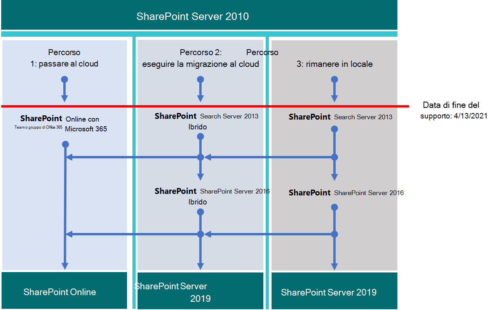

# Aggiornamento da SharePoint 2010

*Questo articolo può essere applicato sia a Microsoft 365 Enterprise che a Office 365 Enterprise.*

Microsoft SharePoint 2010 e SharePoint Server 2010 raggiungeranno la fine del supporto il **13 aprile 2021.** In questo articolo vengono fornite risorse che consentono di eseguire la migrazione dei dati di SharePoint Server 2010 esistenti a SharePoint Online in Microsoft 365 o di aggiornare l'ambiente SharePoint Server 2010 locale.

## Che *cos'è la fine del supporto?*

La maggior parte dei prodotti Microsoft ha un ciclo di vita del supporto, durante il quale ottengono nuove funzionalità, correzioni di bug, correzioni per la sicurezza e così via. Dopo la data di fine del supporto, il prodotto non smette di funzionare, ma Microsoft non fornisce più:

- Supporto tecnico per i problemi che possono verificarsi.

- Correzioni di bug per i problemi che possono influire sulla stabilità e sull'usabilità del server.

- Correzioni della sicurezza per le vulnerabilità che possono rendere il server vulnerabile alle violazioni della sicurezza.

- Aggiornamenti del fuso orario.

Ciò significa che non saranno disponibili ulteriori aggiornamenti, patch o correzioni per il prodotto (incluse patch/correzioni di sicurezza). Il supporto Tecnico Microsoft avrà completamente spostato i propri sforzi di supporto a versioni più recenti.

Al termine del supporto di SharePoint Server 2010, eliminare i dati non più necessari prima di aggiornare il prodotto ed eseguire la migrazione dei dati importanti.

> [!NOTE]
> Un ciclo di vita del software in genere dura dieci anni dalla versione iniziale. [I provider di soluzioni Microsoft](https://go.microsoft.com/fwlink/?linkid=841249) possono aiutarti a eseguire l'aggiornamento alla versione successiva del software o a eseguire la migrazione a Microsoft 365 (o entrambi). Assicurarsi di essere a conoscenza delle date di fine del supporto anche per le tecnologie sottostanti critiche, in particolare per la versione di Microsoft SQL Server in uso con SharePoint. Per ulteriori informazioni, vedere [Fixed Lifecycle Policy](https://support.microsoft.com/help/14085).

## Pianificare in anticipo

Controllare le date di fine del supporto nel [sito Ciclo di vita del prodotto](https://support.microsoft.com/lifecycle/search?alpha=SharePoint%20Server%202010). Pianificare gli aggiornamenti o le migrazioni in base a queste date. Ricorda che il prodotto *non smetterà di funzionare* alla data elencata. Tuttavia, poiché l'installazione non verrà più patchata dopo tale data, è necessario pianificare una transizione graduale alla versione successiva del prodotto.

Questa matrice consente di tracciare un corso tra le opzioni di migrazione:

|Fine del prodotto di supporto|Buone |Elevate|
|---|---|---|
|SharePoint Server 2010|SharePoint Server 2013 (locale)|SharePoint Online|
||SharePoint Server 2013 ibrido con SharePoint Online|SharePoint Server 2016 (locale)|
|||Ricerca ibrida cloud di SharePoint|

Se si sceglie un'opzione nella fascia bassa della scala (buona), sarà necessario iniziare a pianificare un altro aggiornamento subito dopo la migrazione da SharePoint Server 2010.

Ecco i tre percorsi che è possibile eseguire per evitare la fine del supporto per SharePoint Server 2010.

> [!NOTE]
> La fine del supporto per SharePoint Server 2010 e SharePoint Foundation 2010 è attualmente pianificata per il 13 aprile 2021. Tuttavia, assicurati di controllare il sito [ciclo di vita del](https://support.microsoft.com/lifecycle) prodotto per le date più attuali.

## Operazioni successive

SharePoint Server 2013 e SharePoint Foundation 2013 possono essere installati in locale nei propri server. In caso contrario, è possibile usare SharePoint Online, un servizio online che fa parte di Microsoft 365. È possibile scegliere di:

- Eseguire la migrazione a SharePoint Online.

- Aggiornare SharePoint Server o SharePoint Foundation in locale.

- Eseguire entrambe le operazioni precedenti.

- Implementare [una soluzione ibrida di SharePoint.](/sharepoint/hybrid/hybrid)

Considerare i costi nascosti della gestione di una server farm, tra cui la manutenzione o la migrazione delle personalizzazioni e l'aggiornamento dell'hardware. Se hai preso in considerazione questi fattori, sarà più facile eseguire l'aggiornamento in locale. Se si esegue la farm in SharePoint Server legacy senza una personalizzazione pesante, è possibile trarre vantaggio da una migrazione pianificata a SharePoint Online. Per un ambiente SharePoint Server locale, è anche possibile spostare alcuni dati in SharePoint Online per ridurre il sovraccarico della gestione hardware.

> [!NOTE]
> Gli amministratori di SharePoint possono creare una sottoscrizione di Microsoft 365, configurare nuovi siti di SharePoint Online e quindi eliminare SharePoint Server 2010 in modo pulito, portando solo i documenti essenziali nei nuovi siti. Gli eventuali dati rimanenti possono quindi essere scaricati dal sito di SharePoint Server 2010 in archivi locali.

|SharePoint Online|SharePoint Server locale|
|---|---|
|Costo elevato nel tempo (piano/esecuzione/verifica)|Costo elevato nel tempo (piano/esecuzione/verifica)|
|Costo inferiore per i fondi (nessun acquisto di hardware)|Costi più elevati per i fondi (acquisti di hardware)|
|Costo una sola volta per la migrazione|Costo una sola volta ripetuto per migrazione futura|
|Basso costo totale di proprietà/manutenzione|Costo totale elevato di proprietà/manutenzione|

Un passaggio una sola volta a Microsoft 365 avrà un costo maggiore mentre si organizzano i dati e si decide cosa prendere nel cloud e cosa lasciare indietro. Tuttavia, dopo la migrazione dei dati, gli aggiornamenti futuri saranno automatici, in quanto non sarà più necessario gestire gli aggiornamenti hardware e software. Inoltre, il tempo di esecuzione della farm sarà supportato da un contratto di servizio [(SLA) Microsoft.](/office365/servicedescriptions/office-365-platform-service-description/service-level-agreement)

### Eseguire la migrazione a SharePoint Online

Assicurarsi che SharePoint Online offre tutte le funzionalità necessarie. Vedere [Descrizione del servizio SharePoint.](/office365/servicedescriptions/sharepoint-online-service-description/sharepoint-online-service-description)

Non è possibile eseguire la migrazione direttamente da SharePoint Server 2010 (o SharePoint Foundation 2010) a SharePoint Online. Gran parte del lavoro di migrazione è manuale. Questa fase offre tuttavia la possibilità di eliminare i dati e i siti che non sono più necessari prima dello spostamento. È possibile archiviare altri dati nell'archiviazione. 

Tenere presente che SharePoint Server 2010 e SharePoint Foundation 2010 non smetterà di funzionare al termine del supporto. In questo modo, gli amministratori possono avere un periodo in cui SharePoint è ancora in esecuzione se i clienti dimenticano di spostare alcuni dei dati.

Se si esegue l'aggiornamento a SharePoint Server 2013 o SharePoint Server 2016 e si decide di inserire dati in SharePoint Online, è possibile utilizzare l'API di migrazione di [SharePoint](https://support.office.com/article/Upload-on-premises-content-to-SharePoint-Online-using-PowerShell-cmdlets-555049c6-15ef-45a6-9a1f-a1ef673b867c?ui=en-US&amp;rs=en-US&amp;ad=US) per eseguire la migrazione delle informazioni in OneDrive for Business.

|Vantaggio di SharePoint Online|Svantaggio di SharePoint Online|
|---|---|
|Microsoft fornisce l'hardware spo e tutta l'amministrazione dell'hardware.|Le funzionalità disponibili possono differire tra SharePoint Server locale e SharePoint Server 2013.|
|L'utente è l'amministratore globale della sottoscrizione e può assegnare gli amministratori ai siti di SharePoint Online.|Alcune azioni disponibili per un amministratore di farm in SharePoint Server locale non esistono (o non sono necessarie) nel ruolo di amministratore di SharePoint in Microsoft 365. Amministrazione di SharePoint, Amministrazione raccolta siti e Proprietà sito sono tuttavia locali per l'organizzazione.|
|Microsoft applica patch, correzioni e aggiornamenti all'hardware e al software sottostanti, inclusi SQL server in cui viene eseguito SharePoint Online.|Poiché nel servizio non è disponibile alcun accesso al file system sottostante, la personalizzazione è limitata.|
|Microsoft pubblica i [contratti di servizio e](/office365/servicedescriptions/office-365-platform-service-description/service-level-agreement) si sposta rapidamente per risolvere gli incidenti a livello di servizio.|Backup e ripristino e altre opzioni di ripristino sono automatizzate dal servizio in SharePoint Online. Se non vengono utilizzati, i backup vengono sovrascritti.|
|I test di sicurezza e l'ottimizzazione delle prestazioni del server vengono eseguiti continuamente nel servizio da Microsoft.|Le modifiche apportate all'interfaccia utente e ad altre caratteristiche di SharePoint vengono installate dal servizio e possono essere attivate o disattivate.|
|Microsoft 365 soddisfa molti standard di settore: [offerte di conformità Microsoft](/compliance/regulatory/offering-home).|[L'assistenza FastTrack](https://go.microsoft.com/fwlink/?linkid=518597) per la migrazione è limitata.    Gran parte dell'aggiornamento sarà manuale o tramite l'API di migrazione di SharePoint Online e OneDrive descritta nella Roadmap del contenuto per la migrazione di [SharePoint Online e OneDrive.](/sharepointmigration/upload-on-premises-content-to-sharepoint-online-using-powershell-cmdlets)|
|I tecnici del supporto Microsoft e i dipendenti del datacenter non hanno accesso amministrativo illimitato all'abbonamento.|Possono essere previsti costi aggiuntivi se è necessario aggiornare l'infrastruttura hardware per supportare la versione più recente di SharePoint o se è necessaria una farm secondaria per l'aggiornamento.|
|I provider di soluzioni consentono di eseguire una sola volta la migrazione dei dati a SharePoint Online.|Non tutte le modifiche apportate a SharePoint Online sono sotto il tuo controllo. Dopo la migrazione, le differenze di progettazione nei menu, nelle raccolte e in altre funzionalità potrebbero influire temporaneamente sull'usabilità.|
|I prodotti online vengono aggiornati automaticamente nel servizio. Le funzionalità possono essere deprecate, ma non esiste una vera fine del ciclo di vita del supporto.|Esiste un ciclo di vita di fine del supporto per SharePoint Server o SharePoint Foundation e server SQL server.|

Se si è deciso di creare un nuovo sito di Microsoft 365 e si eseguirà manualmente la migrazione dei dati in base alle esigenze, controllare le opzioni [di Microsoft 365.](https://www.microsoft.com/microsoft-365/)

### Aggiornare SharePoint Server locale

A partire da SharePoint Server 2019, gli aggiornamenti devono passare *in serie.* Non è possibile eseguire direttamente l'aggiornamento da SharePoint Server 2010 a SharePoint Server 2016 o a SharePoint 2019. Percorso di aggiornamento seriale:

- SharePoint Server 2010 \> SharePoint Server 2013 \> SharePoint Server 2016

Sarà necessario tempo e pianificazione per seguire l'intero percorso da SharePoint 2010 a SharePoint Server 2016. Gli aggiornamenti comportano costi per l'hardware (SQL anche i server devono essere aggiornati), il software e l'amministrazione. Potrebbe inoltre essere necessario aggiornare o persino abbandonare le personalizzazioni. Assicurarsi di documentare le personalizzazioni critiche prima di aggiornare la farm di SharePoint Server.

> [!NOTE]
> È possibile gestire la farm di SharePoint 2010 di fine supporto, installare una farm di SharePoint Server 2016 in un nuovo hardware (in modo che le farm separate esemplino affiancate) e quindi pianificare ed eseguire una migrazione manuale del contenuto (ad esempio per il download e il ricaricamento del contenuto). Tuttavia, esistono potenziali insidie per questi spostamenti manuali, ad esempio i documenti provenienti dal 2010 con un account di ultima modifica corrente con l'alias dell'account che esegue lo spostamento manuale. È inoltre necessario eseguire alcune operazioni in anticipo, ad esempio ricreare siti, siti secondari, autorizzazioni ed elenchi. Assicurarsi di pulire l'ambiente prima dell'aggiornamento. Considerare quali dati è possibile spostare nell'archiviazione o non sono più necessari. In questo modo è possibile ridurre l'impatto della migrazione. Prima di eseguire l'aggiornamento, è necessario essere certi che la farm esistente sia funzionante e( certamente) prima di rimuovere le autorizzazioni.

Ricordarsi di esaminare i percorsi di aggiornamento supportati e non *supportati:*

- [SharePoint Server 2010](/previous-versions/office/sharepoint-2007-products-and-technologies/cc262747(v=office.12))

- [SharePoint Server 2013](/SharePoint/upgrade-and-update/review-supported-editions-and-products-for-upgrading-to-sharepoint-2013)

Se si dispone *di personalizzazioni,* è fondamentale pianificare ogni passaggio del percorso di migrazione:

- [SharePoint Server 2010](/previous-versions/office/sharepoint-server-2010/cc263203(v=office.14))

- [SharePoint Server 2013](/SharePoint/upgrade-and-update/create-a-communication-plan-for-the-upgrade-to-sharepoint-2013)

|Vantaggio locale|Svantaggio locale|
|---|---|
|Controllo completo di tutti gli aspetti della farm di SharePoint (e del relativo SQL), dall'hardware del server verso l'alto.|Tutte le interruzioni e le correzioni sono responsabilità dell'azienda. Tuttavia, puoi coinvolgere il supporto Microsoft a pagamento se il prodotto non è passato alla fine del supporto.|
|Set di funzionalità completo di SharePoint Server locale con l'opzione per connettere la farm locale a una sottoscrizione di SharePoint Online tramite ibrido.|L'aggiornamento, le patch, le correzioni per la sicurezza, gli aggiornamenti hardware e tutta la manutenzione di SharePoint Server e della SQL farm vengono gestiti in locale.|
|Accesso completo per opzioni di personalizzazione maggiori rispetto a SharePoint Online.|[Le offerte di conformità Microsoft](/compliance/regulatory/offering-home) devono essere configurate manualmente in locale.|
|I test di sicurezza e l'ottimizzazione delle prestazioni del server vengono eseguiti in locale sotto il tuo controllo.|Microsoft 365 potrebbe rendere disponibili a SharePoint Online funzionalità che non interoperabili con SharePoint Server in locale.|
|I provider di soluzioni consentono di eseguire la migrazione dei dati alla versione successiva di SharePoint Server (e oltre).|I siti di SharePoint Server non utilizzeranno automaticamente [i certificati SSL/TLS](/SharePoint/security-for-sharepoint-server/enable-tls-1-1-and-tls-1-2-support-in-sharepoint-server-2016) come illustrato in SharePoint Online.|
|Controllo completo delle convenzioni di denominazione, backup e ripristino e altre opzioni di ripristino in SharePoint Server locale.|SharePoint Server locale è sensibile ai cicli di vita dei prodotti.|

### Aggiornare le risorse

Iniziare confrontando i requisiti hardware e software. Se l'ambiente corrente non soddisfa i requisiti di base, potrebbe essere necessario aggiornare prima l'hardware nella farm o nei SQL server. 

È possibile decidere di spostare alcuni dei siti nell'hardware "sempreverde" di SharePoint Online. Dopo aver effettuato la valutazione, seguire i metodi e i percorsi di aggiornamento supportati.

- *Requisiti hardware/software per:*

    [SharePoint Server 2010](/previous-versions/office/sharepoint-server-2010/cc262485(v=office.14))  |  [SharePoint Server 2013](/SharePoint/install/hardware-and-software-requirements-0)  |  [SharePoint Server 2016](/SharePoint/install/hardware-and-software-requirements)

- *Limiti software e limiti per:*

    [SharePoint Server 2010](/previous-versions/office/sharepoint-server-2010/cc262787(v=office.14))  |  [SharePoint Server 2013](/SharePoint/install/software-boundaries-and-limits)  |  [SharePoint Server 2016](/SharePoint/install/software-boundaries-and-limits-0)

- *Panoramica del processo di aggiornamento per:*

    [SharePoint Server 2010](/previous-versions/office/sharepoint-server-2010/cc303420(v=office.14))  |  [SharePoint Server 2013](/SharePoint/upgrade-and-update/upgrade-to-sharepoint-server-2016)  |  [SharePoint Server 2016](/SharePoint/upgrade-and-update/upgrade-to-sharepoint-server-2016)

### Creare una soluzione ibrida con SharePoint Online e SharePoint Server locale

Una configurazione ibrida offre il meglio sia in locale che online per alcune esigenze di migrazione. È possibile connettere farm di SharePoint Server 2013, 2016 o 2019 a SharePoint Online per creare un ambiente ibrido di [SharePoint: informazioni](https://support.office.com/article/4c89a95a-a58c-4fc1-974a-389d4f195383.aspx)sulle soluzioni ibride di SharePoint.

Se l'obiettivo della migrazione è una farm di SharePoint Server ibrida, individuare i siti e gli utenti da spostare online e che devono rimanere in locale. La classificazione del contenuto della farm di SharePoint Server come impatto elevato, medio o basso per l'azienda può essere utile per questa decisione. Potrebbe essere necessario condividere solo gli account utente per l'accesso e l'indice di ricerca di SharePoint Server con SharePoint Online. Tuttavia, questo fattore potrebbe non essere chiaro finché non si osserva come vengono utilizzati i siti. Se in un secondo momento l'azienda decide di eseguire la migrazione di tutto il contenuto a SharePoint Online, è possibile spostare tutti gli account e i dati rimanenti online e rimuovere le autorizzazioni della farm locale. La gestione/amministrazione della farm di SharePoint verrà eseguita tramite le console di Microsoft 365 da quel momento in avanti.

Assicurarsi di acquisire familiarità con i tipi esistenti di ibridi e come configurare la connessione tra la farm di SharePoint locale e l'abbonamento a Microsoft 365.

|Opzione|Descrizione|
|---|---|
|[Offerte di conformità Microsoft](/compliance/regulatory/offering-home).|[L'assistenza FastTrack](https://www.microsoft.com/fasttrack/microsoft-365) per la migrazione è limitata.   Gran parte dell'aggiornamento sarà manuale o tramite l'API di migrazione di SharePoint Online e OneDrive descritta nella Roadmap del contenuto per la migrazione di [SharePoint Online e OneDrive.](/sharepointmigration/upload-on-premises-content-to-sharepoint-online-using-powershell-cmdlets)|
|I tecnici del supporto Microsoft e i dipendenti del datacenter non hanno accesso amministrativo illimitato all'abbonamento.|Potrebbero essere previsti costi aggiuntivi se è necessario aggiornare l'infrastruttura hardware per supportare la versione più recente di SharePoint o se è necessaria una farm secondaria.|
|I partner possono assistere nel processo di migrazione dei dati a SharePoint Online una sola volta.||
|I prodotti online vengono aggiornati automaticamente nel servizio. Le funzionalità possono essere deprecate, ma non esiste una vera fine del supporto.||

Se si è deciso di creare un nuovo sito di Microsoft 365 ed eseguire manualmente la migrazione dei dati in base alle esigenze, controllare le opzioni [di Microsoft 365.](https://www.microsoft.com/microsoft-365/)

### Aggiornare SharePoint Server locale

Non è possibile ignorare le versioni negli aggiornamenti di SharePoint. Ciò significa che gli aggiornamenti vengono evasi in serie:

- SharePoint 2007 \> SharePoint Server 2010 \> SharePoint Server 2013 \> SharePoint Server 2016

Per eseguire l'intero percorso da SharePoint 2007 a SharePoint Server 2016, significa un investimento significativo di tempo e coinvolgerà i costi hardware (è necessario aggiornare anche i server SQL), il software e i costi di amministrazione. Le personalizzazioni dovranno essere aggiornate o abbandonate, in base alla criticità della funzionalità.

> [!NOTE]
> È possibile mantenere la farm di SharePoint 2007 di fine vita, installare una farm di SharePoint Server 2016 in un nuovo hardware (in modo che le farm separate esemplino affiancate) e quindi pianificare ed eseguire una migrazione manuale del contenuto (ad esempio per il download e il ricaricamento del contenuto). Tuttavia, esistono alcuni svantaggi di questi spostamenti manuali, ad esempio gli spostamenti di documenti che sostituiscono l'ultimo account modificato con l'alias dell'account che esegue lo spostamento manuale. È inoltre necessario eseguire molte attività in anticipo, ad esempio ricreare siti, siti secondari, autorizzazioni e strutture di elenchi. In ogni caso, considerare quali dati è possibile spostare nell'archiviazione o non è più necessario ridurre l'impatto della migrazione.

Assicurarsi di pulire l'ambiente prima dell'aggiornamento. Prima di eseguire l'aggiornamento, è necessario essere certi che la farm esistente sia funzionante e sicuramente prima di rimuovere le autorizzazioni.

Ricordarsi di esaminare i percorsi di aggiornamento supportati e non *supportati:*

- [SharePoint Server 2007](/previous-versions/office/sharepoint-2007-products-and-technologies/cc262747(v=office.12))

- [SharePoint Server 2010](/previous-versions/office/sharepoint-2007-products-and-technologies/cc262747(v=office.12))

- [SharePoint Server 2013](/SharePoint/upgrade-and-update/review-supported-editions-and-products-for-upgrading-to-sharepoint-2013)

Se sono presenti *personalizzazioni,* è fondamentale pianificare l'aggiornamento per ogni passaggio del percorso di migrazione:

- [SharePoint 2007](/previous-versions/office/sharepoint-2007-products-and-technologies/cc263203(v=office.12))

- [SharePoint Server 2010](/previous-versions/office/sharepoint-server-2010/cc263203(v=office.14))

- [SharePoint Server 2013](/SharePoint/upgrade-and-update/create-a-communication-plan-for-the-upgrade-to-sharepoint-2013)

|On-premises pro|Con locale|
|---|---|
|Controllo completo di tutti gli aspetti della farm di SharePoint, dall'hardware del server verso l'alto.|Tutte le interruzioni e le correzioni sono responsabilità dell'azienda. È tuttavia possibile coinvolgere il supporto Microsoft a pagamento se il prodotto non è passato alla fine del supporto.|
|Set di funzionalità completo di SharePoint Server locale con l'opzione per connettere la farm locale a una sottoscrizione di SharePoint Online tramite ibrido.|Aggiornamento, patch, correzioni per la sicurezza e tutta la manutenzione di SharePoint Server gestito in locale.|
|Accesso completo per una maggiore personalizzazione.|[Le offerte di conformità Microsoft](/compliance/regulatory/offering-home) devono essere configurate manualmente in locale.|
|I test di sicurezza e l'ottimizzazione delle prestazioni del server vengono eseguiti in locale sotto il controllo dell'utente.|Microsoft 365 potrebbe rendere disponibili a SharePoint Online funzionalità che non interoperabili con SharePoint Server locale.|
|I partner possono aiutare a eseguire la migrazione dei dati alla versione successiva di SharePoint Server (e oltre).|I siti di SharePoint Server non utilizzeranno automaticamente [i certificati SSL/TLS](/SharePoint/security-for-sharepoint-server/enable-tls-1-1-and-tls-1-2-support-in-sharepoint-server-2016) come illustrato in SharePoint Online.|
|Controllo completo delle convenzioni di denominazione, backup e ripristino e altre opzioni di ripristino in SharePoint Server locale.|SharePoint Server locale è sensibile ai cicli di vita dei prodotti.|

### Aggiornare le risorse

Iniziare conoscendo i requisiti hardware e software, quindi seguire i metodi di aggiornamento supportati.

- *Requisiti hardware/software per*:

    [SharePoint Server 2010](/previous-versions/office/sharepoint-server-2010/cc262485(v=office.14))  |  [SharePoint Server 2010](/previous-versions/office/sharepoint-server-2010/cc262485(v=office.14))  |  [SharePoint Server 2013](/SharePoint/install/hardware-and-software-requirements-0)  |  [SharePoint Server 2016](/SharePoint/install/hardware-and-software-requirements)

- *Limiti software e limiti per*:

    [SharePoint Server 2007](/previous-versions/office/sharepoint-2007-products-and-technologies/cc262787(v=office.12))  |  [SharePoint Server 2010](/previous-versions/office/sharepoint-server-2010/cc262787(v=office.14))  |  [SharePoint Server 2013](/SharePoint/install/software-boundaries-and-limits)  |  [SharePoint Server 2016](/SharePoint/install/software-boundaries-and-limits-0)

- *Panoramica del processo di aggiornamento per*:

    [SharePoint Server 2007](/previous-versions/office/sharepoint-2007-products-and-technologies/cc303420(v=office.12))  |  [SharePoint Server 2010](/previous-versions/office/sharepoint-server-2010/cc303420(v=office.14))  |  [SharePoint Server 2013](/SharePoint/upgrade-and-update/upgrade-to-sharepoint-server-2016)  |  [SharePoint Server 2016](/SharePoint/upgrade-and-update/upgrade-to-sharepoint-server-2016)

### Creare una soluzione ibrida di SharePoint tra SharePoint Online e locale

Se la risposta alle esigenze di migrazione è compresa tra il controllo offerto in locale e il costo di proprietà più basso offerto da SharePoint Online, è possibile connettere le farm di SharePoint Server 2013 o 2016 a SharePoint Online tramite ibridi. [Informazioni sulle soluzioni ibride di SharePoint](https://support.office.com/article/4c89a95a-a58c-4fc1-974a-389d4f195383.aspx)

Se si decide che una farm di SharePoint Server ibrida sarà utile per l'azienda, acquisire familiarità con i tipi esistenti di ibridi e come configurare la connessione tra la farm di SharePoint locale e l'abbonamento a Microsoft 365.

È possibile creare un ambiente di sviluppo/test di Microsoft 365, che è possibile configurare con [Le guide dei laboratori di testing.](m365-enterprise-test-lab-guides.md) Dopo aver acquistato una sottoscrizione di valutazione o di Microsoft 365, è possibile creare raccolte siti, Web e raccolte documenti in SharePoint Online in cui è possibile eseguire la migrazione dei dati. È possibile eseguire la migrazione manualmente, tramite l'API di migrazione o, se si desidera eseguire la migrazione del contenuto del sito personale in OneDrive for Business, tramite la procedura guidata ibrida.

> [!NOTE]
> Per utilizzare l'opzione ibrida, la farm di SharePoint Server 2010 deve prima essere aggiornata in locale a SharePoint Server 2013 o 2016. SharePoint Foundation 2010 e SharePoint Foundation 2013 non supportano le connessioni ibride con SharePoint Online.

## Riepilogo delle opzioni per client e server di Office 2010 e Windows 7

Per un riepilogo visivo delle opzioni di aggiornamento, migrazione e passaggio al cloud per i client e i server di Office 2010 e Windows 7, vedere il [poster relativo alla fine del supporto](../downloads/Office2010Windows7EndOfSupport.pdf).

In questo poster vengono illustrati i vari percorsi che è possibile eseguire per evitare i prodotti client e server di Office 2010 e la fine del supporto di Windows 7, con i percorsi preferiti e i supporti delle opzioni in Microsoft 365 Enterprise evidenziati.

Puoi anche [scaricare questo](https://github.com/MicrosoftDocs/microsoft-365-docs/raw/public/microsoft-365/downloads/Office2010Windows7EndOfSupport.pdf) poster e stamparlo in formato lettera, legale o tabloid (11 x 17).

## Articoli correlati

[Risorse per l'aggiornamento da server e client di Office 2007 o 2010](upgrade-from-office-2010-servers-and-products.md)

[Overview of the upgrade process from SharePoint 2010 to SharePoint 2013](/SharePoint/upgrade-and-update/overview-of-the-upgrade-process-from-sharepoint-2010-to-sharepoint-2013)

[Procedure consigliate per l'aggiornamento da SharePoint 2010 a SharePoint 2013](/SharePoint/upgrade-and-update/best-practices-for-upgrading-from-sharepoint-2010-to-sharepoint-2013)

[Risolvere i problemi relativi all'aggiornamento dei database in SharePoint 2013](/SharePoint/upgrade-and-update/troubleshoot-database-upgrade-issues-in-sharepoint-2013)

[Cercare provider di soluzioni Microsoft utili per l'aggiornamento](https://go.microsoft.com/fwlink/?linkid=841249)

[Criterio di manutenzione del prodotto aggiornato per SharePoint 2013](/SharePoint/product-servicing-policy/updated-product-servicing-policy-for-sharepoint-2013)

[Criteri di manutenzione del prodotto aggiornati per SharePoint Server 2016](/SharePoint/product-servicing-policy/updated-product-servicing-policy-for-sharepoint-server-2016)