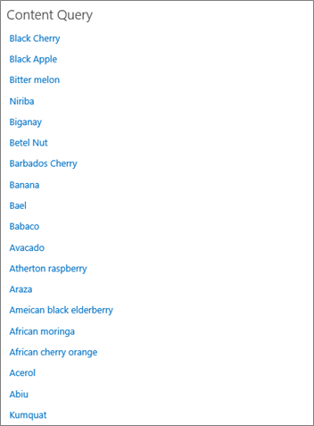
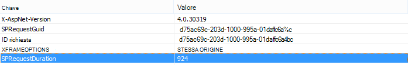
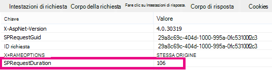

# Utilizzo della web part Ricerca contenuto anziché della web part Query contenuto per migliorare le prestazioni in SharePoint Online

In questo articolo viene descritto come migliorare le prestazioni sostituendo la web part Query contenuto con la web part Ricerca contenuto in SharePoint Server 2013 e SharePoint Online.
  
Una delle nuove funzionalità più potenti di SharePoint Server 2013 e SharePoint Online è la web part Ricerca contenuto. Questa web part utilizza l'indice di ricerca per recuperare rapidamente i risultati visualizzati all'utente. Utilizzare la web part Ricerca contenuto anziché la web part Query contenuto (CQWP) nelle pagine per migliorare le prestazioni per gli utenti.
  
L'utilizzo di una web part Ricerca contenuto in una web part Query contenuto comporta quasi sempre prestazioni di caricamento delle pagine significativamente migliori in SharePoint Online. C'è un po' di configurazione aggiuntiva per ottenere la query giusta, ma i vantaggi sono prestazioni migliorate e utenti soddisfatti.
  
## Confronto tra il miglioramento delle prestazioni derivato dall'utilizzo della web part Ricerca contenuto anziché della web part Query contenuto

Negli esempi seguenti vengono illustrati i miglioramenti relativi alle prestazioni che è possibile ottenere quando si utilizza una web part Ricerca contenuto anziché una web part Query contenuto. Gli effetti sono più ovvi con una struttura di sito complessa e query di contenuto molto ampie.
  
Questo sito di esempio presenta le caratteristiche seguenti:
  
- 8 livelli di siti secondari.
    
- Elenchi che usano un tipo di contenuto "fruit" personalizzato.
    
- Nella web part la query sul contenuto è ampia e restituisce tutti gli elementi con il tipo di contenuto "fruit".
    
- Nell'esempio vengono utilizzati solo 50 elementi tra gli 8 siti. Gli effetti saranno ancora più pronunciati per i siti con più contenuto.
    
Ecco una cattura di schermata dei risultati della web part Query contenuto.
  

  
In Internet Explorer usa la scheda **Rete** degli strumenti di sviluppo F12 per esaminare i dettagli dell'intestazione della risposta. Nella cattura di schermata seguente il valore di **SPRequestDuration** per il caricamento della pagina è 924 millisecondi. 
  

  
 **SPRequestDuration** indica la quantità di lavoro eseguita sul server per preparare la pagina. Il passaggio del contenuto tramite query Web part contenuto tramite ricerca Web part riduce notevolmente il tempo necessario per il rendering della pagina. Al contrario, una pagina con una web part Ricerca contenuto equivalente, che restituisce lo stesso numero di risultati, ha un valore **SPRequestDuration** di 106 millisecondi, come illustrato in questa cattura di schermata: 
  

  
## Aggiunta di una web part Ricerca contenuto in SharePoint Online

L'aggiunta di una web part Ricerca contenuto è molto simile a una normale web part Query contenuto. Vedere la sezione *"Aggiungere una web part Ricerca contenuto"* in [Configurare una web part Ricerca contenuto in SharePoint.](https://support.office.com/article/Configure-a-Content-Search-Web-Part-in-SharePoint-0dc16de1-dbe4-462b-babb-bf8338c36c9a)
  
## Creazione della query di ricerca giusta per la web part Ricerca contenuto

Dopo aver aggiunto una web part Ricerca contenuto, è possibile perfezionare la ricerca e restituire gli elementi desiderati. Per istruzioni dettagliate su come eseguire questa operazione, vedere la sezione "Visualizzare il contenuto configurando una query avanzata in una web part Ricerca *contenuto" in* Configurare una web part Ricerca contenuto [in SharePoint.](https://support.office.com/article/Configure-a-Content-Search-Web-Part-in-SharePoint-0dc16de1-dbe4-462b-babb-bf8338c36c9a)
  
## Strumento di creazione e test di query

Per uno strumento per creare e testare query complesse, vedere [lo strumento query di ricerca](https://sp2013searchtool.codeplex.com/) in Codeplex. 
  

