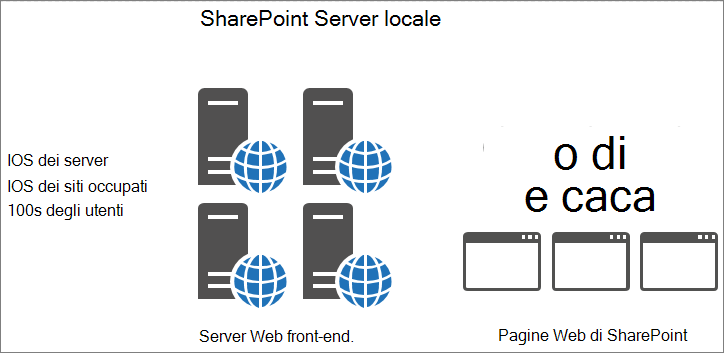

# Utilizzo della cache oggetti con SharePoint Online

In questo articolo viene illustrata la differenza tra l'utilizzo della cache oggetti in SharePoint Server 2013 locale e SharePoint Online.
  
Esiste un notevole impatto negativo nell'affidarsi alla cache oggetti nella distribuzione di SharePoint Online. Qualsiasi dipendenza dalla cache oggetti in SharePoint Online riduce l'affidabilità della pagina. 
  
## Funzionamento della cache oggetti di SharePoint Online e SharePoint Server 2013

Quando SharePoint Server 2013 è ospitato in locale, il cliente dispone di server Web front-end privati che ospitano la cache oggetti. Ciò significa che la cache è dedicata a un cliente ed è limitata solo dalla quantità di memoria disponibile e assegnata alla cache oggetti. Poiché viene servito un solo cliente nello scenario locale, in genere i server Web front-end dispongono di utenti che effettuano richieste per gli stessi siti ripetutamente. Ciò significa che la cache si riempie velocemente e rimane piena dei risultati delle query dell'elenco e degli oggetti di SharePoint che gli utenti richiedono regolarmente.
  

  
Di conseguenza, la seconda volta che un utente visita una pagina, il tempo di caricamento della pagina migliora. Dopo un minimo di quattro caricamenti della stessa pagina, la pagina è memorizzata nella cache su tutti i server Web front-end.
  
Al contrario, in SharePoint Online sono presenti molti più server, ma anche molti altri siti. Ogni utente può connettersi a un server Web front-end diverso che non dispone della cache compilata. In caso contrario, la cache viene popolata per un server, ma l'utente successivo a tale server Web front-end richiede una pagina da un sito diverso. Oppure, anche se l'utente successivo richiede la stessa pagina in base alla visita precedente, viene effettuato un bilanciamento del carico a un server Web front-end diverso che non dispone di tale pagina nella cache. In questo ultimo caso, la memorizzazione nella cache non aiuta affatto gli utenti.
  
Nella figura seguente, ogni punto rappresenta una pagina che richiede un utente e la cache in cui è memorizzato. Colori diversi rappresentano diversi clienti che condividono l'infrastruttura SaaS.
  

  
Come si può notare dal diagramma, le possibilità di un determinato utente di accedere a un server con la versione memorizzata nella cache sono limitate. Inoltre, a causa della velocità effettiva elevata e del fatto che i server sono condivisi tra molti siti, la cache non dura molto perché è disponibile solo così tanto spazio per la memorizzazione nella cache.
  
Per tutti i motivi fin qui citati, basarsi su utenti con oggetti memorizzati nella cache non è un modo efficace per garantire un'esperienza utente e dei tempi di caricamento delle pagine di qualità in SharePoint Online.
  
## Se non è possibile fare affidamento sulla cache oggetti per migliorare le prestazioni in SharePoint Online, cosa sarebbe opportuno utilizzare?

Dal momento che non si dovrebbe utilizzare la memorizzazione nella cache in SharePoint Online, occorre prendere in considerazione metodi di progettazione alternativi per le personalizzazioni di SharePoint che utilizzano la cache oggetti. In altri termini, occorre prendere in considerazione l'utilizzo di metodi per problemi relativi alle prestazioni che non si basano sulla memorizzazione di oggetti nella cache per produrre risultati ottimali per gli utenti. Ciò è descritto in alcuni degli ulteriori articoli in questa serie tra cui:
  
- [Opzioni di spostamento per SharePoint Online](navigation-options-for-sharepoint-online.md)
    
- [Minimizzazione e creazione di bundle in SharePoint Online](minification-and-bundling-in-sharepoint-online.md)
    
- [Usare la rete per la distribuzione di contenuti di Office 365 con SharePoint Online](use-microsoft-365-cdn-with-spo.md)
    
- [Ritardo caricamento immagini e JavaScript in SharePoint Online](delay-loading-images-and-javascript-in-sharepoint-online.md)
    

