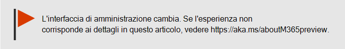
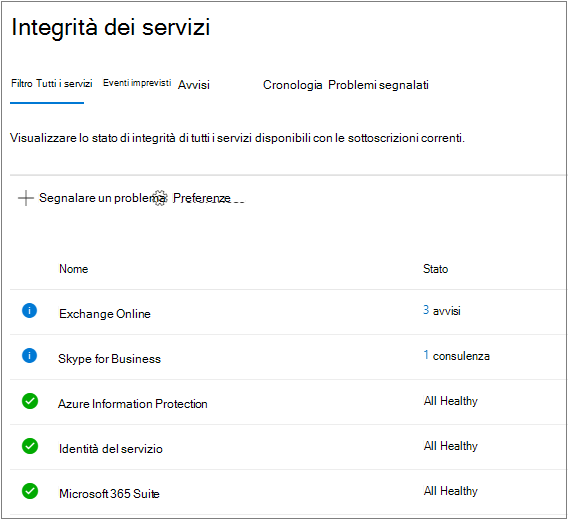
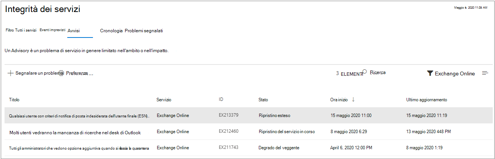
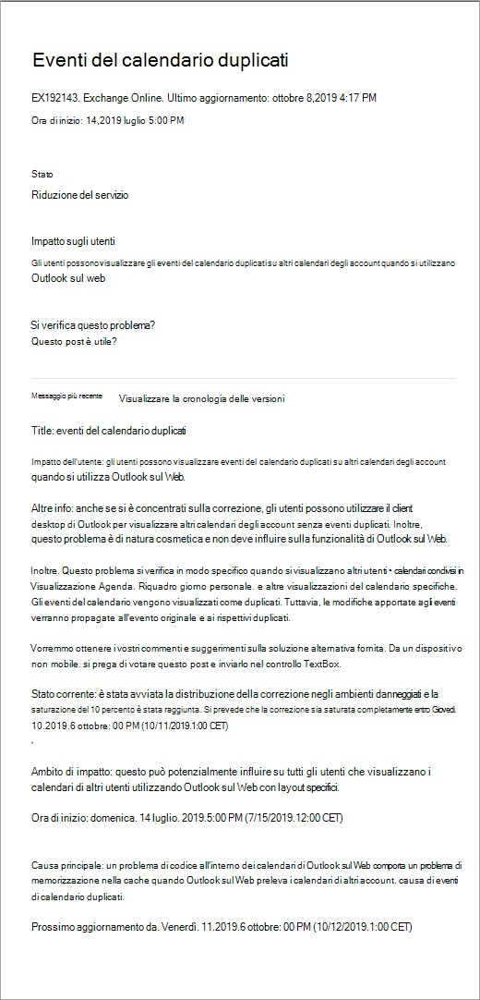
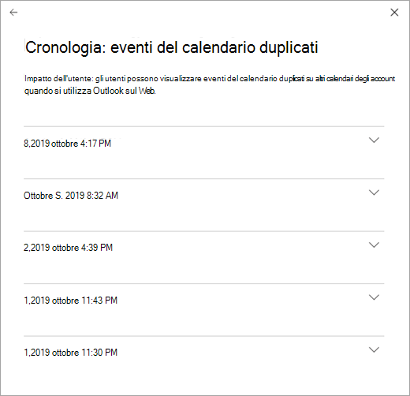

# Come verificare l'integrità dei servizi di Microsoft 365

È possibile visualizzare l'integrità dei servizi Microsoft, inclusi Office sul Web, Yammer, Microsoft Dynamics CRM e  i servizi cloud di gestione dei dispositivi mobili, nella pagina Integrità dei servizi nell'interfaccia di amministrazione di [Microsoft 365.](https://go.microsoft.com/fwlink/p/?linkid=2024339) If you are experiencing problems with a cloud service, you can check the service health to determine whether this is a known issue with a resolution in progress before you call support or spend time troubleshooting.

Se non è possibile accedere all'interfaccia di  amministrazione, è possibile utilizzare la pagina dello stato del servizio per verificare la presenza di problemi noti che impediscono l'accesso al tenant.  Iscriviti anche per seguirci [all'@MSFT365status](https://twitter.com/MSFT365Status) su Twitter per visualizzare informazioni su determinati eventi.

  
### Come verificare l'integrità dei servizi

1. Accedere all'interfaccia di amministrazione di Microsoft 365 all'indirizzo [https://admin.microsoft.com](https://go.microsoft.com/fwlink/p/?linkid=2024339) e accedere con un account amministratore.

    > [!NOTE]
    > Gli utenti a cui è assegnato il ruolo di amministratore globale o amministratore del servizio possono visualizzare le informazioni sull'integrità dei servizi. Per consentire agli amministratori di Exchange, SharePoint e Skype for Business di visualizzare tali informazioni, è necessario assegnare anche a loro il ruolo di amministratore del servizio. Per ulteriori informazioni sui ruoli che possono visualizzare l'integrità del servizio, vedere [Informazioni sui ruoli di amministratore.](../admin/add-users/about-admin-roles.md?preserve-view=true&view=o365-worldwide#roles-available-in-the-microsoft-365-admin-center)
  
2. Se non si utilizza la nuova interfaccia di amministrazione, nella **home** page selezionare l'interruttore Prova la nuova interfaccia di **amministrazione** nell'angolo superiore destro.

3. Per visualizzare l'integrità del servizio, nell'interfaccia di amministrazione passare **a** Integrità servizio integrità oppure selezionare la scheda Integrità servizio nel dashboard  >   **principale.**  La scheda del dashboard indica se è presente un problema di servizio attivo e collegamenti alla pagina dettagliata **sull'integrità del** servizio.
  
4. Nella pagina **Integrità servizio** lo stato di integrità di ogni servizio cloud viene visualizzato in formato tabella.

   

La **scheda Tutti i** servizi (visualizzazione predefinita) mostra tutti i servizi e il relativo stato di integrità corrente. Un'icona e **la** colonna Stato indicano lo stato di ogni servizio. 

Per filtrare la visualizzazione in base ai  servizi in cui si è verificato un evento imprevisto, selezionare la scheda Eventi imprevisti nella parte superiore della pagina. Selezionando la **scheda Advisories** verranno visualizzati solo i servizi per cui è stato pubblicato un avviso. 

La **scheda** Cronologia mostra la cronologia degli eventi imprevisti e degli avvisi risolti.

Se si verifica un problema con un servizio Di Microsoft 365 e  non lo si vede nella pagina Integrità dei servizi, indicarlo selezionando Segnala un problema e completando il breve modulo. Verranno visualizzati i dati e i report correlati di altre organizzazioni per verificare la diffusione del problema e se ha avuto origine con il servizio. In caso contrario, verrà aggiunto come nuovo evento imprevisto o avviso nella pagina Integrità del servizio, in cui è possibile tenere traccia della risoluzione.  Se non viene visualizzato nell'elenco entro circa 30 minuti, è consigliabile contattare il supporto tecnico per risolvere il problema.

Per personalizzare la visualizzazione dei servizi visualizzati nel dashboard, selezionare Preferenze Visualizzazione personalizzata e deselezionare le caselle di controllo per i servizi che si desidera filtrare dalla visualizzazione dashboard integrità  >  dei servizi. Verificare che la casella di controllo sia selezionata per ogni servizio che si desidera monitorare.    

Per iscriversi alle notifiche tramite posta elettronica di nuovi eventi imprevisti che influiscono sul tenant e sulle modifiche dello stato per un evento imprevisto attivo, selezionare Preferenze Posta elettronica, fare clic su Invia notifiche di servizio tramite posta elettronica e quindi  >  specificare: 

- Fino a due indirizzi di posta elettronica.
- Indica se si desiderano notifiche per eventi imprevisti o avvisi
- Servizi per cui si desidera notificare

> [!NOTE]
> Ogni amministratore può avere le proprie preferenze impostate e il limite precedente di due indirizzi di posta elettronica è per ogni account amministratore.

> [!TIP]
> Puoi anche usare l'app Di amministrazione di [Microsoft 365](https://go.microsoft.com/fwlink/p/?linkid=627216) nel dispositivo mobile per visualizzare l'integrità del servizio, un ottimo modo per rimanere al corrente con le notifiche push. 
  
### Visualizzare i dettagli delle informazioni pubblicate sull'integrità dei servizi

Nella visualizzazione **Tutti i servizi,** selezionando lo stato del servizio verrà aperta una visualizzazione di riepilogo degli avvisi o degli eventi imprevisti.
  

Il riepilogo dell'avviso o dell'evento imprevisto include le informazioni seguenti:

- **Title** : riepilogo del problema.
- **Service** - Nome del servizio interessato.
- **ID** - Identificatore numerico per il problema.
- **Status** : in che modo questo problema influisce sul servizio.
- **Ora di** inizio - Ora in cui è stato avviato il problema.
- **Last updated** - L'ultima volta che il messaggio di integrità del servizio è stato aggiornato. Vengono inviati messaggi frequenti che consentono di conoscere lo stato di avanzamento dell'applicazione di una soluzione.

Selezionare il titolo del problema per visualizzare la pagina dei dettagli  del problema, che mostra ulteriori informazioni sul problema, inclusa la cronologia di tutti i messaggi pubblicati mentre si lavora a una soluzione.

### Tradurre le informazioni sull'integrità dei servizi

Le spiegazioni sull'integrità dei servizi vengono pubblicate in tempo reale, di conseguenza non vengono tradotte automaticamente nelle varie lingue e i dettagli di un evento del servizio sono disponibili solo in inglese. Per tradurre la spiegazione, seguire questa procedura:
  
1. Passare a [Translator](https://www.bing.com/translator/).

2. Nella pagina **Integrità dei servizi** selezionare un evento imprevisto o un avviso. In **Mostra dettagli** copiare il testo relativo al problema.

3. In Translator incollare il testo e quindi scegliere **Traduci**.

### Definizioni

Nella maggior parte dei casi, i servizi verranno visualizzati come integri senza ulteriori informazioni. Un problema che si verificato in un servizio viene identificato come avviso o evento imprevisto ed è contraddistinto dallo stato corrente.
  
> [!TIP]
> Nelle informazioni sull'integrità dei servizi non vengono visualizzati gli eventi di manutenzione pianificata. Per tenere traccia degli eventi di manutenzione pianificata, è possibile consultare le informazioni aggiornate del **Centro messaggi**. Filtrare in base ai messaggi classificati come pianificati per la modifica per scoprire quando avrà luogo la modifica, quale sarà il suo effetto e come prepararsi. Per ulteriori dettagli, vedere Centro messaggi [in Microsoft 365.](https://support.office.com/article/38fb3333-bfcc-4340-a37b-deda509c2093)
  
### Eventi imprevisti e avvisi

| Icona | Descrizione |
|:-----|:-----|
||Se per un servizio è visualizzato un avviso, si tratta di un problema noto che interessa alcuni utenti, ma il servizio è ancora disponibile. In un avviso è spesso inclusa una soluzione alternativa del problema. Il problema potrebbe inoltre essere intermittente o limitato in termini di ambito e impatto sugli utenti.    |
||Se per un servizio è visualizzato un incidente attivo, si tratta di un problema critico, di conseguenza il servizio o una funzione principale del servizio risulta non disponibile. Gli utenti potrebbero, ad esempio, non riuscire a inviare e ricevere posta elettronica o a eseguire l'accesso. Gli incidenti avranno un notevole impatto sugli utenti. Quando è in corso un incidente, nel dashboard per l'integrità dei servizi vengono fornite informazioni aggiornate sullo stato dell'analisi del problema, le operazioni eseguite per contenerlo e la conferma della risoluzione.    |

### Definizioni degli stati

| Stato | Definizione |
|:-----|:-----|
|**Analisi** | Si tratta di un potenziale problema noto per il quale il team Microsoft sta raccogliendo ulteriori informazioni sul comportamento e sulla portata dell'impatto. |
|**Riduzione del servizio** | È stato confermato che si tratta di un problema che potrebbe influire sull'uso di un servizio o di una funzionalità. Questo stato potrebbe essere visualizzato se, ad esempio, si verificano rallentamenti in un servizio, ci sono interruzioni intermittenti oppure se una funzionalità non funziona. |
|**Interruzione del servizio** | Questo stato viene visualizzato se è stato stabilito che un problema non consente agli utenti di accedere al servizio. In questo caso, il problema è importante e può essere riprodotto più volte. |
|**Ripristino del servizio in corso** | La causa del problema è stata identificata, l'azione correttiva è nota e il servizio verrà ripristinato a breve. |
|**Ripristino esteso** | Questo stato indica che è in corso un'azione correttiva per ripristinare il servizio per la maggior parte degli utenti, ma il ripristino di tutti i sistemi interessati potrebbe richiedere più tempo. Questo stato viene visualizzato anche se è stata applicata una soluzione temporanea per limitare l'impatto in attesa di una correzione permanente. |
|**Analisi sospesa** | Questo stato viene visualizzato se, in seguito all'analisi dettagliata di un potenziale problema, il team di supporto deve richiedere maggiori informazioni ai clienti. In tal caso, il team comunicherà all'utente quali dati e log sono necessari. |
|**Servizio ripristinato** | È stato verificato che l'azione correttiva ha consentito di risolvere il problema sottostante e il servizio è stato ripristinato. Per scoprire la causa dell'errore, visualizzare i dettagli del problema. |
|**Falso positivo** | Dopo un'indagine dettagliata, abbiamo confermato che il servizio è integro e funziona come progettato. Non è stato rilevato alcun impatto sul servizio o la causa dell'incidente è stata originata all'esterno del servizio. |
|**Report post-incidente pubblicato** | È stato pubblicato un rapporto post-incidente per un problema specifico che include informazioni sulla causa radice e passaggi successivi per garantire che un problema simile non si ripresenta. |

### Cronologia

L'integrità del servizio consente di esaminare lo stato di integrità corrente e visualizzare la cronologia di eventuali avvisi e eventi imprevisti del servizio che hanno interessato il tenant negli ultimi 30 giorni. Per visualizzare l'integrità precedente di tutti i servizi, selezionare **Visualizza cronologia** nella pagina dei dettagli del problema.
  

  
Viene visualizzato un elenco di tutti i messaggi di integrità dei servizi pubblicati nell'intervallo di tempo selezionato, come illustrato di seguito:
  

  
Espandere qualsiasi riga per visualizzare ulteriori dettagli sul problema.
  
Per ulteriori informazioni sull'impegno per il tempo di attività, vedere [Transparent operations from Microsoft 365](/office365/servicedescriptions/office-365-platform-service-description/service-health-and-continuity).

## Argomenti correlati

[Report attività nell'interfaccia di amministrazione di Microsoft 365](https://support.office.com/article/0d6dfb17-8582-4172-a9a9-aed798150263) 
 [Preferenze centro messaggi](../admin/manage/message-center.md?preserve-view=true&view=o365-worldwide#preferences11)