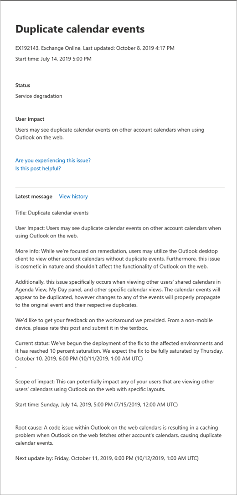

# Come verificare l'integrità dei servizi di Microsoft 365How to check Microsoft 365 service health

You can view the health of your Microsoft services, including Office on the web, Yammer, Microsoft Dynamics CRM, and mobile device management cloud services, on the **Service health** page in the [Microsoft 365 admin center.](https://go.microsoft.com/fwlink/p/?linkid=2024339)You can view the health of your Microsoft services, including Office on the web, Yammer, Microsoft Dynamics CRM, and mobile device management cloud services, on the **Service health** page in the [Microsoft 365 admin center](https://go.microsoft.com/fwlink/p/?linkid=2024339). If you are experiencing problems with a cloud service, you can check the service health to determine whether this is a known issue with a resolution in progress before you call support or spend time troubleshooting.If you are experiencing problems with a cloud service, you can check the service health to determine whether this is a known issue with a resolution in progress before you call support or spend time troubleshooting.

Se non è possibile accedere all'interfaccia di  amministrazione, è possibile utilizzare la pagina dello stato del servizio per verificare la presenza di problemi noti che impediscono l'accesso al tenant.If you are unable to sign in to the admin center, you can use the [service status page](https://status.office365.com) to check for known issues preventing you from logging into your tenant.  Iscriviti anche per seguirci [all'indirizzo @MSFT365status](https://twitter.com/MSFT365Status) su Twitter per visualizzare informazioni su determinati eventi.Also sign up to follow us at [@MSFT365status](https://twitter.com/MSFT365Status) on Twitter to see information on certain events.

  
### Come verificare l'integrità dei serviziHow to check service health

1. Accedere all'interfaccia di amministrazione di Microsoft 365 all'indirizzo [https://admin.microsoft.com](https://go.microsoft.com/fwlink/p/?linkid=2024339) e accedere con un account amministratore.Go to the Microsoft 365 admin center at [https://admin.microsoft.com](https://go.microsoft.com/fwlink/p/?linkid=2024339), and sign in with an admin account.

    > [!NOTE]
    > Gli utenti a cui è assegnato il ruolo di amministratore globale o amministratore del servizio possono visualizzare le informazioni sull'integrità dei servizi.People who are assigned the global admin or service administrator role can view service health. Per consentire agli amministratori di Exchange, SharePoint e Skype for Business di visualizzare tali informazioni, è necessario assegnare anche a loro il ruolo di amministratore del servizio.To allow Exchange, SharePoint, and Skype for Business admins to view service health, they must also be assigned the Service admin role. Per ulteriori informazioni sui ruoli che possono visualizzare l'integrità del servizio, vedere [Informazioni sui ruoli di amministratore.](https://docs.microsoft.com/microsoft-365/admin/add-users/about-admin-roles?view=o365-worldwide&preserve-view=true#roles-available-in-the-microsoft-365-admin-center)For more information about roles that can view service health, see [About admin roles](https://docs.microsoft.com/microsoft-365/admin/add-users/about-admin-roles?view=o365-worldwide&preserve-view=true#roles-available-in-the-microsoft-365-admin-center).
  
2. Se non si utilizza la nuova interfaccia di amministrazione, nella **home** page selezionare l'interruttore Prova la nuova interfaccia di amministrazione nell'angolo superiore destro. If you are not using the new admin center, on the **Home** page, select the **Try the new admin center** toggle in the upper-right corner.

3. Per visualizzare l'integrità dei servizi, nell'interfaccia di amministrazione passare **a** Integrità dei servizi di integrità o selezionare la scheda integrità del servizio nel  >  dashboard **principale.** To view service health, in the admin center, go to **Health** > **Service health**, or select the **Service health** card on the **Home dashboard**. La scheda del dashboard indica se è presente un problema di servizio attivo e collegamenti alla pagina dettagliata **sull'integrità dei** servizi.The dashboard card indicates whether there is an active service issue and links to the detailed **Service health** page.
  
4. Nella pagina **Integrità dei** servizi, lo stato di integrità di ogni servizio cloud viene visualizzato in un formato di tabella.On the **Service health** page, the health state of each cloud service is shown in a table format.

   

Nella **scheda Tutti i** servizi (visualizzazione predefinita) vengono visualizzati tutti i servizi e il relativo stato di integrità corrente.The **All services** tab (the default view) shows all services and their current health state. Un'icona e **la colonna** Stato indicano lo stato di ogni servizio.An icon and the **Status** column indicate the state of each service. 

Per filtrare la visualizzazione in base ai servizi in cui si è verificato un evento imprevisto, selezionare la scheda Eventi **imprevisti** nella parte superiore della pagina.To filter your view to services currently experiencing an incident, select the **Incidents** tab at the top of the page. Se si **seleziona la scheda** Avvisi, verranno visualizzati solo i servizi per cui è stato pubblicato un avviso.Selecting the **Advisories** tab will show only services that currently have an advisory posted. 

La **scheda Cronologia** mostra la cronologia degli eventi imprevisti e degli avvisi che sono stati risolti.The **History** tab shows the history of incidents and advisories that have been resolved.

Se si verifica un problema con un servizio di Microsoft 365 e  non è presente nella pagina Integrità dei servizi, indicarlo selezionando Segnala un problema e completando il breve modulo.If you're experiencing an issue with a Microsoft 365 service and you don’t see it listed on the **Service health** page, tell us about it by selecting **Report an issue**, and completing the short form. Verranno visualizzati i dati e i report correlati di altre organizzazioni per verificare la diffusione del problema e l'origine del servizio.We’ll look at related data and reports from other organizations to see how widespread the issue is, and if it originated with our service. In caso contrario, verrà aggiunto come nuovo evento imprevisto o avviso nella pagina Integrità dei servizi, in cui è possibile tenere traccia della relativa risoluzione. If it did, we’ll add it as a new incident or advisory on the **Service health** page, where you can track its resolution. Se non viene visualizzato nell'elenco entro circa 30 minuti, prendere in considerazione la possibilità di contattare il supporto tecnico per risolvere il problema.If you don’t see it appear on the list within about 30 minutes, consider contacting support to resolve the issue.

Per personalizzare la visualizzazione dei servizi visualizzati nel dashboard, selezionare Visualizzazione personalizzata preferenze e deselezionare le caselle di controllo relative ai servizi che si desidera filtrare dalla visualizzazione dashboard integrità  >  dei servizi.To customize your view of which services show up on the dashboard, select **Preferences** > **Custom view**,  and clear the check boxes for the services you want to filter out of your Service health dashboard view. Verificare che la casella di controllo sia selezionata per ogni servizio che si desidera monitorare.Make sure that the check box is selected for each service that you want to monitor.    

Per registrarsi per ricevere notifiche tramite posta elettronica di nuovi eventi imprevisti che influiscono sul tenant e modifiche di stato per un evento imprevisto attivo, selezionare Preferenze e-mail, fare clic su  >   **Inviami** notifiche di notifica tramite posta elettronica e quindi specificare:To sign up for email notifications of new incidents that affect your tenant and status changes for an active incident, select **Preferences** > **Email**, click **Send me service heath notifications in email**, and then specify:

- Fino a due indirizzi di posta elettronica.Up to two email addresses.
- Se si desiderano notifiche per eventi imprevisti o avvisiWhether you want notifications for incidents or advisories
- Servizi per i quali si desidera notificareThe services for which you want notification

> [!NOTE]
> Ogni amministratore può avere le proprie preferenze impostate e il limite di due indirizzi di posta elettronica sopra indicato è per ogni account amministratore.Each admin can have their Preferences set and the above limit of two email address is per admin account.

> [!TIP]
> È anche possibile usare l'app Amministratore di [Microsoft 365](https://go.microsoft.com/fwlink/p/?linkid=627216) nel dispositivo mobile per visualizzare l'integrità dei servizi, un ottimo modo per rimanere al corrente delle notifiche push.You can also use the [Microsoft 365 Admin app](https://go.microsoft.com/fwlink/p/?linkid=627216) on your mobile device to view Service health, which is a great way to stay current with push notifications. 
  
### Visualizzare i dettagli delle informazioni pubblicate sull'integrità dei serviziView details of posted service health

Nella visualizzazione **Tutti i servizi,** selezionando lo stato del servizio verrà aperta una visualizzazione di riepilogo degli avvisi o degli eventi imprevisti.On the **All services** view, selecting the service status will open a summary view of advisories or incidents.
  

Il riepilogo dell'avviso o dell'evento imprevisto include le informazioni seguenti:The advisory or incident summary provides the following information:

- **Titolo:** un riepilogo del problema.**Title** - A summary of the problem.
- **Service** - Nome del servizio interessato.**Service** - The name of the affected service.
- **ID** - Identificatore numerico del problema.**ID** - A numeric identifier for the problem.
- **Status** : in che modo questo problema influisce sul servizio.**Status** - How this problem affects the service.
- **Ora di** inizio - Ora in cui è stato avviato il problema.**Start time** - The time when the issue started.
- **Last updated-** L'ultima volta in cui il messaggio di integrità del servizio è stato aggiornato.**Last updated** - The last time that the service health message was updated. Vengono inviati messaggi frequenti che consentono di conoscere lo stato di avanzamento dell'applicazione di una soluzione.We post frequent messages to let you know the progress that we're making in applying a solution.

Selezionare il titolo del problema per visualizzare la pagina dei dettagli  del problema, che mostra ulteriori informazioni sul problema, inclusa la cronologia di tutti i messaggi inseriti mentre si lavora a una soluzione.Select the issue title to see the issue detail page, which shows more information about the issue, including the [history](#history) of all messages posted while we work on a solution.

### Tradurre le informazioni sull'integrità dei serviziTranslate service health details

Le spiegazioni sull'integrità dei servizi vengono pubblicate in tempo reale, di conseguenza non vengono tradotte automaticamente nelle varie lingue e i dettagli di un evento del servizio sono disponibili solo in inglese. Per tradurre la spiegazione, seguire questa procedura:Because service health explanations are posted in real-time, they are not automatically translated to your language and the details of a service event are in English only. To translate the explanation, follow these steps:
  
1. Passare a [Translator](https://www.bing.com/translator/).Go to [Translator](https://www.bing.com/translator/).

2. Nella pagina **Integrità dei servizi** selezionare un evento imprevisto o un avviso. In **Mostra dettagli** copiare il testo relativo al problema.On the **Service health** page, select an incident or advisory. Under **Show details**, copy the text about the issue.

3. In Translator incollare il testo e quindi scegliere **Traduci**.In Translator, paste the text and choose **Translate**.

### DefinizioniDefinitions

Nella maggior parte dei casi, i servizi vengono visualizzati come integri senza ulteriori informazioni.Most of the time, services will appear as healthy with no further information. Un problema che si verificato in un servizio viene identificato come avviso o evento imprevisto ed è contraddistinto dallo stato corrente.When a service is having a problem, the issue is identified as either an advisory or an incident and shows a current status.
  
> [!TIP]
> Nelle informazioni sull'integrità dei servizi non vengono visualizzati gli eventi di manutenzione pianificata.Planned maintenance events aren't shown in service health. Per tenere traccia degli eventi di manutenzione pianificata, è possibile consultare le informazioni aggiornate del **Centro messaggi**.You can track planned maintenance events by staying up to date with the **Message center**. Filtrare in base ai messaggi classificati come pianificati per la modifica per scoprire quando avrà luogo la modifica, quale sarà il suo effetto e come prepararsi.Filter to messages categorized as Plan for change to find out when the change is going to happen, its effect, and how to prepare for it. Per altri dettagli, vedere Centro messaggi [in Microsoft 365.](https://support.office.com/article/38fb3333-bfcc-4340-a37b-deda509c2093)See [Message center in Microsoft 365](https://support.office.com/article/38fb3333-bfcc-4340-a37b-deda509c2093) for more details.
  
### Eventi imprevisti e avvisiIncidents and advisories

| IconaIcon | DescrizioneDescription |
|:-----|:-----|
||Se per un servizio è visualizzato un avviso, si tratta di un problema noto che interessa alcuni utenti, ma il servizio è ancora disponibile. In un avviso è spesso inclusa una soluzione alternativa del problema. Il problema potrebbe inoltre essere intermittente o limitato in termini di ambito e impatto sugli utenti.If a service has an advisory shown, we are aware of a problem that is affecting some users, but the service is still available. In an advisory, there is often a workaround to the problem and the problem may be intermittent or is limited in scope and user impact.    |
||Se per un servizio è visualizzato un incidente attivo, si tratta di un problema critico, di conseguenza il servizio o una funzione principale del servizio risulta non disponibile. Gli utenti potrebbero, ad esempio, non riuscire a inviare e ricevere posta elettronica o a eseguire l'accesso. Gli incidenti avranno un notevole impatto sugli utenti. Quando è in corso un incidente, nel dashboard per l'integrità dei servizi vengono fornite informazioni aggiornate sullo stato dell'analisi del problema, le operazioni eseguite per contenerlo e la conferma della risoluzione.If a service has an active incident shown, it's a critical issue and the service or a major function of the service is unavailable. For example, users may be unable to send and receive email or unable to sign-in. Incidents will have noticeable impact to users. When there is an incident in progress, we will provide updates regarding the investigation, mitigation efforts, and confirmation of resolution in the Service health dashboard.    |

### Definizioni degli statiStatus definitions

| StatoStatus | DefinizioneDefinition |
|:-----|:-----|
|**Analisi****Investigating** | Si tratta di un potenziale problema noto per il quale il team Microsoft sta raccogliendo ulteriori informazioni sul comportamento e sulla portata dell'impatto.We're aware of a potential issue and are gathering more information about what's going on and the scope of impact. |
|**Riduzione del servizio****Service degradation** | È stato confermato che si tratta di un problema che potrebbe influire sull'uso di un servizio o di una funzionalità. Questo stato potrebbe essere visualizzato se, ad esempio, si verificano rallentamenti in un servizio, ci sono interruzioni intermittenti oppure se una funzionalità non funziona.We've confirmed that there is an issue that may affect use of a service or feature. You might see this status if a service is performing more slowly than usual, there are intermittent interruptions, or if a feature isn't working, for example. |
|**Interruzione del servizio****Service interruption** | Questo stato viene visualizzato se è stato stabilito che un problema non consente agli utenti di accedere al servizio. In questo caso, il problema è importante e può essere riprodotto più volte.You'll see this status if we determine that an issue affects the ability for users to access the service. In this case, the issue is significant and can be reproduced consistently. |
|**Ripristino del servizio in corso****Restoring service** | La causa del problema è stata identificata, l'azione correttiva è nota e il servizio verrà ripristinato a breve.The cause of the issue has been identified, we know what corrective action to take, and are in the process of bringing the service back to a healthy state. |
|**Ripristino esteso****Extended recovery** | Questo stato indica che è in corso un'azione correttiva per ripristinare il servizio per la maggior parte degli utenti, ma il ripristino di tutti i sistemi interessati potrebbe richiedere più tempo. Questo stato viene visualizzato anche se è stata applicata una soluzione temporanea per limitare l'impatto in attesa di una correzione permanente.This status indicates that corrective action is in progress to restore service to most users but will take some time to reach all the affected systems. You might also see this status if we've made a temporary fix to reduce impact while we wait to apply a permanent fix. |
|**Analisi sospesa****Investigation suspended** | Questo stato viene visualizzato se, in seguito all'analisi dettagliata di un potenziale problema, il team di supporto deve richiedere maggiori informazioni ai clienti. In tal caso, il team comunicherà all'utente quali dati e log sono necessari.If our detailed investigation of a potential issue results in a request for additional information from customers to allow us to investigate further, you'll see this status. If we need you to act, we'll let you know what data or logs we need. |
|**Servizio ripristinato****Service restored** | È stato verificato che l'azione correttiva ha consentito di risolvere il problema sottostante e il servizio è stato ripristinato. Per scoprire la causa dell'errore, visualizzare i dettagli del problema.We've confirmed that corrective action has resolved the underlying problem and the service has been restored to a healthy state. To find out what went wrong, view the issue details. |
|**Falso positivo****False positive** | Dopo un'indagine dettagliata, abbiamo confermato che il servizio è integro e operativo come progettato.After a detailed investigation, we’ve confirmed the service is healthy and operating as designed. Non è stato rilevato alcun impatto sul servizio o la causa dell'incidente ha avuto origine all'esterno del servizio.No impact to the service was observed or the cause of the incident originated outside of the service. |
|**Report post-evento imprevisto pubblicato****Post-incident report published** | We've published a Post Incident Report for a specific issue that includes root cause information and next steps to ensure a similar issue doesn't reoccur.We’ve published a Post Incident Report for a specific issue that includes root cause information and next steps to ensure a similar issue doesn’t reoccur. |

### CronologiaHistory

L'integrità dei servizi consente di esaminare lo stato di integrità corrente e di visualizzare la cronologia degli avvisi e degli eventi imprevisti che hanno interessato il tenant negli ultimi 30 giorni.Service health lets you look at current health status and view the history of any service advisories and incidents that have affected your tenant in the past 30 days. Per visualizzare l'integrità passata di tutti i servizi, selezionare **Visualizza cronologia** nella pagina dei dettagli del problema.To view the past health of all services, select **View history** on the issue detail page.
  

  
Viene visualizzato un elenco di tutti i messaggi di integrità dei servizi pubblicati nell'intervallo di tempo selezionato, come illustrato di seguito:A list of all service health messages posted in the selected timeframe is displayed, as shown below:
  

  
Espandere una riga qualsiasi per visualizzare ulteriori dettagli sul problema.Expand any row to view more details about the issue.
  
Per altre informazioni sul nostro impegno per il tempo di attività, vedere [Operazioni trasparenti da Microsoft 365.](https://go.microsoft.com/fwlink/?linkid=848695)For more information about our commitment to uptime, see [Transparent operations from Microsoft 365](https://go.microsoft.com/fwlink/?linkid=848695).

## Argomenti correlatiRelated topics

[Report attività nell'interfaccia di amministrazione di](https://support.office.com/article/0d6dfb17-8582-4172-a9a9-aed798150263) 
 Microsoft 365 [Preferenze del Centro messaggi](https://docs.microsoft.com/microsoft-365/admin/manage/message-center?view=o365-worldwide&preserve-view=true#preferences11)[Activity Reports in the Microsoft 365 admin center](https://support.office.com/article/0d6dfb17-8582-4172-a9a9-aed798150263)
[Message center Preferences](https://docs.microsoft.com/microsoft-365/admin/manage/message-center?view=o365-worldwide&preserve-view=true#preferences11)
