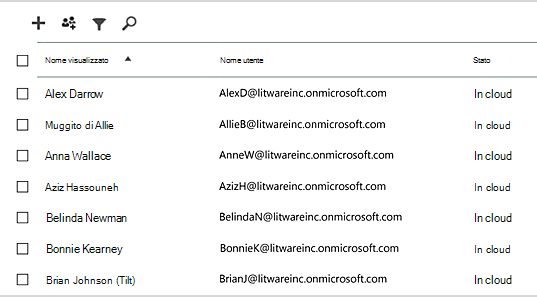
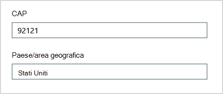
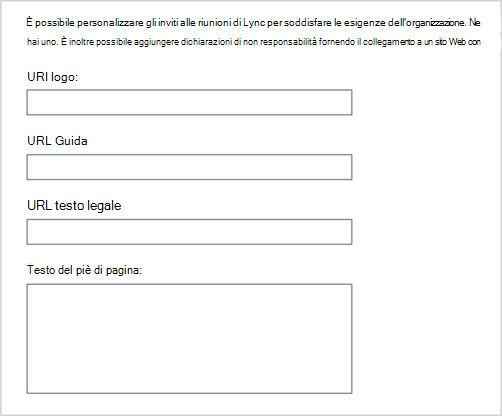
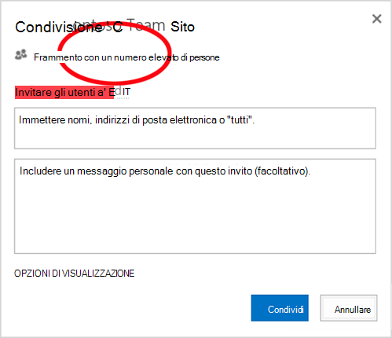
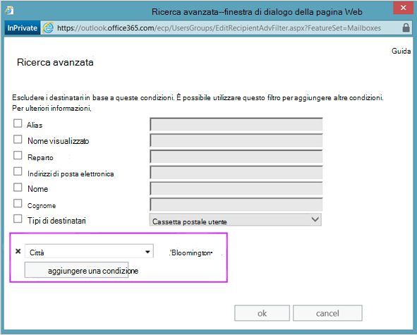
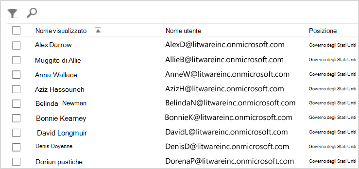
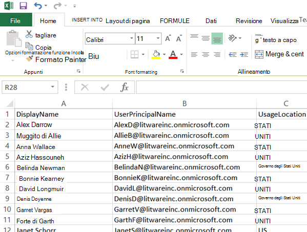
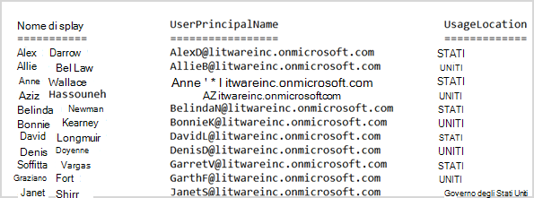

# <a name="why-you-need-to-use-powershell-for-microsoft-365"></a>Perché è necessario usare PowerShell per Microsoft 365

*Questo articolo si applica sia a Microsoft 365 Enterprise che a Office 365 Enterprise*.

Con il interfaccia di amministrazione di Microsoft 365, è possibile gestire le licenze e gli Microsoft 365 utente. È inoltre possibile gestire i servizi Microsoft 365, ad esempio Exchange Online, Teams e SharePoint Online. Se invece si utilizza PowerShell per gestire questi servizi, è possibile e sfruttare l'ambiente della riga di comando e del linguaggio di script per velocizzare, automazione e funzionalità aggiuntive.

In questo articolo viene illustrato come usare PowerShell per gestire Microsoft 365 per:

- Rivelare informazioni aggiuntive che non è possibile visualizzare nella interfaccia di amministrazione di Microsoft 365

- Configurare le funzionalità e le impostazioni solo con PowerShell

- Eseguire operazioni in blocco

- Filtrare i dati

- Stampare o salvare dati

- Gestire tra i servizi

Tenere presente che PowerShell per Microsoft 365 è un set di moduli per Windows PowerShell, ovvero un ambiente da riga di comando per piattaforme e servizi basati su Windows. Questo ambiente crea un linguaggio della shell dei comandi che può essere esteso con moduli aggiuntivi. Consente di eseguire comandi o script semplici o complessi. Ad esempio, dopo aver installato PowerShell per i moduli Microsoft 365 e aver eseguito la connessione alla sottoscrizione di Microsoft 365, è possibile eseguire il comando seguente per elencare tutte le cassette postali utente per Microsoft Exchange Online:

```powershell
Get-Mailbox
```

È anche possibile ottenere l'elenco delle cassette postali utilizzando il interfaccia di amministrazione di Microsoft 365, ma il conteggio degli elementi in tutti gli elenchi per tutti i siti per tutte le app Web non è facile.

PowerShell per Microsoft 365 è progettato per facilitare la gestione Microsoft 365, non per sostituire il interfaccia di amministrazione di Microsoft 365. Gli amministratori devono essere in grado di usare PowerShell per Microsoft 365 perché esistono alcune procedure di configurazione che possono essere eseguite solo tramite PowerShell per Microsoft 365 comandi. In questi casi, è necessario sapere come:

- Installare PowerShell per i Microsoft 365 (operazione eseguita una sola volta per ogni computer amministratore).

- Connessione alla sottoscrizione Microsoft 365 (una sola volta per ogni sessione di PowerShell).

- Raccogliere le informazioni necessarie per eseguire PowerShell necessario per Microsoft 365 comandi.

- Eseguire PowerShell per Microsoft 365 comandi.

Dopo aver appreso queste competenze di base, non è necessario elencare gli utenti delle cassette postali utilizzando il **comando Get-Mailbox.** Non è inoltre necessario comprendere come creare un nuovo comando come il comando citato in precedenza per contare tutti gli elementi in tutti gli elenchi per tutti i siti per tutte le app Web. Microsoft e la community di amministratori possono aiutarti a eseguire tali attività in base alle esigenze.

## <a name="powershell-for-microsoft-365-can-reveal-information-that-you-cant-see-with-the-microsoft-365-admin-center"></a>PowerShell per Microsoft 365 può rivelare informazioni che non è possibile visualizzare con il interfaccia di amministrazione di Microsoft 365

Il interfaccia di amministrazione di Microsoft 365 visualizza molte informazioni utili. Non vengono tuttavia visualizzate tutte le informazioni possibili archiviate Microsoft 365 utenti, licenze, cassette postali e siti. Ecco un esempio per *utenti e gruppi* nell'interfaccia di amministrazione di Microsoft 365:



Questa visualizzazione fornisce le informazioni necessarie in molti casi. Tuttavia, in alcuni casi sono necessarie informazioni aggiuntive. Ad esempio, Microsoft 365 licenze (e le Microsoft 365 disponibili per un utente) dipendono in parte dalla posizione geografica dell'utente. I criteri e le funzionalità che è possibile estendere a un utente che risiede negli Stati Uniti potrebbero non essere uguali a quelli che è possibile estendere a un utente in India o Belgio. Segui questi passaggi nella interfaccia di amministrazione di Microsoft 365 per determinare la posizione geografica di un utente:

1. Fare doppio clic sul **Nome visualizzato** dell'utente.

2. Nel riquadro di visualizzazione delle proprietà dell'utente selezionare **details**.

3. Nella visualizzazione dei dettagli, selezionare **ulteriori dettagli.**

4. Scorrere fino a trovare **l'intestazione Paese o area geografica**:

     

5. Prendere nota del nome visualizzato e della posizione dell'utente su un pezzo di carta o copiarlo e incollarlo nel Blocco note.

È necessario ripetere questa procedura per ogni utente. Se si dispone di molti utenti, questo processo può essere noioso. Con PowerShell per Microsoft 365, è possibile visualizzare queste informazioni per tutti gli utenti utilizzando il comando seguente:

```powershell
Get-AzureADUser | Select DisplayName, UsageLocation
```


>[!Note]
>PowerShell Core non supporta il modulo Microsoft Azure Active Directory per Windows PowerShell e i cmdlet con *Msol* nel nome. È necessario eseguire questi cmdlet da Windows PowerShell.
>

Ecco un esempio dei risultati:

```powershell
DisplayName                               UsageLocation
-----------                               -------------
Bonnie Kearney                            GB
Fabrice Canel                             BR
Brian Johnson (TAILSPIN)                  US
Anne Wallace                              US
Alex Darrow                               US
David Longmuir                            BR
```

L'interpretazione di questo comando di PowerShell è: Ottenere tutti gli utenti nella sottoscrizione di Microsoft 365 corrente (**Get-AzureADUser**), ma visualizzare solo il nome e il percorso di ogni utente (**Selezionare DisplayName, UsageLocation**).

Poiché PowerShell per Microsoft 365 supporta un linguaggio della shell dei comandi, è possibile modificare ulteriormente le informazioni ottenute dal **comando Get-AzureADUser.** Ad esempio, è possibile ordinare questi utenti in base alla posizione, raggruppando tutti gli utenti brasiliani, tutti gli utenti degli Stati Uniti e così via. Ecco il comando:

```powershell
Get-AzureADUser | Select DisplayName, UsageLocation | Sort UsageLocation, DisplayName
```

Ecco un esempio dei risultati:

```powershell
DisplayName                                 UsageLocation
-----------                                 -------------
David Longmuir                              BR
Fabrice Canel                               BR
Bonnie Kearney                              GB
Alex Darrow                                 US
Anne Wallace                                US
Brian Johnson (TAILSPIN)                    US
```

L'interpretazione di questo comando di PowerShell è: Ottenere tutti gli utenti nella sottoscrizione Microsoft 365 corrente, ma visualizzare solo il nome e la posizione di ogni utente e ordinarli prima in base alla posizione e quindi al nome (**Sort UsageLocation, DisplayName**).

È inoltre possibile utilizzare filtri aggiuntivi. Ad esempio, se si desidera visualizzare tali informazioni sugli utenti residenti in Brasile, utilizzare questo comando:

```powershell
Get-AzureADUser | Where {$_.UsageLocation -eq "BR"} | Select DisplayName, UsageLocation
```

Ecco un esempio dei risultati:

```powershell
DisplayName                                           UsageLocation
-----------                                           -------------
David Longmuir                                        BR
Fabrice Canel                                         BR
```

L'interpretazione di questo comando di PowerShell è: Ottenere tutti gli utenti nella sottoscrizione di Microsoft 365 corrente la cui posizione è Il Brasile (**Dove {$ \_ . UsageLocation -eq "BR"}**) e quindi visualizzare il nome e il percorso per ogni utente.

 **Nota sui domini di grandi dimensioni**

Se si dispone di un dominio di grandi dimensioni con decine di migliaia di utenti, provare alcuni degli esempi illustrati in questo articolo potrebbe causare limitazioni. In base a fattori come la potenza di calcolo e la larghezza di banda di rete disponibile, è possibile che si stia tentando di eseguire troppe attività contemporaneamente. Le organizzazioni di grandi dimensioni potrebbero voler dividere alcune di queste operazioni di PowerShell in due comandi.

Ad esempio, il comando seguente restituisce tutti gli account utente e mostra il nome e il percorso di ognuno:

```powershell
Get-AzureADUser | Select DisplayName, UsageLocation
```

Questa operazione funziona perfettamente per i domini più piccoli. In un'organizzazione di grandi dimensioni, tuttavia, è possibile suddividere l'operazione in due comandi: un comando per archiviare le informazioni sull'account utente in una variabile e un altro per visualizzare le informazioni necessarie. Di seguito viene riportato un esempio:

```powershell
$x = Get-AzureADUser
$x | Select DisplayName, UsageLocation
```

L'interpretazione di questo set di comandi di PowerShell è:
1. Recuperare tutti gli utenti nella sottoscrizione Microsoft 365 corrente e archiviare le informazioni in una variabile denominata $x (**$x = Get-AzureADUser**).
1.  Visualizzare il contenuto della *variabile*$x , ma includere solo il nome e la posizione per ogni utente (**$x | Selezionare DisplayName, UsageLocation**.

## <a name="microsoft-365-has-features-that-you-can-only-configure-with-powershell-for-microsoft-365"></a>Microsoft 365 funzionalità che è possibile configurare solo con PowerShell per Microsoft 365

Il interfaccia di amministrazione di Microsoft 365 è progettato per fornire l'accesso alle attività amministrative comuni e utili che si applicano alla maggior parte degli ambienti. In altre parole, il interfaccia di amministrazione di Microsoft 365 è stato progettato in modo che l'amministratore tipico possa eseguire le attività di gestione più comuni. Tuttavia, alcune attività non possono essere eseguite nell'interfaccia di amministrazione.

Ad esempio, l'Skype for Business di amministrazione di Skype for Business Online offre alcune opzioni per la creazione di inviti a riunioni personalizzati:



Con queste impostazioni, è possibile aggiungere un tocco di personalizzazione e professionalità alle convocazioni di riunioni. Tuttavia, le impostazioni di configurazione delle riunioni sono molto di più rispetto alla semplice creazione di inviti a riunioni personalizzati. Ad esempio, per impostazione predefinita le riunioni consentono:

- A utenti anonimi di ottenere l'ingresso automatico a ogni riunione.

- Ai partecipanti di registrare una riunione.

- A tutti gli utenti dell'organizzazione di essere designati come relatori quando partecipano a riunione.

Queste impostazioni non sono disponibili nell'interfaccia Skype for Business di amministrazione di Skype for Business Online. È possibile controllarli da PowerShell per Microsoft 365. Ecco un comando che disabilita queste tre impostazioni:

```powershell
Set-CsMeetingConfiguration -AdmitAnonymousUsersByDefault $False -AllowConferenceRecording $False -DesignateAsPresenter "None"
```

> [!NOTE]
> Per eseguire questo comando, è necessario installare il [modulo di PowerShell Skype for Business Online.](https://www.microsoft.com/download/details.aspx?id=39366)

L'interpretazione di questo comando di PowerShell è:

1. Nelle impostazioni per le nuove riunioni Skype for Business Online (**Set-CsMeetingConfiguration**), disabilitare l'accesso automatico agli utenti anonimi alle riunioni (**-AdmitAnonymousUsersByDefault $False**).
2.  Disabilitare la possibilità per i partecipanti di registrare le riunioni (**-AllowConferenceRecording $False**).
3. Non designare tutti gli utenti dell'organizzazione come relatori (**-DesignateAsPresenter "None"**).

Per ripristinare queste impostazioni predefinite (abilitare le opzioni), eseguire questo comando:

```powershell
Set-CsMeetingConfiguration -AdmitAnonymousUsersByDefault $True -AllowConferenceRecording $True -DesignateAsPresenter "Company"
```

Esistono anche altri scenari simili, motivo per cui gli amministratori dovrebbero sapere come eseguire PowerShell per Microsoft 365 comandi.

## <a name="powershell-for-microsoft-365-is-great-for-bulk-operations"></a>PowerShell per Microsoft 365 è ideale per le operazioni in blocco

Le interfacce visive come interfaccia di amministrazione di Microsoft 365 sono particolarmente utili quando è necessario eseguire una singola operazione. Ad esempio, se è necessario disabilitare un account utente, è possibile utilizzare l'interfaccia di amministrazione per individuare e deselezionare rapidamente una casella di controllo. Questo può essere più semplice rispetto all'esecuzione di un'operazione simile in PowerShell.

Tuttavia, se è necessario modificare molte cose o alcuni elementi selezionati in un ampio set di altri elementi, il interfaccia di amministrazione di Microsoft 365 potrebbe non essere lo strumento migliore. Ad esempio, si supponga che sia necessario modificare il prefisso su migliaia di numeri di telefono o rimuovere l'utente specifico *Ken Myer* da tutti i siti SharePoint Online. Come eseguire questa operazione nell'interfaccia di amministrazione di Microsoft 365?

Per l'ultimo esempio, si supponga di avere diverse centinaia di siti SharePoint Online e di non sapere di quali siti è membro Ken Meyer. È necessario iniziare dal interfaccia di amministrazione di Microsoft 365 ed eseguire questa procedura per ogni sito:

1. Selezionare **l'URL** del sito.

2. Nella casella **proprietà raccolta siti** selezionare il collegamento Indirizzo sito **Web** per aprire il sito.

3. Nel sito selezionare **Condividi**.

4. Nella finestra **di** dialogo Condividi selezionare il collegamento che mostra tutti gli utenti che dispongono delle autorizzazioni per il sito:

     

5. Nella finestra **di dialogo** Condivisi con selezionare **Avanzate.**

6. Scorrere verso il basso l'elenco degli utenti, trovare e selezionare Ken Myer (presupponendo che abbia le autorizzazioni per il sito), quindi **selezionare Rimuovi autorizzazioni utente**.

Questa operazione potrebbe richiedere *molto tempo* per diverse centinaia di siti.

L'alternativa consiste nell'eseguire il comando seguente in PowerShell per Microsoft 365 rimuovere Ken Myer da tutti i siti:

```powershell
Get-SPOSite | ForEach {Remove-SPOUser -Site $_.Url -LoginName "kenmyer@litwareinc.com"}
```

> [!NOTE]
> Questo comando richiede l'installazione del [SharePoint PowerShell online.](/powershell/sharepoint/sharepoint-online/connect-sharepoint-online?view=sharepoint-ps)

L'interpretazione di questo comando di PowerShell è: Ottenere tutti i siti di SharePoint nella sottoscrizione Microsoft 365 corrente (**Get-SPOSite**) e per ogni sito rimuovere Ken Meyer dall'elenco degli utenti che possono accedervi (**ForEach {Remove-SPOUser -Site $ \_ . Url -LoginName "kenmyer \@ litwareinc.com"}**).

Microsoft Microsoft 365 rimuovere Ken Meyer da ogni sito, inclusi quelli a cui non ha accesso. I risultati mostreranno quindi gli errori per i siti a cui non ha accesso. Possiamo usare una condizione aggiuntiva su questo comando per rimuovere Ken Meyer solo dai siti che lo hanno nell'elenco di accesso. Tuttavia, gli errori restituiti non causano alcun danno ai siti stessi. L'esecuzione di questo comando in centinaia di siti potrebbe richiedere alcuni minuti, anziché ore di lavoro nell'interfaccia di amministrazione di Microsoft 365.

Ecco un altro esempio di operazione in blocco. Utilizzare questo comando per aggiungere *Bonnie Kearney*, un nuovo SharePoint amministratore, a tutti i siti dell'organizzazione:

```powershell
Get-SPOSite | ForEach {Add-SPOUser -Site $_.Url -LoginName "bkearney@litwareinc.com" -Group "Members"}
```

L'interpretazione di questo comando di PowerShell è: Ottenere tutti i siti di SharePoint nella sottoscrizione Microsoft 365 corrente e per ogni sito consentire l'accesso a Bonnie Kearney aggiungendo il nome di accesso al gruppo Membri del sito (**ForEach {Add-SPOUser -Site $ \_ . Url -LoginName "bkearney \@ litwareinc.com" -Group "Members"}**).

## <a name="powershell-for-microsoft-365-is-great-at-filtering-data"></a>PowerShell per Microsoft 365 è ideale per filtrare i dati

Il interfaccia di amministrazione di Microsoft 365 offre diversi modi per filtrare i dati per individuare facilmente un sottoinsieme di informazioni mirato. Ad esempio, Exchange facilita il filtro di qualsiasi proprietà relativa alla cassetta postale di un utente. Ad esempio, ecco l'elenco delle cassette postali per tutti gli utenti che vivono nella città di Bloomington:



L'interfaccia di amministrazione di Exchange consente di combinare i criteri di filtro. Ad esempio, è possibile trovare le cassette postali per tutte le persone che vivono a Bloomington e lavorano nel reparto Finance.

Tuttavia, esistono limitazioni per le attività che è possibile eseguire nell'Exchange di amministrazione. Ad esempio, non è possibile trovare facilmente le cassette postali delle persone che vivono a *Bloomington* o San Diego o le cassette postali per tutte le persone che non vivono a Bloomington.

È possibile utilizzare il seguente comando powershell per Microsoft 365 per ottenere un elenco di cassette postali per tutte le persone che vivono a Bloomington o San Diego:

```powershell
Get-User | Where {$_.RecipientTypeDetails -eq "UserMailbox&quot; -and ($_.City -eq &quot;San Diego&quot; -or $_.City -eq &quot;Bloomington")} | Select DisplayName, City
```

Ecco un esempio dei risultati:

```powershell
DisplayName                              City
-----------                              ----
Alex Darrow                              San Diego
Bonnie Kearney                           San Diego
Julian Isla                              Bloomington
Rob Young                                Bloomington
```

L'interpretazione di questo comando di PowerShell è: Ottenere tutti gli utenti nella sottoscrizione Microsoft 365 corrente che dispongono di una cassetta postale nella città di San Diego o Bloomington (**Dove {$ \_ . RecipientTypeDetails -eq "UserMailbox" -and ($ \_ . City -eq "San Diego" -or $ \_ . City -eq "Bloomington")}**), quindi visualizzare il nome e la città per ognuno (**Select DisplayName, City**).

Ed ecco il comando per elencare tutte le cassette postali per le persone che vivono ovunque tranne Bloomington:

```powershell
Get-User | Where {$_.RecipientTypeDetails -eq "UserMailbox" -and $_.City -ne "Bloomington"} | Select DisplayName, City
```

Ecco un esempio dei risultati:

```powershell
DisplayName                               City
-----------                               ----
MOD Administrator                         Redmond
Alex Darrow                               San Diego
Allie Bellew                              Bellevue
Anne Wallace                              Louisville
Aziz Hassouneh                            Cairo
Belinda Newman                            Charlotte
Bonnie Kearney                            San Diego
David Longmuir                            Waukesha
Denis Dehenne                             Birmingham
Garret Vargas                             Seattle
Garth Fort                                Tulsa
Janet Schorr                              Bellevue
```

L'interpretazione di questo comando di PowerShell è: Ottenere tutti gli utenti nella sottoscrizione Microsoft 365 corrente che dispongono di una cassetta postale non situata nella città di Bloomington (**Dove {$ \_ . RecipientTypeDetails -eq "UserMailbox" -e $ \_ . City -ne "Bloomington"}**), quindi visualizzare il nome e la città per ognuno.

### <a name="use-wildcards"></a>Utilizzare caratteri jolly

È inoltre possibile utilizzare i caratteri jolly nei filtri di PowerShell per trovare una corrispondenza di parte di un nome. Si supponga, ad esempio, di cercare un account utente. Tutto quello che puoi ricordare è che il cognome dell'utente era *Anderson* o *forse Henderson* o *Jorgenson.*

È possibile tenere traccia dell'utente nel interfaccia di amministrazione di Microsoft 365 utilizzando lo strumento di ricerca ed eseguendo tre ricerche diverse:

- Una per  *Anderson*

- Una per  *Henderson*

- Una per  *Jorgenson*

Poiché tutti e tre questi nomi terminano con "figlio", è possibile indicare a PowerShell di visualizzare tutti gli utenti il cui nome termina con "figlio". Ecco il comando:

```powershell
Get-User -Filter '{LastName -like "*son"}'
```

L'interpretazione di questo comando di PowerShell è: Ottenere tutti gli utenti nella sottoscrizione Microsoft 365 corrente, ma utilizzare un filtro che elenca solo gli utenti il cui cognome termina con "son" (**-Filter '{LastName -like " \* son"}'**). \*L'acronimo di qualsiasi set di caratteri, ovvero lettere nel cognome dell'utente.

## <a name="powershell-for-microsoft-365-makes-it-easy-to-print-or-save-data"></a>PowerShell per Microsoft 365 semplifica la stampa o il salvataggio dei dati

Il interfaccia di amministrazione di Microsoft 365 consente di visualizzare elenchi di dati. Ecco un esempio dell'interfaccia di amministrazione di Skype for Business Online che visualizza un elenco di utenti abilitati per Skype for Business Online:



Per salvare le informazioni in un file, è necessario incollarle in un documento o Microsoft Excel foglio di lavoro. In entrambi i casi potrebbe essere necessaria una formattazione aggiuntiva. Inoltre, il interfaccia di amministrazione di Microsoft 365 non consente di stampare direttamente l'elenco visualizzato.

Fortunatamente, è possibile utilizzare PowerShell non solo per visualizzare l'elenco, ma anche per salvarlo in un file facilmente importabile in Excel. Ecco un comando di esempio per salvare i dati utente di Skype for Business Online in un file CSV (Comma Separated Values), che può quindi essere facilmente importato come tabella in un foglio di lavoro di Excel:

```powershell
Get-CsOnlineUser | Select DisplayName, UserPrincipalName, UsageLocation | Export-Csv -Path "C:\Logs\SfBUsers.csv" -NoTypeInformation
```

Ecco un esempio dei risultati:



L'interpretazione di questo comando di PowerShell è: Ottenere tutti gli utenti di Skype for Business Online nella sottoscrizione Microsoft 365 corrente (**Get-CsOnlineUser**); ottenere solo il nome utente, l'UPN e il percorso (**Select DisplayName, UserPrincipalName, UsageLocation**); e quindi salvare le informazioni in un file CSV denominato C: \\ Logs \\SfBUsers.csv (**Export-Csv -Path "C: \\ Logs \\SfBUsers.csv" -NoTypeInformation**).

È inoltre possibile utilizzare le opzioni per salvare l'elenco come file XML o come pagina HTML. Infatti, con altri comandi di PowerShell, è possibile salvarlo direttamente come file Excel, con qualsiasi formattazione personalizzata desiderata.

È inoltre possibile inviare l'output di un comando di PowerShell che visualizza un elenco direttamente alla stampante predefinita in Windows. Ecco un comando di esempio:

```powershell
Get-CsOnlineUser | Select DisplayName, UserPrincipalName, UsageLocation | Out-Printer
```

Di seguito, è riportato l'aspetto del documento stampato:



L'interpretazione di questo comando di PowerShell è: Ottenere tutti gli utenti di Skype for Business Online nella sottoscrizione Microsoft 365 corrente; ottenere solo il nome utente, l'UPN e il percorso; e quindi inviare le informazioni alla stampante Windows predefinita (**Out-Printer**).

Il documento stampato ha la stessa formattazione semplice della visualizzazione nella finestra di comando di PowerShell. Per ottenere una copia completa, è sufficiente **aggiungere | Out-Printer** alla fine del comando.

## <a name="powershell-for-microsoft-365-lets-you-manage-across-server-products"></a>PowerShell per Microsoft 365 consente di gestire i prodotti server

I componenti che costituiscono Microsoft 365 sono progettati per funzionare insieme. Si supponga, ad esempio, di aggiungere un nuovo utente a Microsoft 365 e di specificare informazioni quali il reparto e il numero di telefono dell'utente. Queste informazioni saranno quindi disponibili se si accede alle informazioni dell'utente in uno dei servizi Microsoft 365: Skype for Business Online, Exchange o SharePoint.

Si tratta di informazioni generali che interessano la famiglia di prodotti. Le informazioni specifiche del prodotto, ad esempio le informazioni sulla cassetta Exchange di un utente, in genere non sono disponibili nella famiglia di prodotti. Ad esempio, le informazioni sull'abilita o meno della cassetta postale di un utente sono disponibili solo nell'Exchange di amministrazione.

Si supponga di voler creare un report che mostra le seguenti informazioni per tutti gli utenti:

- Nome visualizzato dell'utente

- Indica se l'utente ha una licenza per Microsoft 365

- L'abilitazione della cassetta postale di Exchange dell'utente.

- L'abilitazione per Skype for Business online dell'utente

Non è possibile produrre facilmente un report di questo tipo nell'interfaccia di amministrazione di Microsoft 365. Al contrario, è necessario creare un documento separato per archiviare le informazioni, ad esempio un foglio Excel foglio di lavoro. Quindi, ottenere tutti i nomi utente e le informazioni sulla licenza dal interfaccia di amministrazione di Microsoft 365, ottenere le informazioni sulla cassetta postale dall'interfaccia di amministrazione di Exchange, ottenere le informazioni di Skype for Business Online dall'interfaccia di amministrazione di Skype for Business Online e quindi combinare queste informazioni.

L'alternativa consiste nell'usare uno script di PowerShell per compilare il report.

Lo script di esempio seguente è più complicato rispetto ai comandi finora visualizzati in questo articolo. Tuttavia, mostra la possibilità di usare PowerShell per creare visualizzazioni delle informazioni difficili da ottenere in caso contrario. Ecco lo script per compilare e visualizzare l'elenco necessario:

```powershell
$x = Get-AzureADUser

foreach ($i in $x)
    {
      $y = Get-Mailbox -Identity $i.UserPrincipalName
      $i | Add-Member -MemberType NoteProperty -Name IsMailboxEnabled -Value $y.IsMailboxEnabled

      $y = Get-CsOnlineUser -Identity $i.UserPrincipalName
      $i | Add-Member -MemberType NoteProperty -Name EnabledForSfB -Value $y.Enabled
    }

$x | Select DisplayName, IsLicensed, IsMailboxEnabled, EnabledforSfB
```

Ecco un esempio dei risultati:

```powershell
DisplayName             IsLicensed   IsMailboxEnabled   EnabledForSfB
-----------             ----------   ----------------   --------------
Bonnie Kearney          True         True               True
Fabrice Canel           True         True               True
Brian Johnson           False        True               False
Anne Wallace            True         True               True
Alex Darrow             True         True               True
David Longmuir          True         True               True
Katy Jordan             False        True               False
Molly Dempsey           False        True               False
```

L'interpretazione di questo script di PowerShell è:

1. Recuperare tutti gli utenti nella sottoscrizione Microsoft 365 corrente e archiviare le informazioni in una variabile denominata *$x* (**$x = Get-AzureADUser**).
1. Avviare un ciclo che viene eseguito su tutti gli utenti nella variabile $x (**foreach ($i in $x).**
1. Definire una variabile denominata *$y* e archiviare le informazioni sulla cassetta postale dell'utente (**$y = Get-Mailbox -Identity $i.UserPrincipalName**).
1. Aggiungere una nuova proprietà alle informazioni utente denominate *IsMailBoxEnabled.* Impostarlo sul valore della proprietà IsMailBoxEnabled della cassetta postale dell'utente (**$i | Add-Member -MemberType NoteProperty -Name IsMailboxEnabled -Value $y.IsMailboxEnabled**).
1. Definire una variabile denominata *$y* e archiviare le informazioni di Skype for Business Online dell'utente (**$y = Get-CsOnlineUser -Identity $i.UserPrincipalName**).
1. Aggiungere una nuova proprietà alle informazioni utente denominate *EnabledForSfB.* Impostarlo sul valore della proprietà Enabled delle informazioni di Skype for Business Online dell'utente (**$i | Add-Member -MemberType NoteProperty -Name EnabledForSfB -Value $y.Enabled**).
1. Visualizzare l'elenco degli utenti, ma includere solo il nome, se sono concessi in licenza e le due nuove proprietà che indicano se la cassetta postale è abilitata e se sono abilitati per Skype for Business Online (**$x | Selezionare DisplayName, IsLicensed, IsMailboxEnabled, EnabledforSfB**.

## <a name="see-also"></a>Vedere anche

[Guida introduttiva a PowerShell per Microsoft 365](getting-started-with-microsoft-365-powershell.md)

[Gestire gli account utente, le licenze e i gruppi di Microsoft 365 con PowerShell](manage-user-accounts-and-licenses-with-microsoft-365-powershell.md)

[Usare Windows PowerShell per creare report in Microsoft 365](use-windows-powershell-to-create-reports-in-microsoft-365.md)