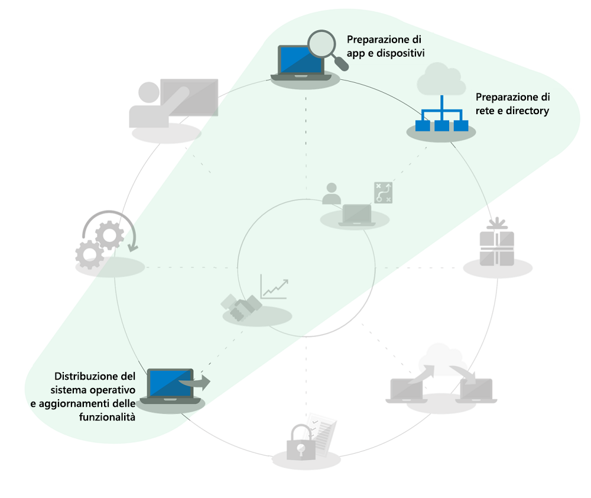
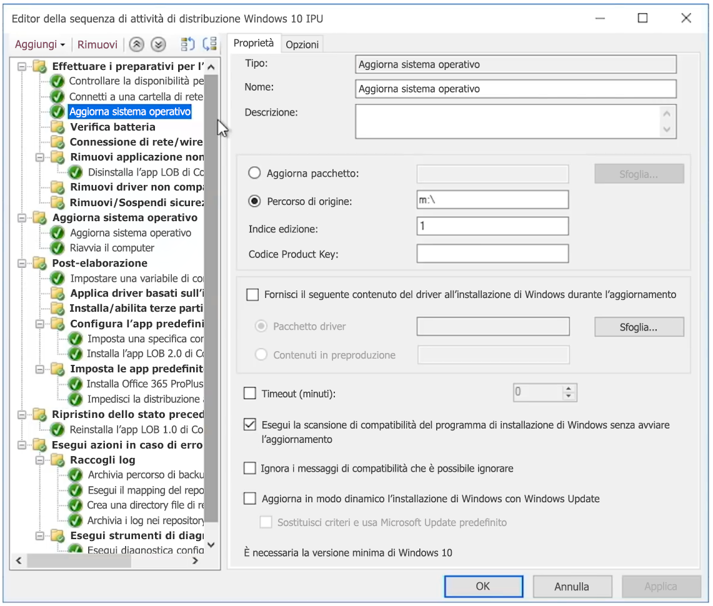

# Aggiornamenti sul posto automatici da Windows 7 a Windows 10 per organizzazioni di grandi dimensioni

A partire dal 14 gennaio 2020, gli aggiornamenti della sicurezza o il supporto per PC che eseguono Windows 7 non sono più disponibili. Per il passaggio da Windows 7 a Windows 10 con diverse opzioni di distribuzione disponibili, la domanda più comune nella community IT è "Qual è il modo più rapido per passare da Windows 7 a Windows 10?" La risposta breve è quella di eseguire gli aggiornamenti sul posto per i PC esistenti, in modo da poter ridurre l'attenzione su vari aspetti del processo di distribuzione desktop.

Con gli aggiornamenti sul posto, l'ambito di diversi processi di distribuzione desktop viene ridotto in modo significativo, in particolare:

  - **Creazione del pacchetto di applicazioni** e nuovo recapito delle app line-of-business richieste: queste vengono semplicemente ereditate dall'ambiente Windows 7.

  - **Migrazione** dei file e impostazioni utente di base: anche queste sono ereditate dall'installazione precedente se il dispositivo viene mantenuto dallo stesso utente

Le attività disattivate nel grafico a ruota del processo di distribuzione sopra riportato non sono elementi che è possibile ignorare completamente, ma per risparmiare tempo si presuppone che la configurazione della sicurezza venga anticipata, che i processi di aggiornamento software successivi alla distribuzione vengano modificati e che la formazione degli utenti per il componente Windows sia stata eseguita in gran parte a casa degli utenti, dal momento che i computer Windows acquistati privatamente dal 2012, per la maggior parte non avevano Windows 7 precaricato e dopo il rilascio di Windows 10 nel 2015, anche la maggior parte degli home system Windows 7 è stata aggiornata a Windows 10.

## Affidabilità degli aggiornamenti sul posto, misure di sicurezza e scalabilità

Gli aggiornamenti sul posto a Windows 10 rappresentano un approccio affidabile per far passare un dispositivo esistente che esegue Windows 7 o versione successiva, a Windows 10 senza dover eseguire la migrazione dei file o la reinstallazione delle applicazioni. Dopo l'aggiornamento sul posto, i file, le impostazioni e le app disponibili dell'utente sono coerenti con l'installazione precedente di Windows 7. Gli aggiornamenti funzionano anche se il passaggio avviene tra architetture simili (da 32 bit a 32 bit o da 64 bit a 64 bit) e tra versioni di Windows simili tra loro (da Professional a Pro o da Enterprise a Enterprise).

Per impostazione predefinita, il processo di aggiornamento esegue il backup dell'installazione precedente di Windows come parte dell'aggiornamento, in modo che, in caso di errore di aggiornamento o se dopo l'aggiornamento un dispositivo o un'applicazione non funziona correttamente, sia possibile eseguire il rollback a Windows 7. Per impostazione predefinita, i PC aggiornati hanno 10 giorni, per cui è possibile avviare manualmente un rollback a Windows 7, se necessario.

Gli aggiornamenti sul posto possono essere automatizzati con strumenti di distribuzione del sistema operativo come [Microsoft Endpoint Configuration Manager](https://docs.microsoft.com/mem/configmgr/osd/deploy-use/create-a-task-sequence-to-upgrade-an-operating-system) o [Microsoft Deployment Toolkit](https://docs.microsoft.com/windows/deployment/upgrade/upgrade-to-windows-10-with-the-microsoft-deployment-toolkit). Questo articolo illustra gli approcci automatizzati e le ottimizzazioni insieme ai collegamenti alle risorse correlate per ottenere assistenza.

## Aggiornamento di un numero ridotto di computer

Per un singolo computer o un numero ridotto di computer, l'approccio manuale all'aggiornamento in genere è l'opzione migliore rispetto agli approcci più automatizzati. È possibile trovare il software e le licenze necessari nel [Microsoft Store](https://go.microsoft.com/fwlink/p/?LinkId=808282), presso altri rivenditori software o nel [Volume Licensing Service Center](https://www.microsoft.com/licensing/servicecenter/default.aspx) se si dispone di contratti multilicenza. Per istruzioni dettagliate sull'aggiornamento di un singolo PC a Windows 10 e le opzioni di ripristino post-aggiornamento, vedere la [guida dettagliata all'aggiornamento manuale da Windows 7 a Windows 10](https://docs.microsoft.com/microsoft-365/enterprise/windows-7-to-windows-10-upgrade).

## Come eseguire l'aggiornamento di più computer

Se si gestiscono decine o migliaia di computer, l'opzione migliore consiste nell'eseguire gli aggiornamenti sul posto ricorrendo all'automazione della sequenza di attività con Microsoft Endpoint Configuration Manager o Microsoft Deployment Toolkit. Anche se il processo è molto affidabile nella maggior parte delle situazioni, a seconda del numero di PC che si sta aggiornando, è comunque importante ricorrere a test e controlli per garantire il successo su larga scala.

Ciò significa che è possibile ignorare la preparazione delle directory o le attività associate al recapito e al packaging delle app Azure Active Directory, Office e line-of-business e alla migrazione dei file degli utenti, dal momento che questi aspetti vengono conservati come parte dell'aggiornamento e la sicurezza deve essere ereditata. Queste aree possono essere migliorate tutte nel tempo.

L'opzione di distribuzione dell'aggiornamento è illustrata in [Distribuzione del sistema operativo e aggiornamenti delle funzionalità](https://www.aka.ms/mdd6) e sebbene sia possibile creare facilmente soluzioni con script che eseguono l'installazione di Windows 10 in modo automatizzato con un'interazione amministrativa minima o del tutto assente, una sequenza di attività offre un controllo più granulare ai fini indicati di seguito:

  - Eseguire controlli pre-distribuzione

  - Gestire lo stato di crittografia dell'unità prima dell'aggiornamento

  - Disinstallare i driver e le app con problemi noti prima dell'aggiornamento

  - Installare altri driver e app dopo l'aggiornamento

  - Gestire lo stato di crittografia dell'unità dopo l'aggiornamento

  - Ripristinare un PC allo stato precedente, in cui vengono reinstallate app o driver disinstallati, in caso di aggiornamento non riuscito

  - Eseguire qualsiasi altra configurazione per ottenere uno stato business ready

Le cause più comuni del mancato completamento degli aggiornamenti o dell'impossibilità di eseguirli includono i problemi indicati di seguito:

  - Driver dispositivo obsoleti

  - Crittografia del disco di terzi

  - Soluzioni di codice di ultimo livello, come antimalware, VPN o virtualizzazione

I modelli di [sequenza di attività di aggiornamento](https://docs.microsoft.com/mem/configmgr/osd/deploy-use/create-a-task-sequence-to-upgrade-an-operating-system) sono integrati in Microsoft Endpoint Configuration Manager (Current Branch) e sono disponibili da diverse versioni. Nelle versioni recenti sono stati apportati miglioramenti tecnologici notevoli a Configuration Manager, che rendono persino più efficiente il processo per determinare la preparazione alla compatibilità dei dispositivi e di Office, ridurre il traffico di rete e configurare nuove opzioni come il backup di OneDrive. Guardare questo [programma Microsoft Mechanics](https://youtu.be/CYRnAmCD7ls) per altre informazioni sugli aggiornamenti recenti alla distribuzione del sistema operativo di Configuration Manager.

Se non si usa Microsoft Endpoint Configuration Manager, è possibile usare Microsoft Deployment Toolkit per creare ed eseguire sequenze di attività di distribuzione degli aggiornamenti.

## Aggiornamenti della sequenza di attività pre-cache

L'[opzione pre-cache](https://docs.microsoft.com/mem/configmgr/osd/deploy-use/create-a-task-sequence-to-upgrade-an-operating-system#configure-pre-cache-content) per la sequenza delle attività di distribuzione di Configuration Manager consente ai client di scaricare il contenuto del pacchetto di aggiornamento del sistema operativo appropriato prima che la sequenza di attività aggiorni il sistema operativo. In precedenza, l'avvio della sequenza di attività avviava il download del contenuto del pacchetto. Il contenuto pre-cache offre anche l'opzione per consentire al client di scaricare solo il pacchetto di aggiornamento del sistema operativo applicabile, e tutti gli altri contenuti a cui viene fatto riferimento nel momento in cui riceve la distribuzione.

Sequenze di attività pre-cache combinate ad analisi della compatibilità

Oltre al risparmio di tempo per il download del pacchetto, è possibile applicare l'opzione di pre-cache al pacchetto di aggiornamento e usare il programma di installazione di Windows per valutare se l'aggiornamento sul posto avrà esito positivo prima di eseguire l'aggiornamento effettivo di Windows. La seguente sintassi della riga di comando può essere usata per eseguire in automatico un'analisi della compatibilità e scoprire se Installazione di Windows valuta il dispositivo come pronto per l'aggiornamento: **Setup.EXE /Auto Upgrade /Quiet /NoReboot /Compat ScanOnly**

I log verranno quindi inviati al percorso definito del server e Installazione di Windows non verrà visualizzato all'utente e si chiuderà senza interazione con l'utente.

I risultati dei log stessi sono indicati di seguito:

1.  Se il programma di installazione non trova alcun problema di compatibilità e il PC sembra soddisfare tutti i requisiti, restituirà MOSETUP\_E\_COMPAT\_SCANONLY (0xC1900210)

2.  Se il programma di installazione trova problemi di compatibilità correggibili, come app notoriamente non compatibili, restituirà MOSETUP\_E\_COMPAT\_INSTALLREQ\_BLOCK (0xC1900208)

3.  Se il programma di installazione trova che il PC non è idoneo per Windows 10, restituirà MOSETUP\_E\_COMPAT\_SYSREQ\_BLOCK (0xC1900200)

4.  Se il programma di installazione trova che il PC non dispone di spazio libero sufficiente per l'installazione, restituirà MOSETUP\_E\_INSTALLDISKSPACE\_BLOCK (0xC190020E)

Una volta distribuite le sequenze pre-cache con analisi di compatibilità a un numero elevato di PC di una raccolta, è possibile iniziare ad analizzare i file di log per la preparazione del dispositivo. Utilizzando gli output elencati in precedenza, \#1 (0xC1900210) può essere elaborato come "pronto per la distribuzione" \#e 4 (0xC190020E) può essere elaborato liberando spazio su disco. Sebbene sia consigliabile prestare attenzione agli elementi da eliminare, Pulizia di Windows Update, Cestino e File temporanei sono i punti da cui iniziare e in molti casi forniranno spazio sufficiente per il successo dell'aggiornamento. È possibile eseguire l'analisi della compatibilità con la frequenza desiderata finché il PC non viene trovato pronto per l'aggiornamento sul posto. Per altre informazioni sulle opzioni della riga di comando di Installazione di Windows, vedere <https://aka.ms/setupswitches>

## [Centro di distribuzione desktop](https://aka.ms/howtoshift)
