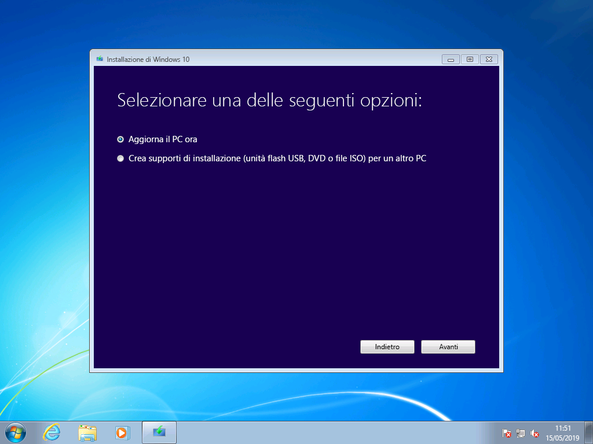
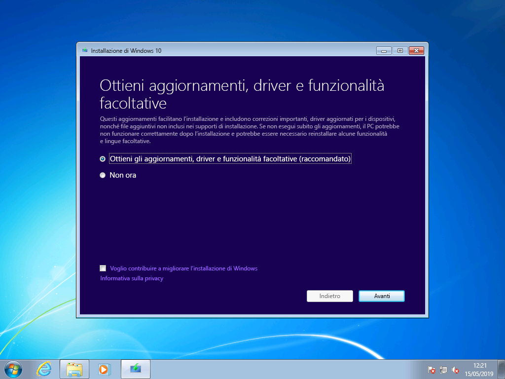
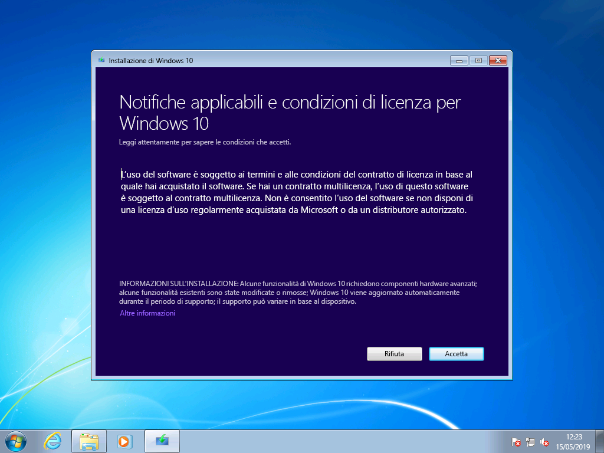
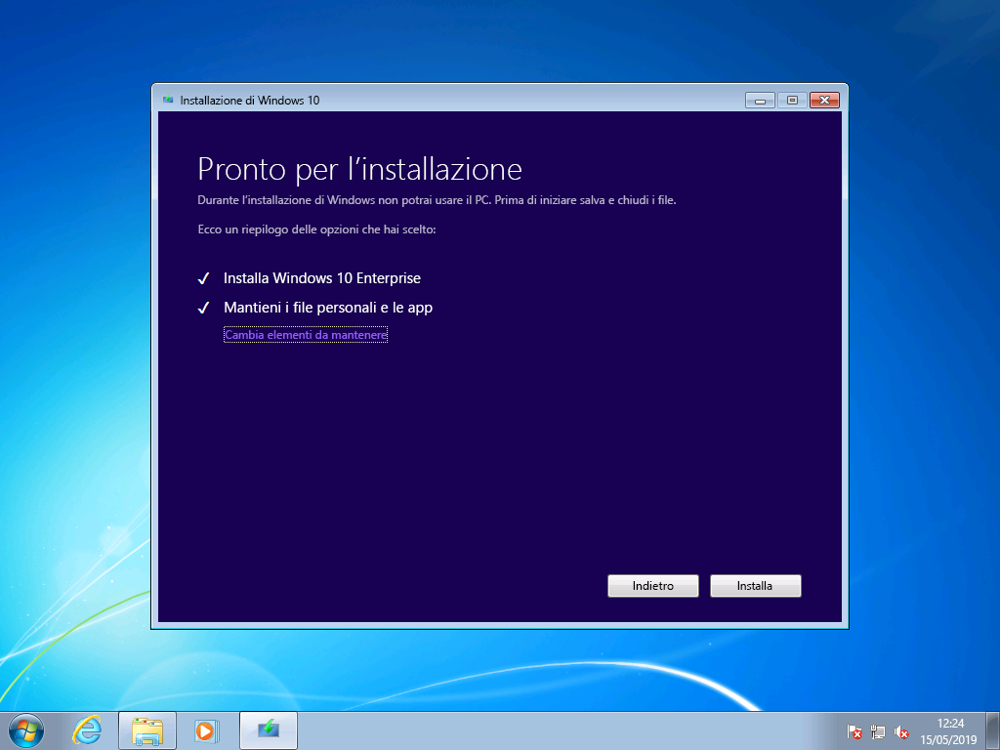
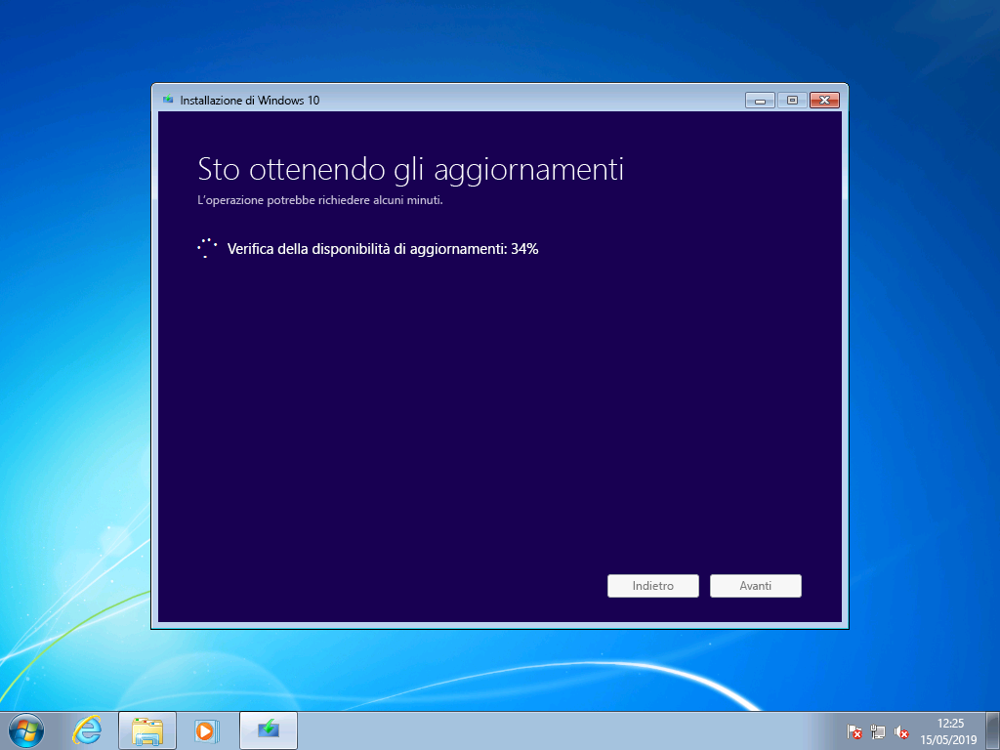
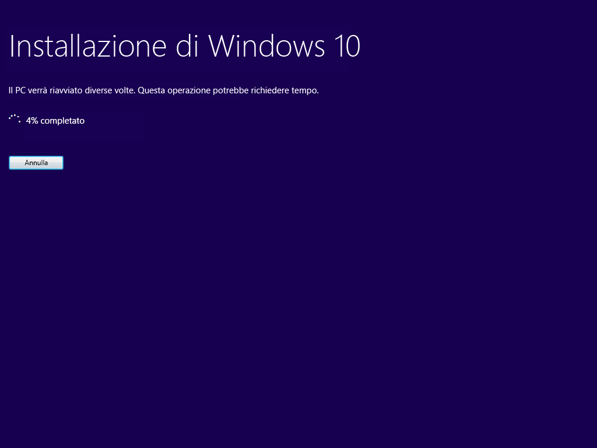
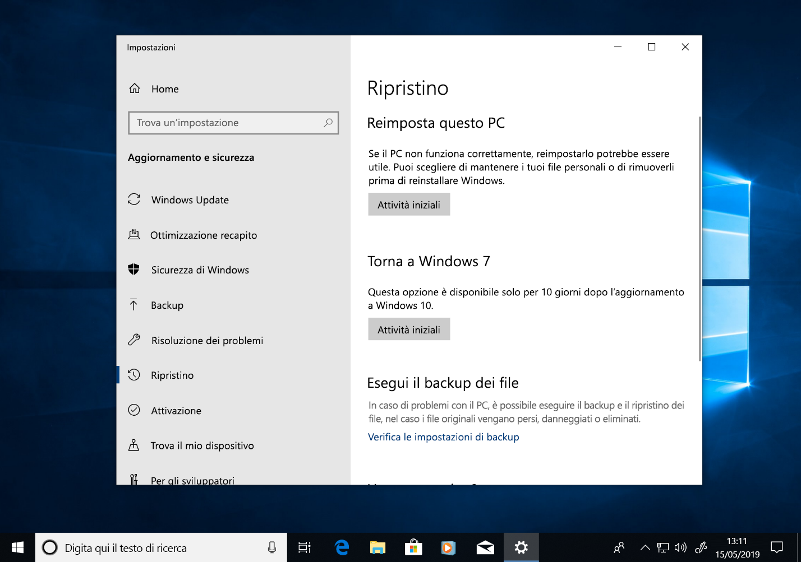
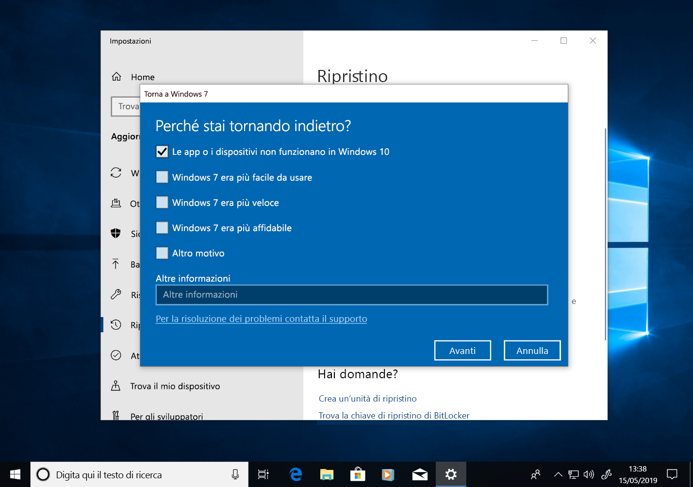
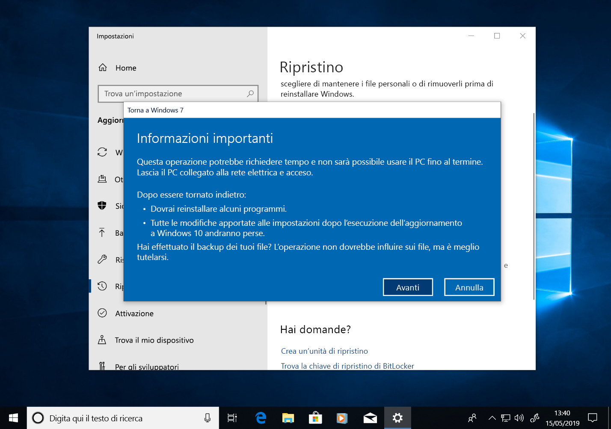
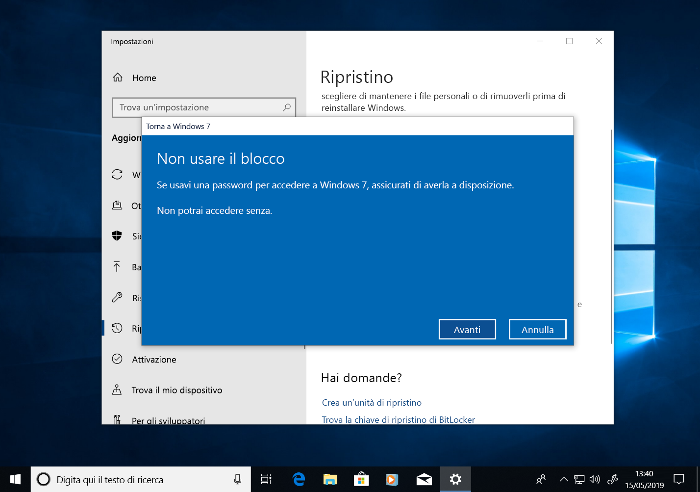

# Guida introduttiva per l’aggiornamento manuale da Windows 7 a Windows 10

Questo articolo descrive il processo di aggiornamento manuale di un PC Windows 7 Enterprise a Windows 10 Enterprise. Per le altre versioni di Windows 7, come Home e Professional, il processo è molto simile, ma è anche possibile eseguire l'aggiornamento direttamente tramite lo strumento per la creazione di contenuti multimediali. Gli aggiornamenti per tutte le versioni di Windows 7 a Windows 10 richiederanno un codice Product Key valido, una versione corrispondente o superiore di Windows, ad esempio, Windows 7 Professional può eseguire l'aggiornamento a Windows 10 Pro, ma non può essere aggiornato a Windows 10 Home. In Windows 7 Ultimate richiede l’aggiornamento a Windows 10 Pro.

## Aggiornamenti di Windows 10 con strumenti per la creazione di contenuti multimediali o file ISO

È possibile eseguire l'aggiornamento a Windows 10 direttamente utilizzando [lo strumento per la creazione di contenuti multimediali ](https://www.microsoft.com/en-us/software-download/windows10ISO) oppure usarlo per scaricare Windows 10 come file ISO. È necessario verificare se il sistema corrente sia a 32 o 64 bit, la lingua predefinita e la versione di Windows 7 del sistema, ad esempio Home, Professional o Enterprise. In Windows 7 queste informazioni si trovano nel sistema del pannello di controllo \> Sistema e sicurezza \>. Lo strumento per la creazione di contenuti multimediali non supporta Windows 10 Enterprise per gli aggiornamenti, la creazione di supporti di installazione o il download di file ISO. Se si esegue l'aggiornamento da Windows 7 Enterprise, è necessario Windows 10 Enterprise.

Durante l'aggiornamento da Windows 7 Enterprise a Windows 10 Enterprise, è necessario scaricare il file ISO per la lingua e l'architettura (32 bit o 64 bit) dal [Centro servizi per contratti multilicenza.](https://www.microsoft.com/licensing/servicecenter/default.aspx)

Se si prevede di eseguire l'aggiornamento con un file ISO, è necessario estrarre i file all'interno della ISO nel file system locale, in un'unità rimovibile o masterizzare il file ISO in un DVD. È possibile estrarre i file di installazione di nell'ISO con un PC con Windows 8 o versione successiva e salvare i file in uno spazio di archiviazione USB rimovibile o utilizzare un'applicazione come [7zip](https://www.7-zip.org/) per estrarre il contenuto del file ISO in una cartella nell'unità locale in Windows 7.

Dopo avere installato il supporto di installazione in Windows 7, è possibile avviare l'aggiornamento eseguendo setup.exe come illustrato di seguito.

**Suggerimento importante: per un aggiornamento sul posto in cui vengono migrate le applicazioni e i dati in Windows 10, è necessario avviare il processo all'interno di una sessione che esegue Windows 7. L'avvio dell'installazione di file multimediali da un DVD o da un'unità USB non consente di conservare le app e i file, ma verrà eseguita un'installazione pulita di Windows 10.**

Nell’ambito della configurazione di Windows 10, si passerà alla procedura guidata dell’installazione e la prima schermata offre un'opzione per scaricare aggiornamenti, driver e funzionalità opzionali. Questa opzione è consigliata per assicurare la riuscita dell'aggiornamento

Una volta applicati gli aggiornamenti, l'installazione di Windows 10 passerà alla fase successiva, Selezionare immagine. Qui è necessario selezionare la propria versione di Windows. In questo caso, poiché nel PC è installato Windows 7 Enterprise, selezionare Windows 10 Enterprise.

Nella schermata successiva della configurazione di Windows 10 vengono presentati gli avvisi applicabili e le condizioni di licenza. Dopo aver letto e compreso gli avvisi e le condizioni, fare clic su "Accetta" per continuare o "Rifiuta" per annullare l'operazione.

Ora l'installazione di Windows 10 cercherà altri aggiornamenti.

Una volta completata, la configurazione di Windows 10 è pronta per l’installazione e, per impostazione predefinita, è configurata per l'installazione di Windows 10. Inoltre, mantiene installati i file personali e le applicazioni. Questa è l'opzione consigliata. Facendo clic su "Cambia cosa mantenere", sono disponibili altre opzioni. In caso contrario scegliere “Installa”.

Se si seleziona "Cambia elementi da mantenere", verranno visualizzate le opzioni seguenti:

"Mantieni solo i file personali" non sposta le app o le impostazioni installate da Windows 7 a Windows 10. In alternativa, verranno spostati solo i file e gli account utente in Windows. Le app dovranno essere reinstallate più avanti con questa opzione. Usare questa opzione solo se si è certi di poter reinstallare e configurare le app necessarie dopo l'installazione di Windows, in caso contrario, usare l'opzione predefinita "Mantieni file personali e app".

"Niente" eliminerà i file, le app e le impostazioni ed eseguirà un'installazione pulita di Windows. Usare questa opzione solo se in precedenza è stato eseguito il backup dei dati che si desidera mantenere ed è possibile reinstallare le app.

L'installazione di Windows 10 otterrà nuovamente gli aggiornamenti in base alle impostazioni selezionate nella schermata precedente.

Ora Windows 10 verrà installato per diversi minuti e, se si sceglie di mantenere i file e le app personali, tutto si ritroverà nelle stesse posizioni di file e le app saranno ora disponibili in Windows 10.

## 

## Ripristino in Windows 10

Dopo l'installazione di Windows 10, l'opzione di ripristino in Windows 10 consente di ottenere fino a 10 giorni di tempo per tornare a Windows 7. Questa opzione è utile se il dispositivo o l'app del sistema non funziona correttamente ed è necessario tornare all'installazione precedente di Windows 7. Dopo 10 giorni, per impostazione predefinita, Windows 10 libera lo spazio consumato dai file di ripristino di Windows 7 nell'unità disco rigido ed elimina i file dall'installazione precedente. Anche se Windows 7 dopo il periodo di tempo viene eliminato e non è possibile ripristinare Windows 7, le app e i file personali rimarranno in Windows 10.

Per avviare il processo di ripristino di Windows 7, passare a Impostazioni Ripristino di \>Aggiornamento e sicurezza\>. In Tornare a Windows 7 selezionare "Inizia".

A questo punto, Windows 10 chiederà il motivo per cui si sta per tornare indietro. Se c'è un motivo tecnico, è utile compilarlo per facilitare la risoluzione e garantire che altre persone possano trarre beneficio da questa esperienza.

In molti casi, la versione di Windows 10 avrà emesso aggiornamenti che possono risolvere i problemi tecnici. È consigliabile verificare la disponibilità di aggiornamenti e, se trovati e installati, verificare se il problema è stato risolto.

Se gli aggiornamenti non consentono di risolvere i problemi ed è necessario tornare all'installazione precedente di Windows 7, è possibile che alcune app debbano essere reinstallate, ad esempio qualsiasi app installata durante il periodo di tempo in cui si è utilizzato Windows 10, e alcune impostazioni potrebbero essere andate perse. In particolare, i file e i documenti salvati in locale durante l’uso di Windows 10 verranno mantenuti e saranno disponibili una volta tornati a Windows 7. 

Prima di iniziare, verificare di avere un account locale o di dominio e una password già pronti dall'installazione precedente di Windows 7.

Da qui è possibile avviare il processo per tornare a Windows 7. Dopo qualche minuto, il PC si avvierà nuovamente in Windows 7 con la stessa esperienza precedente all’esecuzione dell’aggiornamento a Windows 10.

## Passaggio a Windows 10 in un nuovo PC

Un'altra opzione consigliata consiste nel passare a Windows 10 in un nuovo PC. Se si preferisce, è possibile trasferire i file dal vecchio computer tramite il backup di [OneDrive](https://support.office.com/article/b5e918be-0fd4-4095-98da-bceed57f8e0c?ocid=MoveToWindows10), [Backup e ripristino integrato in Windows](https://support.microsoft.com/help/4469209?ocid=MoveToWindows10), manualmente tramite un [dispositivo di archiviazione esterno](https://support.microsoft.com/it-IT/help/4465814/windows-7-move-files-off-pc-with-an-external-storage-device?ocid=MoveToWindows10) oppure con strumenti come [Laplink PCmover Express](https://www.microsoft.com/en-us/windows/transfer-your-data). Con una di queste opzioni sarà comunque necessario reinstallare le applicazioni obbligatorie non incluse in Windows 10. Per altre informazioni sulle opzioni per lo spostamento manuale da un PC che esegue Windows 7 in un nuovo PC con Windows 10, vedere [passaggio a un PC con Windows 10](https://support.microsoft.com/it-IT/help/4229823?ocid=MoveToWindows10) nel supporto di Windows.

## [Centro di distribuzione desktop](https://aka.ms/howtoshift)