# Guida introduttiva per l’aggiornamento da Windows 7 a Windows 10Windows 7 to Windows 10 manual upgrade step-by-step guide

Questo articolo descrive il processo di aggiornamento manuale di un PC Windows 7 Enterprise a Windows 10 Enterprise.This article describes the process to manually upgrade a Windows 7 Enterprise PC to Windows 10 Enterprise. Per le altre versioni di Windows 7, come Home e Professional, il processo è molto simile, ma è anche possibile eseguire l'aggiornamento direttamente tramite lo strumento per la creazione di contenuti multimediali.For other Windows 7 editions, such as Home and Professional, the process is very similar, but you also have the option to upgrade directly using the media creation tool. Gli aggiornamenti per tutte le versioni di Windows 7 a Windows 10 richiederanno un codice Product Key valido, una versione corrispondente o superiore di Windows, ad esempio, Windows 7 Professional può eseguire l'aggiornamento a Windows 10 Pro, ma non può essere aggiornato a Windows 10 Home.Upgrades for any edition of Windows 7 to Windows 10 will require a valid product key and matching or higher edition of Windows, for example Windows 7 Professional can upgrade to Windows 10 Pro, but cannot be upgraded to Windows 10 Home. In Windows 7 Ultimate richiede l’aggiornamento a Windows 10 Pro.Windows 7 Ultimate will need to be upgraded to Windows 10 Pro.

## Aggiornamenti di Windows 10 con strumenti per la creazione di contenuti multimediali o file ISOWindows 10 upgrades using the media creation tool or ISO files

È possibile eseguire l'aggiornamento a Windows 10 direttamente utilizzando [lo strumento per la creazione di contenuti multimediali ](https://www.microsoft.com/en-us/software-download/windows10ISO) oppure usarlo per scaricare Windows 10 come file ISO.You can upgrade to Windows 10 directly using the [media creation tool](https://www.microsoft.com/en-us/software-download/windows10ISO) or use the it to download Windows 10 as an ISO file. È necessario constatare se il sistema corrente sia a 32 o 64 bit, la lingua predefinita e la versione di Windows 7 del sistema, ad esempio Home, Professional o Enterprise.You’ll need to note whether your current system is 32 or 64-bit, your system’s default language and edition of Windows 7 (e.g. Home, Professional, or Enterprise). In Windows 7 queste informazioni si trovano nel sistema del pannello di controllo \> Sistema e sicurezza \>.In Windows 7, this information is located in the Control Panel \> System and Security \> System. Lo strumento per la creazione di contenuti multimediali non supporta Windows 10 Enterprise per gli aggiornamenti, la creazione di supporti di installazione o il download di file ISO.The media creation tool does not support Windows 10 Enterprise for upgrades, creating installation media or downloading ISO files. Se si esegue l'aggiornamento da Windows 7 Enterprise, è necessario Windows 10 Enterprise.Windows 10 Enterprise is required if you are upgrading from Windows 7 Enterprise.

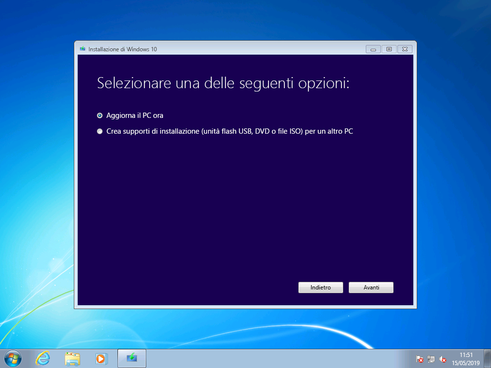

> Opzioni strumenti per la creazione di Windows 10Windows 10 media creation tool options

Durante l' aggiornamento da Windows 7 Enterprise a Windows 10 Enterprise, è necessario scaricare il file ISO per la lingua e l'architettura (32 bit o 64 bit) dal [Centro servizi per contratti multilicenza.](https://www.microsoft.com/licensing/servicecenter/default.aspx)When upgrading from Windows 7 Enterprise to Windows 10 Enterprise, you’ll need to download the ISO file for your language and architecture (32-bit or 64-bit) from the [Volume Licensing Service Center](https://www.microsoft.com/licensing/servicecenter/default.aspx).

Se si prevede di eseguire l'aggiornamento con un file ISO, è necessario estrarre i file all'interno della ISO nel file system locale, in un'unità rimovibile o masterizzare il file ISO in un DVD.If you plan to perform the upgrade using an ISO file, you will need to extract the files within the ISO to either your local file system, to a removable drive, or you can burn the ISO file to a DVD. È possibile estrarre i file di installazione di nell'ISO con un PC con Windows 8 o versione successiva e salvare i file in uno spazio di archiviazione USB rimovibile o utilizzare un'applicazione come [7zip](https://www.7-zip.org/) per estrarre il contenuto del file ISO in una cartella nell'unità locale in Windows 7.You can extract the installation files within the ISO using a Windows 8 or newer PC and save these files to removable USB storage or use an application such as [7zip](https://www.7-zip.org/) to extract the contents of your ISO file to a folder on your local drive within Windows 7.

Dopo avere installato il supporto di installazione in Windows 7, è possibile avviare l'aggiornamento eseguendo setup.exe come illustrato di seguito.Once you have the install media available in Windows 7, you can initiate the upgrade by running setup.exe as shown below.

**Suggerimento importante: per un aggiornamento sul posto in cui vengono migrate le applicazioni e i dati in Windows 10, è necessario avviare il processo all'interno di una sessione che esegue Windows 7. L'avvio dell'installazione di file multimediali da un DVD o da un'unità USB non consente di conservare le app e i file, ma verrà eseguita un'installazione pulita di Windows 10.****Important tip: For an in-place upgrade where applications and your data are migrated to Window 10, you’ll need to initiate the process from within a running Windows 7 session. Booting to install media from a DVD or USB drive will not give you the option to keep your apps and files, instead it will perform a clean install of Windows 10.**

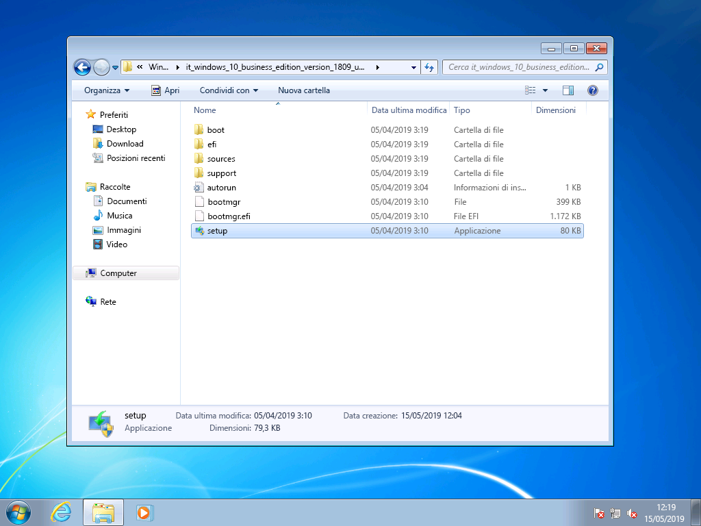

> File estratti da una versione ISO per Windows 10 Enterprise 32 bitExtracted files from a Windows 10 Enterprise 32-bit ISO

Nell’ambito della configurazione di Windows 10, si passerà alla procedura guidata dell’installazione e la prima schermata offre un'opzione per scaricare aggiornamenti, driver e funzionalità opzionali.Within Windows 10 Setup, you will be guided through the installation process and the first screen provides an option to download updates, drivers and optional features. Questa opzione è consigliata per assicurare la riuscita dell'aggiornamentoThis is recommended to help ensure success with the upgrade

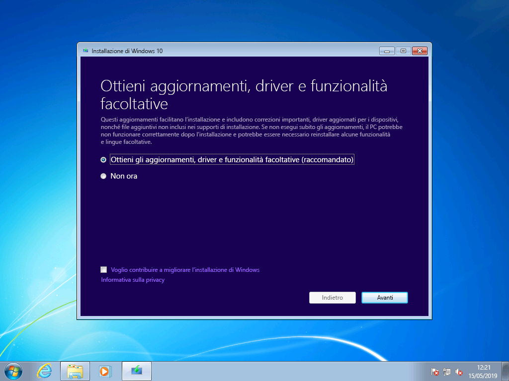

> Schermata iniziale della configurazione di Windows 10Initial Windows 10 Setup screen

Una volta applicati gli aggiornamenti, l'installazione di Windows 10 passerà alla fase successiva, selezionare immagine.Once updates have been applied, Windows 10 Setup will move to the next phase, Select Image. Qui è necessario selezionare la propria versione di Windows.Here, you will need to select your edition of Windows. In questo caso, poiché il PC è installato in Windows 7 Enterprise, selezionare Windows 10 Enterprise.In this case, since the PC has Windows 7 Enterprise installed, you would select Windows 10 Enterprise.

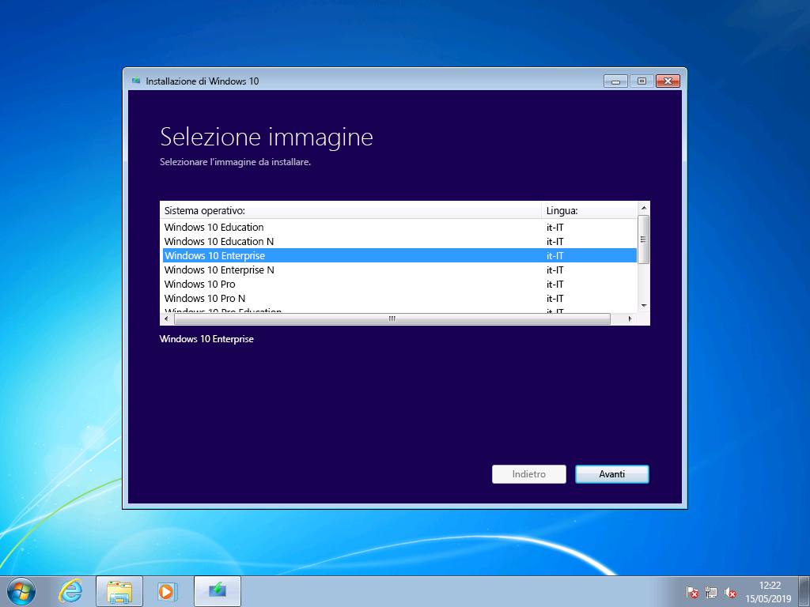

> Schermata di selezione immagine a 32 bit di Windows 10 EnterpriseWindows 10 Enterprise 32-bit image selection screen

Nella schermata successiva della configurazione di Windows 10 vengono presentati gli avvisi applicabili e le condizioni di licenza.In the next screen in Windows 10 Setup, you’re presented with applicable notices and license terms. Dopo aver letto e compreso gli avvisi e le condizioni, fare clic su "Accetta" per continuare o "Rifiuta" per annullare l'operazione.Once you have read and understand the notices and terms, click “Accept” to continue or “Decline” to cancel.

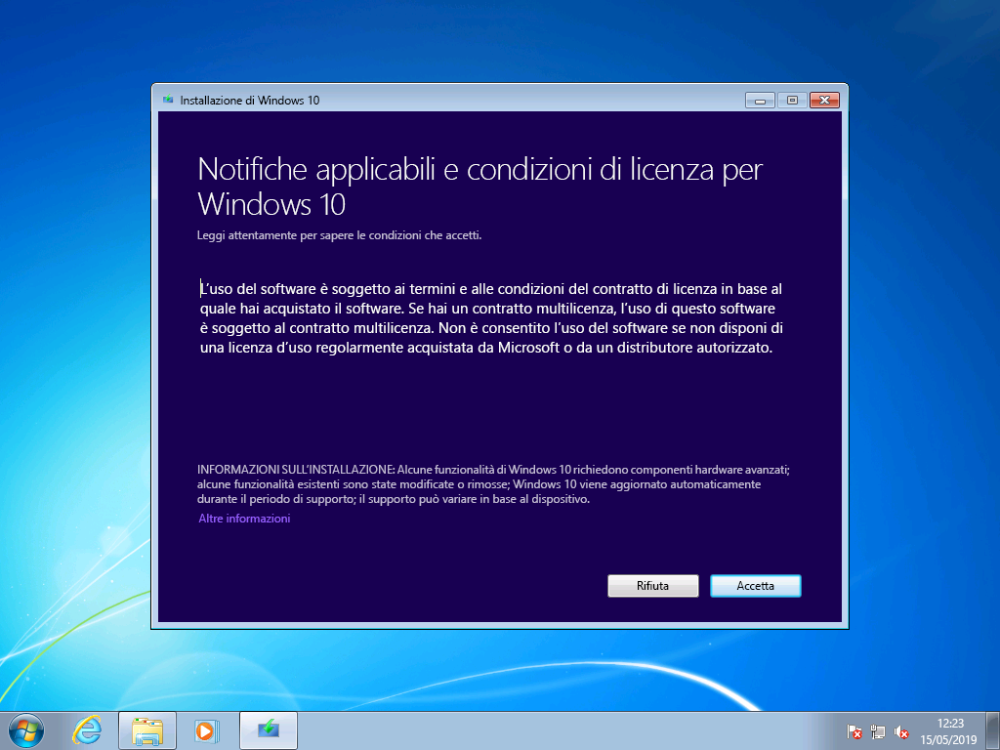

*Notifiche applicabili e condizioni di licenza per Windows 10**Windows 10 Applicable notices and license terms*

Ora l'installazione di Windows 10 cercherà altri aggiornamenti.Now Windows 10 Setup will look for additional updates.

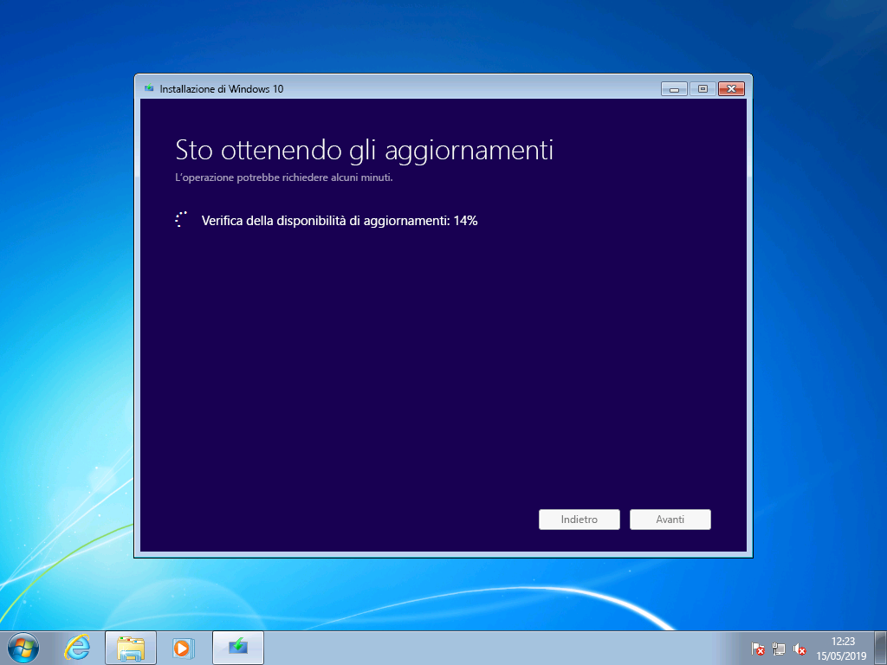

*Configurazione di aggiornamenti per Windows 10**Windows 10 Setup getting updates*

Una volta completata, la configurazione di Windows 10 è pronta per l’installazione e, per impostazione predefinita, è configurata per l'installazione di Windows 10. Inoltre, mantiene installati i file personali e le applicazioni.Once complete, Windows 10 Setup is ready to install and by default is configured to install Windows 10 and keep your personal files and apps installed. Questa è l'opzione consigliata.This is the recommended option. Facendo clic su "Cambia cosa mantenere", sono disponibili altre opzioni.By clicking, “Change what to keep,” you’ll find additional options. In caso contrario scegliere “Installa”.Otherwise, click “Install.”

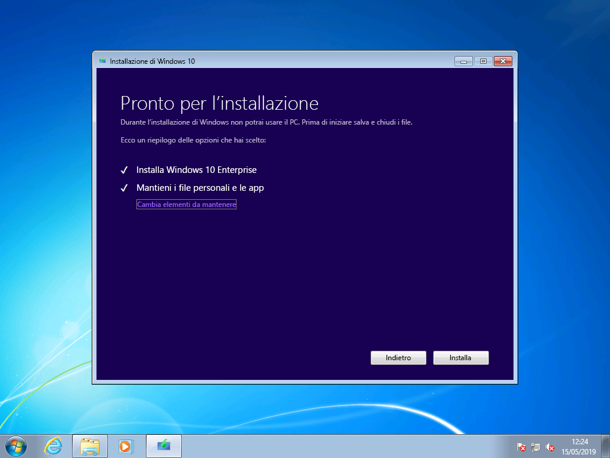

*Opzione predefinita di aggiornamento della configurazione di Windows 10**Windows 10 Setup upgrade option default*

Se si seleziona "Cambia cosa mantenere", verranno visualizzate le opzioni seguenti:If you select “Change what to keep”, you’ll be presented with these options:

"Mantieni solo i file personali" non sposta le app o le impostazioni installate da Windows 7 a Windows 10.“Keep personal files only” will not move your installed apps or settings from Windows 7 to Windows 10. In alternativa, verranno spostati solo i file e gli account utente in Windows.Instead it will only move your files and user accounts to Windows. Le app dovranno essere reinstallate più avanti con questa opzione.Apps will need to be reinstalled later with this option. Usare questa opzione solo se si è certi di poter reinstallare e configurare le app necessarie dopo l'installazione di Windows, in caso contrario, usare l'opzione predefinita "Mantieni file personali e app".Only use this option if you are confident you can reinstall and configure the apps you will need after Windows is installed, otherwise stick with the default “Keep personal files and apps” option.

"Niente" eliminerà i file, le app e le impostazioni ed eseguirà un'installazione pulita di Windows.“Nothing” will delete your files, apps and settings and perform a clean install of Windows. Usare questa opzione solo se in precedenza è stato eseguito il backup dei dati che si desidera mantenere ed è possibile reinstallare le app.Use this option only if you have previously backed up the data you want to keep and you are able to reinstall your apps.

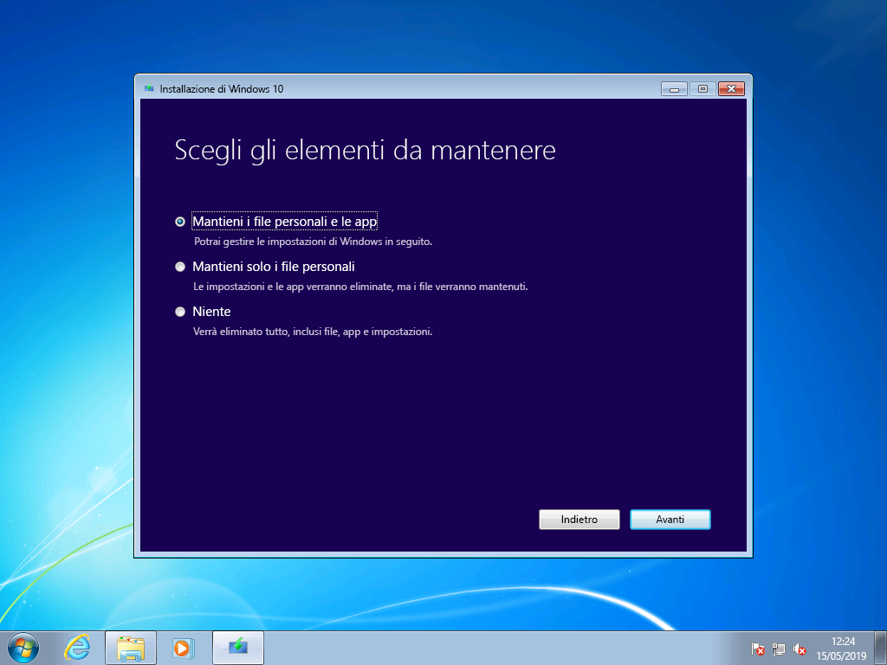

*Opzioni per l'installazione di Windows 10**Windows 10 Setup installation options*

L'installazione di Windows 10 otterrà nuovamente gli aggiornamenti in base alle impostazioni selezionate nella schermata precedente.Now Windows 10 Setup will get updates again based on what you selected in the previous screen.

*Configurazione di aggiornamenti per Windows 10**Windows 10 Setup getting updates*

Ora Windows 10 verrà installato per diversi minuti e, se si sceglie di mantenere i file e le app personali, tutto si ritroverà nelle stesse posizioni di file e le app saranno ora disponibili in Windows 10.Now Windows 10 will install for several minutes and if you chose to keep your personal files and apps, everything will be in the same file locations and your apps will now be available in Windows 10.

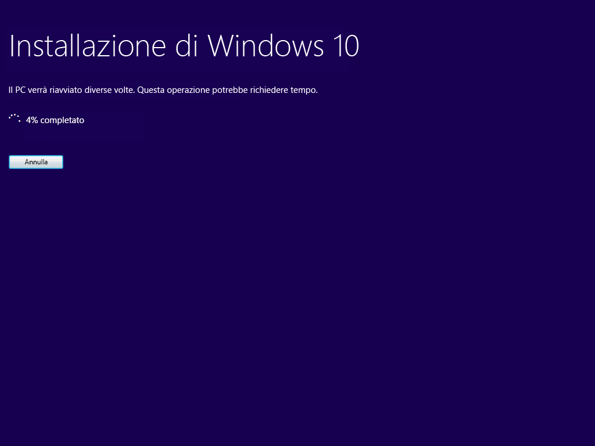

*Stato di installazione di Windows 10**Windows 10 installation progress*

## 

## Ripristino in Windows 10Recovery in Windows 10

Dopo l'installazione di Windows 10, l'opzione di ripristino in Windows 10 consente di ottenere fino a 10 giorni di tempo per tornare a Windows 7.After Windows 10 is installed, the Recovery option in Windows 10 gives you up to 10 days to go back to Windows 7. Questa opzione è utile se il dispositivo o l'app del sistema non funziona correttamente ed è necessario tornare all'installazione precedente di Windows 7.This is useful if a device or app on your system does not function properly and you need to go back to your previous Windows 7 installation. Dopo 10 giorni, per impostazione predefinita, Windows 10 libera lo spazio consumato dai file di ripristino di Windows 7 nell'unità disco rigido ed elimina i file dall'installazione precedente.After 10 days, by default Windows 10 will free up the space consumed by your Windows 7 recovery files on your hard drive and delete files from the previous installation. Anche se Windows 7 dopo il periodo di tempo viene eliminato e non è possibile ripristinare Windows 7, le app e i file personali rimarranno in Windows 10.Although Windows 7 after this time is deleted and you won’t be able to revert Windows 7, your apps and personal files will remain in Windows 10.

Per avviare il processo di ripristino di Windows 7, passare a Impostazioni Ripristino di \>Aggiornamento e sicurezza\>.To start the Go back to Windows 7 process, navigate to Settings \> Update & Security \> Recovery. In tornare a Windows 7 selezionare "Inizia".Under Go back to Windows 7, select “Get started.”

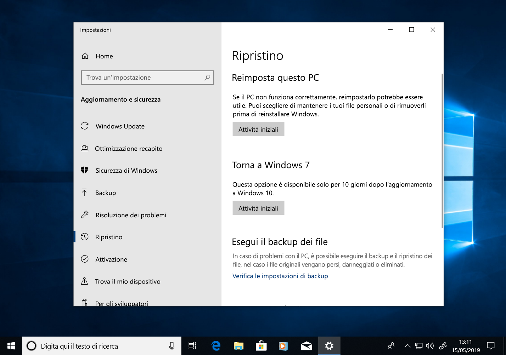

*Opzioni di ripristino di Windows 10**Windows 10 Recovery options*

A questo punto, Windows 10 chiederà il motivo per cui si sta per tornare indietro.Now, Windows 10 will ask why you are going back. Se c'è un motivo tecnico, è utile compilarlo per facilitare la risoluzione e garantire che altre persone possano trarre beneficio da questa esperienza.If there is a technical reason, this is useful to fill out in order to help drive resolution and ensure others can benefit from your experience.

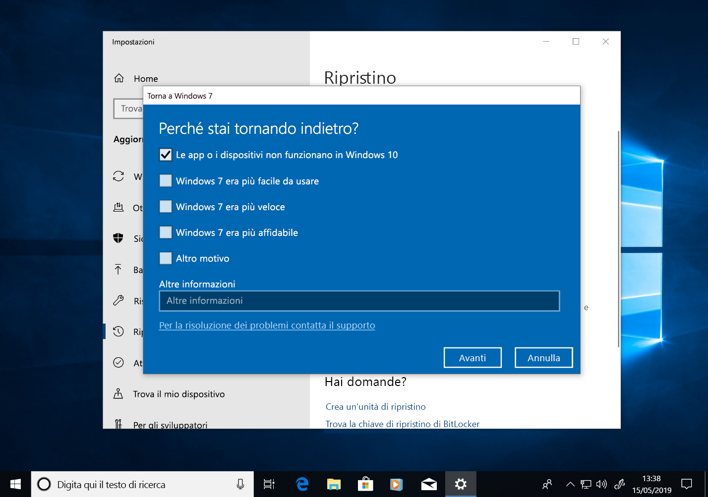

*Windows 10 che chiede il motivo per cui si tornerà a Windows 7**Windows 10 asking why you are going back to Windows 7*

In molti casi, la versione di Windows 10 avrà emesso aggiornamenti che possono risolvere i problemi tecnici.In many cases, your version of Windows 10 will have had updates issued, which may resolve technical issues. È consigliabile verificare la disponibilità di aggiornamenti e, se trovati e installati, verificare se il problema è stato risolto.It is encouraged that you check for updates and if found and installed, then check if that fixes the problems you have experienced.

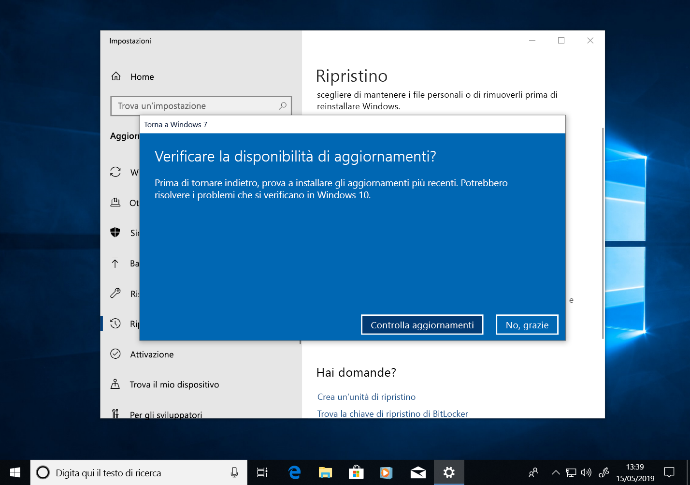

*Controllare la disponibilità di aggiornamenti per Windows 10**Windows 10 Recovery check for updates*

Se gli aggiornamenti non consentono di risolvere i problemi ed è necessario tornare all'installazione precedente di Windows 7, è possibile che alcune app debbano essere reinstallate, ad esempio qualsiasi app installata durante il periodo di tempo in cui si è utilizzato Windows 10, e alcune impostazioni potrebbero essere andate perse.If the updates do not resolve issues and you do need to revert to your previous installation of Windows 7, there is a chance that some apps will need to be reinstalled – such as any app that installed during the time you were running Windows 10 – and some settings may be lost. In particolare, i file e i documenti salvati in locale durante l’uso di Windows 10 verranno mantenute e saranno disponibili una volta tornati a Windows 7.Importantly, files and docs you’ve saved locally while using Windows 10 will remain and be available for you once you’re back in Windows 7. 

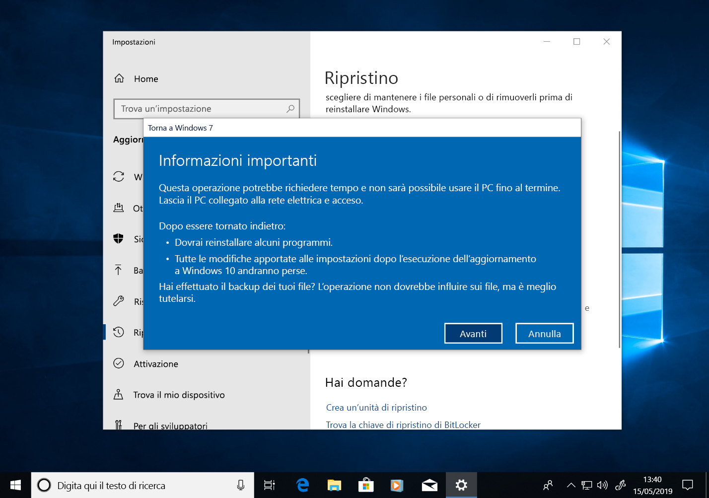

*Ripristino di Windows 10: informazioni che è necessario conoscere**Windows 10 Recovery: What you need to know*

Prima di iniziare, verificare di avere un account locale o di dominio e una password già pronti dall'installazione precedente di Windows 7.Before you get started, make sure you have a local or domain account and password ready from the previous Windows 7 installation.

*Ripristino di Windows 10 assicurandosi di avere le credenziali di accesso dell'installazione precedente**Windows 10 Recovery ensuring you have logon credentials from the previous installation*

Da qui è possibile avviare il processo per tornare a Windows 7.From here you can initiate the process to go back to Windows 7. Dopo qualche minuto, il PC si avvierà nuovamente in Windows 7 con la stessa esperienza precedente all’esecuzione dell’aggiornamento a Windows 10.After a few minutes, your PC will boot back into Windows 7 with the same experience prior to upgrading to Windows 10.

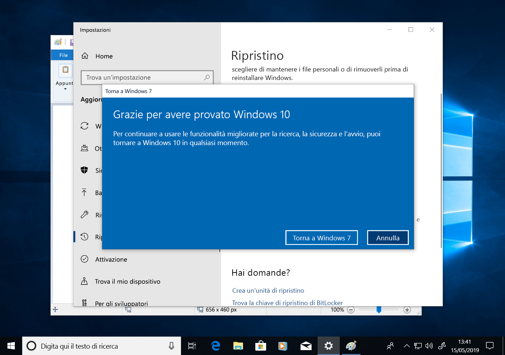

*Schermata finale di ripristino di Windows 10 prima di tornare in Windows 7**Windows 10 Recovery final screen before going back to Windows 7*

## Passaggio a Windows 10 in un nuovo PCMoving to Windows 10 on a new PC

Un'altra opzione consigliata consiste nel passare a Windows 10 in un nuovo PC.Another recommended option is to move to Windows 10 on a new PC. Se si preferisce, è possibile trasferire i file dal vecchio computer tramite il backup di [OneDrive](https://support.office.com/article/b5e918be-0fd4-4095-98da-bceed57f8e0c?ocid=MoveToWindows10), [Backup e ripristino integrato in Windows](https://support.microsoft.com/help/4469209?ocid=MoveToWindows10), manualmente tramite un [dispositivo di archiviazione esterno](https://support.microsoft.com/it-IT/help/4465814/windows-7-move-files-off-pc-with-an-external-storage-device?ocid=MoveToWindows10) oppure con strumenti come [Laplink PCmover Express](https://www.microsoft.com/en-us/windows/transfer-your-data).If this is your preference, you can transfer your files from your old computer using [OneDrive](https://support.office.com/article/b5e918be-0fd4-4095-98da-bceed57f8e0c?ocid=MoveToWindows10) backup, [Backup and Restore built into Windows](https://support.microsoft.com/help/4469209?ocid=MoveToWindows10), manually using an [external storage device](https://support.microsoft.com/en-us/help/4465814/windows-7-move-files-off-pc-with-an-external-storage-device?ocid=MoveToWindows10), or tools like [Laplink’s PCmover Express](https://www.microsoft.com/en-us/windows/transfer-your-data). Con una di queste opzioni sarà comunque necessario reinstallare le applicazioni obbligatorie non incluse in Windows 10.With any of these options, you will still need to re-install any required applications not included with Windows 10. Per altre informazioni sulle opzioni per lo spostamento manuale da un PC che esegue Windows 7 in un nuovo PC con Windows 10, vedere [passaggio a un PC con Windows 10](https://support.microsoft.com/it-IT/help/4229823?ocid=MoveToWindows10) nel supporto di Windows.To learn more about your options for manually moving from an existing PC running Windows 7 to a new PC with Windows 10, see [Moving to a Windows 10 PC](https://support.microsoft.com/en-us/help/4229823?ocid=MoveToWindows10) in Windows Support.

## [Centro di distribuzione desktopDesktop Deployment Center](https://aka.ms/howtoshift)