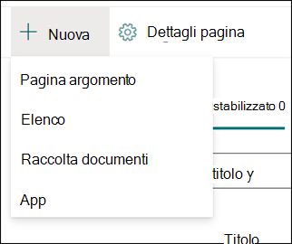
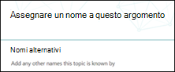
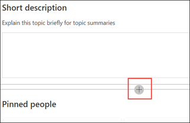

# Creare un nuovo argomento (anteprima)

> [!Note] 
> Il contenuto di questo articolo è relativo all'anteprima privata di Project Cortex. [Altre informazioni su Project Cortex](https://aka.ms/projectcortex).

Nelle esperienze di argomento, è possibile creare un nuovo argomento se non si è scoperto tramite l'indicizzazione o se la tecnologia AI non ha trovato prove sufficienti per stabilirlo come argomento.

## Requisiti

Per creare un nuovo argomento, è necessario eseguire le operazioni seguenti:
- Avere una licenza per l'argomento experiences.
- Dispongono delle autorizzazioni per gli [**utenti autorizzati a creare o modificare gli argomenti**](https://docs.microsoft.com/microsoft-365/knowledge/topic-experiences-user-permissions). Gli amministratori delle informazioni possono fornire agli utenti questa autorizzazione nelle impostazioni delle autorizzazioni per l'argomento Knowledge Network. 

> [!Note] 
> Gli utenti che dispongono dell'autorizzazione per la gestione degli argomenti nel centro argomenti (Knowledge Manager) dispongono già delle autorizzazioni per la creazione e la modifica degli argomenti.

## Per creare un nuovo argomento:

1. Nella pagina Centro argomenti selezionare **nuovo** e quindi **pagina argomento**. Se non si è in grado di visualizzare la **nuova** opzione nel centro argomenti, potrebbe non essere necessario disporre delle autorizzazioni necessarie.

    

2. Nella pagina nuovo argomento, è possibile inserire le informazioni nel nuovo modello di argomento:

    - Nella sezione **nome in questo argomento** Digitare il nome del nuovo argomento.
    
    - Nella sezione **Alternate Names** Digitare nomi o acronimi utilizzati anche per fare riferimento all'argomento.
    
    - Nella sezione **Descrizione breve** Digitare una descrizione di una o due frasi dell'argomento. Questo testo verrà utilizzato per la scheda argomento associato.
    
    - Nella sezione **utenti** Digitare i nomi degli esperti dell'argomento. Gli utenti aggiunti manualmente all'argomento verranno visualizzati nella pagina dell'argomento come **persone** bloccate.
    
    - Nella sezione **file e pagine** selezionare **Aggiungi** e quindi nella pagina successiva è possibile selezionare i file di OneDrive associati o le pagine di SharePoint Online.
    
    - Nella sezione **siti** selezionare **Aggiungi**. Nel riquadro  **siti** che viene visualizzato selezionare i siti associati all'argomento.

    
    
3. Se è necessario aggiungere altri componenti alla pagina, ad esempio testo, immagini, Web part, collegamenti e così via, selezionare l'icona Canvas al centro della pagina per individuarla e aggiungerla.

    

4. Al termine, fare clic su **pubblica** per pubblicare la pagina dell'argomento. Verranno visualizzate le pagine degli argomenti pubblicati nella scheda **pagine** .

Dopo aver pubblicato l'articolo, il nome dell'argomento, il nome alternativo, la descrizione e le persone appuntate verranno visualizzati a tutti gli utenti con licenza che visualizzano l'articolo. I file, le pagine e i siti verranno visualizzati solo nella pagina dell'argomento se il visualizzatore ha le autorizzazioni di Office 365 per l'elemento. 

La pagina nuovo argomento è costituita da Web part che sono *Knowledge Network Aware*. Questo significa che, poiché AI riunisce altre informazioni sull'argomento, le informazioni contenute in queste web part verranno aggiornate con suggerimenti per rendere la pagina più utile agli utenti.

## Vedere anche

  

