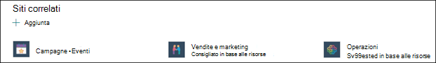

# Creare un nuovo argomento in Microsoft Viva Topics

In Viva Topics puoi creare un nuovo argomento se non ne viene individuato uno tramite l'indicizzazione o se la tecnologia IA non ha trovato prove sufficienti per stabilirlo come argomento.

> [!Note] 
> Mentre le informazioni in un argomento raccolto dall'IA sono limitate per motivi di [sicurezza,](topic-experiences-security-trimming.md)tenere presente che la descrizione dell'argomento e le informazioni sulle persone in un argomento creato manualmente sono visibili a tutti gli utenti che dispongono delle autorizzazioni per visualizzare l'argomento. 

## Requisiti

Per creare un nuovo argomento, è necessario:
- Avere una licenza Viva Topics.
- Disporre delle autorizzazioni [**per gli utenti che possono creare o modificare argomenti.**](./topic-experiences-user-permissions.md) Gli amministratori della knowledge base possono concedere agli utenti questa autorizzazione nelle impostazioni delle autorizzazioni dell'argomento Viva Topics. 

> [!Note] 
> Gli utenti che dispongono dell'autorizzazione per gestire gli argomenti nel Centro argomenti (responsabili della knowledge base) dispongono già delle autorizzazioni per creare e modificare gli argomenti.

## Per creare un argomento

È possibile creare un nuovo argomento da due posizioni:

- Home page del Centro argomenti:  qualsiasi utente con licenza con autorizzazione Chi può creare o modificare argomenti (collaboratori) può creare un nuovo argomento dal Centro argomenti selezionando il <b>menu</b> Nuovo e selezionando <b>Pagina Argomento.</b>  

       

- Pagina Gestisci argomenti: qualsiasi  utente con licenza che dispone dell'autorizzazione Chi può gestire gli argomenti (responsabili della knowledge base) può creare un nuovo argomento dalla pagina Gestisci argomenti nel Centro argomenti selezionando Pagina Nuovo <b>argomento.</b>  

       

### Per creare un nuovo argomento:

1. Selezionare l'opzione per creare una nuova pagina argomento dalla barra multifunzione nella pagina Gestisci argomenti.

2.   Nella sezione **Assegnare un nome all'argomento** digitare il nome del nuovo argomento.

       

3. Nella sezione <b>Nomi alternativi</b> digitare eventuali altri nomi a cui potrebbe fare riferimento l'argomento. 

       
4. Nella sezione <b>Descrizione</b> digitare un paio di frasi che descrivono l'argomento. 

     

4. Nella sezione <b>Persone</b> aggiunte puoi "aggiungere" una persona per mostrargli di avere una connessione all'argomento (ad esempio, un proprietario di una risorsa connessa). Iniziare digitando il nome o <b></b> l'indirizzo di posta elettronica nella casella Aggiungi un nuovo utente e quindi selezionare l'utente che si desidera aggiungere dai risultati della ricerca. Puoi anche "sbloccarli" selezionando l'icona Rimuovi <b>dall'elenco</b> nella scheda utente. Puoi anche trascinare la persona per modificare l'ordine di visualizzazione dell'elenco di persone.
 
     

5. Nella sezione <b>File e</b> pagine aggiunti è possibile aggiungere o aggiungere un file o una pagina del sito di SharePoint associata all'argomento.

    
 
    Per aggiungere un nuovo file, <b>selezionare</b>Aggiungi , selezionare il sito di SharePoint dai siti frequenti o seguiti e quindi selezionare il file dalla raccolta documenti del sito.

    Puoi anche usare <b>l'opzione Da un collegamento</b> per aggiungere un file o una pagina specificando l'URL. 

    > [!Note] 
    > I file e le pagine aggiunti devono trovarsi nello stesso tenant di Microsoft 365. Se vuoi aggiungere un collegamento a una risorsa esterna nell'argomento, puoi aggiungerlo tramite l'icona canvas nel passaggio 8.

6.  La <b>sezione Siti correlati</b> mostra i siti che dispongono di informazioni sull'argomento. 

     

    È possibile aggiungere un sito correlato <b>selezionando</b> Aggiungi e quindi cercando il sito o selezionandolo nell'elenco dei siti frequenti o recenti. 
    
     

7. La <b>sezione Argomenti correlati</b> mostra le connessioni esistenti tra gli argomenti. È possibile aggiungere una connessione a un argomento diverso selezionando il pulsante Connetti <b>a</b> un argomento correlato, quindi digitando il nome dell'argomento correlato e selezionandolo dai risultati della ricerca. 

      

    È quindi possibile fornire una descrizione del modo in cui gli argomenti sono correlati e selezionare <b>Aggiorna</b>. 

     

   L'argomento correlato aggiunto verrà visualizzato come argomento connesso.

     

   Per rimuovere un argomento correlato, selezionare l'argomento che si desidera rimuovere, quindi selezionare <b>l'icona Rimuovi argomento.</b> 
 
      

   Selezionare quindi <b>Rimuovi</b>. 

     
     
 

8. Puoi anche aggiungere elementi statici alla pagina (ad esempio testo, immagini o collegamenti) selezionando l'icona dell'area di disegno, che puoi trovare sotto la breve descrizione. Selezionandolo verrà aperta la casella degli strumenti di SharePoint da cui è possibile scegliere l'elemento che si desidera aggiungere alla pagina.

     

9. Selezionare **Pubblica** per salvare le modifiche. 

Dopo aver pubblicato la pagina, il nome dell'argomento, il nome alternativo, la descrizione e gli utenti aggiunti verranno visualizzati per tutti gli utenti con licenza che visualizzano l'argomento. File, pagine e siti specifici verranno visualizzati nella pagina dell'argomento solo se il visualizzatore dispone delle autorizzazioni di Office 365 per l'elemento. 

## Vedere anche

