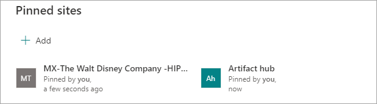
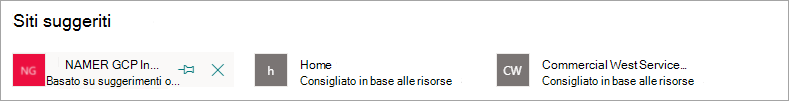

# Modificare un argomento esistente in Microsoft Viva TopicsEdit an existing topic in Microsoft Viva Topics 

 

> [!VIDEO https://www.microsoft.com/videoplayer/embed/RE4LA4n]  

 

In Viva Topics è possibile modificare un argomento esistente.In Viva Topics, you can edit an existing topic. Potrebbe essere necessario eseguire questa operazione se si desidera correggere o aggiungere ulteriori informazioni a una pagina di argomento esistente.You might need to do this if you want to correct or add additional information to an existing topic page. 

> [!Note] 
> Mentre le informazioni in un argomento raccolto dall'IA sono limitate per motivi di [sicurezza,](topic-experiences-security-trimming.md)la descrizione dell'argomento e le informazioni sulle persone che vengono aggiunti manualmente durante la modifica di un argomento esistente sono visibili a tutti gli utenti che dispongono delle autorizzazioni per visualizzare gli argomenti.While information in a topic that is gathered by AI is [security trimmed](topic-experiences-security-trimming.md), the topic description and people information that you manually add when editing an existing topic is visible to all users who have permissions to view topics. 

## RequisitiRequirements

Per modificare un argomento esistente, è necessario:To edit an existing topic, you need to:
- Avere una licenza di Viva Topics.Have a Viva Topics license.
- Disporre delle autorizzazioni [per creare o modificare argomenti.](./topic-experiences-user-permissions.md)Have permissions to [create or edit topics](./topic-experiences-user-permissions.md). Gli amministratori delle informazioni possono assegnare questa autorizzazione nelle impostazioni delle autorizzazioni per gli argomenti di Viva Topics.Knowledge admins can give users this permission in the Viva Topics topic permissions settings. 

> [!Note] 
> Gli utenti che dispongono dell'autorizzazione per gestire gli argomenti nel Centro argomenti (responsabili della knowledge base) dispongono già delle autorizzazioni per creare e modificare gli argomenti.Users who have permission to manage topics in the topic center (knowledge managers) already have permissions to create and edit topics.

## Come modificare una pagina di argomentoHow to edit a topic page

Gli utenti che dispongono dell'autorizzazione *Who* creare o modificare argomenti possono modificare un argomento aprendo  la pagina dell'argomento da un'evidenziazione dell'argomento e quindi selezionando il pulsante Modifica in alto a destra nella pagina dell'argomento.Users who have the *Who can create or edit topics* permission can edit a topic by opening the topic page from a topic highlight, and then selecting the **Edit** button on the top right of the topic page. La pagina dell'argomento può essere aperta anche dalla home page del Centro argomenti in cui è possibile trovare tutti gli argomenti a cui si dispone di una connessione.The topic page can also be opened from the topic center home page where you can find all the topics that you have a connection to.

      

I knowledge manager possono inoltre modificare gli argomenti direttamente dalla pagina **Gestisci** argomenti selezionando l'argomento e quindi selezionando **Modifica** sulla barra degli strumenti.Knowledge managers can also edit topics directly from the **Manage topics** page by selecting the topic, and then selecting **Edit** in the toolbar.

   

### Per modificare una pagina dell'argomentoTo edit a topic page

1. Nella pagina dell'argomento selezionare **Modifica.**On the topic page, select **Edit**. In questo modo è possibile apportare le modifiche necessarie alla pagina dell'argomento.This lets you make changes as needed to the topic page.

     

2. Nella sezione **Nomi alternativi** digitare eventuali altri nomi a cui potrebbe fare riferimento l'argomento.In the **Alternate names** section, type any other names that the topic might be referred to. 

    

3. Nella sezione **Descrizione** digitare qualche frase per descrivere l'argomento.In the **Description** section, type a couple of sentences that describes the topic. Se esiste già una descrizione, aggiornarla se necessario.Or if a description already exists, update it if needed.

     

4. Nella sezione **Persone aggiunte** è possibile "aggiungere" una persona per mostrarle che ha una connessione con l'argomento (ad esempio, un proprietario di una risorsa connessa).In the **Pinned people** section, you can "pin" a person to show them as having a connection the topic (for example, an owner of a connected resource). Iniziare digitandone il nome o l'indirizzo di posta elettronica nella casella **Aggiungi** un nuovo utente e quindi selezionando l'utente che si desidera aggiungere dai risultati della ricerca.Begin by typing their name or email address in the **Add a new user** box, and then selecting the user you want to add from the search results. Puoi anche "sbloccarli" selezionando l'icona Rimuovi **dall'elenco** nella scheda utente.You can also "unpin" them by selecting the **Remove from list** icon on the user card.
 
     

    La sezione **Persone suggerite** mostra gli utenti che secondo l'intelligenza artificiale potrebbero essere collegati all'argomento dalla loro connessione alle risorse sull'argomento.The **Suggested people** section shows users that AI thinks might be connected to the topic from their connection to resources about the topic. È possibile modificare il loro stato da Suggeriti a Aggiunti selezionando l'icona aggiungi sulla scheda utente.You can change their status from Suggested to Pinned by selecting the pin icon on the user card.

   

5. Nella sezione **File e pagine aggiunti** è possibile aggiungere un file o una pagina del sito di SharePoint associata all'argomento.In the **Pinned files and pages** section, you can add or "pin" a file or SharePoint site page that is associated to the topic.

   
 
    Per aggiungere un nuovo file, selezionare **Aggiungi,** selezionare il sito SharePoint dai siti frequenti o seguiti e quindi selezionare il file dalla raccolta documenti del sito.To add a new file, select **Add**, select the SharePoint site from your Frequent or Followed sites, and then select the file from the site's document library.

    È anche possibile usare l'opzione **Da un collegamento** per aggiungere un file o una pagina fornendo l'URL.You can also use the **From a link** option to add a file or page by providing the URL. 

   > [!Note] 
   > I file e le pagine aggiunti devono trovarsi nello stesso tenant Microsoft 365 tenant.Files and pages that you add must be located within the same Microsoft 365 tenant. Se vuoi aggiungere un collegamento a una risorsa esterna nell'argomento, puoi aggiungerlo tramite l'icona canvas nel passaggio 9.If you want to add a link to an external resource in the topic, you can add it through the canvas icon in step 9.

6. La **sezione File e pagine suggeriti** mostra i file e le pagine che l'intelligenza artificiale suggerisce di associare all'argomento.The **Suggested files and pages** section shows files and pages that AI suggests to be associated to the topic.

   

    È possibile sostituire una pagina o un file suggerito con un file o una pagina bloccata selezionando l'icona aggiungi.You can change a suggested file or page to a pinned file or page by selecting the pinned icon.

7.  Nella sezione **Siti aggiunti** è possibile aggiungere o aggiungere un sito associato all'argomento.In the **Pinned sites** section, you can add or “pin” a site that is associated to the topic. 

    

    Per aggiungere un nuovo sito, **selezionare** Aggiungi e quindi cercare il sito oppure selezionarlo dall'elenco dei siti frequenti o recenti.To add a new site, select **Add** and then either search for the site, or select it from your list of Frequent or Recent sites.
    
    

8. La **sezione Siti suggeriti** mostra i siti che l'IA suggerisce di associare all'argomento.The **Suggested sites** section shows the sites that AI suggests to be associated to the topic. 

     

    È possibile modificare un sito suggerito in un sito aggiunto selezionando l'icona aggiunta.You can change a suggested site to a pinned site by selecting the pinned icon.

<!---

7.  The <b>Related sites</b> section shows sites that have information about the topic. 

     

    You can add a related site by selecting <b>Add</b> and then either searching for the site, or selecting it from your list of Frequent or Recent sites. 
    
     

8. The <b>Related topics</b> section shows connections that exists between topics. You can add a connection to a different topic by selecting the <b>Connect to a related topic</b> button, and then typing the name of the related topic, and selecting it from the search results. 

      

    You can then give a description of how the topics are related, and select <b>Update</b>. 

     

   The related topic you added will display as a connected topic.

     

   To remove a related topic, select the topic you want to remove, then select the <b>Remove topic</b> icon. 
 
      

   Then select <b>Remove</b>. 

     

--->

9. È anche possibile aggiungere elementi statici alla pagina, ad esempio testo, immagini o collegamenti, selezionando l'icona dell'area di disegno, disponibile sotto la breve descrizione.You can also add static items to the page — such as text, images, or links - by selecting the canvas icon, which you can find below the short description. Selezionandolo si aprirà SharePoint casella degli strumenti da cui è possibile scegliere l'elemento che si desidera aggiungere alla pagina.Selecting it will open the SharePoint toolbox from which you can choose the item you want to add to the page.

   

10. Selezionare **Pubblica** o **Ripubblica** per salvare le modifiche.Select **Publish** or **Republish** to save your changes. **La** ripubblicazione sarà l'opzione disponibile se l'argomento è stato pubblicato in precedenza.**Republish** will be your available option if the topic has been published previously.

