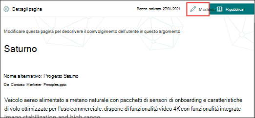
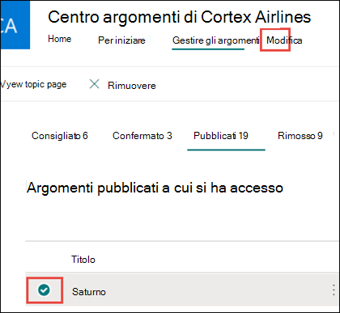
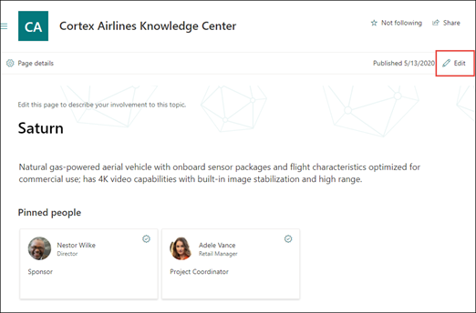
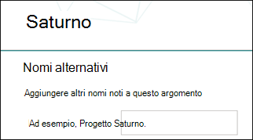
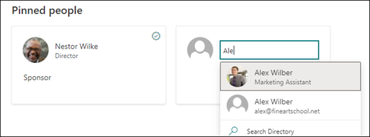
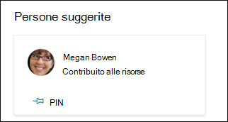
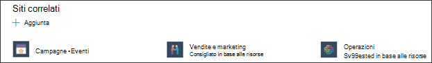
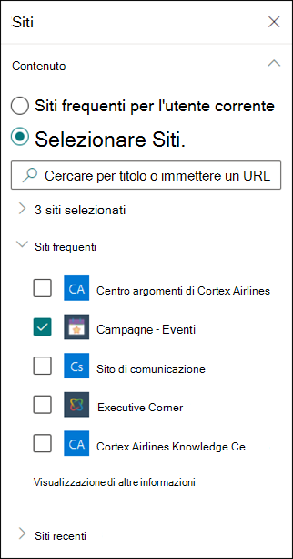
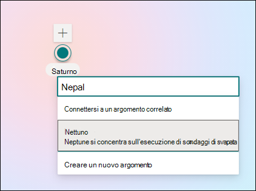
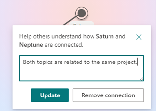

# Modificare un argomento esistente in Microsoft Viva Topics 

 

> [!VIDEO https://www.microsoft.com/videoplayer/embed/RE4LA4n]  

 

In Viva Topics è possibile modificare un argomento esistente. Potrebbe essere necessario eseguire questa operazione se si desidera correggere o aggiungere ulteriori informazioni a una pagina di argomento esistente. 

> [!Note] 
> Mentre le informazioni in un argomento raccolto dall'IA sono limitate per motivi di [sicurezza,](topic-experiences-security-trimming.md)tenere presente che la descrizione dell'argomento e le informazioni sulle persone che vengono aggiunti manualmente durante la modifica di un argomento esistente sono visibili a tutti gli utenti che dispongono delle autorizzazioni per visualizzare gli argomenti. 

## Requisiti

Per modificare un argomento esistente, è necessario:
- Avere una licenza di Viva Topics.
- Disporre delle autorizzazioni per [**Who creare o modificare argomenti.**](./topic-experiences-user-permissions.md) Gli amministratori delle informazioni possono assegnare questa autorizzazione nelle impostazioni delle autorizzazioni per gli argomenti di Viva Topics. 

> [!Note] 
> Gli utenti che dispongono dell'autorizzazione per gestire gli argomenti nel Centro argomenti (responsabili della conoscenza) dispongono già delle autorizzazioni per creare e modificare gli argomenti.

## Come modificare una pagina di argomento

Gli utenti che dispongono dell'autorizzazione **Who** creare o modificare argomenti possono modificare un argomento aprendo <b></b> la pagina dell'argomento da un'evidenziazione dell'argomento e quindi selezionando il pulsante Modifica in alto a destra nella pagina dell'argomento. La pagina dell'argomento può essere aperta anche dalla home page del Centro argomenti in cui è possibile trovare tutti gli argomenti a cui si dispone di una connessione.

      

I knowledge manager possono inoltre modificare gli argomenti direttamente dalla pagina Gestisci argomenti selezionando l'argomento e quindi selezionando <b>Modifica</b> sulla barra degli strumenti.

      

### Per modificare una pagina dell'argomento

1. Nella pagina dell'argomento selezionare **Modifica.** In questo modo è possibile apportare le modifiche necessarie alla pagina dell'argomento.

       

2. Nella sezione <b>Nomi alternativi</b> digitare altri nomi a cui l'argomento potrebbe fare riferimento. 

       
3. Nella sezione <b>Descrizione</b> digitare qualche frase per descrivere l'argomento. Se esiste già una descrizione, aggiornarla se necessario.

     

4. Nella sezione <b>Persone aggiunte</b> è possibile "aggiungere" una persona per mostrarle che ha una connessione con l'argomento (ad esempio, un proprietario di una risorsa connessa). Iniziare digitandone il nome o l'indirizzo di posta elettronica nella casella <b>Aggiungi</b> un nuovo utente e quindi selezionando l'utente che si desidera aggiungere dai risultati della ricerca. Puoi anche "sbloccarli" selezionando l'icona Rimuovi <b>dall'elenco</b> nella scheda utente.
 
     

    La sezione <b>Persone suggerite</b> mostra gli utenti che secondo l'intelligenza artificiale potrebbero essere collegati all'argomento dalla loro connessione alle risorse sull'argomento. È possibile modificare il loro stato da Suggeriti a Aggiunti selezionando l'icona aggiungi sulla scheda utente.

    

5. Nella sezione <b>File e pagine aggiunti</b> è possibile aggiungere un file o una pagina del sito di SharePoint associata all'argomento.

    
 
    Per aggiungere un nuovo file, selezionare <b>Aggiungi,</b>selezionare il sito SharePoint dai siti frequenti o seguiti e quindi selezionare il file dalla raccolta documenti del sito.

    È anche possibile usare l'opzione <b>Da un collegamento</b> per aggiungere un file o una pagina fornendo l'URL. 

   > [!Note] 
   > I file e le pagine aggiunti devono trovarsi nello stesso tenant Microsoft 365 tenant. Se vuoi aggiungere un collegamento a una risorsa esterna nell'argomento, puoi aggiungerlo tramite l'icona canvas nel passaggio 9.

6. La <b>sezione File e pagine suggeriti</b> mostra i file e le pagine che l'intelligenza artificiale suggerisce di associare all'argomento.

    

    È possibile sostituire una pagina o un file suggerito con un file o una pagina bloccata selezionando l'icona aggiungi.

7.  La sezione <b>Siti correlati</b> mostra i siti con informazioni sull'argomento. 

     

    È possibile aggiungere un sito correlato <b>selezionando</b> Aggiungi e quindi cercando il sito o selezionandolo nell'elenco dei siti frequenti o recenti. 
    
     

8. La <b>sezione Argomenti correlati</b> mostra le connessioni esistenti tra gli argomenti. È possibile aggiungere una connessione a un argomento diverso selezionando il <b>pulsante Connessione a</b> un argomento correlato, quindi digitando il nome dell'argomento correlato e selezionandolo dai risultati della ricerca. 

      

    È quindi possibile fornire una descrizione del modo in cui gli argomenti sono correlati e selezionare <b>Aggiorna</b>. 

     

   L'argomento correlato aggiunto verrà visualizzato come argomento connesso.

     

   Per rimuovere un argomento correlato, selezionare l'argomento che si desidera rimuovere, quindi selezionare <b>l'icona Rimuovi argomento.</b> 
 
      

   Selezionare quindi <b>Rimuovi</b>. 

     

9. È anche possibile aggiungere elementi statici alla pagina, ad esempio testo, immagini o collegamenti, selezionando l'icona dell'area di disegno, disponibile sotto la breve descrizione. Selezionandolo si aprirà SharePoint casella degli strumenti da cui è possibile scegliere l'elemento che si desidera aggiungere alla pagina.

     

10. Selezionare **Pubblica** o **Ripubblica** per salvare le modifiche. **La** ripubblicazione sarà l'opzione disponibile se l'argomento è stato pubblicato in precedenza.

## Vedere anche

