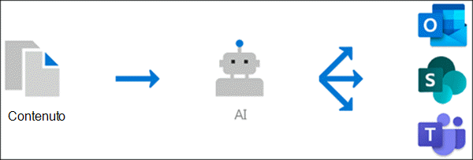

# Panoramica della gestione delle informazioni (anteprima)

> [!Note] 
> Il contenuto di questo articolo è relativo all'anteprima privata di Project Cortex. [Altre informazioni su Project Cortex](https://aka.ms/projectcortex).

Knowledge Management utilizza la tecnologia Microsoft AI, Microsoft 365, approfondire, ricerca e altri componenti e servizi per creare una rete di conoscenze nell'ambiente Microsoft 365. 

      

L'obiettivo è quello di fornire informazioni agli utenti nelle app che utilizzano tutti i giorni, ad esempio Outlook, teams e SharePoint.

Ad esempio, gli utenti visualizzano termini non familiari nei messaggi di posta elettronica, nei siti di SharePoint o nelle conversazioni dei team, per i quali è necessario sapere di più. Knowledge Management utilizza l'AI per cercare e identificare automaticamente questi **argomenti**e compilare informazioni su di esse, ad esempio una descrizione breve, esperti dell'argomento in materia e siti, file e pagine correlate. È possibile scegliere di aggiornare le informazioni sull'argomento in base alle esigenze. È quindi possibile rendere gli argomenti disponibili per gli utenti, il che significa che per ogni istanza dell'argomento visualizzato nelle app come Outlook, teams e SharePoint, il testo verrà evidenziato. Gli utenti possono scegliere di selezionare l'argomento per ulteriori informazioni su di esso tramite l'argomento dettagli.

## Individuazione degli argomenti

Knowledge Management utilizza la tecnologia Microsoft AI per cercare **argomenti** nell'ambiente Office 365.

Un argomento è una frase o un termine che è un'organizzazione significativa o importante. Ha un significato specifico per l'organizzazione e dispone di risorse correlate che possono aiutare gli utenti a capire cosa è e trovare ulteriori informazioni.

Quando viene individuato un argomento, viene creata una **pagina di argomento** contenente informazioni raccolte tramite l'individuazione degli argomenti, ad esempio:

- Breve descrizione dell'argomento.
- Utenti che potrebbero essere informati sull'argomento.
- File, pagine e siti correlati all'argomento.

## Gestione degli argomenti

La gestione degli argomenti viene svolta nel **centro tematico**dell'organizzazione. Il sito Centro argomenti viene creato durante l'installazione e funge da centro di informazioni per la propria organizzazione. Contiene un elenco di tutti gli argomenti che sono stati individuati nell'ambiente, nonché tutte le pagine di argomento create per questi argomenti. 

Gli utenti a cui sono state fornite le autorizzazioni corrette saranno in grado di eseguire le operazioni seguenti nell'argomento centro:

- Confermare o rifiutare gli argomenti individuati nel tenant.
- Creare manualmente nuovi argomenti in base alle esigenze (ad esempio, se non sono state fornite informazioni sufficienti per essere scoperte tramite AI).
- Modificare le pagine degli argomenti esistenti. 

Per ulteriori informazioni, vedere [work with topic in the topic Center](work-with-topics.md) .  

## Controlli di amministratore

I controlli di amministratore nell'interfaccia di amministrazione di Microsoft 365 consentono di gestire la rete delle informazioni. Consentono a Microsoft 365 Global o all'amministratore di SharePoint di:

- Controllare gli utenti dell'organizzazione autorizzati a visualizzare gli argomenti nelle app client o nei risultati della ricerca di SharePoint.
- Controllare i siti di SharePoint sottoposti a ricerca per indicizzazione per cercare gli argomenti.
- Configure topic Discovery to Exclude specific termini che non si vuole essere un argomento.
- Controllare quali utenti possono confermare o rifiutare gli argomenti nell'argomento centro.
- Controllare quali utenti possono creare e modificare gli argomenti nel centro argomenti.

Per ulteriori informazioni, vedere [Manage Your Knowledge Network](manage-knowledge-network.md) . 

## Tema curation

L'AI continuerà a funzionare continuamente per fornire suggerimenti per migliorare gli argomenti in base alle modifiche apportate all'ambiente.

Gli utenti a cui è consentito l'accesso per visualizzare gli argomenti nei rispettivi lavori quotidiani sono autorizzati a presentare suggerimenti per migliorarli. Ad esempio, se un utente Visualizza la pagina dell'argomento e visualizza informazioni non corrette o che devono essere aggiunte, un collegamento nella pagina dell'argomento consente di inviare una richiesta di aggiornamento delle informazioni.

Inoltre, gli utenti con autorizzazioni appropriate possono contrassegnare elementi quali la conversazione di team rilevanti per un argomento e aggiungerli a un argomento specifico.

## Vedere anche
[Configurare la gestione delle informazioni](set-up-knowledge-network.md) 
[Panoramica del centro argomenti](topic-center-overview.md)
