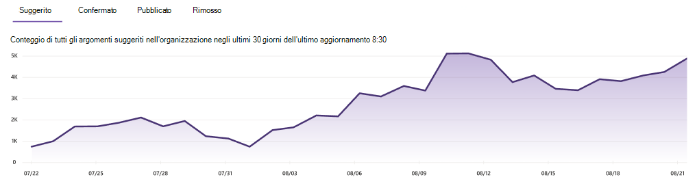

# Gestire gli argomenti nel Centro argomenti in Microsoft Viva TopicsManage topics in the topic center in Microsoft Viva Topics

 

> [!VIDEO https://www.microsoft.com/videoplayer/embed/RE4LxDx]  

 

Nel Centro argomenti Viva, un responsabile  della knowledge base può visualizzare la pagina Gestisci argomenti per esaminare gli argomenti identificati nelle posizioni di origine come specificato dall'amministratore della knowledge base.In the Viva Topics topic center, a knowledge manager can view the **Manage topics** page to review topics that have been identified in the source locations as specified by your knowledge admin.  

     

## Fasi dell'argomentoTopic stages

I knowledge manager aiutano a guidare gli argomenti individuati nelle varie fasi del ciclo di vita degli argomenti: **Suggerite,** **Confermate,** **Pubblicate** e **Rimosse.**Knowledge managers help to guide discovered topics through the various topic lifecycle stages: **Suggested**, **Confirmed**, **Published**, and **Removed**.

    

- **Consigliati**: un argomento è stato identificato dall'IA e ha risorse di supporto, connessioni e proprietà sufficienti.**Suggested**: A topic has been identified by AI and has enough supporting resources, connections, and properties. Questi argomenti sono contrassegnati come **argomento consigliato** nell'interfaccia utente.(These are marked as a **Suggested Topic** in the UI.)

- **Confirmed**: Argomento che è stato individuato dall'IA ed è stato convalidato.**Confirmed**: A topic that has been discovered by AI and has been validated. La convalida degli argomenti si verifica quando:Topic validation occurs when either:

   - Un responsabile della conoscenza conferma un argomento.A knowledge manager confirms a topic. Un responsabile [della knowledge base conferma un argomento](manage-topics.md#confirmed-topics) nella pagina **Gestisci** argomenti.A knowledge manager [confirms a topic](manage-topics.md#confirmed-topics) on the **Manage topics** page.

   - Più utenti confermano un argomento.Multiple users confirm a topic. Deve essere presente una rete di due voti positivi ricevuti dagli utenti che hanno votato usando il meccanismo di feedback nella scheda dell'argomento.There must be a net of two positive votes received from users who voted using the feedback mechanism on the topic card. Ad esempio, se un utente ha votato positivo e un utente ha votato negativo per un determinato argomento, sarebbero comunque necessari altri due voti positivi per confermare l'argomento.For example, if one user voted positive and one user voted negative for a particular topic, you would still need two more positive votes for the topic to be confirmed.
 
- **Published**: Argomento che è stato curato.**Published**: A topic that has been curated. Sono state apportate modifiche manuali per migliorarne la qualità o sono state create da un utente.Manual edits have been made to improve its quality, or it has been created by a user.

- **Rimosso**: argomento rifiutato e non più visibile per i visualizzatori.**Removed**: A topic that has been rejected and will no longer be visible to viewers. Un argomento può essere rimosso in qualsiasi stato (suggerito, confermato o pubblicato).A topic can be removed in any state (suggested, confirmed, or published). La rimozione degli argomenti si verifica quando:Topic removal occurs when either:

   - Un responsabile della conoscenza rimuove un argomento.A knowledge manager removes a topic. Un responsabile della knowledge base rimuove un argomento nella **pagina Gestisci** argomenti.A knowledge manager removes a topic on the **Manage topics** page.

   - Più utenti votano negativamente usando il meccanismo di feedback nella scheda dell'argomento.Multiple users cast negative votes using the feedback mechanism on the topic card. Per rimuovere un argomento, deve essere presente una rete di due voti negativi ricevuti dagli utenti.For a topic to be removed, there must be a net of two negative votes received from users. Ad esempio, se un utente ha votato negativo e un utente ha votato positivo per un determinato argomento, sarebbero comunque necessari altri due voti negativi per rimuovere l'argomento.For example, if one user voted negative and one user voted positive for a particular topic, you would still need two more negative votes for the topic to be removed.

  Quando un argomento pubblicato viene rimosso, la pagina con i dettagli curati dovrà essere eliminata manualmente tramite la raccolta pagine del Centro argomenti.When a published topic is removed, the page with the curated details will need to be deleted manually through the Pages Library of the topic center.

> [!Note] 
> Nella pagina **Gestisci argomenti,** ogni knowledge manager potrà visualizzare solo gli argomenti in cui hanno accesso ai file e alle pagine sottostanti connessi all'argomento.On the **Manage topics** page, each knowledge manager will only be able to see topics where they have access to the underlying files and pages connected to the topic. Questa limitazione delle autorizzazioni verrà riflessa nell'elenco degli argomenti visualizzati nelle schede Suggerite, **Confermate,** **Pubblicate** **e Rimosse.**This permission trimming will be reflected in the list of topics that appear in the **Suggested**, **Confirmed**, **Published**, and **Removed** tabs. Il conteggio degli argomenti, tuttavia, mostra i conteggi totali nell'organizzazione indipendentemente dalle autorizzazioni.The topic counts, however, show the total counts in the organization regardless of permissions.

## RequisitiRequirements

Per gestire gli argomenti nel Centro argomenti, è necessario:To manage topics in the topic center, you need to:
- Avere una licenza di Viva Topics.Have a Viva Topics license.

- Disporre [**dell'autorizzazione Who gestire gli argomenti.**](./topic-experiences-user-permissions.md)Have the [**Who can manage topics**](./topic-experiences-user-permissions.md) permission. Gli amministratori delle informazioni possono assegnare questa autorizzazione nelle impostazioni delle autorizzazioni per gli argomenti di Viva Topics.Knowledge admins can give users this permission in the Viva Topics topic permissions settings. 

Non sarà possibile visualizzare  la pagina Gestisci argomenti nel Centro argomenti a meno che non si dispone dell'autorizzazione Who **gestire gli** argomenti.You will not be able to view the **Manage topics** page in the topic center unless you have the **Who can manage topics** permission.

Nel Centro argomenti, un responsabile della conoscenza può esaminare gli argomenti identificati nelle posizioni di origine specificate e può confermarli o rimuoverli.In the topic center, a knowledge manager can review topics that have been identified in the source locations you specified, and can either confirm or remove them. Un responsabile della conoscenza può anche creare e pubblicare nuove pagine di argomento se non ne è stata trovata una nell'individuazione degli argomenti o modificare quelle esistenti se è necessario aggiornarne una.A knowledge manager can also create and publish new topic pages if one was not found in topic discovery, or edit existing ones if they need to be updated.

## Esaminare gli argomenti suggeritiReview suggested topics

Nella pagina **Gestisci argomenti** gli argomenti individuati nei percorsi di origine SharePoint specificati verranno elencati nella **scheda Suggeriti.** Se necessario, un responsabile della knowledge base può esaminare gli argomenti non confermati e scegliere di confermarli o rimuoverli.On the **Manage topics** page, topics that were discovered in your specified SharePoint source locations will be listed on the **Suggested** tab. If needed, a knowledge manager can review unconfirmed topics and choose to confirm or remove them.

    

Per esaminare un argomento consigliato:To review a suggested topic:

1. Nella pagina **Gestisci argomenti** selezionare la **scheda** Suggeriti e quindi selezionare l'argomento per aprire la pagina dell'argomento.On the **Manage topics** page, select the **Suggested** tab, and then select the topic to open the topic page.

2. Nella pagina dell'argomento esaminare la pagina dell'argomento e selezionare **Modifica** se è necessario apportare modifiche alla pagina.On the topic page, review the topic page, and select **Edit** if you need to make any changes to the page. La pubblicazione di eventuali modifiche sposterà questo argomento nella **scheda Published.**Publishing any edits will move this topic to the **Published** tab.

3. Dopo aver esaminato l'argomento, tornare alla **pagina Gestisci** argomenti.After reviewing the topic, go back to the **Manage topics** page. Per l'argomento selezionato è possibile:For the selected topic, you can:

   - Selezionare il segno di spunta per confermare l'argomento.Select the check mark to confirm the topic.
    
   - Selezionare la **x** se si desidera rimuovere l'argomento.Select the **x** if you want to remove the topic.

    Gli argomenti confermati verranno rimossi **dall'elenco Suggeriti** e ora verranno visualizzati **nell'elenco** Confermati.Confirmed topics will be removed from the **Suggested** list and will now display in the **Confirmed** list.

    Gli argomenti rimossi verranno rimossi **dall'elenco Suggeriti** e ora verranno visualizzati nella **scheda** Rimosso.Removed topics will be removed from the **Suggested** list and will now display in the **Removed** tab.

### Punteggio qualitàQuality score

A ogni argomento visualizzato nella **pagina Argomenti** suggeriti è assegnato un punteggio di qualità.Each topic that appears on the **Suggested** topics page has a quality score assigned to it. Il punteggio di qualità è un riflesso della quantità di informazioni che l'utente medio visualizza per le informazioni sull'argomento, tenendo presente che ogni utente potrebbe visualizzare più o meno informazioni a causa delle autorizzazioni che potrebbero o meno avere sulle informazioni in un argomento.The quality score is a reflection of the amount of information that the average user will see for the information on the topic, keeping in mind that each user might see more or less information because of the permissions they might or might not have on the information in a topic. 

Il punteggio di qualità può contribuire a fornire informazioni approfondite sugli argomenti con la maggior parte delle informazioni e può essere utile per trovare argomenti che potrebbero essere modificati manualmente.The quality score can help give insight to the topics with the most information and can be useful for finding topics that may need to be manually edited. Ad esempio, un argomento con un punteggio di qualità inferiore potrebbe essere il risultato di alcuni utenti che non hanno autorizzazioni SharePoint per i file o i siti pertinenti inclusi nell'argomento.For example, a topic with a lower quality score might be the result of some users not having SharePoint permissions to pertinent files or sites that AI has included in the topic. Un contributore potrebbe quindi modificare l'argomento in modo da includere le informazioni (se appropriato), che saranno poi visualizzabili a tutti gli utenti autorizzati a visualizzare l'argomento.A contributor could then edit the topic to include the information (when appropriate), which will then be viewable to all users who can view the topic.

### ImpressionImpressions

Nella **colonna Impressions** viene visualizzato il numero di volte in cui un argomento è stato visualizzato agli utenti finali.The **Impressions** column displays the number of times a topic has been shown to end users. Sono incluse le visualizzazioni tramite le schede di risposta degli argomenti nella ricerca e le evidenziazioni degli argomenti.This includes views through topic answer cards in search and through topic highlights. Non riflette il click-through su questi argomenti, ma che l'argomento è stato visualizzato.It does not reflect the click-through on these topics, but that the topic has been displayed. La **colonna Impressions** verrà visualizzata per gli argomenti nelle  schede **Suggerite,** Confermate, **Pubblicate** e Rimosse della **pagina Gestisci** argomenti. The **Impressions** column will show for topics in the **Suggested**, **Confirmed**, **Published**, and **Removed** tabs on the **Manage topics** page.

## Argomenti confermatiConfirmed topics

Nella  pagina Gestisci argomenti, gli argomenti individuati nelle posizioni di origine SharePoint specificate e confermati da un responsabile della conoscenza o "crowdsourced" confermati da due o più persone nette (bilanciamento dei voti negativi degli utenti rispetto ai voti degli utenti positivi) tramite il meccanismo di feedback della scheda saranno elencati nella **scheda Confermata.** Se necessario, un utente con autorizzazioni per gestire gli argomenti può esaminare gli argomenti confermati e scegliere di rifiutarli.On the **Manage topics** page, topics that were discovered in your specified SharePoint source locations and have been confirmed by a knowledge manager or "crowdsourced" confirmed by a net two or more people (balancing negative user votes against positive user votes) through the card feedback mechanism will be listed in the **Confirmed** tab. If needed, a user with permissions to manage topics can review confirmed topics and choose to reject them.

Per rivedere un argomento confermato:To review a confirmed topic:

1. Nella scheda **Confermati** selezionare l'argomento per aprire la pagina dell'argomento.On the **Confirmed** tab, select the topic to open the topic page.

2. Nella pagina dell'argomento esaminare la pagina dell'argomento e selezionare **Modifica** se è necessario apportare modifiche alla pagina.On the topic page, review the topic page, and select **Edit** if you need to make any changes to the page.

Tieni presente che puoi comunque scegliere di rifiutare un argomento confermato.Note that you can still choose to reject a confirmed topic. A tale scopo, passare all'argomento selezionato **nella** scheda Confermata e selezionare **la x** se si desidera rifiutare l'argomento.To do this, go to the selected topic on the **Confirmed** tab, and select the **x** if you want to reject the topic.

## Argomenti pubblicatiPublished topics

Gli argomenti pubblicati sono stati modificati in modo che informazioni specifiche vengano sempre visualizzate a chiunque incontri la pagina.Published topics have been edited so that specific information will always appear to whoever encounters the page. Qui sono elencati anche gli argomenti creati manualmente.Manually created topics are listed here as well.

   

## Dashboard conteggio argomentiTopic count dashboard

Questo grafico nella visualizzazione dashboard consente di visualizzare il numero di argomenti nel centro argomenti Viva Topics.This chart in the dashboard view lets you see the number of topics in your Viva Topics topic center. Il grafico mostra i conteggi degli argomenti per ogni fase del ciclo di vita dell'argomento e mostra anche l'andamento dei conteggi degli argomenti nel tempo.The chart shows the topic counts per topic lifecycle stage and also shows how topic counts have trended over time. I knowledge manager possono monitorare visivamente la frequenza con cui i nuovi argomenti vengono individuati dall'IA e la frequenza con cui gli argomenti vengono confermati o pubblicati dal knowledge manager o dalle azioni degli utenti.Knowledge managers can visually monitor the rate at which new topics are being discovered by AI and the rate at which topics are getting confirmed or published by the knowledge manager or user actions.

I knowledge manager potrebbero visualizzare un numero diverso di argomenti rappresentati nell'elenco degli argomenti nella pagina **Gestisci** argomenti rispetto a quelli visualizzati nel dashboard.Knowledge managers might see a different count of topics represented in the list of topics on the **Manage topics** page than they see in the dashboard. Ciò è dovuto al fatto che un responsabile della conoscenza potrebbe non avere accesso a tutti gli argomenti.This is because a knowledge manager might not have access to all topics. Il conteggio presentato nella visualizzazione dashboard viene effettuato prima di applicare la limitazione delle autorizzazioni.The count presented in the dashboard view is taken before applying permission-trimming. 

   
