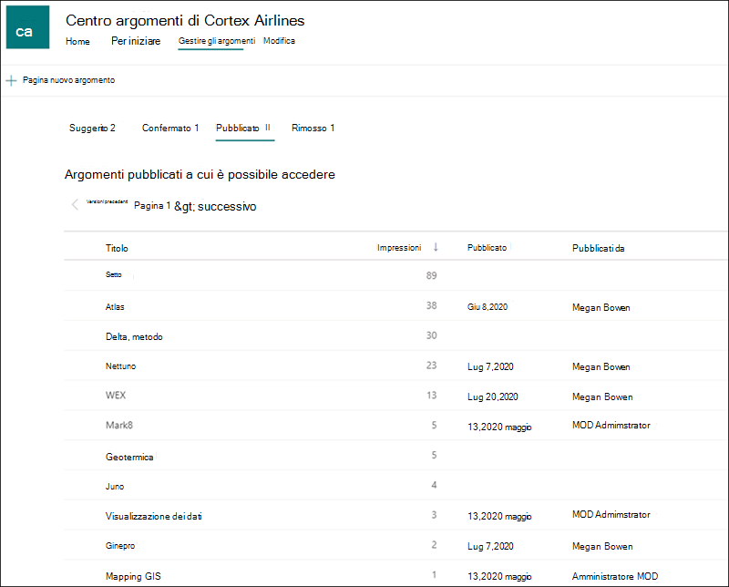
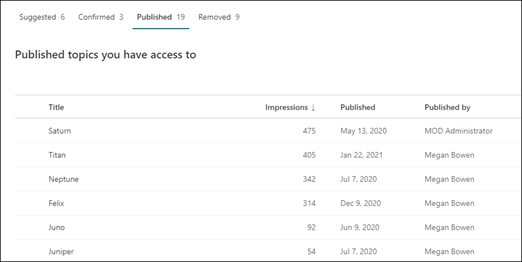

# Gestire gli argomenti nel Centro argomenti 

 

> [!VIDEO https://www.microsoft.com/videoplayer/embed/RE4LxDx]  

 

Nel Centro argomenti viva, un responsabile  della conoscenza può visualizzare la pagina Gestisci argomenti per esaminare gli argomenti identificati nei percorsi di origine di SharePoint, come specificato dall'amministratore della knowledge base.  

      

I knowledge manager aiutano a guidare gli argomenti individuati nel ciclo di vita degli argomenti in cui sono:

- Suggerito: un argomento è stato identificato dall'IA e dispone di risorse, connessioni e proprietà di supporto sufficienti.
- Confermato: viene convalidato un argomento suggerito dall'IA. La convalida viene eseguita tramite conferma da un responsabile della conoscenza. Inoltre, un argomento può essere confermato se almeno due utenti forniscono feedback positivo tramite la domanda di feedback nella scheda dell'argomento.
- Published: Argomento confermato che è stato curato: sono state apportate modifiche manuali per migliorarne la qualità.
- Rimosso: un argomento viene rifiutato da un responsabile della conoscenza e non sarà più visibile ai visualizzatori. L'argomento può essere in qualsiasi stato quando viene rimosso (suggerito, confermato o pubblicato). Quando un argomento pubblicato viene rimosso, la pagina con i dettagli curati dovrà essere eliminata manualmente tramite la raccolta pagine del Centro argomenti.

      

> [!Note] 
> Nella pagina Gestisci argomenti, ogni knowledge manager sarà in grado di visualizzare solo gli argomenti in cui hanno accesso ai file e alle pagine dell'argomento. Ciò si riflette negli argomenti elencati nelle schede Suggerite, Confermate, Rimosse e Pubblicate. Il conteggio degli argomenti, tuttavia, mostra i conteggi totali nell'organizzazione.

## Requisiti

Per gestire gli argomenti nel Centro argomenti, è necessario:
- Avere una licenza Viva Topics.

- Disporre [**dell'autorizzazione Chi può gestire gli**](./topic-experiences-user-permissions.md) argomenti. Gli amministratori della knowledge base possono concedere agli utenti questa autorizzazione nelle impostazioni delle autorizzazioni dell'argomento Viva Topics. 

Non sarà possibile visualizzare la pagina Gestisci argomenti nel Centro argomenti a meno che non si dispone dell'autorizzazione Chi **può gestire gli** argomenti.

Nel Centro argomenti, un responsabile della conoscenza può esaminare gli argomenti identificati nei percorsi di origine di SharePoint specificati e può confermarli o rifiutarli. Un responsabile della conoscenza può anche creare e pubblicare nuove pagine di argomento se non ne è stata trovata una nell'individuazione degli argomenti o modificare quelle esistenti se è necessario aggiornarne una.

## Esaminare gli argomenti suggeriti

Nella pagina Gestione argomenti del Centro argomenti gli argomenti individuati nei percorsi di origine di SharePoint specificati verranno elencati nella **scheda Suggeriti.** Se necessario, un responsabile della knowledge base può esaminare gli argomenti non confermati e scegliere di confermarli o rifiutarli.

      

Per esaminare un argomento consigliato:

1. Nella pagina **Gestisci argomenti** selezionare la **scheda Suggeriti** e selezionare l'argomento per aprire la pagina dell'argomento. 

2. Nella pagina dell'argomento esaminare la pagina dell'argomento e selezionare **Modifica** se è necessario apportare modifiche alla pagina. La pubblicazione di eventuali modifiche sposterà questo argomento nella **scheda Published.**

3. Dopo aver esaminato l'argomento, tornare alla pagina Gestisci argomenti. Per l'argomento selezionato, è possibile:

   - Selezionare il segno di spunta per confermare l'argomento.
    
   - Selezionare la **x** se si desidera rifiutare l'argomento.

    Gli argomenti confermati verranno rimossi **dall'elenco Suggeriti** e ora verranno visualizzati **nell'elenco** Confermati.

    Gli argomenti rifiutati verranno rimossi **dall'elenco Suggeriti** e ora verranno visualizzati nella **scheda** Rimosso.

     

### Punteggio qualità

A ogni argomento visualizzato nella pagina Argomenti suggeriti <b>è</b> assegnato un punteggio qualità. Il punteggio Qualità riflette la quantità di informazioni che l'utente medio potrà visualizzare per le informazioni sull'argomento, tenendo presente che ogni utente può visualizzare più o meno informazioni a causa delle autorizzazioni che possono o meno avere sulle informazioni in un argomento. 

Il punteggio Qualità può contribuire a fornire informazioni dettagliate sugli argomenti con la maggior parte delle informazioni e può essere utile per trovare gli argomenti che potrebbero dover essere modificati manualmente.  Ad esempio, un argomento con un punteggio di qualità inferiore può essere il risultato di alcuni utenti che non hanno autorizzazioni di SharePoint per i file o i siti pertinenti inclusi nell'argomento. Un collaboratore può quindi modificare l'argomento in modo da includere le informazioni (se appropriato), che saranno quindi visualizzabili per tutti gli utenti che possono visualizzare l'argomento.

Il punteggio Qualità può essere compreso tra 1 e 100. Un argomento appena individuato avrà un punteggio di qualità pari a 0 fino a quando due o più utenti non lo avranno visualizzato. Il punteggio di qualità di ogni utente è determinato da una serie di fattori, ad esempio la quantità di contenuto visualizzato per l'utente specifico, che viene controllata dalle autorizzazioni dell'utente in quanto ogni pagina degli argomenti dispone di limitazione per motivi di sicurezza per il contenuto generato dall'IA. Il punteggio qualità visualizzato nella scheda Argomenti suggeriti è una media di ogni singolo punteggio degli utenti.

### Impression

Nella <b>colonna Impressions</b> viene visualizzato il numero di volte in cui un argomento è stato visualizzato agli utenti finali. Sono incluse le visualizzazioni tramite le schede argomento nella ricerca, le evidenziazioni degli argomenti e le visualizzazioni del Centro argomenti. Non riflette il click-through su questi argomenti, ma che l'argomento è stato visualizzato. La colonna Impressions verrà visualizzata per gli argomenti nelle schede Suggerite, Confermate, Pubblicate e Rimosse nella pagina Gestisci argomenti.

## Argomenti confermati

Nella pagina Gestisci argomenti, gli argomenti individuati nelle posizioni di origine di SharePoint specificate e confermati da un responsabile della knowledge base o da "crowd sourced" confermati da due o più persone tramite il meccanismo di feedback della scheda saranno elencati nella **scheda** Confermata. Se necessario, un utente con autorizzazioni per gestire gli argomenti può esaminare gli argomenti confermati e scegliere di rifiutarli.

Per esaminare un argomento confermato:

1. Nella scheda **Confermata** selezionare l'argomento per aprire la pagina dell'argomento. 

2. Nella pagina dell'argomento esaminare la pagina dell'argomento e selezionare **Modifica** se è necessario apportare modifiche alla pagina.

Tieni presente che puoi comunque scegliere di rifiutare un argomento confermato.  A tale scopo, passare all'argomento selezionato nell'elenco Confermato e selezionare **la x** se si desidera rifiutare l'argomento.

## Argomenti pubblicati
Gli argomenti pubblicati sono stati modificati in modo che informazioni specifiche vengano sempre visualizzate a chiunque incontri la pagina. Anche gli argomenti creati manualmente sono elencati qui.

     