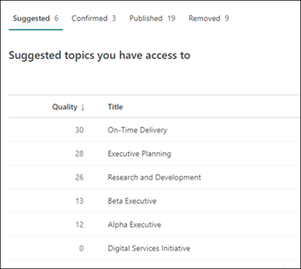

# Gestire gli argomenti nel Centro argomenti in Microsoft Viva Topics

 

> [!VIDEO https://www.microsoft.com/videoplayer/embed/RE4LxDx]  

 

Nel Centro argomenti Viva, un responsabile  della knowledge base può visualizzare la pagina Gestisci argomenti per esaminare gli argomenti identificati nelle posizioni di origine come specificato dall'amministratore della knowledge base.  

     

## Fasi dell'argomento

I knowledge manager aiutano a guidare gli argomenti individuati nelle varie fasi del ciclo di vita degli argomenti: **Suggerite,** **Confermate,** **Pubblicate** e **Rimosse.**

    

- **Consigliato:** un argomento è stato identificato dall'IA e dispone di risorse, connessioni e proprietà di supporto sufficienti. Questi argomenti sono contrassegnati come **argomento consigliato** nell'interfaccia utente.

- **Confermata:** viene convalidato un argomento suggerito dall'IA. La convalida dell'argomento deve essere confermata da un responsabile della conoscenza. Per confermare un argomento, è necessario che vi sia una rete di due voti positivi ricevuti dagli utenti che hanno votato usando il meccanismo di feedback nella scheda dell'argomento. Ad esempio, se un utente ha votato positivo e un utente ha votato negativo per un determinato argomento, sarebbero comunque necessari altri due voti positivi per confermare l'argomento.
 
- **Published**: argomento confermato che è stato curato: sono state apportate modifiche manuali per migliorarne la qualità.

- **Rimosso**: un argomento viene rifiutato da un responsabile della conoscenza e non sarà più visibile ai visualizzatori. Un argomento può essere rimosso in qualsiasi stato (suggerito, confermato o pubblicato). Per rimuovere un argomento, deve essere presente una rete di due voti negativi ricevuti dagli utenti che hanno votato usando i meccanismi di feedback nella scheda dell'argomento. Ad esempio, se un utente ha votato negativo e un utente ha votato positivo per un determinato argomento, sarebbero comunque necessari altri due voti negativi per rimuovere l'argomento. Quando un argomento pubblicato viene rimosso, la pagina con i dettagli curati dovrà essere eliminata manualmente tramite la raccolta pagine del Centro argomenti.

> [!Note] 
> Nella pagina **Gestisci argomenti,** ogni knowledge manager potrà visualizzare solo gli argomenti in cui hanno accesso ai file e alle pagine sottostanti connessi all'argomento. Questa limitazione delle autorizzazioni verrà riflessa nell'elenco degli argomenti visualizzati nelle schede Suggerite, **Confermate,** **Pubblicate** **e Rimosse.** Il conteggio degli argomenti, tuttavia, mostra i conteggi totali nell'organizzazione indipendentemente dalle autorizzazioni.

## Requisiti

Per gestire gli argomenti nel Centro argomenti, è necessario:
- Avere una licenza Viva Topics.

- Disporre [**dell'autorizzazione Chi può gestire gli**](./topic-experiences-user-permissions.md) argomenti. Gli amministratori della knowledge base possono concedere agli utenti questa autorizzazione nelle impostazioni delle autorizzazioni dell'argomento Viva Topics. 

Non sarà possibile visualizzare  la pagina Gestisci argomenti nel Centro argomenti a meno che non si dispone dell'autorizzazione Chi **può gestire gli** argomenti.

Nel Centro argomenti, un responsabile della conoscenza può esaminare gli argomenti identificati nelle posizioni di origine specificate e può confermarli o rimuoverli. Un responsabile della conoscenza può anche creare e pubblicare nuove pagine di argomento se non ne è stata trovata una nell'individuazione degli argomenti o modificare quelle esistenti se è necessario aggiornarne una.

## Esaminare gli argomenti suggeriti

Nella pagina **Gestisci argomenti** gli argomenti individuati nei percorsi di origine di SharePoint specificati verranno elencati nella **scheda Suggeriti.** Se necessario, un responsabile della knowledge base può esaminare gli argomenti non confermati e scegliere di confermarli o rimuoverli.

    

Per esaminare un argomento consigliato:

1. Nella pagina **Gestisci argomenti** selezionare la **scheda** Suggeriti e quindi selezionare l'argomento per aprire la pagina dell'argomento.

2. Nella pagina dell'argomento esaminare la pagina dell'argomento e selezionare **Modifica** se è necessario apportare modifiche alla pagina. La pubblicazione di eventuali modifiche sposterà questo argomento nella **scheda Published.**

3. Dopo aver esaminato l'argomento, tornare alla **pagina Gestisci** argomenti. Per l'argomento selezionato, è possibile:

   - Selezionare il segno di spunta per confermare l'argomento.
    
   - Selezionare la **x** se si desidera rimuovere l'argomento.

    Gli argomenti confermati verranno rimossi **dall'elenco Suggeriti** e ora verranno visualizzati **nell'elenco** Confermati.

    Gli argomenti rimossi verranno rimossi **dall'elenco Suggeriti** e ora verranno visualizzati nella **scheda** Rimosso.

### Punteggio qualità

A ogni argomento visualizzato nella **pagina Argomenti** suggeriti è assegnato un punteggio di qualità. Il punteggio di qualità è un riflesso della quantità di informazioni che l'utente medio visualizza per le informazioni sull'argomento, tenendo presente che ogni utente potrebbe visualizzare più o meno informazioni a causa delle autorizzazioni che potrebbero o meno avere sulle informazioni in un argomento. 

Il punteggio di qualità può contribuire a fornire informazioni approfondite sugli argomenti con la maggior parte delle informazioni e può essere utile per trovare argomenti che potrebbero essere modificati manualmente. Ad esempio, un argomento con un punteggio di qualità inferiore potrebbe essere il risultato di alcuni utenti che non hanno autorizzazioni di SharePoint per i file o i siti pertinenti inclusi nell'argomento. Un collaboratore può quindi modificare l'argomento in modo da includere le informazioni (se appropriato), che saranno quindi visualizzabili per tutti gli utenti che possono visualizzare l'argomento.

### Impression

Nella **colonna Impressions** viene visualizzato il numero di volte in cui un argomento è stato visualizzato agli utenti finali. Sono incluse le visualizzazioni tramite le schede di risposta degli argomenti nella ricerca e le evidenziazioni degli argomenti. Non riflette il click-through su questi argomenti, ma che l'argomento è stato visualizzato. La **colonna Impressions** verrà visualizzata per gli argomenti nelle  schede **Suggerite,** Confermate, **Pubblicate** e Rimosse della **pagina Gestisci** argomenti. 

## Argomenti confermati

Nella  pagina Gestisci argomenti, gli argomenti individuati nelle posizioni di origine di SharePoint specificate e confermati da un knowledge manager o "crowdsourced" confermati da due o più persone nette (bilanciamento dei voti negativi degli utenti rispetto ai voti degli utenti positivi) tramite il meccanismo di feedback della scheda saranno elencati nella **scheda Confermata.** Se necessario, un utente con autorizzazioni per gestire gli argomenti può esaminare gli argomenti confermati e scegliere di rifiutarli.

Per esaminare un argomento confermato:

1. Nella scheda **Confermata** selezionare l'argomento per aprire la pagina dell'argomento.

2. Nella pagina dell'argomento esaminare la pagina dell'argomento e selezionare **Modifica** se è necessario apportare modifiche alla pagina.

Tieni presente che puoi comunque scegliere di rifiutare un argomento confermato. A tale scopo, passare all'argomento selezionato **nella** scheda Confermata e selezionare **la x** se si desidera rifiutare l'argomento.

## Argomenti pubblicati

Gli argomenti pubblicati sono stati modificati in modo che informazioni specifiche vengano sempre visualizzate a chiunque incontri la pagina. Anche gli argomenti creati manualmente sono elencati qui.

   
