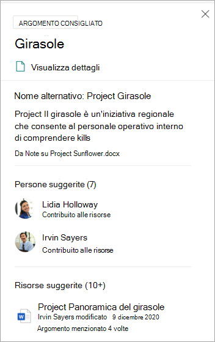
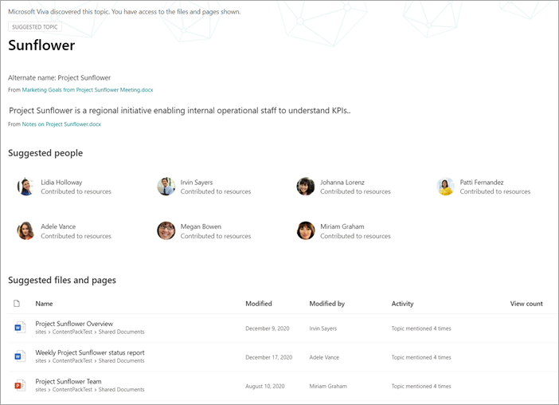
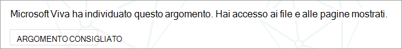
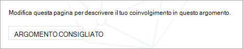
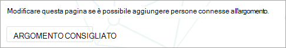

# Gestire gli argomenti su vasta scala in Microsoft Viva TopicsManage topics at scale in Microsoft Viva Topics

Quando si indicizzano SharePoint siti o l'intera organizzazione per Viva Topics, è possibile che venga generato un numero di argomenti.When you index your SharePoint sites or your entire organization for Viva Topics, many topics might be generated. In questo caso e vengono visualizzati migliaia  di argomenti suggeriti nella pagina Gestisci argomenti, può essere difficile sapere da dove iniziare.When this happens and you see thousands of suggested topics on the **Manage topics** page, it can be challenging to know where to start. In questo articolo viene descritto come Viva Topics consente di ottimizzare gli argomenti e le informazioni visualizzati agli utenti che cercano informazioni, anche in organizzazioni di grandi dimensioni con un numero elevato di argomenti.This article describes how Viva Topics helps you optimize which topics and information are shown to users who are searching for information, even in large organizations with large numbers of topics.

Innanzitutto, un promemoria delle [quattro fasi per gli argomenti:](manage-topics.md#topic-stages)First, a reminder of the [four stages for topics](manage-topics.md#topic-stages):

- **Consigliati**: un argomento è stato identificato dall'IA e ha risorse di supporto, connessioni e proprietà sufficienti.**Suggested**: A topic has been identified by AI and has enough supporting resources, connections, and properties. Questi argomenti sono contrassegnati come **argomento consigliato** nell'interfaccia utente.(These are marked as a **Suggested Topic** in the UI.)

- **Confermato:** un argomento suggerito dall'IA deve essere convalidato.**Confirmed**: A topic that has been suggested by AI needs to be validated. La convalida degli argomenti si verifica quando:Topic validation occurs when either:
   - Un responsabile della conoscenza conferma un argomento.A knowledge manager confirms a topic. Un responsabile [della knowledge base conferma un argomento](manage-topics.md#confirmed-topics) nella pagina **Gestisci** argomenti.A knowledge manager [confirms a topic](manage-topics.md#confirmed-topics) on the **Manage topics** page. 
   - Più utenti confermano un argomento.Multiple users confirm a topic. Deve essere presente una rete di due voti positivi ricevuti dagli utenti che hanno votato usando il meccanismo di feedback nella scheda dell'argomento.There must be a net of two positive votes received from users who voted using the feedback mechanism on the topic card. Ad esempio, se un utente ha votato positivo e un utente ha votato negativo per un determinato argomento, sarebbero comunque necessari altri due voti positivi per confermare l'argomento.For example, if one user voted positive and one user voted negative for a particular topic, you would still need two more positive votes for the topic to be confirmed.
 
- **Published**: Argomento confermato che è stato curato.**Published**: A confirmed topic that has been curated. Sono state apportate modifiche manuali per migliorarne la qualità.Manual edits have been made to improve its quality.

- **Rimosso**: un argomento viene rifiutato da un responsabile della conoscenza e non sarà più visibile ai visualizzatori.**Removed**: A topic is rejected by a knowledge manager and will no longer be visible to viewers. Un argomento può essere rimosso in qualsiasi stato (suggerito, confermato o pubblicato).A topic can be removed in any state (suggested, confirmed, or published). Per rimuovere un argomento, deve essere presente una rete di due voti negativi ricevuti dagli utenti che hanno votato usando i meccanismi di feedback nella scheda dell'argomento.For a topic to be removed, there must be a net of two negative votes received from users who voted using the feedback mechanisms on the topic card. Ad esempio, se un utente ha votato negativo e un utente ha votato positivo per un determinato argomento, sarebbero comunque necessari altri due voti negativi per rimuovere l'argomento.For example, if one user voted negative and one user voted positive for a particular topic, you would still need two more negative votes for the topic to be removed. Quando un argomento pubblicato viene rimosso, la pagina con i dettagli curati dovrà essere eliminata manualmente tramite la raccolta pagine del Centro argomenti.When a published topic is removed, the page with the curated details will need to be deleted manually through the Pages Library of the topic center.

## Ruolo di knowledge managerKnowledge manager role 

Quando si configura Viva Topics, si aggiungerà un gruppo di utenti a cui sono concesse le autorizzazioni per visualizzare la **pagina Gestisci** argomenti nel Centro argomenti.When you configure Viva Topics, you'll add a group of users who are granted permissions to see the **Manage topics** page in the topic center. Verrà visualizzato solo per gli utenti che hanno il ruolo di cura principale per gli argomenti.It will appear only for these users who hold the role of primary curation for the topics. Avranno accesso ai dati relativi agli argomenti e potranno visualizzare gli elenchi di tutti gli argomenti a cui hanno accesso per la revisione e la cura.They'll have access to data about the topics and will be able to see lists of all topics that they have access to review and curate.

I dipendenti di questo ruolo devono disporre di ampie autorizzazioni per visualizzare un'ampia gamma di argomenti.Employees in this role should have broad permissions to view a wide array of topics. In caso contrario, se le autorizzazioni sono segmentate, è possibile selezionare un gruppo di utenti che rappresentano aree diverse dell'azienda e possono essere curate per le proprie aree.Or if permissions are segmented, you might want to select a group of users that represent different areas of the business and can curate for their own areas.

Quando si esaminano per la prima volta gli argomenti nel Centro argomenti, gli argomenti suggeriti sono puramente definiti dall'IA.When you first review topics in the topic center, suggested topics are purely AI-defined. I responsabili della conoscenza potrebbero voler esaminare ognuno di essi prima di eseguire l'implementazione di Viva Topics in una community di utenti ampia.Knowledge managers might want to review each one before rolling out Viva Topics to a broad user community. Quando si lavora su larga scala, questo approccio è raramente pratico a causa delle migliaia di argomenti.When working at scale, this approach is rarely a practical because of the thousands of topics.

L'approccio consigliato consiste nel trovare un equilibrio tra gli argomenti più pertinenti o importanti per il set iniziale di utenti e concentrarsi sulla cura di tali argomenti prima dell'implementazione di Viva Topics.The recommended approach is to find a balance of the most pertinent or important topics for your initial set of users and focus on curation of those topics before rollout of Viva Topics. Iniziare a raccogliere feedback dagli utenti e consentire al crowdsourcing di determinare i modelli di utilizzo e di contributo degli utenti per informare le strategie suggerite in questo articolo.Begin to collect feedback from the users and allow crowdsourcing to determine the usage and contribution patterns of your users to inform the strategies suggested in this article.

È importante riconoscere che il sistema identificherà e mostrerà a tutti gli utenti sia gli argomenti pubblicati suggeriti dall'IA che gli argomenti pubblicati curati dall'utente.It's important to recognize that the system will identify and show both AI-suggested and human-curated published topics to all users. Tuttavia, questo non significa che tutti gli argomenti suggeriti verranno visualizzati a tutti gli utenti finali.However, this doesn't mean that every suggested topic will be shown to all end users. Le impostazioni di sicurezza in atto mostreranno solo gli argomenti a cui ogni dipendente può accedere in base alle autorizzazioni impostate per il contenuto stesso.The security settings in place will show only the topics that each employee can access based on the permissions that are set on the content itself.

In quanto knowledge manager con  autorizzazioni per visualizzare la pagina Gestisci argomenti, è possibile che venga visualizzato un numero molto maggiore di argomenti elencati a causa delle proprie autorizzazioni elevate, a seconda del ruolo nell'organizzazione e del livello di accesso.As a knowledge manager with permissions to view the **Manage topics** page, you might see a much larger number of topics listed because of your own elevated permissions, depending on your role in the organization and level of access. Avrai anche accesso alle visualizzazioni che consentono di visualizzare gli argomenti elencati in un'unica posizione anziché accedervi tramite evidenziazioni o ricerche.You'll also have access to views that allow you see topics listed in a single location rather than accessing them by using highlights or search.

Inoltre, è probabile che la maggior parte degli utenti visualizza una percentuale minore di argomenti e un insieme più ampio di argomenti che verranno visualizzati molto meno frequentemente a causa delle autorizzazioni.In addition, there is likely a smaller percentage of topics that will be viewed by most users and a larger set of more topics that will be seen much less frequently due to permissions. Di conseguenza, è bene concentrare innanzitutto le attività di cura sugli argomenti più importanti per l'organizzazione e che sono più probabili essere visti in modo più ampio.As a result, it is good to first focus any curation tasks on the topics that are the most important for your organization and that are the most likely to be seen more broadly.

In questo articolo vengono illustrate alcune strategie per la curazione.This article covers a few strategies for curation. Queste strategie potrebbero indicare che gli argomenti meno frequenti o meno comuni potrebbero non essere completamente curati dai knowledge manager.These strategies might mean that the less frequent or less common topics might not be fully curated by knowledge managers. Tuttavia, questi argomenti suggeriti rimangono utili e possono fornire informazioni approfondite o un puntatore a una persona, in modo da risparmiare ore a un dipendente per cercare un punto di partenza.However, these suggested topics remain useful and can provide insight or a pointer to a person, which can save an employee hours of looking for a starting point. Consentire aggiornamenti in crowdsource per gli argomenti è vantaggioso e offre più contenuto e copertura per gli argomenti meno comuni.Allowing crowdsourced updates to topics is beneficial and provides more content and coverage for the less common topics.

In questo articolo vengono fornite alcune linee guida e procedure consigliate per affrontare la gestione e la cura degli argomenti.This article provides some guidance and best practices to approach topic management and curation.

## Informazioni sugli argomenti suggeritiUnderstanding suggested topics

Quando gli argomenti vengono individuati dall'IA, vengono contrassegnati come argomento **consigliato,** sia nella pagina Gestisci argomenti che nelle schede degli argomenti presentate agli utenti. When topics are discovered by AI, they're marked as a **Suggested Topic**, both on the **Manage topics** page, and in the topic cards that are presented to users. Tutti gli argomenti che non sono stati contrassegnati come rimossi verranno visualizzati agli utenti, inclusi gli argomenti confermati, pubblicati e suggeriti.Any topic that hasn't been marked as removed will be shown to users—this includes confirmed, published, and suggested topics. Gli argomenti in tutti e tre gli stati sono disponibili per gli utenti finali.Topics in all three states are available to end users.

All'interno di una scheda argomento o di una pagina, usiamo vari segnali per mostrare come l'IA ha generato le informazioni.Within a topic card or page, we use various cues to show how the AI has generated the information. Il sistema usa un'ampia gamma di prove per aggiungere le risorse, principalmente tramite il contenuto stesso.The system uses a variety of evidence to add the resources, primarily through the content itself.

- Le etichette mostrano che un argomento è stato suggerito e che è stato individuato da Viva Topics.Labels show that a topic is suggested and that it was discovered by Viva Topics.  

   

- Informazioni sugli stati della scheda da cui provengono le definizioni specificandone l'origine.Information on the card states where a definition has come from by specifying its source.

- Le persone suggerite derivano aggregando persone che hanno scritto o modificato documenti con prove di argomento.Suggested people are derived by aggregating people who have written or edited documents with topic evidence. Se una persona scrive un documento con un nome di argomento nel titolo e che dispone di molte visualizzazioni, potrebbe essere necessario un solo documento per stabilire la persona come correlata.If a person writes a document that has a topic name in the title, and that document has many views, it might only require one document to establish the person as related. Tuttavia, in molti casi è meglio avere più prove e le persone elencate hanno lavorato su più documenti.However, in many cases more evidence is better, and people who are listed have worked on multiple documents.  

   

- Per i file e le pagine mostrati, il sistema identifica il numero di volte in cui l'argomento è stato menzionato nel documento, ma l'argomento deve essere menzionato anche in un contesto specifico che identifichi il riferimento all'argomento di tipo specifico (ad esempio progetto o team).For the files and pages shown, the system identifies how many times the topic has been mentioned in the document, but the topic also must be mentioned in a specific context that identifies the reference to the topic of specific type (such as project or team). Questo è ciò che conta come prova per l'IA.This is what counts as evidence for the AI. Il sistema considera anche l'occorrenza di un nome di argomento nei titoli dei documenti, dei tipi di documenti e di altre funzionalità di analisi (ad esempio le visualizzazioni).The system also considers the occurrence of a topic name in the titles of documents, types of documents, and other analytics features (such as views).

   

   

   

Questi attributi dimostrano che il contenuto è stato aggiunto dall'IA e come l'IA ha determinato questa decisione.These attributes demonstrate that the content has been added by AI, and how the AI has made that determination.

### ComunicazioneCommunication

Quando comunichi agli utenti argomenti viva, è importante chiarire la differenza tra gli argomenti suggeriti dall'IA e il contenuto e i relativi equivalenti curati.When communicating to your users about Viva Topics, it's important to clarify the difference between AI-suggested topics and content and their curated equivalents.

In quanto lettore, dovresti visualizzare gli argomenti suggeriti con un occhio più critico.As a reader, you should view suggested topics with a more critical eye. Non devono essere percepite come fonti autorevoli di veritá organizzativa.They shouldn't be perceived as authoritative sources of organizational truth. Si tratta piuttosto di uno strumento di ricerca delle modalità per accedere a conoscenze tacita presentate tramite il contenuto a cui si ha accesso.Rather, they're a way-finding tool to access tacit knowledge that is presented through the content that you have access to. L'IA ha individuato l'argomento e ha prove sufficienti per mostrarlo all'utente, ma il suo valore non è stato confermato da una persona.The AI has discovered the topic and has enough evidence to show it to you, but its value hasn't been confirmed by a person.

### Controlli crowdsourcedCrowdsourced controls

Gli argomenti suggeriti possono essere migliorati curando la pagina e tramite feedback in crowdsource sull'argomento.Suggested topics can be improved by curation of the page and through crowdsourced feedback on the topic.

Quando gli utenti interagiscono con un argomento suggerito, potrebbero essere poste una semplice domanda nell'interfaccia utente.When users interact with a suggested topic, they might be asked a simple question in the UI. Ad esempio: *questo argomento è rilevante per la pagina?*For example: *Was this topic relevant to the page?* *Questa persona è rilevante per l'argomento?**Is this person relevant for the topic?* *Questa definizione è accurata?**Was this definition accurate?* Utilizzando il feedback per tali domande, l'accuratezza degli argomenti può aumentare senza la necessità di un individuo denominato per la cura della pagina.By using the feedback to such questions, the accuracy of the topics can increase without the need for a named individual to curate the page.

La home page di un centro argomenti è un'altra posizione in cui vengono raccolti i commenti e suggerimenti sugli argomenti suggeriti.The home page of a topic center is another location where feedback on suggested topics is gathered. Nel Centro argomenti, un utente può visualizzare gli argomenti a cui è stato associato e può confermare l'associazione o farlo rimuovere.In the topic center, a user can see the topics that they have been associated with and are given the option to either confirm this association or have it removed.

   

Quando si consente un ampio crowdsourcing di argomenti, è necessario considerare i fattori seguenti:When you allow broad crowdsourcing of topics, you should consider the following factors:

-   Gli utenti visualizzano **l'opzione** Modifica nelle pagine degli argomenti e possono modificare le pagine nella stessa esperienza di altre pagine SharePoint moderne.Users will see the **Edit** option on topic pages and can edit the pages in the same experience as other modern SharePoint pages.

-   Alcune **web part Argomento** consigliato non possono essere rimosse.Some **Suggested Topic** web parts can't be removed. Non è possibile rimuovere il nome dell'argomento, i nomi alternativi, la definizione, le persone suggerite e le risorse suggerite.The topic name, alternate names, definition, suggested people, and suggested resources can't be removed.

-   Può essere necessario del tempo per spostare un argomento suggerito o confermato che è stato pubblicato **nell'elenco Pubblicato** nella **pagina Gestisci** argomenti.It can take some time for a suggested or confirmed topic that has been published to be moved to the **Published** list on the **Manage topics** page.

    -   Il tempo stimato per la visualizzazione di un argomento in ricerca, evidenziazioni, hashtag o annotazioni è di 2 ore.The estimated time for a topic to appear in search, highlights, hashtags, or annotations is 2 hours.

    -   Nella maggior parte dei casi, il  tempo stimato per la visualizzazione di un argomento nell'elenco Pubblicato nella pagina Argomenti gestiti non è superiore a 24 ore. The estimated time for a topic to appear in **Published** list on the **Managed topics** page is no more than 24 hours in most cases. Dovrebbero essere visualizzati entro 2 ore, ma poiché esiste una sincronizzazione completa ogni 24 ore, l'attesa non deve essere più lunga di 24 ore.You should see them within 2 hours, but because there's a full sync every 24 hours, the wait shouldn't be longer than 24 hours.

-   È possibile che un utente lasci un argomento pubblicato in uno stato di estrazione o modifica.It's possible that a user might leave a published topic in a checked-out or editing state. Un responsabile della conoscenza può visualizzare tali informazioni nella raccolta pagine del Centro argomenti e può eliminare le modifiche dell'utente per ripubblicare l'argomento o contattare l'utente per richiedere di archiviare l'argomento.A knowledge manager can see these in the Pages Library of the topic center and either can discard the user's changes to republish the topic or contact that user to request that they check in the topic.

### La visibilità degli argomenti e il contenuto si basano sulle autorizzazioni di un utenteTopic visibility and content is based on a user's permissions

Quando si esamina l'elenco degli argomenti suggeriti come knowledge manager, tenere presente che il contenuto di un argomento suggerito sarà basato in modo dinamico sulle autorizzazioni.When you review the list of suggested topics as a knowledge manager, keep in mind that the contents on a suggested topic will be dynamically based on permissions. Il contenuto suggerito e le persone visualizzate potrebbero non essere uguali a quelli presentati a un utente o a un altro responsabile della conoscenza.The suggested content and people that are shown to you might not be the same as those who are presented to any user or another knowledge manager.

In base alle autorizzazioni per visualizzare il contenuto associato a un argomento, ogni utente potrebbe visualizzare un set diverso di risorse suggerite, persone, nomi alternativi e definizione.Based on the permissions to view content that is associated with a topic, each user might see a different set of suggested resources, people, alternative names, and definition.

## Assegnare priorità agli argomenti per la curazionePrioritize the topics for curation

È possibile utilizzare le strategie seguenti per identificare gli argomenti che potrebbero essere importanti e pertanto sono buoni candidati per la cura.You can use the following strategies to identify topics that are likely to be prominent, and therefore are good candidates for curation. 

### TassonomieTaxonomies

L'uso di tassonomie esistenti può fornire un elenco di argomenti che potrebbero essere importanti per gli utenti.Using existing taxonomies can provide a list of topics that are likely to be prominent for users. Ad esempio, questi potrebbero essere:For example, these could be:

-   Prodotti e servizi forniti dall'organizzazioneProducts and services that your organization provides

-   Teams nell'organizzazioneTeams in your organization

-   Progetti di alto profiloHigh-profile projects

Questo approccio può essere assunto anche a livello di reparto o funzionale, con esperti in materia che comprendono tale area dell'organizzazione.This approach could also be taken on a departmental or functional level, with subject-matter experts who understand that area of your organization. L'obiettivo non è fare in modo che riveda una selezione o tutti gli argomenti.The goal isn't to have them review a selection or all of the topics. Piuttosto, mettono a disposizione le proprie competenze di dominio per guidare la cura selettiva.Rather, they bring their own domain expertise to guide selective curation.

### RicercaSearch

I termini di ricerca comuni vengono spesso individuati come argomenti.Common search terms are often discovered as topics. Utilizzando i [report di query principali in Microsoft Search,](/sharepoint/view-search-usage-reports)è possibile identificare i termini di ricerca più frequenti nell'organizzazione.By using the [top query reports in Microsoft Search](/sharepoint/view-search-usage-reports), you can identify the most frequent search terms in your organization. Se sono stati individuati argomenti per questi termini, sono buoni candidati per la curazione.If topics have been discovered for these terms, they're good candidates for curation. Questi argomenti possono essere presentati come schede di risposta in Microsoft Search.These topics can be presented as answer cards in Microsoft Search.

Se attualmente si usano segnalibri [di Microsoft Search,](/microsoftsearch/manage-bookmarks)valutare quale di questi può essere sostituito con un argomento.If you're currently using [Microsoft Search bookmarks](/microsoftsearch/manage-bookmarks), consider which of these can be replaced with a topic. Una scheda di risposta segnalibro contiene un titolo, una descrizione e un URL.A bookmark answer card contains a title, description, and URL. In alcuni casi, una scheda argomento potrebbe essere più utile per un utente e una scheda argomento mostra anche risorse e persone.In some circumstances, a topic card might be more useful to a user, and a topic card also shows resources and people.

Nell'esperienza di ricerca dell'utente, quando un utente cerca un termine come *viaggi,* i risultati della ricerca vengono visualizzati nell'ordine di priorità seguente in Microsoft Search:In the user's search experience, when a user searches for a term like *travel*, search results are displayed in the following priority order in Microsoft Search:

1.  Argomenti pubblicati o confermatiPublished or confirmed topics

2.  SegnalibriBookmarks

3.  Argomenti suggeritiSuggested topics

### Impression e punteggio di qualitàImpressions and quality score

Il [conteggio delle impression](manage-topics.md#impressions) e il punteggio [di](manage-topics.md#quality-score) qualità sono metriche importanti per comprendere il comportamento di un argomento.The [impressions](manage-topics.md#impressions) count and [quality score](manage-topics.md#quality-score) are important metrics for understanding the behavior of a topic. Il valore di queste metriche sarà limitato quando solo i knowledge manager o i team IT hanno accesso agli argomenti.The value of these metrics will be limited when only knowledge managers or IT teams have access to topics. L'esposizione di argomenti a un gruppo pilota di utenti genererà dati più rappresentativi per queste misure.Exposing topics to a pilot group of users will generate more representative data for these measures.

È probabile che gli argomenti con un numero elevato di impression interagiscano con maggiore frequenza.Topics with a high impression count are likely to be more frequently interacted with. Il punteggio di qualità per questi argomenti darà un'idea di quanto siano ricchi questi argomenti.The quality score for these topics will give a sense of how rich those topics are. Gli argomenti con un numero di impression elevato e un punteggio di bassa qualità sono ottimi obiettivi per la gestione.Topics with a high impression count and a low quality score are good targets for curation.

### Termini chiave dell'architettura delle informazioni di siti organizzativi di grandi dimensioniKey terms from the information architecture of larger organizational sites

I siti portale più grandi all'interno dell'organizzazione potrebbero aver investito tempo nell'organizzazione dell'architettura delle informazioni e della struttura di spostamento del sito attorno ad aree chiave per le unità aziendali, le linee di prodotti, i progetti principali e così via.Larger portal sites within your organization might have invested time in organizing their information architecture and the navigation of their site around key topic areas for their business units, product lines, major projects, and so on. La revisione di questi termini e l'identificazione e la cura degli argomenti relativi a tali termini possono aiutare gli utenti che cercano informazioni su queste aree.Reviewing these terms and identifying and curating topics for these terms can help users who are looking for information on these areas.

### Sfruttare le knowledge base interne o i siti wikiLeverage internal knowledge bases or wiki sites

Se l'organizzazione ha investito in knowledge base o siti wiki, questi possono fornire un elenco di argomenti da utilizzare per le attività di cura iniziale.If your organization has invested in knowledge bases or wiki sites, these can provide a list of topics to use for your initial curation efforts. Se sono particolarmente grandi, selezionare gli argomenti più visualizzati o modificati come punto di partenza.If they're particularly large, select the most viewed or edited topics as a starting point.

## Vedere ancheSee also

[Gestire gli argomenti nel centro argomentiManage topics in the topic center](manage-topics.md)

[Panoramica sul centro argomentiTopic center overview](topic-center-overview.md)
