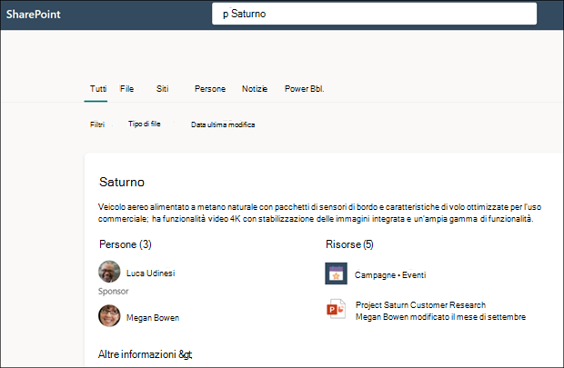

# Usare Microsoft Search per trovare argomenti in Microsoft Viva Topics

Anche se gli utenti di Viva Topics possono trovare gli argomenti principali nei propri siti di SharePoint, possono trovarli anche tramite Microsoft Search. 

## Risposta all'argomento

Quando si cerca un argomento specifico in Microsoft Search (ad esempio, "Saturno"), se un argomento esiste e viene trovato, il risultato verrà visualizzato nel formato suggerimento Risposte.

Nella risposta all'argomento verrà visualizzato:
- Nome argomento
- Nomi alternativi: nomi alternativi o acronimi per l'argomento.
- Definizione: descrizione dell'argomento fornito dall'intelligenza artificiale o aggiunto manualmente da una persona.
- Persone suggerite o aggiunte: persone suggerite dall'intelligenza artificiale o aggiunte all'argomento da una persona
- Risorse suggerite o aggiunte: file, pagine o siti suggeriti dall'intelligenza artificiale o aggiunti all'argomento da una persona. 

    

La pagina dell'argomento può essere visualizzata nei risultati della ricerca anche se la scheda di risposta dell'argomento non viene visualizzata.

## Acronimi

In Viva Topics è possibile modificare manualmente un argomento in modo da includere un acronimo come <b>nome alternativo.</b> Ciò consente a un utente che esegue una ricerca solo con l'acronimo dell'argomento di trovare la risposta all'argomento tramite Microsoft Search.

[Acronym Answers](https://docs.microsoft.com/microsoftsearch/manage-acronyms) è una funzionalità fornita da Microsoft Search ed è gestita separatamente da Viva Topics.

## Segnalibri e argomenti

[I segnalibri](https://docs.microsoft.com/microsoftsearch/manage-bookmarks) sono una funzionalità di Microsoft Search che consente agli utenti di trovare rapidamente siti e strumenti importanti con una semplice ricerca (ad esempio, uno strumento di prenotazione di viaggi in un sito esterno all'esterno del tenant di Microsoft 365). Vengono creati dagli amministratori della ricerca nell'interfaccia di amministrazione di Microsoft 365. 

Per gli utenti che cercano informazioni sulla prenotazione di un viaggio di lavoro:

- Se alcuni utenti conoscono il nome dello strumento di viaggio (ad esempio, "Concur"), è più semplice creare un segnalibro per passare direttamente al sito esterno.
- Per gli utenti che in genere ricercano "viaggi", creare un argomento su "Viaggi" con le informazioni che si aspettano di vedere. Prendere in considerazione l'aggiunta di un collegamento al sito esterno Concur nella descrizione dell'argomento. Se il collegamento è invece a un sito di prenotazione viaggi interno ospitato nel tenant di Microsoft 365, è possibile aggiungerlo alle "risorse aggiunte".
 
### Priorità dei risultati della ricerca 
 
Nell'esperienza di ricerca degli utenti, quando un utente cerca un termine come "viaggi", i risultati della ricerca vengono visualizzati con la priorità seguente in Microsoft Search
1. Argomenti pubblicati o confermati 
2. Segnalibri
3. Argomenti suggeriti 

