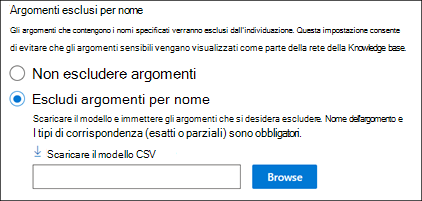
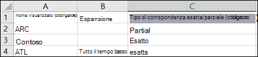
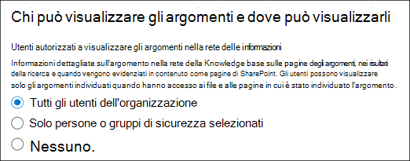
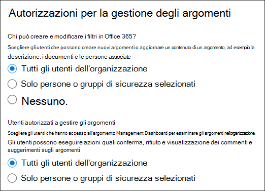
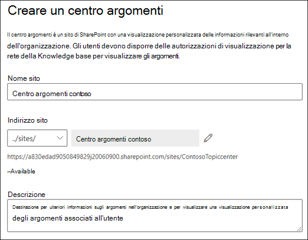
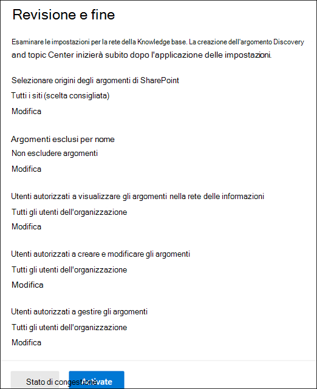

# Configurare la gestione delle informazioni (anteprima)Set up Knowledge Management (Preview)

> [!Note] 
> Il contenuto di questo articolo è relativo all'anteprima privata di Project Cortex.The content in this article is for Project Cortex Private Preview. [Per ulteriori informazioni, vedere Project Cortex](https://aka.ms/projectcortex).[Find out more about Project Cortex](https://aka.ms/projectcortex).

È possibile utilizzare l'interfaccia di amministrazione di Microsoft 365 per impostare e configurare la [gestione delle informazioni](knowledge-management-overview.md).You can use the Microsoft 365 admin center to set up and configure [Knowledge Management](knowledge-management-overview.md). 

> [!Important]
> È importante pianificare il modo migliore per impostare e configurare la gestione della conoscenza nell'ambiente in uso.It is important to plan the best way to set up and configure Knowledge Management in your environment. Ad esempio, è necessario prendere in considerazione quanto segue:For example, you will need to make considerations about the following:
- I siti di SharePoint che si desidera analizzare per gli argomenti.Which SharePoint sites you want to analyze for topics.
- Gli utenti a cui si desidera rendere visibili gli argomenti.Which users you want to make topics visible to.
- Gli utenti che si desidera concedere le autorizzazioni per la gestione degli argomenti nell'argomento centro.Which users you want to give permissions to manage topics in the topic center.
- Gli utenti che si desidera concedere le autorizzazioni per la creazione o la modifica di argomenti nel centro argomenti.Which users you want to give permissions to create or edit topics in the topic center.
- Il nome che si desidera assegnare al centro dell'argomento.What name you want to give your topic center.

> [!Note]
> Potrebbe essere utile creare gruppi di sicurezza per assegnare agli utenti le autorizzazioni necessarie per visualizzare gli argomenti, gestire l'argomento e creare e modificare gli argomenti.You may find it useful to create security groups to assign your users the permissions needed to view topics, manage topic, and create and edit topics.

Un amministratore può anche [apportare modifiche alle impostazioni selezionate in qualsiasi momento dopo l'installazione](manage-knowledge-network.md) tramite le impostazioni di gestione delle informazioni nell'interfaccia di amministrazione di Microsoft 365.An admin can also [make changes to your selected settings anytime after setup](manage-knowledge-network.md) through the Knowledge Management settings in the Microsoft 365 admin center.

## RequisitiRequirements 
È necessario disporre delle autorizzazioni di amministratore globale o di amministratore di SharePoint per poter accedere all'interfaccia di amministrazione di Microsoft 365 e configurare le attività relative alla conoscenza organizzativa.You must have Global Admin or SharePoint admin permissions to be able to access the Microsoft 365 admin center and set up Organizational knowledge tasks.

## Configurare la rete di conoscenzeSet up your knowledge network

Se si configura la rete della Knowledge base, è possibile effettuare le seguenti operazioni:Setting up your knowledge network walks you through the following:

- Individuazione dell'argomento: selezione di origini e argomenti di argomento da escludere dall'individuazione.Topic discovery: Selecting topic sources and topics to  exclude from discovery.
- Visibilità sull'argomento: selezione degli utenti che possono visualizzare gli argomenti come elementi salienti, nelle pagine di ricerca e nell'argomento.Topic visibility: Selecting who can view topics as highlights, in search and topic pages.
- Autorizzazioni per l'argomento: selezione degli utenti autorizzati a creare, modificare e gestire gli argomenti.Topic permissions: Selecting who can create, edit, and manage topics.
- Centro argomenti: creare il centro argomenti.Topic center: Create your topic center.
- Revisione: controllare e applicare le impostazioni.Review: Check and apply your settings.

Per configurare la rete delle informazioni:To set up your knowledge network:

1. Nell'interfaccia di amministrazione di Microsoft 365 (admin.microsoft.com), selezionare **Setup**e quindi visualizzare la sezione relativa alle **informazioni sull'organizzazione** .In the Microsoft 365 admin center (admin.microsoft.com), select **Setup**, and then view the **Organizational Knowledge** section.
2. Nella sezione **informazioni organizzative** fare clic su **Connetti persone alla conoscenza**.In the **Organizational Knowledge** section, click **Connect people to knowledge**. 

      

3. Nella pagina **Connect people to Knowledge** fare clic su Guida **introduttiva** per eseguire il processo di installazione.On the **Connect people to knowledge** page, click **Get started** to walk you through the setup process. 

      

4. Nella pagina **scegliere il modo in cui la rete di informazioni può trovare gli argomenti** , verrà configurata l'individuazione dell'argomento.On the **Choose how the knowledge network can find topics** page, you will configure topic discovery. Nella sezione **selezione origini argomenti di SharePoint** selezionare i siti di SharePoint che verranno sottoposti a ricerca per indicizzazione come origini per gli argomenti durante l'individuazione.In the **Select SharePoint topic sources** section, select which SharePoint sites will be crawled as sources for your topics during discovery. Ciò include:This includes: 
    a.a. **Tutti i siti**: tutti i siti di SharePoint nel tenant.**All sites**: All SharePoint sites in your tenant. Questo acquisisce i siti correnti e futuri.This captures current and future sites. 
    b.b. **All, eccetto siti selezionati**: digitare i nomi dei siti che si desidera escludere.**All, except selected sites**: Type the names of the sites you want to exclude.  È inoltre possibile caricare un elenco di siti che si desidera escludere dall'individuazione.You can also upload a list of sites that you want to opt out from discovery. I siti creati in futuro verranno inclusi come origini per l'individuazione degli argomenti.Sites created in future will be included as sources for topic discovery.  
    c.c. **Solo siti selezionati**: digitare i nomi dei siti che si desidera includere.**Only selected sites**: Type the names of the sites you want to include. È inoltre possibile caricare un elenco di siti.You can also upload a list of sites. I siti creati in futuro non verranno inclusi come origini per l'individuazione degli argomenti.Sites created in the future will not be included as sources for topic discovery.  

      
   
5. Nella sezione **Escludi argomenti per nome** è possibile scegliere di includere i nomi degli argomenti che non si desidera siano inclusi nei risultati individuati.In the **Exclude topics by name** section, you can choose to includes names of topics you don't want to be in the discovered results. Utilizzare questa impostazione per impedire l'inclusione di argomenti sensibili nell'ambito della rete della Knowledge base.Use this setting to prevent sensitive topics from being included as part of the knowledge network. Le opzioni includono:Your options include: 
    a.a. **Non escludere argomenti****Don't exclude any topics**  
    b.b. **Escludi argomenti per nome**: se sono presenti argomenti che non si desidera vengano visualizzati dagli utenti nell'ambito della rete della Knowledge base.**Exclude topics by name**:  If you have topics you don’t want shown to users as part of the knowledge network. 

      

    #### Come escludere gli argomenti per nomeHow to exclude topics by name    

    Se è necessario escludere gli argomenti, fare clic su **Scarica il modello. csv**dopo aver selezionato **Escludi argomenti per nome**.If you need to exclude topics, after selecting **Exclude topics by name**, select **Download the .csv template**. Utilizzare Excel. Modello CSV che include un elenco di argomenti che si desidera escludere dai risultati dell'individuazione.Use the Excel .CSV template to include a list of topics that you want to exclude from your discovery results.

      

    Nel modello CSV, immettere le informazioni seguenti sugli argomenti che si desidera escludere:In the CSV template, enter the following information about the topics you want to exclude:

    - **Nome**: digitare il nome dell'argomento che si desidera escludere.**Name**: Type the name of the topic you want to exclude. Questa operazione può essere eseguita in due modi:There are two ways to do this: 
        - Corrispondenza esatta: è possibile includere il nome o l'acronimo esatto (ad esempio, *Contoso* o *ATL*).Exact match: You can include the exact name or acronym (for example, *Contoso* or *ATL*). 
        - Corrispondenza parziale: è possibile escludere tutti gli argomenti in cui è presente una parola specifica.Partial match: You can exclude all topics that have a specific word in it.  Ad esempio, *Arc* escluderà tutti gli argomenti con l' *arco* di parola in esso, ad esempio *cerchio arco*, *saldatura ad arco al plasma*o *arco di training*. Tenere presente che non verranno esclusi gli argomenti in cui il testo viene incluso come parte di una parola, ad esempio l' *architettura*.For example, *arc* will exclude all topics with the word *arc* in it, such as *Arc circle*, *Plasma arc welding*, or *Training arc*. Note that it will not exclude topics in which the text is included as part of a word, such as *Architecture*. 
    - **Espansione (facoltativo)**: se si desidera escludere un acronimo, digitare le parole in cui si trova l'acronimo.**Expansion (optional)**: If you want to exclude an acronym, type the words the acronym stands for. 
    - **MatchType-exact/partial**: digitare se il nome immesso è un tipo di corrispondenza *esatta* o *parziale* .**MatchType-Exact/Partial**: Type whether the name you entered was an *exact* or *partial* match type. 

    Dopo aver completato e salvato il file del modello CSV, selezionare **Sfoglia** per individuarlo e selezionarlo.After you've completed and saved your CSV template file, select **Browse** to locate and select it.
    
    Selezionare **Avanti**.Select **Next**. 

6. Negli **utenti che possono visualizzare gli argomenti e dove possono visualizzarli** , verrà configurata la visibilità dell'argomento.On the **Who can see topics and where they can see them** page, you will configure topic visibility. Negli **utenti che possono visualizzare gli argomenti nell'impostazione della rete di conoscenze** , scegliere chi avrà accesso ai dettagli sull'argomento, ad esempio argomenti evidenziati, schede argomento, risposte agli argomenti nelle pagine di ricerca e argomento.In the **Who can see topics in the knowledge network** setting, you choose who will have access to topic details, such as highlighted topics, topic cards, topic answers in search, and topic pages. È possibile selezionare:You can select: 
    a.a. **Tutti gli utenti dell'organizzazione****Everyone in your organization** 
    b.b. **Solo persone o gruppi di sicurezza selezionati****Only selected people or security groups** 
    c.c. **Nessuno****No one** 

       

 > [!Note] 
 > Anche se questa impostazione consente di selezionare qualsiasi utente dell'organizzazione, solo gli utenti che dispongono di licenze di gestione delle informazioni assegnate potranno visualizzare gli argomenti.While this setting allows you to select any user in your organization, only users who have knowledge management licenses assigned to them will be able to view topics. 

7. Nella pagina **autorizzazioni per gestione** argomenti scegliere gli utenti che potranno creare, modificare o gestire gli argomenti.In the **Permissions for topic management** page, you choose who will be able to create, edit, or manage topics. Nella sezione **utenti autorizzati a creare e modificare gli argomenti** , è possibile selezionare:In the **Who can create and edit topics** section, you can select: 
    a.a. **Tutti gli utenti dell'organizzazione****Everyone in your organization** 
    b.b. **Solo persone o gruppi di sicurezza selezionati****Only selected people or security groups** 
8. Nella sezione **chi può gestire gli argomenti** è possibile selezionare:In the **Who can manage topics** section, you can select: 
    a.a. **Tutti gli utenti dell'organizzazione****Everyone in your organization** 
    b.b. **Utenti o gruppi di sicurezza selezionati****Selected people or security groups** 

      

    Selezionare **Avanti**.Select **Next**. 
9. Nella pagina **Crea centro** argomenti è possibile creare il sito Centro argomenti in cui è possibile visualizzare le pagine degli argomenti e gestire i temi.On the **Create Topic  Center** page, you can create your topic center site in which topic pages can be viewed and topics can be managed.  Nella casella **nome centro argomenti** Digitare un nome per il centro degli argomenti.In the **Topic center name** box, type a name for your Topic center. Facoltativamente, è possibile digitare una breve descrizione nella casella **Descrizione sito** .You can optionally type a short description in the **Site description** box.  

Selezionare **Avanti**.Select **Next**. 

      

10. Nella pagina **revisione e fine** è possibile esaminare l'impostazione selezionata e scegliere di apportare modifiche.On the **Review and finish** page, you can look at your selected setting and choose to make changes. Se si è soddisfatti delle selezioni, selezionare **attiva**.If you are satisfied with your selections, select **Activate**.

       

11. Verrà visualizzata la pagina **rete informazioni attivata** che conferma che il sistema inizierà a analizzare i siti selezionati per gli argomenti e a creare il sito del centro informazioni.The **Knowledge network activated** page will display, confirming that the system will now start analyzing your selected sites for topics and creating the Knowledge Center site. Scegliere **Fine**.Select **Done**. 

       

12. Verrà restituito alla pagina **Connect people to Knowledge** .You'll be returned to your **Connect people to knowledge** page. Da questa pagina, è possibile selezionare **Gestisci** per apportare modifiche alle impostazioni di configurazione.From this page, you can select **Manage** to make any changes to your configuration settings. 

         

> [!Note]
> Dopo l'installazione, un amministratore può [apportare modifiche alle impostazioni di gestione delle informazioni selezionate](manage-knowledge-network.md) in qualsiasi momento tornando alla pagina.After setup, an admin can [make changes to your selected knowledge management settings](manage-knowledge-network.md) any time by returning to this page.

## Vedere ancheSee also

  

