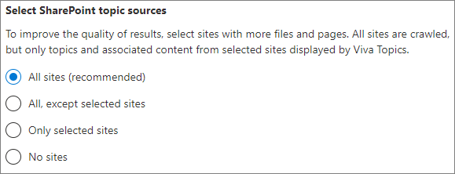

# Configurare le esperienze degli argomenti in Microsoft 365Set up topic experiences in Microsoft 365

 

> [!VIDEO https://www.microsoft.com/videoplayer/embed/RE4LBp7]  

 

È possibile utilizzare l'interfaccia di amministrazione di Microsoft 365 per impostare e configurare le [esperienze degli argomenti](topic-experiences-overview.md).You can use the Microsoft 365 admin center to set up and configure [topic experiences](topic-experiences-overview.md). 

È importante pianificare il modo migliore per impostare e configurare gli argomenti nell'ambiente in uso.It is important to plan the best way to set up and configure topics in your environment. Prima di iniziare le procedure descritte in questo articolo, leggere l' [argomento piano Experience](plan-topic-experiences.md) .Be sure to read [Plan topic experiences](plan-topic-experiences.md) before you begin the procedures in this article.

È necessario essere un amministratore globale o un amministratore di SharePoint per accedere all'interfaccia di amministrazione di Microsoft 365 e impostare le esperienze degli argomenti.You must be a global administrator or SharePoint administrator to access the Microsoft 365 admin center and set up topic experiences.

## Configurare le esperienze dell'argomentoSet up topic experiences

Per impostare le esperienze degli argomenti in Microsoft 365To set up topic experiences in Microsoft 365

1. Nell'interfaccia di [amministrazione di Microsoft 365](https://admin.microsoft.com)selezionare **Setup** e quindi visualizzare la sezione **file e contenuto** .In the [Microsoft 365 admin center](https://admin.microsoft.com), select **Setup**, and then view the **Files and content** section.
2. Nella sezione **file e contenuto** fare clic su **Connetti persone alla conoscenza**.In the **Files and content** section, click **Connect people to knowledge**.

     

3. Nella pagina **Connect people to Knowledge** fare clic su Guida **introduttiva** per eseguire il processo di installazione.On the **Connect people to knowledge** page, click **Get started** to walk you through the setup process.

     

4. Nella pagina **scegliere il modo in cui la rete di informazioni può trovare gli argomenti** , verrà configurata l'individuazione dell'argomento.On the **Choose how the knowledge network can find topics** page, you will configure topic discovery. Nella sezione **selezione origini argomenti di SharePoint** selezionare i siti di SharePoint che verranno sottoposti a ricerca per indicizzazione come origini per gli argomenti durante l'individuazione.In the **Select SharePoint topic sources** section, select which SharePoint sites will be crawled as sources for your topics during discovery. Scegliere da:Choose from:
    - **Tutti i siti**: tutti i siti di SharePoint nell'organizzazione.**All sites**: All SharePoint sites in your organization. Sono inclusi i siti correnti e futuri.This includes current and future sites.
    - **All, eccetto siti selezionati**: digitare i nomi dei siti che si desidera escludere.**All, except selected sites**: Type the names of the sites you want to exclude.  È inoltre possibile caricare un elenco di siti che si desidera escludere dall'individuazione.You can also upload a list of sites that you want to opt out from discovery. I siti creati in futuro verranno inclusi come origini per l'individuazione degli argomenti.Sites created in future will be included as sources for topic discovery. 
    - **Solo siti selezionati**: digitare i nomi dei siti che si desidera includere.**Only selected sites**: Type the names of the sites you want to include. È inoltre possibile caricare un elenco di siti.You can also upload a list of sites. I siti creati in futuro non verranno inclusi come origini per l'individuazione degli argomenti.Sites created in the future will not be included as sources for topic discovery.
    - **Nessun sito**: non includere alcun sito di SharePoint.**No sites**: Do not include any SharePoint sites.

     
   
5. Nella sezione **Escludi argomenti per nome** è possibile aggiungere i nomi degli argomenti che si desidera escludere dall'individuazione dell'argomento.In the **Exclude topics by name** section, you can add names of topics you want to exclude from topic discovery. Utilizzare questa impostazione per impedire l'inclusione di informazioni riservate come argomenti.Use this setting to prevent sensitive information from being included as topics. Le opzioni sono:The options are:
    - **Non escludere argomenti****Don't exclude any topics** 
    - **Escludi argomenti per nome****Exclude topics by name**

     

    I Knowledge Manager possono anche escludere gli argomenti nell'argomento centro dopo l'individuazione.(Knowledge managers can also exclude topics in the topic center after discovery.)

    #### Come escludere gli argomenti per nomeHow to exclude topics by name    

    Se è necessario escludere gli argomenti, dopo aver selezionato **Escludi argomenti per nome**, selezionare Scarica il modello CSV e aggiornarlo con l'elenco di argomenti che si desidera escludere dai risultati dell'individuazione.If you need to exclude topics, after selecting **Exclude topics by name**, select download the .csv template and update it with the list of topics that you want to exclude from your discovery results.

     

    Nel modello CSV, immettere le informazioni seguenti sugli argomenti che si desidera escludere:In the CSV template, enter the following information about the topics you want to exclude:

    - **Nome**: digitare il nome dell'argomento che si desidera escludere.**Name**: Type the name of the topic you want to exclude. Questa operazione può essere eseguita in due modi:There are two ways to do this:
        - Corrispondenza esatta: è possibile includere il nome o l'acronimo esatto (ad esempio, *Contoso* o *ATL*).Exact match: You can include the exact name or acronym (for example, *Contoso* or *ATL*).
        - Corrispondenza parziale: è possibile escludere tutti gli argomenti in cui è presente una parola specifica.Partial match: You can exclude all topics that have a specific word in it.  Ad esempio, *Arc* escluderà tutti gli argomenti con l' *arco* di parola in esso, ad esempio *cerchio arco*, *saldatura ad arco al plasma* o *arco di training*. Tenere presente che non verranno esclusi gli argomenti in cui il testo viene incluso come parte di una parola, ad esempio l' *architettura*.For example, *arc* will exclude all topics with the word *arc* in it, such as *Arc circle*, *Plasma arc welding*, or *Training arc*. Note that it will not exclude topics in which the text is included as part of a word, such as *Architecture*.
    - Acronimo **di (facoltativo)**: se si desidera escludere un acronimo, digitare le parole in cui si trova l'acronimo.**Stands for (optional)**: If you want to exclude an acronym, type the words the acronym stands for.
    - **MatchType-exact/partial**: digitare se il nome immesso è un tipo di corrispondenza *esatta* o *parziale* .**MatchType-Exact/Partial**: Type whether the name you entered was an *exact* or *partial* match type.

    Dopo aver completato e salvato il file. csv, selezionare **Sfoglia** per individuarlo e selezionarlo.After you've completed and saved your .csv file, select **Browse** to locate and select it.
    
    Selezionare **Avanti**.Select **Next**.

6. Negli **utenti che possono visualizzare gli argomenti e dove possono visualizzarli** , verrà configurata la visibilità dell'argomento.On the **Who can see topics and where can they see them** page, you will configure topic visibility. Negli **utenti che possono visualizzare gli argomenti nell'impostazione della rete di conoscenze** , scegliere chi avrà accesso ai dettagli sull'argomento, ad esempio argomenti evidenziati, schede argomento, risposte agli argomenti nelle pagine di ricerca e argomento.In the **Who can see topics in the knowledge network** setting, you choose who will have access to topic details, such as highlighted topics, topic cards, topic answers in search, and topic pages. È possibile selezionare:You can select:
    - **Tutti gli utenti dell'organizzazione****Everyone in my organization**
    - **Solo persone o gruppi di sicurezza selezionati****Only selected people or security groups**
    - **Nessuno****No one**

      

 > [!Note] 
 > Anche se questa impostazione consente di selezionare qualsiasi utente dell'organizzazione, solo gli utenti che dispongono di licenze per l'argomento sono in grado di visualizzare gli argomenti.While this setting allows you to select any user in your organization, only users who have Topic Experiences licenses assigned to them will be able to view topics.

7. Nella pagina **autorizzazioni per gestione** argomenti scegliere gli utenti che potranno creare, modificare o gestire gli argomenti.In the **Permissions for topic management** page, you choose who will be able to create, edit, or manage topics. Nella sezione **utenti autorizzati a creare e modificare gli argomenti** , è possibile selezionare:In the **Who can create and edit topics** section, you can select:
    - **Tutti gli utenti dell'organizzazione****Everyone in my organization**
    - **Solo persone o gruppi di sicurezza selezionati****Only selected people or security groups**
    - **Nessuno****No one**

     

8. Nella sezione **chi può gestire gli argomenti** è possibile selezionare:In the **Who can manage topics** section, you can select:
    - **Tutti gli utenti dell'organizzazione****Everyone in my organization**
    - **Solo persone o gruppi di sicurezza selezionati****Only selected people or security groups**

     

    Selezionare **Avanti**.Select **Next**.

9. Nella pagina **Crea centro** argomenti è possibile creare il sito Centro argomenti in cui è possibile visualizzare le pagine degli argomenti e gestire i temi.On the **Create topic center** page, you can create your topic center site in which topic pages can be viewed and topics can be managed. Nella casella **nome sito** Digitare un nome per il centro degli argomenti.In the **Site name** box, type a name for your Topic center. Facoltativamente, è possibile digitare una breve descrizione nella casella **Descrizione** .You can optionally type a short description in the **Description** box. 

Selezionare **Avanti**.Select **Next**.

     

10. Nella pagina **Verificare e completare**, è possibile esaminare l'impostazione selezionata e scegliere se apportare modifiche.On the **Review and finish** page, you can look at your selected setting and choose to make changes. Al termine, selezionare **Attiva**.If you are satisfied with your selections, select **Activate**.

11. Verrà visualizzata la pagina **rete informazioni attivata** che conferma che il sistema inizierà a analizzare i siti selezionati per gli argomenti e a creare il sito del centro informazioni.The **Knowledge network activated** page will display, confirming that the system will now start analyzing your selected sites for topics and creating the Knowledge Center site. Scegliere **Fatto**.Select **Done**.

12. Verrà restituito alla pagina **Connect people to Knowledge** .You'll be returned to your **Connect people to knowledge** page. In questa pagina è possibile selezionare **Gestisci** per modificare le impostazioni di configurazione.From this page, you can select **Manage** to make any changes to your configuration settings. 

        

## Assegnare le licenzeAssign licenses

Dopo aver configurato l'argomento esperienze, è necessario assegnare le licenze per gli utenti che utilizzeranno le esperienze degli argomenti.Once you have configured topic experiences, you must assign licenses for the users who will be using topic experiences. Solo gli utenti con una licenza possono visualizzare informazioni su argomenti quali evidenziazione, schede argomento, pagine argomento e centro argomenti.Only users with a license can see information on topics including highlights, topic cards, topic pages and the topic center. 

Per assegnare le licenze:To assign licenses:

1. Nell'interfaccia di amministrazione di Microsoft 365, in **Utenti** fare clic su **Utenti attivi**.In the Microsoft 365 admin center, under **Users**, click **Active users**.

2. Selezionare gli utenti a cui si vuole assegnare una licenza, poi fare clic su **Gestisci le licenze di prodotto**.Select the users that you want to license, and click **Manage product licenses**.

3. Selezionare **Assegna altre**.Select **Assign more**.

4. In **licenze** selezionare l' **argomento esperienze**.Under **Licenses**, select **Topic Experiences**.

5. In **app**, verificare che i **connettori di Graph Search con l'indice** e gli **argomenti** siano entrambi selezionati.Under **Apps**, make sure **Graph Connectors Search with Index** and **Topic Experiences** are both selected.

    > [!div class="mx-imgBorder"]
    > 

6. Fare clic su **Salva modifiche**.Click **Save changes**.

## Gestire le esperienze degli argomentiManage topic experiences

Dopo aver impostato le esperienze sugli argomenti, è possibile modificare le impostazioni scelte durante l'installazione nell'interfaccia di [amministrazione di Microsoft 365](https://admin.microsoft.com/AdminPortal#/featureexplorer/csi/KnowledgeManagement).Once you have set up topic experiences, you can change the settings that you chose during setup in the [Microsoft 365 admin center](https://admin.microsoft.com/AdminPortal#/featureexplorer/csi/KnowledgeManagement). Vedere i riferimenti seguenti:See the following references:

- [Gestire l'individuazione degli argomenti in Microsoft 365Manage topic discovery in Microsoft 365](topic-experiences-discovery.md)
- [Gestire la visibilità degli argomenti in Microsoft 365Manage topic visibility in Microsoft 365](topic-experiences-knowledge-rules.md)
- [Gestire le autorizzazioni per l'argomento in Microsoft 365Manage topic permissions in Microsoft 365](topic-experiences-user-permissions.md)
- [Modificare il nome del centro argomenti in Microsoft 365Change the name of the topic center in Microsoft 365](topic-experiences-administration.md)

## Vedere ancheSee also

[Panoramica delle esperienze degli argomentiTopic Experiences Overview](topic-experiences-overview.md)
