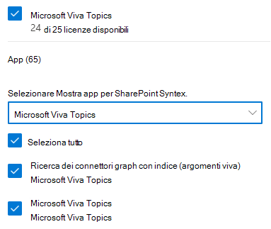

# Configurare le esperienze degli argomenti in Microsoft 365

 

> [!VIDEO https://www.microsoft.com/videoplayer/embed/RE4Li0E]  

 

È possibile utilizzare l'interfaccia di amministrazione di Microsoft 365 per impostare e configurare le [esperienze degli argomenti](topic-experiences-overview.md). 

È importante pianificare il modo migliore per impostare e configurare gli argomenti nell'ambiente in uso. Prima di iniziare le procedure descritte in questo articolo, leggere l' [argomento piano Experience](plan-topic-experiences.md) .

È necessario essere un amministratore globale o un amministratore di SharePoint per accedere all'interfaccia di amministrazione di Microsoft 365 e impostare le esperienze degli argomenti.

## Configurare le esperienze dell'argomento

Per impostare le esperienze degli argomenti in Microsoft 365

1. Nell'interfaccia di [amministrazione di Microsoft 365](https://admin.microsoft.com)selezionare **Setup** e quindi visualizzare la sezione **file e contenuto** .
2. Nella sezione **file e contenuto** fare clic su **Connetti persone alla conoscenza**.

     

3. Nella pagina **Connect people to Knowledge** fare clic su Guida **introduttiva** per eseguire il processo di installazione.

     

4. Nella pagina **scegliere il modo in cui la rete di informazioni può trovare gli argomenti** , verrà configurata l'individuazione dell'argomento. Nella sezione **selezione origini argomenti di SharePoint** selezionare i siti di SharePoint che verranno sottoposti a ricerca per indicizzazione come origini per gli argomenti durante l'individuazione. Scegliere da:
    - **Tutti i siti**: tutti i siti di SharePoint nell'organizzazione. Sono inclusi i siti correnti e futuri.
    - **All, eccetto siti selezionati**: digitare i nomi dei siti che si desidera escludere.  È inoltre possibile caricare un elenco di siti che si desidera escludere dall'individuazione. I siti creati in futuro verranno inclusi come origini per l'individuazione degli argomenti. 
    - **Solo siti selezionati**: digitare i nomi dei siti che si desidera includere. È inoltre possibile caricare un elenco di siti. I siti creati in futuro non verranno inclusi come origini per l'individuazione degli argomenti.
    - **Nessun sito**: non includere alcun sito di SharePoint.

     
   
5. Nella sezione **Escludi argomenti per nome** è possibile aggiungere i nomi degli argomenti che si desidera escludere dall'individuazione dell'argomento. Utilizzare questa impostazione per impedire l'inclusione di informazioni riservate come argomenti. Le opzioni sono:
    - **Non escludere argomenti** 
    - **Escludi argomenti per nome**

     

    I Knowledge Manager possono anche escludere gli argomenti nell'argomento centro dopo l'individuazione.

    #### Come escludere gli argomenti per nome    

    Se è necessario escludere gli argomenti, dopo aver selezionato **Escludi argomenti per nome**, selezionare Scarica il modello CSV e aggiornarlo con l'elenco di argomenti che si desidera escludere dai risultati dell'individuazione.

     

    Nel modello CSV, immettere le informazioni seguenti sugli argomenti che si desidera escludere:

    - **Nome**: digitare il nome dell'argomento che si desidera escludere. Questa operazione può essere eseguita in due modi:
        - Corrispondenza esatta: è possibile includere il nome o l'acronimo esatto (ad esempio, *Contoso* o *ATL*).
        - Corrispondenza parziale: è possibile escludere tutti gli argomenti in cui è presente una parola specifica.  Ad esempio, *Arc* escluderà tutti gli argomenti con l' *arco* di parola in esso, ad esempio *cerchio arco*, *saldatura ad arco al plasma* o *arco di training*. Tenere presente che non verranno esclusi gli argomenti in cui il testo viene incluso come parte di una parola, ad esempio l' *architettura*.
    - Acronimo **di (facoltativo)**: se si desidera escludere un acronimo, digitare le parole in cui si trova l'acronimo.
    - **MatchType-exact/partial**: digitare se il nome immesso è un tipo di corrispondenza *esatta* o *parziale* .

    Dopo aver completato e salvato il file. csv, selezionare **Sfoglia** per individuarlo e selezionarlo.
    
    Selezionare **Avanti**.

6. Negli **utenti che possono visualizzare gli argomenti e dove possono visualizzarli** , verrà configurata la visibilità dell'argomento. Negli **utenti che possono visualizzare gli argomenti nell'impostazione della rete di conoscenze** , scegliere chi avrà accesso ai dettagli sull'argomento, ad esempio argomenti evidenziati, schede argomento, risposte agli argomenti nelle pagine di ricerca e argomento. È possibile selezionare:
    - **Tutti gli utenti dell'organizzazione**
    - **Solo persone o gruppi di sicurezza selezionati**
    - **Nessuno**

      

 > [!Note] 
 > Anche se questa impostazione consente di selezionare qualsiasi utente dell'organizzazione, solo gli utenti che dispongono di licenze per l'argomento sono in grado di visualizzare gli argomenti.

7. Nella pagina **autorizzazioni per gestione** argomenti scegliere gli utenti che potranno creare, modificare o gestire gli argomenti. Nella sezione **utenti autorizzati a creare e modificare gli argomenti** , è possibile selezionare:
    - **Tutti gli utenti dell'organizzazione**
    - **Solo persone o gruppi di sicurezza selezionati**
    - **Nessuno**

     

8. Nella sezione **chi può gestire gli argomenti** è possibile selezionare:
    - **Tutti gli utenti dell'organizzazione**
    - **Solo persone o gruppi di sicurezza selezionati**

     

    Selezionare **Avanti**.

9. Nella pagina **Crea centro** argomenti è possibile creare il sito Centro argomenti in cui è possibile visualizzare le pagine degli argomenti e gestire i temi. Nella casella **nome sito** Digitare un nome per il centro degli argomenti. Facoltativamente, è possibile digitare una breve descrizione nella casella **Descrizione** . 

Selezionare **Avanti**.

     

10. Nella pagina **Verificare e completare**, è possibile esaminare l'impostazione selezionata e scegliere se apportare modifiche. Al termine, selezionare **Attiva**.

11. Verrà visualizzata la pagina **rete informazioni attivata** che conferma che il sistema inizierà a analizzare i siti selezionati per gli argomenti e a creare il sito del centro informazioni. Scegliere **Fatto**.

12. Verrà restituito alla pagina **Connect people to Knowledge** . In questa pagina è possibile selezionare **Gestisci** per modificare le impostazioni di configurazione. 

        

## Assegnare le licenze

Dopo aver configurato l'argomento esperienze, è necessario assegnare le licenze per gli utenti che utilizzeranno le esperienze degli argomenti. Solo gli utenti con una licenza possono visualizzare informazioni su argomenti quali evidenziazione, schede argomento, pagine argomento e centro argomenti. 

Per assegnare le licenze:

1. Nell'interfaccia di amministrazione di Microsoft 365, in **Utenti** fare clic su **Utenti attivi**.

2. Selezionare gli utenti a cui si vuole assegnare una licenza, poi fare clic su **Gestisci le licenze di prodotto**.

3. Selezionare **Assegna altre**.

4. In **licenze** selezionare l' **argomento esperienze**.

5. In **app**, verificare che i **connettori di Graph Search con l'indice** e gli **argomenti** siano entrambi selezionati.

    > [!div class="mx-imgBorder"]
    > 

6. Fare clic su **Salva modifiche**.

## Gestire le esperienze degli argomenti

Dopo aver impostato le esperienze sugli argomenti, è possibile modificare le impostazioni scelte durante l'installazione nell'interfaccia di [amministrazione di Microsoft 365](https://admin.microsoft.com/AdminPortal#/featureexplorer/csi/KnowledgeManagement). Vedere i riferimenti seguenti:

- [Gestire l'individuazione degli argomenti in Microsoft 365](topic-experiences-discovery.md)
- [Gestire la visibilità degli argomenti in Microsoft 365](topic-experiences-knowledge-rules.md)
- [Gestire le autorizzazioni per l'argomento in Microsoft 365](topic-experiences-user-permissions.md)
- [Modificare il nome del centro argomenti in Microsoft 365](topic-experiences-administration.md)

## Vedere anche

[Panoramica delle esperienze degli argomenti](topic-experiences-overview.md)
