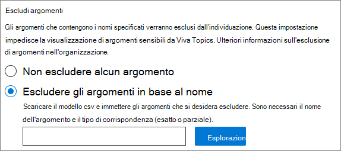

# Configurare Gli argomenti di Microsoft VivaSet up Microsoft Viva Topics

È possibile utilizzare l'interfaccia di amministrazione di Microsoft 365 per configurare [Gli argomenti](topic-experiences-overview.md).You can use the Microsoft 365 admin center to set up and configure [Topics](topic-experiences-overview.md). 

È importante pianificare il modo migliore per configurare e configurare gli argomenti nell'ambiente.It is important to plan the best way to set up and configure topics in your environment. Leggere Plan [for Microsoft Viva Topics](plan-topic-experiences.md) prima di iniziare le procedure descritte in questo articolo.Be sure to read [Plan for Microsoft Viva Topics](plan-topic-experiences.md) before you begin the procedures in this article.

È necessario essere [abbonati a Viva Topics](https://www.microsoft.com/microsoft-viva/topics) ed essere un amministratore globale o un amministratore di SharePoint per accedere all'interfaccia di amministrazione di Microsoft 365 e configurare Gli argomenti.You must be [subscribed to Viva Topics](https://www.microsoft.com/microsoft-viva/topics) and be a global administrator or SharePoint administrator to access the Microsoft 365 admin center and set up Topics.

Se SharePoint è stato configurato per [richiedere dispositivi gestiti,](/sharepoint/control-access-from-unmanaged-devices)assicurarsi di configurare Gli argomenti da un dispositivo gestito.If you have configured SharePoint to [require managed devices](/sharepoint/control-access-from-unmanaged-devices), be sure to set up Topics from a managed device.

## Dimostrazione videoVideo demonstration

Questo video mostra il processo di configurazione degli argomenti in Microsoft 365.This video shows the process for setting up Topics in Microsoft 365.

 

> [!VIDEO https://www.microsoft.com/videoplayer/embed/RE4Li0E]  

 

## Configurare ArgomentiSet up Topics

Per configurare gli argomentiTo set up Topics

1. Nell'interfaccia di amministrazione di [Microsoft 365](https://admin.microsoft.com)selezionare **Installazione** e quindi visualizzare la **sezione File e** contenuto.In the [Microsoft 365 admin center](https://admin.microsoft.com), select **Setup**, and then view the **Files and content** section.
2. Nella sezione **File e contenuto** fare clic su Connetti persone alla **conoscenza.**In the **Files and content** section, click **Connect people to knowledge**.

     

3. Nella pagina **Connetti persone alla knowledge** base fare clic su **Introduzione** per iniziare a eseguire il processo di installazione.On the **Connect people to knowledge** page, click **Get started** to walk you through the setup process.

     

4. Nella pagina **Scegliere in che modo Viva Topics può trovare gli** argomenti, si configurerà l'individuazione degli argomenti.On the **Choose how Viva Topics can find topics** page, you will configure topic discovery. Nella sezione **Selezione origini argomenti di SharePoint** selezionare quali siti di SharePoint verranno sottoposti a ricerca per indicizzazione come origini per gli argomenti durante l'individuazione.In the **Select SharePoint topic sources** section, select which SharePoint sites will be crawled as sources for your topics during discovery. Scegli tra:Choose from:
    - **Tutti i siti**: tutti i siti di SharePoint nell'organizzazione.**All sites**: All SharePoint sites in your organization. Sono inclusi i siti correnti e futuri.This includes current and future sites.
    - **Tutti, ad eccezione dei siti** selezionati: digitare i nomi dei siti che si desidera escludere.**All, except selected sites**: Type the names of the sites you want to exclude.  È inoltre possibile caricare un elenco di siti che si desidera rifiutare esplicitamente dall'individuazione.You can also upload a list of sites that you want to opt out from discovery. I siti creati in futuro verranno inclusi come origini per l'individuazione degli argomenti.Sites created in future will be included as sources for topic discovery. 
    - **Solo siti selezionati:** digitare i nomi dei siti che si desidera includere.**Only selected sites**: Type the names of the sites you want to include. È inoltre possibile caricare un elenco di siti.You can also upload a list of sites. I siti creati in futuro non verranno inclusi come origini per l'individuazione degli argomenti.Sites created in the future will not be included as sources for topic discovery.
    - **Nessun sito:** non includere alcun sito di SharePoint.**No sites**: Do not include any SharePoint sites.

     
   
5. Nella sezione **Escludi argomenti per nome** è possibile aggiungere i nomi degli argomenti che si desidera escludere dall'individuazione degli argomenti.In the **Exclude topics by name** section, you can add names of topics you want to exclude from topic discovery. Utilizzare questa impostazione per impedire che le informazioni riservate vengano incluse come argomenti.Use this setting to prevent sensitive information from being included as topics. Le opzioni sono:The options are:
    - **Non escludere argomenti****Don't exclude any topics** 
    - **Escludere gli argomenti in base al nome****Exclude topics by name**

     

    I responsabili della conoscenza possono anche escludere gli argomenti nel Centro argomenti dopo l'individuazione.(Knowledge managers can also exclude topics in the topic center after discovery.)

    #### Come escludere gli argomenti in base al nomeHow to exclude topics by name    

    Se è necessario escludere gli argomenti, dopo aver selezionato Escludi argomenti per **nome,** scaricare il modello CSV e aggiornarlo con l'elenco di argomenti che si desidera escludere dai risultati dell'individuazione.If you need to exclude topics, after selecting **Exclude topics by name**, download the .csv template and update it with the list of topics that you want to exclude from your discovery results.

     

    Nel modello CSV immettere le informazioni seguenti sugli argomenti che si desidera escludere:In the CSV template, enter the following information about the topics you want to exclude:

    - **Nome**: digitare il nome dell'argomento che si desidera escludere.**Name**: Type the name of the topic you want to exclude. Questa operazione può essere eseguita in due modi:There are two ways to do this:
        - Corrispondenza esatta: è possibile includere il nome esatto o l'acronimo (ad esempio, *Contoso* o *ATL).*Exact match: You can include the exact name or acronym (for example, *Contoso* or *ATL*).
        - Corrispondenza parziale: è possibile escludere tutti gli argomenti che includono una parola specifica.Partial match: You can exclude all topics that have a specific word in it.  Ad esempio, *arco* escluderà tutti gli argomenti con la parola arco *al* suo interno, ad esempio Cerchio *arco,* *Saldatura* arco di plasma o *Arco di formazione.* Si noti che non verranno esclusi gli argomenti in cui il testo è incluso come parte di una parola, ad esempio *Architettura*.For example, *arc* will exclude all topics with the word *arc* in it, such as *Arc circle*, *Plasma arc welding*, or *Training arc*. Note that it will not exclude topics in which the text is included as part of a word, such as *Architecture*.
    - **Sta per (facoltativo):** se si desidera escludere un acronimo, digitare le parole che l'acronimo sta per.**Stands for (optional)**: If you want to exclude an acronym, type the words the acronym stands for.
    - **MatchType-Exact/Partial**: Digitare se il nome immesso è un *tipo* di corrispondenza esatto *o* parziale.**MatchType-Exact/Partial**: Type whether the name you entered was an *exact* or *partial* match type.

    Dopo aver completato e salvato il file CSV, selezionare **Sfoglia** per individuarlo e selezionarlo.After you've completed and saved your .csv file, select **Browse** to locate and select it.
    
    Selezionare **Avanti**.Select **Next**.

6. Nella pagina Chi può visualizzare gli argomenti e dove può **vederli,** configurerai la visibilità degli argomenti.On the **Who can see topics and where can they see them** page, you will configure topic visibility. **Nell'impostazione Chi** può visualizzare gli argomenti scegliere chi avrà accesso ai dettagli dell'argomento, ad esempio argomenti evidenziati, schede argomento, risposte agli argomenti nella ricerca e pagine degli argomenti.In the **Who can see topics** setting, you choose who will have access to topic details, such as highlighted topics, topic cards, topic answers in search, and topic pages. È possibile selezionare:You can select:
    - **Tutti gli utenti dell'organizzazione****Everyone in my organization**
    - **Solo utenti o gruppi di sicurezza selezionati****Only selected people or security groups**
    - **Nessuno****No one**

      

    > [!Note] 
    > Anche se questa impostazione consente di selezionare qualsiasi utente nell'organizzazione, solo gli utenti a cui sono assegnate licenze esperienze argomento potranno visualizzare gli argomenti.While this setting allows you to select any user in your organization, only users who have Topic Experiences licenses assigned to them will be able to view topics.

7. Nella pagina **Autorizzazioni per la gestione degli** argomenti scegliere chi sarà in grado di creare, modificare o gestire gli argomenti.In the **Permissions for topic management** page, you choose who will be able to create, edit, or manage topics. Nella sezione **Utenti che possono creare e modificare argomenti** è possibile selezionare:In the **Who can create and edit topics** section, you can select:
    - **Tutti gli utenti dell'organizzazione****Everyone in my organization**
    - **Solo utenti o gruppi di sicurezza selezionati****Only selected people or security groups**
    - **Nessuno****No one**

     

8. Nella sezione **Chi può gestire gli argomenti** è possibile selezionare:In the **Who can manage topics** section, you can select:
    - **Tutti gli utenti dell'organizzazione****Everyone in my organization**
    - **Solo utenti o gruppi di sicurezza selezionati****Only selected people or security groups**

     

    Selezionare **Avanti**.Select **Next**.

9. Nella pagina **Crea centro argomenti** è possibile creare il sito Centro argomenti in cui è possibile visualizzare le pagine degli argomenti e gestire gli argomenti.On the **Create topic center** page, you can create your topic center site in which topic pages can be viewed and topics can be managed. Nella casella **Nome sito** digitare un nome per il Centro argomenti.In the **Site name** box, type a name for your topic center. Facoltativamente, è possibile digitare una breve descrizione nella **casella Descrizione.**You can optionally type a short description in the **Description** box. 

   Selezionare **Avanti**.Select **Next**.

     

10. Nella pagina **Verificare e completare**, è possibile esaminare l'impostazione selezionata e scegliere se apportare modifiche.On the **Review and finish** page, you can look at your selected setting and choose to make changes. Al termine, selezionare **Attiva**.If you are satisfied with your selections, select **Activate**.

11. Verrà visualizzata la pagina **Viva Topics activated,** che conferma che il sistema inizierà ad analizzare i siti selezionati per gli argomenti e a creare il sito Centro argomenti.The **Viva Topics activated** page will display, confirming that the system will now start analyzing your selected sites for topics and creating the topic center site. Scegliere **Fatto**.Select **Done**.

12. Verrà visualizzata la pagina Connetti **persone alla** conoscenza.You'll be returned to your **Connect people to knowledge** page. In questa pagina è possibile selezionare **Gestisci** per modificare le impostazioni di configurazione.From this page, you can select **Manage** to make any changes to your configuration settings. 

        

Si noti che la prima volta che l'individuazione degli argomenti è abilitata, potrebbero essere necessario fino a due settimane prima che tutti gli argomenti suggeriti vengano visualizzati nella visualizzazione Gestisci argomenti.Note that the first time topic discovery is enabled, it may take up to two weeks for all suggested topics to appear in the Manage Topics view. L'individuazione degli argomenti continua quando vengono apportati nuovi contenuti o aggiornamenti al contenuto.Topic discovery continues as new content or updates to content are made. È normale avere fluttuazioni nel numero di argomenti suggeriti nell'organizzazione poiché Viva Topics valuta nuove informazioni.It is normal to have fluctuations in the number of suggested topics in your organization as Viva Topics evaluates new information.

## Assegna le licenzeAssign licenses

Dopo aver configurato le esperienze di argomento, è necessario assegnare le licenze per gli utenti che si baseranno su Argomenti.Once you have configured topic experiences, you must assign licenses for the users who will be using Topics. Solo gli utenti con una licenza possono visualizzare informazioni su argomenti quali evidenziazioni, schede argomento, pagine di argomenti e il Centro argomenti.Only users with a license can see information on topics including highlights, topic cards, topic pages and the topic center. 

Per assegnare le licenze:To assign licenses:

1. Nell'interfaccia di amministrazione di Microsoft 365, in **Utenti** fare clic su **Utenti attivi**.In the Microsoft 365 admin center, under **Users**, click **Active users**.

2. Seleziona gli utenti di cui vuoi ottenere la licenza e fai clic **su Licenze e app.**Select the users that you want to license, and click **Licenses and apps**.

3. In **Licenze** selezionare **Viva Topics.**Under **Licenses**, select **Viva Topics**.

4. In **App** assicurati che sia selezionata l'opzione Cerca connettori grafico con indice **(Argomenti Viva)** **e Viva Argomenti.**Under **Apps**, make sure **Graph Connectors Search with Index (Viva Topics)** and **Viva Topics** are both selected.

   > [!div class="mx-imgBorder"]
   > 

5. Fare clic su **Salva modifiche**.Click **Save changes**.

## Gestire le esperienze degli argomentiManage topic experiences

Dopo aver configurato Gli argomenti, è possibile modificare le impostazioni scelte durante l'installazione nell'interfaccia di amministrazione di [Microsoft 365.](https://admin.microsoft.com/AdminPortal#/featureexplorer/csi/KnowledgeManagement)Once you have set up Topics, you can change the settings that you chose during setup in the [Microsoft 365 admin center](https://admin.microsoft.com/AdminPortal#/featureexplorer/csi/KnowledgeManagement). Vedere i seguenti riferimenti:See the following references:

- [Gestire l'individuazione degli argomenti in Microsoft Viva TopicsManage topic discovery in Microsoft Viva Topics](topic-experiences-discovery.md)
- [Gestire la visibilità degli argomenti in Microsoft Viva TopicsManage topic visibility in Microsoft Viva Topics](topic-experiences-knowledge-rules.md)
- [Gestire le autorizzazioni per gli argomenti in Microsoft Viva TopicsManage topic permissions in Microsoft Viva Topics](topic-experiences-user-permissions.md)
- [Modificare il nome del Centro argomenti in Microsoft Viva TopicsChange the name of the topic center in Microsoft Viva Topics](topic-experiences-administration.md)

## Vedere ancheSee also

[Panoramica delle esperienze degli argomentiTopic Experiences Overview](topic-experiences-overview.md)
