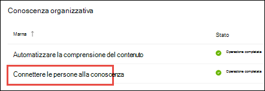

# Panoramica del centro argomenti (anteprima)Topic center overview (Preview)

> [!Note] 
> Il contenuto di questo articolo è relativo all'anteprima privata di Project Cortex.The content in this article is for Project Cortex Private Preview. [Altre informazioni su Project Cortex](https://aka.ms/projectcortex).[Find out more about Project Cortex](https://aka.ms/projectcortex).

Il centro argomenti è un sito di SharePoint moderno che funge da centro di conoscenza per la propria organizzazione.The topic center is a Modern SharePoint site that serves as a center of knowledge for your organization. Viene creato durante l' [installazione di Knowledge Management](set-up-topic-experiences.md) nell'interfaccia di amministrazione di Microsoft 365.It is created during [Knowledge Management setup](set-up-topic-experiences.md) in the Microsoft 365 admin center.

Nel centro argomenti è presente una Home page predefinita in cui è possibile visualizzare gli argomenti a cui sono stati connessi o che sono stati consigliati di essere connessi.The topic center has a default home page where you can see the topics to which you have been connected or suggested to be connected. Gli utenti che dispongono delle autorizzazioni appropriate possono anche:Users with the proper permissions can also:

- Creare una nuova pagina di argomentoCreate a new topic page
- Confermare o rifiutare gli argomenti suggeritiConfirm or reject suggested topics
- Modificare e pubblicare le modifiche apportate a una pagina di argomentoEdit and publish changes to a topic page

> [!Note] 
> È possibile ottenere ulteriori informazioni su ogni attività in [work with topics in the topic Center](work-with-topics.md).You can learn more about each task in [Work with topics in the topic center](work-with-topics.md).

## Dove è il centro argomentiWhere is the topic center

Il centro argomenti è stato creato durante l'installazione di Knowledge Management.Your topic center is created during Knowledge Management setup. Al termine dell'installazione, un amministratore può trovare l'URL nella [pagina Gestione centro informazioni](topic-experiences-discovery.md).After setup completes, an admin can find the URL on the [knowledge center management page](topic-experiences-discovery.md).

1. Nell'interfaccia di amministrazione di Microsoft 365, selezionare **installazione** nel riquadro di spostamento e nella sezione **informazioni organizzative** Selezionare **Connetti persone alla conoscenza**.In the Microsoft 365 admin center, select **Setup** in the navigation pane, and in the **Organizational Knowledge** section, select **Connect people to knowledge**.

     

2. Nella sezione **con una panoramica** della pagina **Connetti persone alla conoscenza** , vedere l' **argomento centro degli argomenti** per l'URL del sito.On the **Connect people to knowledge** page, in the **At a glance** section, see **Topic center address** for the site URL.

## Home pageHome page

Per visualizzare il centro argomenti, è necessario disporre delle autorizzazioni per visualizzare gli argomenti e l'argomento esperienze.To see the topic center, you need to have permissions to view topics and the topic experiences. L'amministratore può assegnare queste autorizzazioni agli utenti durante l' [installazione di Knowledge Management](set-up-topic-experiences.md)oppure è possibile aggiungere nuovi utenti in [seguito](give-user-permissions-to-the-topic-center.md) da un amministratore tramite l'interfaccia di amministrazione di Microsoft 365.Your admin can assign these permissions to users during [knowledge management setup](set-up-topic-experiences.md), or new users can be [added afterwards](give-user-permissions-to-the-topic-center.md) by an admin through the Microsoft 365 admin center.

Nella Home pageOn the home page 
- **Visualizza argomenti** : Visualizza l'argomento experiences.**View topics** : view topic experiences. In questo modo, è possibile visualizzare gli argomenti nell'organizzazione e fornire commenti e suggerimenti sugli argomenti in cui sono stati connessi:So you can see topics in the organization and give feedback on topics where you have been connected:
1. Connessioni consigliate: argomenti in cui è stata suggerita la connessioneSuggested connections - these are topics where my connection has been suggested
2. Connessioni confermate: si tratta di argomenti in cui sono bloccati sull'argomento o sono stati confermati gli argomenti di connessione che verranno spostati dalla sezione consigliata a confermata quando si conferma una connessione consigliata.Confirmed connections - these are topics where I am pinned on the topic or I've confirmed my connection Topics will move from the suggested to confirmed section when I confirm a suggested connection.
Una volta bloccato, le modifiche alla pagina dell'argomento possono essere eseguite per curare la connessione.Once I'm pinned, edits to the topic page can be done to curate my connection.

- **Creare e modificare gli argomenti** : è disponibile un nuovo argomento ed è possibile modificare le pagine**Create and edit topics** : New topic is available and you can edit pages

## Autorizzazioni per l'utilizzo del centro tematico gestione argomenti funzionalitàPermissions to use the Manage Topics capability topic center

Per utilizzare la sezione Gestisci argomenti del centro argomenti, è necessario disporre delle autorizzazioni necessarie.To work in the Manage Topics section of topic center, you need to have the required permissions. L'amministratore può assegnare queste autorizzazioni agli utenti durante l' [installazione di Knowledge Management](set-up-topic-experiences.md)oppure è possibile aggiungere nuovi utenti in [seguito](give-user-permissions-to-the-topic-center.md) da un amministratore tramite l'interfaccia di amministrazione di Microsoft 365.Your admin can assign these permissions to users during [knowledge management setup](set-up-topic-experiences.md), or new users can be [added afterwards](give-user-permissions-to-the-topic-center.md) by an admin through the Microsoft 365 admin center.

Agli utenti del centro argomenti possono essere assegnati due set di autorizzazioni:Topic center users can be given two sets of permissions:

- **Gestire gli argomenti** : utilizzare l'argomento dashboard per esaminare gli argomenti nell'organizzazione.**Manage topics** : Use the topic dashboard to review topics across the organization. Gli utenti possono eseguire azioni come la conferma e il rifiuto di argomenti non confermati.Users can perform actions such as confirming and rejecting unconfirmed topics.

Un utente può disporre di entrambi i set di autorizzazioni o di uno solo, se necessario.A user can be given both sets of permissions, or only one if needed. 

## Revisione degli argomenti nell'argomento dashboardReviewing topics in the topic dashboard

Nell'argomento dashboard sono riportati gli argomenti estratti dalle posizioni di origine specificate.The topic dashboard shows topics that were mined from your specified source locations. Ogni argomento mostrerà la data in cui è stato individuato l'argomento e se sono stati forniti commenti e suggerimenti.Each topic will show the date the topic was discovered and if any feedback has been provided on it. Un utente a cui sono state assegnate le autorizzazioni **Gestisci argomenti** può esaminare gli argomenti non confermati e scegliere di eseguire le operazioni seguenti:A user who was assigned **Manage topics** permissions can review the unconfirmed topics and choose to:
- Confermare l'argomento: evidenzia l'argomento per gli utenti che hanno accesso e gli consente di visualizzare la pagina argomento associato e la pagina dell'argomento.Confirm the topic: Highlights the topic to users who have access and lets them see the associated topic card and topic page.
- Rifiutare l'argomento: rende l'argomento non disponibile per gli utenti.Reject the topic: Makes the topic not available to users. L'argomento viene spostato nella scheda **rifiutata** e può essere confermato in un secondo momento, se necessario.The topic is moved to the **Rejected** tab and can be confirmed later if needed.

## Creare o modificare un argomentoCreate or edit a topic

Se si dispone delle autorizzazioni **Crea e modifica argomenti** , è possibile scegliere di:If you have **Create and edit topics** permissions, you can choose to:

- Modificare gli argomenti esistenti: è possibile apportare modifiche alle pagine degli argomenti esistenti create tramite l'individuazione.Edit existing topics: You can make changes to existing topic pages that were created through discovery.
- Creare nuovi argomenti: è possibile creare nuovi argomenti per quelli che non sono stati trovati tramite Discovery o se gli strumenti di AI non hanno trovato prove sufficienti per creare un argomento.Create new topics: You can create new topics for ones that were not found through discovery, or if AI tools did not find enough evidence to create a topic.

## Vedere ancheSee also

  

