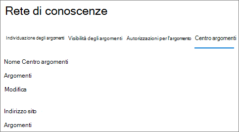

# Panoramica del centro argomenti (anteprima)Topic center overview (Preview)

> [!Note] 
> Il contenuto di questo articolo è relativo all'anteprima privata di Project Cortex.The content in this article is for Project Cortex Private Preview. [Altre informazioni su Project Cortex](https://aka.ms/projectcortex).[Find out more about Project Cortex](https://aka.ms/projectcortex).

Il centro argomenti è un sito di SharePoint moderno che funge da centro di conoscenza per la propria organizzazione.The topic center is a Modern SharePoint site that serves as a center of knowledge for your organization. Viene creato durante l' [installazione dell'argomento experiences](set-up-topic-experiences.md) nell'interfaccia di amministrazione di Microsoft 365.It is created during [Topic Experiences setup](set-up-topic-experiences.md) in the Microsoft 365 admin center.

Nel centro argomenti è presente una Home page predefinita (argomenti personali) in cui tutti gli utenti possono visualizzare gli argomenti a cui sono connessi.The Topic center has a default home page (My topics) where all Topic Experience users can see the topics to which they have a connection. 

Sebbene tutti gli utenti con licenza che possono visualizzare gli argomenti possano accedere al centro argomenti, i responsabili della Knowledge base potranno anche gestire gli argomenti tramite la pagina **Gestisci argomenti** .While all licensed users who can view topics will have access to the Topic center, knowledge managers will also be able to manage topics through the **Manage topics** page. La scheda Gestisci argomenti verrà visualizzata solo agli utenti che dispongono delle autorizzazioni **Gestisci argomenti** .The Manage topics tab will only display to users who have the **Manage topics** permissions. 

## Dove si trova il mio centro argomentiWhere is my Topic center

Il centro argomenti è stato creato durante l'installazione dell'argomento experiences.The Topic center is created during Topic Experiences setup. Al termine dell'installazione, un amministratore può trovare l'URL nella [pagina Gestione centro argomenti](https://docs.microsoft.com/microsoft-365/knowledge/topic-experiences-administration#to-access-topics-management-settings).After setup completes, an admin can find the URL on the [Topic center management page](https://docs.microsoft.com/microsoft-365/knowledge/topic-experiences-administration#to-access-topics-management-settings).

1. Nell'interfaccia di amministrazione di Microsoft 365 fare clic su **Impostazioni** e quindi su **Impostazioni org**.In the Microsoft 365 admin center, click **Settings**, then **Org settings**.
2. Nella scheda **Servizi** , fare clic su **Knowledge Network**.On the **Services** tab, click **Knowledge network**.

      

3. Selezionare la scheda **centro argomenti** . In **Indirizzo sito** è presente un collegamento al centro dell'argomento.Select the **Topic center** tab. Under **Site address** is a link to your Topic center.

      

## Home pageHome page

 

> [!VIDEO https://www.microsoft.com/videoplayer/embed/RE4LAhZ]  

 

Nella Home page del centro argomenti, è possibile visualizzare gli argomenti dell'organizzazione a cui è configurata una connessione.On the Topic center home page, you can see the topics in your organization to which you have a connection.

- Connessioni consigliate: verranno visualizzati gli argomenti suggeriti nell'elenco in **cui sono elencati gli argomenti riportati di seguito. L'abbiamo capito bene?**.Suggested connections - You will see suggested topics listed under **We've listed you on these topics. Did we get it right?**. Si tratta di argomenti in cui la connessione all'argomento è stata suggerita tramite AI.These are topics where your connection to the topic has been suggested through AI. Ad esempio, potrebbe essere il proprietario di un file o di un sito correlato.For example, you may be the owner of a related file or site. Gli argomenti suggeriti vi chiederanno di confermare la connessione all'argomento.Suggested topics will ask you to confirm you connection to the topic.

     
 
- Connessioni confermate: si tratta di argomenti in cui si è bloccati sull'argomento da un altro utente o si è confermata la connessione all'argomento.Confirmed connections - These are topics where you are pinned on the topic by another user or you've confirmed your connection to the topic. Gli argomenti verranno spostati dalla sezione consigliata a confermata quando si conferma una connessione consigliata.Topics will move from the suggested to confirmed section when you confirm a suggested connection.
 
     

Dopo che un utente ha confermato la propria connessione a un argomento, l'utente può apportare modifiche alla pagina dell'argomento per curare la connessione.Once a user confirms their connection to a topic, the user can make edits to the topic page to curate their connection. Ad esempio, possono fornire ulteriori informazioni sulla connessione all'argomento.For example, they can provide more information about their connection to the topic.

## Pagina Gestisci argomentiManage topics page

Per utilizzare la sezione **Gestisci argomenti** del centro argomenti, è necessario disporre delle autorizzazioni necessarie per *gestire gli argomenti* necessari per il ruolo Knowledge Manager.To work in the **Manage Topics** section of Topic center, you need to have the required *Manage topics* permissions needed for the knowledge manager role. L'amministratore può assegnare queste autorizzazioni agli utenti durante l' [installazione di Knowledge Management](set-up-topic-experiences.md)oppure è possibile aggiungere nuovi utenti in [seguito](topic-experiences-knowledge-rules.md) da un amministratore tramite l'interfaccia di amministrazione di Microsoft 365.Your admin can assign these permissions to users during [knowledge management setup](set-up-topic-experiences.md), or new users can be [added afterwards](topic-experiences-knowledge-rules.md) by an admin through the Microsoft 365 admin center.

Nella pagina Gestisci argomenti, nell'argomento dashboard vengono visualizzati gli argomenti identificati dai percorsi di origine specificati.On the Manage Topics page, the topic dashboard shows topics that were identified from your specified source locations. Ogni argomento mostrerà la data in cui è stato individuato l'argomento e se sono stati forniti commenti e suggerimenti.Each topic will show the date the topic was discovered and if any feedback has been provided on it. Un utente a cui sono state assegnate le autorizzazioni **Gestisci argomenti** può esaminare gli argomenti non confermati e scegliere di eseguire le operazioni seguenti:A user who was assigned **Manage topics** permissions can review the unconfirmed topics and choose to:
- Confermare l'argomento: evidenzia l'argomento per gli utenti che hanno accesso e gli consente di visualizzare la pagina argomento associato e la pagina dell'argomento.Confirm the topic: Highlights the topic to users who have access and lets them see the associated topic card and topic page.
- Rifiutare l'argomento: rende l'argomento non disponibile per gli utenti.Reject the topic: Makes the topic not available to users. L'argomento viene spostato nella scheda **rifiutata** e può essere confermato in un secondo momento, se necessario. un responsabile della Knowledge base può guidareThe topic is moved to the **Rejected** tab and can be confirmed later if needed.a knowledge manager can guide 

> [!Note] 
> Per ulteriori informazioni su come gestire gli argomenti nella pagina Gestisci argomenti, vedere [Manage](manage-topics.md) topics.See [Manage topics](manage-topics.md) for more details about topic managing topics in the Manage topics page.

## Creare o modificare un argomentoCreate or edit a topic

Se si dispone delle autorizzazioni **Crea e modifica argomenti** , sarà possibile eseguire le operazioni seguenti:If you have **Create and edit topics** permissions, you will be able to:

- [Modificare gli argomenti esistenti](edit-a-topic.md): è possibile apportare modifiche alle pagine degli argomenti esistenti create tramite l'individuazione.[Edit existing topics](edit-a-topic.md): You can make changes to existing topic pages that were created through discovery.
- [Creare nuovi argomenti](create-a-topic.md): è possibile creare nuovi argomenti per quelli che non sono stati trovati tramite Discovery o se gli strumenti di ai non hanno trovato prove sufficienti per creare un argomento.[Create new topics](create-a-topic.md): You can create new topics for ones that were not found through discovery, or if AI tools did not find enough evidence to create a topic.

## Vedere ancheSee also

  

