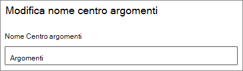

# Modificare il nome del centro argomenti in Microsoft 365

È possibile modificare il nome del centro argomenti nell'interfaccia di [amministrazione di Microsoft 365](https://admin.microsoft.com). Per eseguire queste attività, è necessario essere un amministratore globale o un amministratore di SharePoint.

## Per accedere alle impostazioni di gestione degli argomenti:

1. Nell'interfaccia di amministrazione di Microsoft 365 fare clic su **Impostazioni** e quindi su **Impostazioni org**.
2. Nella scheda **Servizi** , fare clic su **Knowledge Network**.

     

3. Selezionare la scheda **centro argomenti** . Per informazioni su ogni impostazione, vedere le sezioni seguenti.

     

##  Aggiornare il nome del centro dell'argomento

Per modificare il nome del centro argomenti

1. Nella scheda **centro argomenti** , in **nome centro argomenti**, selezionare **modifica**.
2. Nella casella **nome centro** argomenti della pagina **modifica nome centro argomenti** Digitare il nuovo nome del centro argomenti.
3. Selezionare **Salva**

      

## Vedere anche

[Gestire l'individuazione degli argomenti in Microsoft 365](topic-experiences-discovery.md)

[Gestire la visibilità degli argomenti in Microsoft 365](topic-experiences-knowledge-rules.md)

[Gestire le autorizzazioni per l'argomento in Microsoft 365](topic-experiences-user-permissions.md)
