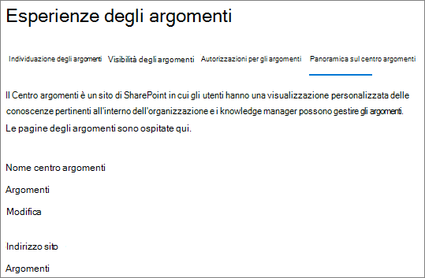

# Modificare il nome del Centro argomenti in Microsoft Viva Topics

È possibile modificare il nome del centro argomenti [nell'Microsoft 365 di amministrazione.](https://admin.microsoft.com) Per eseguire queste attività, è SharePoint amministratore globale o amministratore globale.

## Per accedere alle impostazioni di gestione degli argomenti:

1. Nell'Microsoft 365 di amministrazione fare clic su **Impostazioni** e quindi **su Impostazioni organizzazione.**
2. Nella scheda **Servizi** fare clic su **Esperienze argomento.**

     

3. Selezionare la **scheda Centro** argomenti. Per informazioni su ogni impostazione, vedere le sezioni seguenti.

     

##  Aggiornare il nome del centro argomenti

Per modificare il nome del Centro argomenti

1. Nella scheda **Centro argomenti,** in **Nome centro argomenti,** selezionare **Modifica.**
2. Nella casella **Nome centro argomenti**  della pagina Modifica nome centro argomenti digitare il nuovo nome per il Centro argomenti.
3. Selezionare **Salva**

      

## Vedere anche

[Gestire l'individuazione degli argomenti in Microsoft Viva Topics](topic-experiences-discovery.md)

[Gestire la visibilità degli argomenti in Microsoft Viva Topics](topic-experiences-knowledge-rules.md)

[Gestire le autorizzazioni per gli argomenti in Microsoft Viva Topics](topic-experiences-user-permissions.md)
