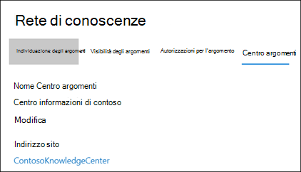
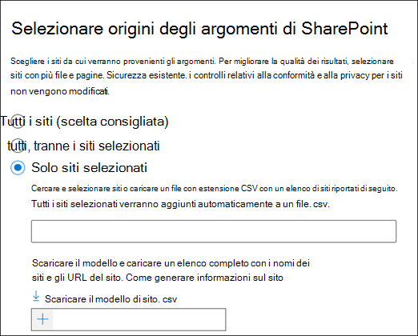
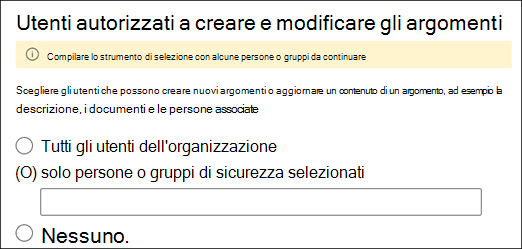
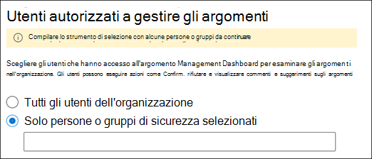
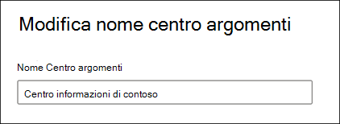

# Gestire la rete di gestione delle informazioni (anteprima)Manage your knowledge management network (Preview)

> [!Note] 
> Il contenuto di questo articolo è relativo all'anteprima privata di Project Cortex.The content in this article is for Project Cortex Private Preview. [Altre informazioni su Project Cortex](https://aka.ms/projectcortex).[Find out more about Project Cortex](https://aka.ms/projectcortex).

Dopo aver [configurato la gestione della conoscenza](set-up-topic-experiences.md), in qualsiasi momento, un amministratore può apportare le modifiche alle impostazioni di configurazione tramite l'interfaccia di amministrazione di Microsoft 365.After you [set up knowledge management](set-up-topic-experiences.md), at any time afterwards an admin can make adjustments to your configuration settings through the Microsoft 365 admin center.

Ad esempio, potrebbe essere necessario modificare le impostazioni per una delle seguenti operazioni:For example, you may need to adjust your settings for any of the following:
- Aggiungere nuove origini di SharePoint ai miei argomenti.Add new SharePoint sources to mine topics.
- Modificare gli utenti che avranno accesso agli argomenti.Change which users will have access to topics.
- Modificare gli utenti che dispongono delle autorizzazioni per eseguire attività nel centro argomenti.Change which users have permissions to do tasks on the topic center.
- Modificare il nome del centro argomentiChange the name of your topic center

## RequisitiRequirements 
È necessario disporre delle autorizzazioni di amministratore globale o di amministratore di SharePoint per poter accedere all'interfaccia di amministrazione di Microsoft 365 e gestire le attività relative alla conoscenza organizzativa.You must have Global Admin or SharePoint admin permissions to be able to access the Microsoft 365 admin center and manage Organizational knowledge tasks.

## Per accedere alle impostazioni di gestione delle informazioni:To access knowledge management settings:

1. Nell'interfaccia di amministrazione di Microsoft 365, selezionare **Setup** e quindi visualizzare la sezione relativa alle **informazioni sull'organizzazione** .In the Microsoft 365 admin center, select **Setup** , and then view the **Organizational Knowledge** section.
2. Nella sezione **informazioni organizzative** fare clic su **Connetti persone alla conoscenza**.In the **Organizational Knowledge** section, click **Connect people to knowledge**. 

      

3. Nella pagina **Connect people to Knowledge** selezionare **Manage** to open the **Knowledge Network Settings** pane.On the **Connect people to knowledge** page, select **Manage** to open the **Knowledge network settings** pane. 

      

## Modificare il modo in cui la rete di informazioni può trovare argomentiChange how the knowledge network can find topics

Se si desidera aggiornare le opzioni per le origini degli argomenti di SharePoint, selezionare la scheda **individuazione argomenti** .Select the **Topic discovery** tab if you want to update your choices for  for SharePoint topic sources. Questa impostazione consente di selezionare i siti di SharePoint nel tenant che verranno sottoposti a ricerca per indicizzazione e estratti per gli argomenti.This setting let you select the SharePoint sites in your tenant that will be crawled and mined for topics.

1. Nella scheda **individuazione argomento** , in **selezionare origini argomento di SharePoint** , selezionare **modifica**.On the **Topic discovery** tab, under **Select SharePoint topic sources** , select **Edit**.
2. Nella pagina **Seleziona origini argomenti di SharePoint** selezionare i siti di SharePoint che verranno sottoposti a ricerca per indicizzazione come origini per gli argomenti durante l'individuazione.On the **Select SharePoint topic sources** page, select which SharePoint sites will be crawled as sources for your topics during discovery. Questo include:This includes: 
    a.a. **Tutti i siti** : tutti i siti di SharePoint nel tenant.**All sites** : All SharePoint sites in your tenant. Questo acquisisce i siti correnti e futuri.This captures current and future sites. 
    b.b. **All, eccetto siti selezionati** : digitare i nomi dei siti che si desidera escludere.**All, except selected sites** : Type the names of the sites you want to exclude.  È inoltre possibile caricare un elenco di siti che si desidera escludere dall'individuazione.You can also upload a list of sites you want to opt out from discovery. I siti creati in futuro verranno inclusi come origini per l'individuazione degli argomenti.Sites created in the future will be included as sources for topic discovery.  
    c.c. **Solo siti selezionati** : digitare i nomi dei siti che si desidera includere.**Only selected sites** : Type the names of the sites you want to include. È inoltre possibile caricare un elenco di siti.You can also upload a list of sites. I siti creati in futuro non verranno inclusi come origini per l'individuazione degli argomenti.Sites created in the future will not be included as sources for topic discovery.  

      
   
    Se si dispone di un numero di siti che si desidera escludere (se si seleziona **tutto, tranne i siti selezionati** ) o si include (se sono stati selezionati **solo i siti selezionati** ), è possibile scegliere di caricare un file CSV con i nomi e gli URL del sito.If you have a number of sites that you want to exclude (if you select **All, except selected sites** ) or include (if you selected **Only selected sites** ), you can choose to upload a CSV file with the site names and URLs. È possibile selezionare **Scarica modello di sito. csv** se si desidera utilizzare il file modello CSV.You can select **Download site template .csv** if you want to use the CSV template file.

3. Selezionare **Salva**.Select **Save**.

##  Modificare gli utenti che possono visualizzare gli argomenti nell'organizzazioneChange who can see topics in your organization

Selezionare la scheda **individuazione argomento** se si desidera aggiornare gli argomenti individuati nei risultati della ricerca e quando gli argomenti vengono evidenziati nel contenuto come le pagine di SharePoint.Select the **Topic discovery** tab if you want to update who in your organization can see discovered topics in search results and when topics are highlighted in content like SharePoint pages.

1. Nella scheda **individuazione argomento** , in **utenti autorizzati a visualizzare gli argomenti della rete della Knowledge** base, selezionare **modifica**.On the **Topic discovery** tab, under **Who can see topics in the knowledge network** , select **Edit**.
2. Gli **utenti che possono visualizzare gli argomenti della pagina della rete della Knowledge** base consentono di scegliere gli utenti che avranno accesso ai dettagli sull'argomento, ad esempio argomenti evidenziati, schede argomento, risposte agli argomenti nelle pagine di ricerca e nell'argomento.On the **Who can see topics in the knowledge network** page, you choose who will have access to topic details, such as highlighted topics, topic cards, topic answers in search, and topic pages. È possibile selezionare:You can select: 
    a.a. **Tutti gli utenti dell'organizzazione****Everyone in your organization** 
    b.b. **Solo persone o gruppi di sicurezza selezionati****Only selected people or security groups** 
    c.c. **Nessuno****No one** 

       
3. Selezionare **Salva**.Select **Save**.  
 
> [!Note] 
> Anche se questa impostazione consente di selezionare qualsiasi utente dell'organizzazione, solo gli utenti che dispongono di licenze di gestione delle informazioni assegnate potranno visualizzare gli argomenti.While this setting allows you to select any user in your organization, only users who have knowledge management licenses assigned to them will be able to view topics.

## Modificare gli utenti che dispongono delle autorizzazioni per eseguire attività nel centro argomentiChange who has permissions to do tasks on the topic center

Selezionare la scheda autorizzazioni per l' **argomento** se si desidera aggiornare gli utenti che dispongono delle autorizzazioni per eseguire le operazioni seguenti nella pagina Centro argomenti:Select the **Topic permissions** tab if you want to update who has permissions to do the following in the topic center page:

- Quali utenti possono creare e modificare gli argomenti: creare nuovi argomenti che non sono stati rilevati durante l'individuazione o modificare i dettagli della pagina di argomento esistente.Which users can create and edit topics: Create new topics that were not found during discovery or edit existing topic page details.
- Quali utenti possono gestire gli argomenti: confermare o rifiutare gli argomenti individuati.Which users can manage topics: Confirm or reject discovered topics.

Per aggiornare gli utenti che dispongono delle autorizzazioni per la creazione e la modifica degli argomenti:To update who has permissions to create and edit topics:

1. Nella scheda **autorizzazioni dell'argomento** , in **utenti autorizzati a creare e modificare gli argomenti** , selezionare **modifica**.On the **Topic permissions** tab, under **Who can create and edit topics** , select **Edit**. 
2. Nella pagina **utenti autorizzati a creare e modificare gli argomenti** è possibile selezionare:On the **Who can create and edit topics** page, you can select: 
    a.a. **Tutti gli utenti dell'organizzazione****Everyone in your organization** 
    b.b. **Solo persone o gruppi di sicurezza selezionati****Only selected people or security groups** 

       

3. Selezionare **Salva**.Select **Save**. 

Per aggiornare gli utenti che dispongono delle autorizzazioni per gestire gli argomenti:To update who has permissions to manage topics:

1. Nella scheda **autorizzazioni dell'argomento** , in **utenti autorizzati a gestire gli argomenti** , selezionare **modifica**.On the **Topic permissions** tab, under **Who can manage topics** , select **Edit**. 
2. Nella pagina **chi** è in grado di gestire gli argomenti, è possibile selezionare:On the **Who can manage topics** page, you can select: 
    a.a. **Tutti gli utenti dell'organizzazione****Everyone in your organization** 
    b.b. **Utenti o gruppi di sicurezza selezionati****Selected people or security groups** 

       

3. Selezionare **Salva**.Select **Save**. 

##  Aggiornare il nome del centro dell'argomentoUpdate your topic center name

Selezionare la scheda **centro argomenti** se si desidera aggiornare il nome del centro argomenti.Select the **Topic center** tab if you want to update the name of your topic center. 

1. Nella scheda **centro argomenti** , in **nome centro argomenti** , selezionare **modifica**.On the **Topic center** tab, under **Topic center name** , select **Edit**.
2. Nella casella **nome centro** argomenti della pagina **modifica nome centro argomenti** Digitare il nuovo nome del centro argomenti.On the **Edit topic center name** page, in the **Topic center name** box, type the new name for your topic center.
3. Selezionare **Salva**Select **Save**

       

## Vedere ancheSee also

  

