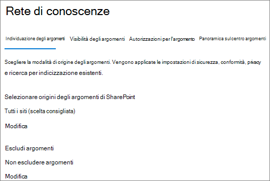
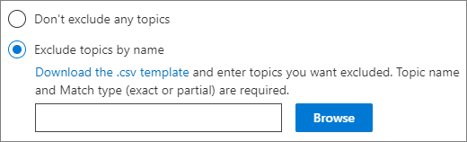
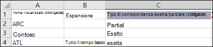

# <a name="manage-topic-discovery-in-microsoft-viva-topics"></a>Gestire l'individuazione degli argomenti negli argomenti di Microsoft Viva

È possibile gestire le impostazioni di individuazione degli argomenti [nell'interfaccia di amministrazione di Microsoft 365.](https://admin.microsoft.com) Per eseguire queste attività, è necessario essere un amministratore globale o un amministratore di SharePoint.

## <a name="to-access-topics-management-settings"></a>Per accedere alle impostazioni di gestione degli argomenti:

1. Nell'interfaccia di amministrazione di Microsoft 365 fare clic su **Impostazioni** e **quindi su Impostazioni organizzazione.**
2. Nella scheda **Servizi** fare clic su **Esperienze argomento.**

     

3. Selezionare la **scheda Individuazione** argomenti. Per informazioni su ogni impostazione, vedere le sezioni seguenti.

     

## <a name="select-sharepoint-topic-sources"></a>Selezionare le origini degli argomenti di SharePoint

È possibile modificare i siti di SharePoint nell'organizzazione che verranno sottoposti a ricerca per indicizzazione per gli argomenti.

Se si desidera includere o escludere un elenco specifico di siti, è possibile utilizzare il modello CSV seguente:

``` csv
Site name,URL
```

Se si aggiungono siti utilizzando la selezione siti, questi verranno aggiunti all'elenco di siti esistenti da includere o escludere. Se si carica un file CSV, l'elenco esistente verrà sovrascritto. Se in precedenza sono stati inclusi o esclusi siti specifici, è possibile scaricare l'elenco come file CSV, apportare modifiche e caricare il nuovo elenco.

Per scegliere i siti per l'individuazione degli argomenti

1. Nella scheda **Individuazione argomenti,** in Selezionare le origini degli **argomenti di SharePoint,** selezionare **Modifica.**
2. Nella pagina **Seleziona origini argomenti di SharePoint** selezionare i siti di SharePoint che verranno sottoposti a ricerca per indicizzazione come origini per gli argomenti durante l'individuazione. Ciò include:
    - **Tutti i siti:** tutti i siti di SharePoint nel tenant. In questo modo vengono catturati i siti correnti e futuri.
    - **Tutti, ad eccezione dei siti** selezionati: digitare i nomi dei siti che si desidera escludere.  Puoi anche caricare un elenco di siti che vuoi rifiutare esplicitamente dall'individuazione. I siti creati in futuro verranno inclusi come origini per l'individuazione degli argomenti. 
    - **Solo siti selezionati:** digitare i nomi dei siti che si desidera includere. È inoltre possibile caricare un elenco di siti. I siti creati in futuro non verranno inclusi come origini per l'individuazione degli argomenti.
    - **Nessun sito:** gli argomenti non verranno generati o aggiornati automaticamente con il contenuto di SharePoint. Gli argomenti esistenti rimangono nel Centro argomenti.

    
   
3. Fare clic su **Salva**.

## <a name="exclude-topics-by-name"></a>Escludere gli argomenti in base al nome

Puoi escludere gli argomenti dall'individuazione caricando un elenco usando un file CSV. Se in precedenza sono stati esclusi gli argomenti, è possibile scaricare il file CSV, apportare modifiche e caricarlo di nuovo.

1. Nella scheda **Individuazione argomenti,** in **Escludi argomenti,** selezionare **Modifica.**
2. Fare **clic su Escludi argomenti per nome.**
3. Se è necessario creare un elenco, scaricare il modello csv e aggiungere gli argomenti che si desidera escludere (vedere l'argomento sull'utilizzo del modello *csv di* seguito). Quando il file è pronto, fare clic **su Sfoglia** e caricare il file. Se è presente un elenco esistente, è possibile scaricare il file CSV contenente l'elenco.
4. Fare clic su **Salva**.

    

### <a name="working-with-the-csv-template"></a>Utilizzo del modello CSV

È possibile copiare il modello csv seguente:

``` csv
Name (required),Expansion,MatchType- Exact/Partial (required)
```

Nel modello CSV immettere le informazioni seguenti sugli argomenti che si desidera escludere:

- **Nome**: digitare il nome dell'argomento che si desidera escludere. Questa operazione può essere eseguita in due modi:
    - Corrispondenza esatta: è possibile includere il nome esatto o l'acronimo (ad esempio, *Contoso* o *ATL).*
    - Corrispondenza parziale: è possibile escludere tutti gli argomenti che includono una parola specifica.  Ad esempio, *l'arco* escluderà tutti gli argomenti con la parola arco *al* suo interno, ad esempio cerchio ad *arco,* saldatura ad arco *di plasma* o arco *di formazione.* Si noti che non verranno esclusi gli argomenti in cui il testo è incluso come parte di una parola, ad esempio *Architecture.*
- **Acronimo (facoltativo):** se si desidera escludere un acronimo, digitare le parole che l'acronimo sta per.
- **MatchType-Exact/Partial:** specificare se il nome immesso è un *tipo* di corrispondenza esatto *o* parziale.

     

## <a name="see-also"></a>Vedere anche

[Gestire la visibilità degli argomenti in Microsoft 365](topic-experiences-knowledge-rules.md)

[Gestire le autorizzazioni per gli argomenti in Microsoft 365](topic-experiences-user-permissions.md)

[Modificare il nome del Centro argomenti in Microsoft 365](topic-experiences-administration.md)
