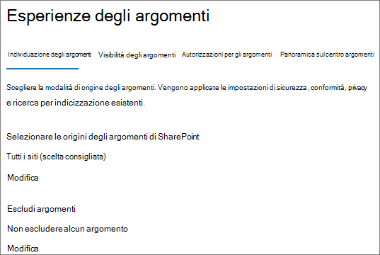

# <a name="manage-topic-discovery-in-microsoft-365"></a><span data-ttu-id="680c4-103">Gestire l'individuazione degli argomenti in Microsoft 365</span><span class="sxs-lookup"><span data-stu-id="680c4-103">Manage topic discovery in Microsoft 365</span></span>

<span data-ttu-id="680c4-104">È possibile gestire le impostazioni di individuazione degli argomenti nell'interfaccia di [amministrazione di Microsoft 365](https://admin.microsoft.com).</span><span class="sxs-lookup"><span data-stu-id="680c4-104">You can manage topic discovery settings in the [Microsoft 365 admin center](https://admin.microsoft.com).</span></span> <span data-ttu-id="680c4-105">Per eseguire queste attività, è necessario essere un amministratore globale o un amministratore di SharePoint.</span><span class="sxs-lookup"><span data-stu-id="680c4-105">You must be a global administrator or SharePoint administrator to perform these tasks.</span></span>

## <a name="to-access-topics-management-settings"></a><span data-ttu-id="680c4-106">Per accedere alle impostazioni di gestione degli argomenti:</span><span class="sxs-lookup"><span data-stu-id="680c4-106">To access topics management settings:</span></span>

1. <span data-ttu-id="680c4-107">Nell'interfaccia di amministrazione di Microsoft 365 fare clic su **Impostazioni** e quindi su **Impostazioni org**.</span><span class="sxs-lookup"><span data-stu-id="680c4-107">In the Microsoft 365 admin center, click **Settings**, then **Org settings**.</span></span>
2. <span data-ttu-id="680c4-108">Nella scheda **Servizi** , fare clic su **Knowledge Network**.</span><span class="sxs-lookup"><span data-stu-id="680c4-108">On the **Services** tab, click **Knowledge network**.</span></span>

     

3. <span data-ttu-id="680c4-110">Selezionare la scheda **individuazione degli argomenti** . Per informazioni su ogni impostazione, vedere le sezioni seguenti.</span><span class="sxs-lookup"><span data-stu-id="680c4-110">Select the **Topic discovery** tab. See the following sections for information about each setting.</span></span>

     

## <a name="select-sharepoint-topic-sources"></a><span data-ttu-id="680c4-112">Selezionare origini degli argomenti di SharePoint</span><span class="sxs-lookup"><span data-stu-id="680c4-112">Select SharePoint topic sources</span></span>

<span data-ttu-id="680c4-113">È possibile modificare i siti di SharePoint nell'organizzazione che verranno sottoposti a ricerca per indicizzazione per gli argomenti.</span><span class="sxs-lookup"><span data-stu-id="680c4-113">You can change the SharePoint sites in your organization that will be crawled for topics.</span></span>

<span data-ttu-id="680c4-114">Se si desidera includere o escludere un elenco specifico di siti, è possibile utilizzare il modello CSV seguente:</span><span class="sxs-lookup"><span data-stu-id="680c4-114">If you want to include or exclude a specific list of sites, you can use the following .csv template:</span></span>

``` csv
Site name,URL
```

<span data-ttu-id="680c4-115">Se si aggiungono siti utilizzando lo strumento di selezione siti, questi vengono aggiunti all'elenco esistente di siti da includere o escludere.</span><span class="sxs-lookup"><span data-stu-id="680c4-115">If you add sites using the site picker, they are added to the existing list of sites to include or exclude.</span></span> <span data-ttu-id="680c4-116">Se si carica un file. csv, sovrascrive qualsiasi elenco esistente.</span><span class="sxs-lookup"><span data-stu-id="680c4-116">If you upload a .csv file, it overwrites any existing list.</span></span> <span data-ttu-id="680c4-117">Se in precedenza sono stati inclusi o esclusi siti specifici, è possibile scaricare l'elenco come file. csv, apportare modifiche e caricare il nuovo elenco.</span><span class="sxs-lookup"><span data-stu-id="680c4-117">If you have previously included or excluded specific sites, you and download the list as a .csv file, make changes, and upload the new list.</span></span>

<span data-ttu-id="680c4-118">Per scegliere i siti per l'individuazione degli argomenti</span><span class="sxs-lookup"><span data-stu-id="680c4-118">To choose sites for topic discovery</span></span>

1. <span data-ttu-id="680c4-119">Nella scheda **individuazione argomento** , in **selezionare origini argomento di SharePoint**, selezionare **modifica**.</span><span class="sxs-lookup"><span data-stu-id="680c4-119">On the **Topic discovery** tab, under **Select SharePoint topic sources**, select **Edit**.</span></span>
2. <span data-ttu-id="680c4-120">Nella pagina **Seleziona origini argomenti di SharePoint** selezionare i siti di SharePoint che verranno sottoposti a ricerca per indicizzazione come origini per gli argomenti durante l'individuazione.</span><span class="sxs-lookup"><span data-stu-id="680c4-120">On the **Select SharePoint topic sources** page, select which SharePoint sites will be crawled as sources for your topics during discovery.</span></span> <span data-ttu-id="680c4-121">Questo include:</span><span class="sxs-lookup"><span data-stu-id="680c4-121">This includes:</span></span>
    - <span data-ttu-id="680c4-122">**Tutti i siti**: tutti i siti di SharePoint nel tenant.</span><span class="sxs-lookup"><span data-stu-id="680c4-122">**All sites**: All SharePoint sites in your tenant.</span></span> <span data-ttu-id="680c4-123">Questo acquisisce i siti correnti e futuri.</span><span class="sxs-lookup"><span data-stu-id="680c4-123">This captures current and future sites.</span></span>
    - <span data-ttu-id="680c4-124">**All, eccetto siti selezionati**: digitare i nomi dei siti che si desidera escludere.</span><span class="sxs-lookup"><span data-stu-id="680c4-124">**All, except selected sites**: Type the names of the sites you want to exclude.</span></span>  <span data-ttu-id="680c4-125">È inoltre possibile caricare un elenco di siti che si desidera escludere dall'individuazione.</span><span class="sxs-lookup"><span data-stu-id="680c4-125">You can also upload a list of sites you want to opt out from discovery.</span></span> <span data-ttu-id="680c4-126">I siti creati in futuro verranno inclusi come origini per l'individuazione degli argomenti.</span><span class="sxs-lookup"><span data-stu-id="680c4-126">Sites created in the future will be included as sources for topic discovery.</span></span> 
    - <span data-ttu-id="680c4-127">**Solo siti selezionati**: digitare i nomi dei siti che si desidera includere.</span><span class="sxs-lookup"><span data-stu-id="680c4-127">**Only selected sites**: Type the names of the sites you want to include.</span></span> <span data-ttu-id="680c4-128">È inoltre possibile caricare un elenco di siti.</span><span class="sxs-lookup"><span data-stu-id="680c4-128">You can also upload a list of sites.</span></span> <span data-ttu-id="680c4-129">I siti creati in futuro non verranno inclusi come origini per l'individuazione degli argomenti.</span><span class="sxs-lookup"><span data-stu-id="680c4-129">Sites created in the future will not be included as sources for topic discovery.</span></span>
    - <span data-ttu-id="680c4-130">**Nessun sito**: gli argomenti non verranno generati o aggiornati automaticamente con il contenuto di SharePoint.</span><span class="sxs-lookup"><span data-stu-id="680c4-130">**No sites**: Topics won't be automatically generated or updated with SharePoint content.</span></span> <span data-ttu-id="680c4-131">Gli argomenti esistenti rimangono nell'argomento centro.</span><span class="sxs-lookup"><span data-stu-id="680c4-131">Existing topics remain in the topic center.</span></span>

    
   
3. <span data-ttu-id="680c4-133">Fare clic su **Salva**.</span><span class="sxs-lookup"><span data-stu-id="680c4-133">Click **Save**.</span></span>

## <a name="exclude-topics-by-name"></a><span data-ttu-id="680c4-134">Escludi argomenti per nome</span><span class="sxs-lookup"><span data-stu-id="680c4-134">Exclude topics by name</span></span>

<span data-ttu-id="680c4-135">È possibile escludere gli argomenti dall'individuazione caricando un elenco utilizzando un file. csv.</span><span class="sxs-lookup"><span data-stu-id="680c4-135">You can exclude topics from discovery by uploading a list using a .csv file.</span></span> <span data-ttu-id="680c4-136">Se sono stati precedentemente esclusi gli argomenti, è possibile scaricare il file. csv, apportare modifiche e caricarlo di nuovo.</span><span class="sxs-lookup"><span data-stu-id="680c4-136">If you've previously excluded topics, you can download the .csv, make changes, and upload it again.</span></span>

1. <span data-ttu-id="680c4-137">Nella scheda **individuazione argomento** , in **argomenti Escludi**, selezionare **modifica**.</span><span class="sxs-lookup"><span data-stu-id="680c4-137">On the **Topic discovery** tab, under **Exclude topics**, select **Edit**.</span></span>
2. <span data-ttu-id="680c4-138">Fare clic su **Escludi argomenti per nome**.</span><span class="sxs-lookup"><span data-stu-id="680c4-138">Click **Exclude topics by name**.</span></span>
3. <span data-ttu-id="680c4-139">Se è necessario creare un elenco, scaricare il modello. csv e aggiungere gli argomenti che si desidera escludere (vedere *utilizzo del modello. CSV di* seguito).</span><span class="sxs-lookup"><span data-stu-id="680c4-139">If you need to create a list, download the .csv template and add the topics that you want to exclude (see *Working with the .csv template* below).</span></span> <span data-ttu-id="680c4-140">Quando il file è pronto, fare clic su **Sfoglia** e caricare il file.</span><span class="sxs-lookup"><span data-stu-id="680c4-140">When the file is ready, click **Browse** and upload the file.</span></span> <span data-ttu-id="680c4-141">Se è presente un elenco esistente, è possibile scaricare il file con estensione CSV contenente l'elenco.</span><span class="sxs-lookup"><span data-stu-id="680c4-141">If there's an existing list, you can download the .csv containing the list.</span></span>
4. <span data-ttu-id="680c4-142">Fare clic su **Salva**.</span><span class="sxs-lookup"><span data-stu-id="680c4-142">Click **Save**.</span></span>

    

### <a name="working-with-the-csv-template"></a><span data-ttu-id="680c4-144">Utilizzo del modello. csv</span><span class="sxs-lookup"><span data-stu-id="680c4-144">Working with the .csv template</span></span>

<span data-ttu-id="680c4-145">È possibile copiare il modello CSV seguente:</span><span class="sxs-lookup"><span data-stu-id="680c4-145">You can copy the csv template below:</span></span>

``` csv
Name (required),Expansion,MatchType- Exact/Partial (required)
```

<span data-ttu-id="680c4-146">Nel modello CSV, immettere le informazioni seguenti sugli argomenti che si desidera escludere:</span><span class="sxs-lookup"><span data-stu-id="680c4-146">In the CSV template, enter the following information about the topics you want to exclude:</span></span>

- <span data-ttu-id="680c4-147">**Nome**: digitare il nome dell'argomento che si desidera escludere.</span><span class="sxs-lookup"><span data-stu-id="680c4-147">**Name**: Type the name of the topic you want to exclude.</span></span> <span data-ttu-id="680c4-148">Questa operazione può essere eseguita in due modi:</span><span class="sxs-lookup"><span data-stu-id="680c4-148">There are two ways to do this:</span></span>
    - <span data-ttu-id="680c4-149">Corrispondenza esatta: è possibile includere il nome o l'acronimo esatto (ad esempio, *Contoso* o *ATL*).</span><span class="sxs-lookup"><span data-stu-id="680c4-149">Exact match: You can include the exact name or acronym (for example, *Contoso* or *ATL*).</span></span>
    - <span data-ttu-id="680c4-150">Corrispondenza parziale: è possibile escludere tutti gli argomenti in cui è presente una parola specifica.</span><span class="sxs-lookup"><span data-stu-id="680c4-150">Partial match: You can exclude all topics that have a specific word in it.</span></span>  <span data-ttu-id="680c4-151">Ad esempio, *Arc* escluderà tutti gli argomenti con l' *arco* di parola in esso, ad esempio *cerchio arco*, *saldatura ad arco al plasma* o *arco di training*. Tenere presente che non verranno esclusi gli argomenti in cui il testo viene incluso come parte di una parola, ad esempio l' *architettura*.</span><span class="sxs-lookup"><span data-stu-id="680c4-151">For example, *arc* will exclude all topics with the word *arc* in it, such as *Arc circle*, *Plasma arc welding*, or *Training arc*. Note that it will not exclude topics in which the text is included as part of a word, such as *Architecture*.</span></span>
- <span data-ttu-id="680c4-152">Acronimo **di (facoltativo)**: se si desidera escludere un acronimo, digitare le parole in cui si trova l'acronimo.</span><span class="sxs-lookup"><span data-stu-id="680c4-152">**Stands for (optional)**: If you want to exclude an acronym, type the words the acronym stands for.</span></span>
- <span data-ttu-id="680c4-153">**MatchType-exact/partial**: digitare se il nome immesso è un tipo di corrispondenza *esatta* o *parziale* .</span><span class="sxs-lookup"><span data-stu-id="680c4-153">**MatchType-Exact/Partial**: Type whether the name you entered was an *exact* or *partial* match type.</span></span>

     

## <a name="see-also"></a><span data-ttu-id="680c4-155">Vedere anche</span><span class="sxs-lookup"><span data-stu-id="680c4-155">See also</span></span>

[<span data-ttu-id="680c4-156">Gestire la visibilità degli argomenti in Microsoft 365</span><span class="sxs-lookup"><span data-stu-id="680c4-156">Manage topic visibility in Microsoft 365</span></span>](topic-experiences-knowledge-rules.md)

[<span data-ttu-id="680c4-157">Gestire le autorizzazioni per l'argomento in Microsoft 365</span><span class="sxs-lookup"><span data-stu-id="680c4-157">Manage topic permissions in Microsoft 365</span></span>](topic-experiences-user-permissions.md)

[<span data-ttu-id="680c4-158">Modificare il nome del centro argomenti in Microsoft 365</span><span class="sxs-lookup"><span data-stu-id="680c4-158">Change the name of the topic center in Microsoft 365</span></span>](topic-experiences-administration.md)
