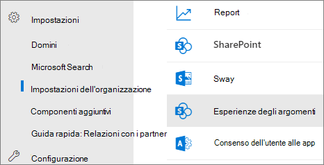

# <a name="manage-topic-discovery-in-microsoft-viva-topics"></a><span data-ttu-id="d8605-103">Gestire l'individuazione degli argomenti in Microsoft Viva Topics</span><span class="sxs-lookup"><span data-stu-id="d8605-103">Manage topic discovery in Microsoft Viva Topics</span></span>

<span data-ttu-id="d8605-104">È possibile gestire le impostazioni di individuazione degli argomenti nell'interfaccia di amministrazione di [Microsoft 365.](https://admin.microsoft.com)</span><span class="sxs-lookup"><span data-stu-id="d8605-104">You can manage topic discovery settings in the [Microsoft 365 admin center](https://admin.microsoft.com).</span></span> <span data-ttu-id="d8605-105">Per eseguire queste attività, è necessario essere un amministratore globale o un amministratore di SharePoint.</span><span class="sxs-lookup"><span data-stu-id="d8605-105">You must be a global administrator or SharePoint administrator to perform these tasks.</span></span>

## <a name="to-access-topics-management-settings"></a><span data-ttu-id="d8605-106">Per accedere alle impostazioni di gestione degli argomenti:</span><span class="sxs-lookup"><span data-stu-id="d8605-106">To access topics management settings:</span></span>

1. <span data-ttu-id="d8605-107">Nell'interfaccia di amministrazione di Microsoft 365, fare clic su **Impostazioni**, quindi **su Impostazioni organizzazione**.</span><span class="sxs-lookup"><span data-stu-id="d8605-107">In the Microsoft 365 admin center, click **Settings**, then **Org settings**.</span></span>
2. <span data-ttu-id="d8605-108">Nella scheda **Servizi** fare clic su **Esperienze argomento.**</span><span class="sxs-lookup"><span data-stu-id="d8605-108">On the **Services** tab, click **Topic experiences**.</span></span>

     

3. <span data-ttu-id="d8605-110">Selezionare la **scheda Individuazione** argomenti. Per informazioni su ogni impostazione, vedere le sezioni seguenti.</span><span class="sxs-lookup"><span data-stu-id="d8605-110">Select the **Topic discovery** tab. See the following sections for information about each setting.</span></span>

     

## <a name="select-sharepoint-topic-sources"></a><span data-ttu-id="d8605-112">Selezionare le origini degli argomenti di SharePoint</span><span class="sxs-lookup"><span data-stu-id="d8605-112">Select SharePoint topic sources</span></span>

<span data-ttu-id="d8605-113">È possibile modificare i siti di SharePoint nell'organizzazione che verranno sottoposti a ricerca per indicizzazione per gli argomenti.</span><span class="sxs-lookup"><span data-stu-id="d8605-113">You can change the SharePoint sites in your organization that will be crawled for topics.</span></span>

<span data-ttu-id="d8605-114">Se si desidera includere o escludere un elenco specifico di siti, è possibile utilizzare il modello CSV seguente:</span><span class="sxs-lookup"><span data-stu-id="d8605-114">If you want to include or exclude a specific list of sites, you can use the following .csv template:</span></span>

``` csv
Site name,URL
```

<span data-ttu-id="d8605-115">Se si aggiungono siti utilizzando la selezione siti, questi vengono aggiunti all'elenco esistente di siti da includere o escludere.</span><span class="sxs-lookup"><span data-stu-id="d8605-115">If you add sites using the site picker, they are added to the existing list of sites to include or exclude.</span></span> <span data-ttu-id="d8605-116">Se carichi un file CSV, sovrascrive qualsiasi elenco esistente.</span><span class="sxs-lookup"><span data-stu-id="d8605-116">If you upload a .csv file, it overwrites any existing list.</span></span> <span data-ttu-id="d8605-117">Se in precedenza sono stati inclusi o esclusi siti specifici, è possibile scaricare l'elenco come file CSV, apportare modifiche e caricare il nuovo elenco.</span><span class="sxs-lookup"><span data-stu-id="d8605-117">If you have previously included or excluded specific sites, you and download the list as a .csv file, make changes, and upload the new list.</span></span>

<span data-ttu-id="d8605-118">Per scegliere i siti per l'individuazione degli argomenti</span><span class="sxs-lookup"><span data-stu-id="d8605-118">To choose sites for topic discovery</span></span>

1. <span data-ttu-id="d8605-119">Nella scheda **Individuazione argomenti** selezionare Modifica in Selezionare le **origini degli argomenti di SharePoint.**</span><span class="sxs-lookup"><span data-stu-id="d8605-119">On the **Topic discovery** tab, under **Select SharePoint topic sources**, select **Edit**.</span></span>
2. <span data-ttu-id="d8605-120">Nella pagina **Seleziona origini argomenti di SharePoint** selezionare quali siti di SharePoint verranno sottoposti a ricerca per indicizzazione come origini per gli argomenti durante l'individuazione.</span><span class="sxs-lookup"><span data-stu-id="d8605-120">On the **Select SharePoint topic sources** page, select which SharePoint sites will be crawled as sources for your topics during discovery.</span></span> <span data-ttu-id="d8605-121">Tra questi vi sono anche:</span><span class="sxs-lookup"><span data-stu-id="d8605-121">This includes:</span></span>
    - <span data-ttu-id="d8605-122">**Tutti i siti**: tutti i siti di SharePoint nel tenant.</span><span class="sxs-lookup"><span data-stu-id="d8605-122">**All sites**: All SharePoint sites in your tenant.</span></span> <span data-ttu-id="d8605-123">In questo modo vengono catturati i siti correnti e futuri.</span><span class="sxs-lookup"><span data-stu-id="d8605-123">This captures current and future sites.</span></span>
    - <span data-ttu-id="d8605-124">**Tutti, ad eccezione dei siti** selezionati: digitare i nomi dei siti che si desidera escludere.</span><span class="sxs-lookup"><span data-stu-id="d8605-124">**All, except selected sites**: Type the names of the sites you want to exclude.</span></span>  <span data-ttu-id="d8605-125">È inoltre possibile caricare un elenco di siti che si desidera rifiutare esplicitamente dall'individuazione.</span><span class="sxs-lookup"><span data-stu-id="d8605-125">You can also upload a list of sites you want to opt out from discovery.</span></span> <span data-ttu-id="d8605-126">I siti creati in futuro verranno inclusi come origini per l'individuazione degli argomenti.</span><span class="sxs-lookup"><span data-stu-id="d8605-126">Sites created in the future will be included as sources for topic discovery.</span></span> 
    - <span data-ttu-id="d8605-127">**Solo siti selezionati:** digitare i nomi dei siti che si desidera includere.</span><span class="sxs-lookup"><span data-stu-id="d8605-127">**Only selected sites**: Type the names of the sites you want to include.</span></span> <span data-ttu-id="d8605-128">È inoltre possibile caricare un elenco di siti.</span><span class="sxs-lookup"><span data-stu-id="d8605-128">You can also upload a list of sites.</span></span> <span data-ttu-id="d8605-129">I siti creati in futuro non verranno inclusi come origini per l'individuazione degli argomenti.</span><span class="sxs-lookup"><span data-stu-id="d8605-129">Sites created in the future will not be included as sources for topic discovery.</span></span>
    - <span data-ttu-id="d8605-130">**Nessun sito:** gli argomenti non verranno generati o aggiornati automaticamente con il contenuto di SharePoint.</span><span class="sxs-lookup"><span data-stu-id="d8605-130">**No sites**: Topics won't be automatically generated or updated with SharePoint content.</span></span> <span data-ttu-id="d8605-131">Gli argomenti esistenti rimangono nel Centro argomenti.</span><span class="sxs-lookup"><span data-stu-id="d8605-131">Existing topics remain in the topic center.</span></span>

    
   
3. <span data-ttu-id="d8605-133">Fare clic su **Salva**.</span><span class="sxs-lookup"><span data-stu-id="d8605-133">Click **Save**.</span></span>

## <a name="exclude-topics-by-name"></a><span data-ttu-id="d8605-134">Escludere gli argomenti in base al nome</span><span class="sxs-lookup"><span data-stu-id="d8605-134">Exclude topics by name</span></span>

<span data-ttu-id="d8605-135">Puoi escludere gli argomenti dall'individuazione caricando un elenco usando un file CSV.</span><span class="sxs-lookup"><span data-stu-id="d8605-135">You can exclude topics from discovery by uploading a list using a .csv file.</span></span> <span data-ttu-id="d8605-136">Se in precedenza hai escluso argomenti, puoi scaricare il file CSV, apportare modifiche e caricarlo di nuovo.</span><span class="sxs-lookup"><span data-stu-id="d8605-136">If you've previously excluded topics, you can download the .csv, make changes, and upload it again.</span></span>

1. <span data-ttu-id="d8605-137">Nella scheda **Individuazione argomenti** selezionare Modifica in **Escludi** **argomenti.**</span><span class="sxs-lookup"><span data-stu-id="d8605-137">On the **Topic discovery** tab, under **Exclude topics**, select **Edit**.</span></span>
2. <span data-ttu-id="d8605-138">Fare **clic su Escludi argomenti per nome.**</span><span class="sxs-lookup"><span data-stu-id="d8605-138">Click **Exclude topics by name**.</span></span>
3. <span data-ttu-id="d8605-139">Se è necessario creare un elenco, scaricare il modello csv e aggiungere gli argomenti che si desidera escludere (vedere Utilizzo del modello *csv di seguito).*</span><span class="sxs-lookup"><span data-stu-id="d8605-139">If you need to create a list, download the .csv template and add the topics that you want to exclude (see *Working with the .csv template* below).</span></span> <span data-ttu-id="d8605-140">Quando il file è pronto, fare clic **su Sfoglia** e caricare il file.</span><span class="sxs-lookup"><span data-stu-id="d8605-140">When the file is ready, click **Browse** and upload the file.</span></span> <span data-ttu-id="d8605-141">Se è presente un elenco esistente, è possibile scaricare il file CSV contenente l'elenco.</span><span class="sxs-lookup"><span data-stu-id="d8605-141">If there's an existing list, you can download the .csv containing the list.</span></span>
4. <span data-ttu-id="d8605-142">Fare clic su **Salva**.</span><span class="sxs-lookup"><span data-stu-id="d8605-142">Click **Save**.</span></span>

    

### <a name="working-with-the-csv-template"></a><span data-ttu-id="d8605-144">Utilizzo del modello CSV</span><span class="sxs-lookup"><span data-stu-id="d8605-144">Working with the .csv template</span></span>

<span data-ttu-id="d8605-145">È possibile copiare il modello csv seguente:</span><span class="sxs-lookup"><span data-stu-id="d8605-145">You can copy the csv template below:</span></span>

``` csv
Name (required),Expansion,MatchType- Exact/Partial (required)
```

<span data-ttu-id="d8605-146">Nel modello CSV immettere le informazioni seguenti sugli argomenti che si desidera escludere:</span><span class="sxs-lookup"><span data-stu-id="d8605-146">In the CSV template, enter the following information about the topics you want to exclude:</span></span>

- <span data-ttu-id="d8605-147">**Nome**: digitare il nome dell'argomento che si desidera escludere.</span><span class="sxs-lookup"><span data-stu-id="d8605-147">**Name**: Type the name of the topic you want to exclude.</span></span> <span data-ttu-id="d8605-148">Questa operazione può essere eseguita in due modi:</span><span class="sxs-lookup"><span data-stu-id="d8605-148">There are two ways to do this:</span></span>
    - <span data-ttu-id="d8605-149">Corrispondenza esatta: è possibile escludere il nome esatto o l'acronimo (ad esempio, *Contoso* o *ATL).*</span><span class="sxs-lookup"><span data-stu-id="d8605-149">Exact match: You can exclude the exact name or acronym (for example, *Contoso* or *ATL*).</span></span>
    - <span data-ttu-id="d8605-150">Corrispondenza parziale: è possibile escludere tutti gli argomenti che includono una parola specifica.</span><span class="sxs-lookup"><span data-stu-id="d8605-150">Partial match: You can exclude all topics that have a specific word in it.</span></span>  <span data-ttu-id="d8605-151">Ad esempio, *arco* escluderà tutti gli argomenti con la parola arco *al* suo interno, ad esempio Cerchio *arco,* *Saldatura* arco di plasma o *Arco di formazione.* Si noti che non verranno esclusi gli argomenti in cui il testo è incluso come parte di una parola, ad esempio *Architettura*.</span><span class="sxs-lookup"><span data-stu-id="d8605-151">For example, *arc* will exclude all topics with the word *arc* in it, such as *Arc circle*, *Plasma arc welding*, or *Training arc*. Note that it will not exclude topics in which the text is included as part of a word, such as *Architecture*.</span></span>
- <span data-ttu-id="d8605-152">**Sta per (facoltativo):** se si desidera escludere un acronimo, digitare le parole che l'acronimo sta per.</span><span class="sxs-lookup"><span data-stu-id="d8605-152">**Stands for (optional)**: If you want to exclude an acronym, type the words the acronym stands for.</span></span>
- <span data-ttu-id="d8605-153">**MatchType-Exact/Partial**: Digitare se il nome immesso è un *tipo* di corrispondenza esatto *o* parziale.</span><span class="sxs-lookup"><span data-stu-id="d8605-153">**MatchType-Exact/Partial**: Type whether the name you entered was an *exact* or *partial* match type.</span></span>

     

## <a name="see-also"></a><span data-ttu-id="d8605-155">Vedere anche</span><span class="sxs-lookup"><span data-stu-id="d8605-155">See also</span></span>

[<span data-ttu-id="d8605-156">Gestire la visibilità degli argomenti in Microsoft 365</span><span class="sxs-lookup"><span data-stu-id="d8605-156">Manage topic visibility in Microsoft 365</span></span>](topic-experiences-knowledge-rules.md)

[<span data-ttu-id="d8605-157">Gestire le autorizzazioni per gli argomenti in Microsoft 365</span><span class="sxs-lookup"><span data-stu-id="d8605-157">Manage topic permissions in Microsoft 365</span></span>](topic-experiences-user-permissions.md)

[<span data-ttu-id="d8605-158">Modificare il nome del Centro argomenti in Microsoft 365</span><span class="sxs-lookup"><span data-stu-id="d8605-158">Change the name of the topic center in Microsoft 365</span></span>](topic-experiences-administration.md)
