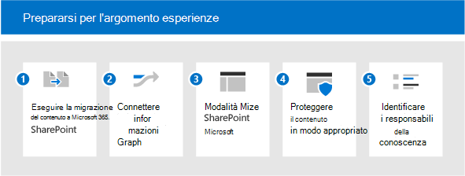

# Prepara l'ambiente per la Microsoft Viva Topics

Per ottenere il massimo da Viva Topics, è necessario includere il maggior contenuto possibile per l'individuazione degli argomenti, in modo da poter disporre di un ricco set di argomenti per gli utenti. Ma quale contenuto deve essere usato per l'individuazione degli argomenti? Come ottimizzare il contenuto indicizzato mantenendone il controllo? Maggiore è l'ambito del contenuto, maggiori sono le informazioni che l'intelligenza artificiale può scoprire. In questo articolo viene illustrata la procedura di pianificazione per assicurarsi di includere il contenuto appropriato e di disporre delle persone e delle risorse appropriate per creare un'esperienza ottimale per gli utenti.

Per pianificare Viva Topics, è necessario:

1. [Eseguire la migrazione del contenuto SharePoint](#1-migrate-content-to-microsoft-365)
    - L'indicizzazione degli argomenti include solo il contenuto SharePoint siti.
      - Se possibile, eseguire la migrazione di contenuti importanti in SharePoint Online da origini esterne.
      - Assegnare priorità alle origini di contenuto con un elevato potenziale di conoscenza tacita.
      - Evidenziare i vantaggi di Viva Topics per incoraggiare gli utenti a spostare il contenuto da OneDrive a SharePoint siti.

2. [Connessione informazioni a Microsoft Graph](#2-connect-information-to-microsoft-graph)
    - In futuro, il contenuto esterno può essere inserito nel knowledge graph e diventare disponibile.
    - Per i contenuti che non possono essere spostati, è consigliabile utilizzare Graph connettori per migliorare la ricerca e prepararsi per l'inclusione futura.

3. [Modernizzare SharePoint pagine](#3-modernize-sharepoint-pages)
    - Le schede argomento possono essere evase solo nelle pagine moderne.
    - Identificare le pagine classiche di alto profilo candidate alla modernizzazione.

4. [Proteggere il contenuto in modo appropriato](#4-secure-content-appropriately)
    - Le risorse degli argomenti sono limitate per motivi di sicurezza in base alle autorizzazioni di un utente.
    - Identificare eventuali contenuti che potrebbero disporre di autorizzazioni estese o restrittive in modo errato:
      - Incoraggiare i proprietari dei siti a usare i report condivisione per esaminare le autorizzazioni
      - Fare in modo che gli amministratori controllino il contenuto ampiamente condiviso tramite la ricerca
      - Incoraggiare i proprietari di contenuti a condividere contenuti non sensibili e che potrebbero avere vantaggi più ampi per l'organizzazione.
    - Esaminare la configurazione di Microsoft Graph per gli utenti e il contenuto:
      - L'indicizzazione degli argomenti rispetta la configurazione escludendo il contenuto dalla ricerca o Delve (ad esempio, NOINDEX). Verificare se queste configurazioni sono ancora rilevanti.

5. [Identificare i knowledge manager e gli argomenti](#5-identify-knowledge-managers-and-topics)
    - Usa tassonomie esistenti per creare manualmente argomenti o assistenza per confermare gli argomenti suggeriti dall'IA.
    - Identificare gli esperti in materia (PMI) per gli argomenti previsti o seeded.
    - Identificare i siti che coprono una grande quantità di dati importanti che possono essere utilizzati per pilotare l'estrazione di argomenti.
    - Coinvolgere i knowledge manager e le community di pratica.

## 1. Eseguire la migrazione del contenuto Microsoft 365

Esistono diversi strumenti e servizi utili per la migrazione: è possibile ottenere una panoramica e informazioni su come eseguire la migrazione in [Migrate your content to Microsoft 365](/sharepointmigration/migrate-to-sharepoint-online). Gli strumenti di migrazione includono:

- [Gestione migrazione](/sharepointmigration/mm-get-started)
- [Strumento di migrazione di SharePoint](/sharepointmigration/introducing-the-sharepoint-migration-tool)
- [Microsoft 365 FastTrack](https://www.microsoft.com/fasttrack/microsoft-365)
- [Strumenti e servizi di migrazione dei partner](https://www.microsoft.com/solution-providers)

Utilizzare al meglio la migrazione:

- Eseguire la migrazione a un sito moderno, che include Microsoft Teams. Anche se l'indicizzazione può essere eseguita in qualsiasi sito di SharePoint (classico o moderno), la visualizzazione degli argomenti tramite evidenziazioni e schede è disponibile solo nelle pagine moderne.
- Gestire i nomi utente: la maggior parte degli strumenti di migrazione consente di eseguire il mapping delle identità degli utenti nella migrazione, in modo che le proprietà come Created By o Modified By siano mantenute dopo la migrazione. Questo è importante per gli argomenti perché la creazione di file viene utilizzata per identificare gli esperti che vengono aggiunti a una pagina o a una scheda dell'argomento. 
- Rendere descrittivi i nomi degli account di servizio: in alcuni casi non è possibile mantenere i nomi utente. Ad esempio, se si esegue la migrazione del contenuto creato da un utente che non è più un dipendente dell'organizzazione. In questa istanza, la maggior parte degli strumenti di migrazione sposta il file imputandone la creazione a un account amministratore o un account del servizio. Se ciò accade di frequente, l'account di servizio potrebbe essere elencato in base agli argomenti come esperto. È qui che la denominazione dell'account diventa molto importante. Se si rende descrittivo, la presenza di questi account non umani sarà comprensibile per gli utenti che utilizzano argomenti.

## 2. Connessione informazioni a Microsoft Graph

Se non è possibile eseguire la migrazione di alcuni contenuti, connetterlo a Microsoft Graph:

- Prendere in considerazione [l'implementazione Graph Content Connectors](/microsoftsearch/connectors-overview). Utilizzando i connettori, il contenuto esterno può essere indicizzato in Microsoft Graph, dove gli utenti possono quindi individuarlo tramite Microsoft Search.
- Gli sviluppi futuri porteranno i dati esterni in Viva Topics.

## 3. Modernizzare SharePoint pagine

Poiché le schede argomento e le evidenziazioni possono essere visualizzate solo nelle pagine moderne, aggiorna le pagine che vuoi includere in Viva Topics dal classico al moderno. Vedere [Modernizzare i siti SharePoint classici.](/sharepoint/dev/transform/modernize-classic-sites) È possibile utilizzare lo [scanner SharePoint modernizzazione per](/sharepoint/dev/transform/modernize-scanner) preparare i siti classici per la modernizzazione.

Se i siti classici sono molti, assegnare la priorità alle pagine di alto profilo per convertirle in pagine moderne.

## 4. Proteggere il contenuto in modo appropriato

Quando gli utenti interagiscono con una scheda argomento o una pagina di argomento, possono visualizzare risorse diverse. Ciò è dovuto al fatto che hanno accesso a diversi file associati all'argomento. Se le autorizzazioni sottostanti sono troppo rigorose, gli aspetti serendipiti dell'individuazione delle informazioni tramite gli argomenti potrebbero essere diminuiti. D'altra parte, se sono troppo ampi, un argomento potrebbe presentare contenuti a un utente che non intendi visualizzare.
Una buona gestione delle autorizzazioni è fondamentale qui. Inoltre, una buona gestione delle autorizzazioni si basa su una partnership continua tra amministratori e proprietari di contenuti. Anche se potrebbe trattarsi di un'attività continua, esistono alcuni passaggi pratici che è possibile eseguire durante la preparazione per gli argomenti:

- Incoraggiare i proprietari dei siti a controllare condivisione e autorizzazioni.

  SharePoint proprietari di siti possono esaminare un report di condivisione per il proprio sito che mostra tutti i dettagli di tutte le autorizzazioni e i collegamenti di condivisione configurati nel sito, vedere [Condivisione di report](/sharepoint/sharing-reports). Vengono elencati gli utenti interni ed esterni (guest).

  I proprietari del sito possono anche vedere chi  dispone delle autorizzazioni per il sito andando alle pagine Autorizzazioni sito **e Autorizzazioni avanzate Impostazioni** sito.

  1. Nel sito scegliere **autorizzazioni** Impostazioni  >  **sito.** Verificare chi è elencato in Proprietari del sito, Membri del sito e Visitatori del sito. Verificare la presenza di eventuali utenti Guest.
  2. Nella pagina **Autorizzazioni** scegliere **Impostazioni avanzate autorizzazioni**. È possibile verificare la presenza di autorizzazioni univoche e controllare chi ha accesso limitato agli elementi del sito.

- Controllare i gruppi e i team di Microsoft 365 per assicurarsi che siano impostati correttamente come gruppi o team pubblici o privati. I nuovi Teams e Microsoft 365 sono impostati su privati per impostazione predefinita, ma quando il primo rilascio è pubblico per impostazione predefinita. Se sono stati adottati in precedenza queste tecnologie, è consigliabile esaminarlo. Inoltre, la funzione di un team spesso si evolve nel corso del ciclo di vita e potrebbe essere necessario aggiornare l'impostazione per riflettere l'uso corrente del team.
- Esaminare l'uso di "tutti", "tutti tranne gli utenti esterni" o gruppi di sicurezza generali. I contenuti potrebbero essere condivisi in modo non corretto con questi valori. Per esaminare l'utilizzo di questi gruppi, è possibile:
  - Creare un account senza appartenenze a gruppi
  - Usare la ricerca con questo account per individuare i contenuti condivisi in generale.
  - Se il contenuto inappropriato è visibile a questo account tramite la ricerca, è possibile collaborare con i proprietari del sito per correggere la configurazione delle autorizzazioni.

Oltre alle autorizzazioni, è anche possibile controllare l'ambito di ciò che è individuabile tramite gli argomenti. Hai sempre il controllo di ciò che è indicizzato.

Gli amministratori possono configurare l'indicizzazione nel Amministrazione Microsoft 365 Center. Quando si configura [Viva Topics,](set-up-topic-experiences.md)è possibile:

- Consentire l'individuazione in tutti i siti di SharePoint o specificare i siti da includere o escludere come origini degli argomenti.
- In caso di termini sensibili, è anche possibile escludere gli argomenti in base al nome. Ad esempio, se si dispone del nome di un progetto sensibile per cui è preferibile non visualizzare evidenziazioni o schede, indipendentemente dalle autorizzazioni dell'utente, è possibile escludere tale nome di progetto.

A livello di contenuto, è anche possibile controllare ciò che è individuabile. Qualsiasi configurazione eseguita per escludere il contenuto dalla ricerca verrà utilizzata anche dall'individuazione del contenuto. Se, ad esempio, si è esclusa la visualizzazione di una raccolta documenti specifica nei risultati di ricerca, questa raccolta documenti non verrà utilizzata per l'individuazione degli argomenti.

## 5. Identificare i knowledge manager e gli argomenti

La gestione degli argomenti implica tre ruoli chiave, tra cui due nuovi ruoli Azure Active Directory (AAD): Amministratore della conoscenza e Responsabile della conoscenza:

- L'amministratore della knowledge base (KA) è un ruolo tecnico, in genere nell'IT. Questo ruolo consente la configurazione degli argomenti Viva nell'interfaccia di amministrazione di M365, nonché la configurazione dell'individuazione e della visibilità degli argomenti.
- Il Knowledge Manager (KM) lavora con gli argomenti stessi e supervisiona la qualità e la completezza.
- I collaboratori di argomenti (TC) non si basano su un ruolo AAD, ma sulle autorizzazioni nell'interfaccia di amministrazione. Sono esperti in materia in grado di curare il contenuto degli argomenti, aggiungendo risorse e persone.

A seconda dell'organizzazione, potrebbero essere presenti poche o molte persone che agiscono in questi ruoli. Per alcune organizzazioni, queste possono essere le stesse persone.

| Amministratore delle informazioni | Responsabile delle informazioni | Autore di argomenti |
|:-------|:-------|:-------|:-------|
| Ruolo AAD | Ruolo AAD | SME |
| Ha accesso all'interfaccia di amministrazione | Ha accesso all'interfaccia di amministrazione | Nessun accesso all'interfaccia di amministrazione |
| Configura Viva Topics | Possiede la gestione e la qualità degli argomenti | Contribuisce agli argomenti in base alle proprie competenze. |
| Garantisce l'applicazione degli standard di sicurezza e conformità e comprende il contratto di licenza.| Esegue attività di gestione degli argomenti, ad esempio la creazione, la modifica, l'eliminazione e il rifiuto di argomenti. Supporta i collaboratori dell'argomento con le relative attività. | Cura le informazioni e il contenuto nelle pagine degli argomenti, incluse le persone e le risorse aggiunte a tale argomento. |

Le evidenziazioni e le schede verranno visualizzate agli utenti nel contesto del proprio lavoro, ad esempio quando esplorano le pagine moderne in SharePoint. È possibile controllare l'esperienza utente finale per gli argomenti.

- Who gli argomenti? La visibilità degli argomenti è configurata Amministrazione Microsoft 365 Center. Scegliere i gruppi da consentire di visualizzare gli argomenti:
  - Tutte le persone nell'organizzazione. "Tutti" non include gli utenti guest, ma tutti gli utenti interni nella directory
  - Solo persone o gruppi di sicurezza selezionati (questa opzione è valida durante la distribuzione di Viva Topics, in modo da poter testare con un sottoinsieme di utenti). Se si desidera che gli utenti guest visualizzano gli argomenti, è necessario utilizzare l'opzione "Utenti o gruppi di sicurezza selezionati" e concedere loro una licenza.
  - Nessuno.

    Tutti gli utenti, anche gli utenti guest, dovranno avere una licenza applicata per visualizzare l'esperienza dell'argomento. Tenere presente che le autorizzazioni controllano sempre ciò che è possibile visualizzare.

- Quali argomenti sono visibili? Si può scegliere tra queste opzioni:
  - Mostrare tutti gli argomenti candidati.
  - Mostrare solo gli argomenti confermati.

Ora che abbiamo i responsabili, gli esperti e gli utenti, possiamo parlare degli argomenti stessi.

- È consigliabile eseguire il seed degli argomenti nell'elenco degli argomenti. La qualità e la quantità di argomenti si basano sul contenuto, che verrà creato come argomento solo se è incluso nel contenuto incluso nell'ambito. Se sono disponibili informazioni e prove sufficienti per l'argomento, verrà creato dall'IA. Seeding topics is where the Knowledge Manager and subject-matter experts can help. La combinazione di conoscenze umane e IA è la scelta migliore per argomenti di qualità. Quindi, se ci sono argomenti che prevedi di poter creare manualmente nel Centro argomenti. In questo modo l'IA darà un segnale forte della rilevanza di tale argomento e identificherà le risorse e le persone da associare a tale argomento.
- Usa tassonomie esistenti per facilitare la pianificazione dell'argomento, SharePoint o altrove. Le tassonomie esistenti spesso includono termini organizzativi, prodotti, aree soggette e così via. Le origini degli argomenti possono anche derivare da elenchi di progetti, segnalibri di ricerca esistenti e così via.