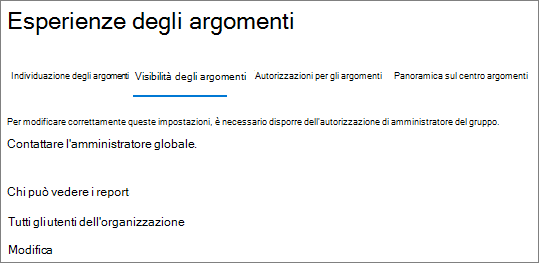
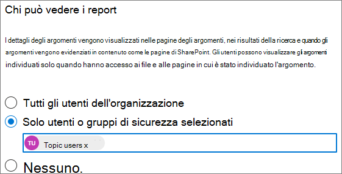

# Gestire la visibilità degli argomenti in Microsoft 365

È possibile gestire l'insieme di utenti che possono visualizzare le evidenziazioni degli argomenti, le schede degli argomenti e l'argomento centro dell'interfaccia di [amministrazione di Microsoft 365](https://admin.microsoft.com). Per eseguire queste attività, è necessario essere un amministratore globale o un amministratore di SharePoint.

## Per accedere alle impostazioni di gestione degli argomenti:

1. Nell'interfaccia di amministrazione di Microsoft 365 fare clic su **Impostazioni** e quindi su **Impostazioni org**.
2. Nella scheda **Servizi** , fare clic su **Knowledge Network**.

     

3. Selezionare la scheda **visibilità argomento** . Per informazioni su ogni impostazione, vedere le sezioni seguenti.

     

##  Modificare gli utenti che possono visualizzare gli argomenti nell'organizzazione

È possibile modificare gli utenti che possono visualizzare gli argomenti nell'organizzazione.

1. Nella scheda **visibilità dell'argomento** , in **utenti autorizzati a visualizzare gli argomenti della rete della Knowledge** base, selezionare **modifica**.
2. Gli **utenti che possono visualizzare gli argomenti della pagina della rete della Knowledge** base consentono di scegliere gli utenti che avranno accesso ai dettagli sull'argomento, ad esempio argomenti evidenziati, schede argomento, risposte agli argomenti nelle pagine di ricerca e nell'argomento. È possibile selezionare:
    - **Tutti gli utenti dell'organizzazione**
    - **Solo persone o gruppi di sicurezza selezionati**
    - **Nessuno**

     

3. Selezionare **Salva**.  
 
> [!Note] 
> Anche se questa impostazione consente di selezionare qualsiasi utente dell'organizzazione, solo gli utenti che dispongono di licenze per l'argomento sono in grado di visualizzare gli argomenti.

## Vedere anche

[Gestire l'individuazione degli argomenti in Microsoft 365](topic-experiences-discovery.md)

[Gestire le autorizzazioni per l'argomento in Microsoft 365](topic-experiences-user-permissions.md)

[Modificare il nome del centro argomenti in Microsoft 365](topic-experiences-administration.md)

